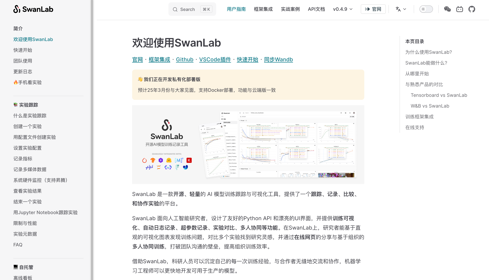

# swanlab-docs

[](https://docs.swanlab.cn)

为项目贡献的方式不仅仅是贡献代码，包括维护文档、在issue和群中答疑、提交bug等都是为swanlab项目贡献的方式！

我们在[github仓库](https://github.com/SwanHubX/SwanLab-Docs)中托管了SwanLab的[官方文档](https://docs.swanlab.cn)，基于[vitepress](https://vitepress.dev/zh/guide/getting-started)。

### 如何为文档做贡献

很简单！只需要克隆项目、增添或修改Markdown文件、提交他们，再创建一个PR就可以。

### 环境安装

1. 克隆本仓库

```bash
git clone https://github.com/SwanHubX/SwanLab-Docs
cd SwanLab-Docs
```

2. 安装依赖环境

需要提前安装nodejs和npm，详细方法请查询[node官方教程](https://nodejs.org/en/download/package-manager)

使用如下命令安装其他依赖项目

```bash
npm add -D vitepress
npm install
```

### 本地运行文档

如果进行本地开发或者预览文档，可在项目根目录运行：

```bash
npm run docs:dev
```

如果要进行完整的编译打包，使用如下命令：

```bash
npm run docs:build
npm run docs:preview
```