# SwanLab Remote Task Deployment Documentation (Beta Feature)

::: danger
<strong>Warning:</strong> This feature is currently in beta testing. Please thoroughly read the <strong>Feature Testing Instructions</strong> section of this document before using this feature. **Some limitations during the beta phase:**

1. Maximum task duration is 4 hours.
2. For more information about the beta phase, please contact <contact@swanlab.cn> or <zeyi.lin@swanhub.co> (Product Manager's Email).
:::

Launch Experiment Command

``` bash
swanlab launch [OPTIONS]
```

| Option | Description |
| --- | --- |
| `-f,--file <yaml file>` | Execute the task based on the configuration file. |
| `--help <yaml file>` | Print help information. |

View and Pause Task Commands

``` bash
swanlab task [OPTIONS]
```

| Option | Description |
| --- | --- |
| `list` | View the status of started training tasks. |
| `search <task id>` | View the running status of a specific task. |
| `stop <task id>` | Stop a running command. |
| `--help` | Print help information. |

For detailed usage, please refer to [SwanLab Remote Task Deployment Commands](#swanlab-remote-task-deployment-commands).

## SwanLab Task Quick Start Tutorial in 3 Minutes

This tutorial will help readers understand how to use the **SwanLab Remote Task Deployment Documentation** feature through a simple quadratic function regression task.

### Preliminary Steps: Login and Obtain Key

Register and log in to [SwanLab](http://swanlab.cn/), and obtain your [API Key](https://swanlab.cn/settings/overview).

Install swanlab locally (ensure the version number is 0.3.15 or higher):

```bash
pip install -U swanlab
```

You can check the swanlab version number with the following command:

```bash
swanlab -v
# 0.3.15
```

### Step 1: Prepare the Code

Use the prepared open-source example, download the [SwanLab Remote Task Deployment Test Code](https://github.com/SwanHubX/SwanLab-LaunchExample.git) using git, and navigate to the project's root directory:

```bash
# Download the project
git clone https://github.com/SwanHubX/SwanLab-LaunchExample.git
# Enter the project root directory
cd SwanLab-LaunchExample
```

If you cannot use [Github](https://github.com), you can find the complete code in the [Appendix](#training-example-code).

### Step 2: Run the Code on the Cloud

Use the `swanlab task launch` command to execute the training entry function as follows:

```bash
swanlab task launch -f swanlab.yaml
```

**SwanLab Remote Task Deployment Documentation** will automatically package and upload the local code to the GPU server and start the training based on the configuration file.

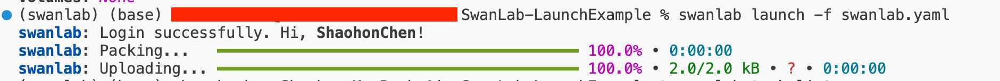

For detailed functions of the configuration file (such as specifying the environment, mounting datasets, etc.), please refer to [YAML Configuration File and Functions](#yaml-configuration-file-and-functions).

### Step 3: View the Experiment

You can use the following command to view the started experiments:

```bash
swanlab task list
```

This will open a table in the terminal (as shown below), with the top one being the current experiment. The *Status* indicates the current status of the experiment (refer to the [swanlab task list](#swanlab-task-list) section for status details).

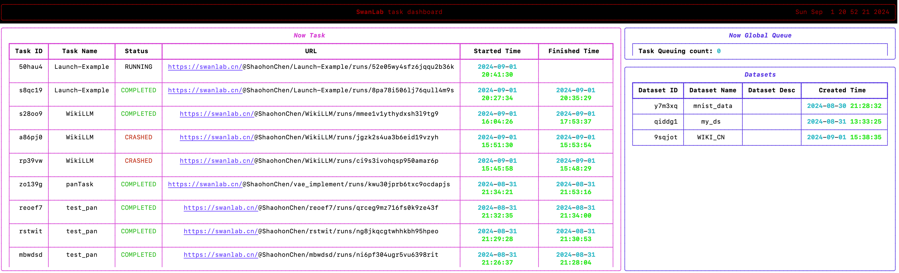

When the training starts (*Status* switches to *RUNNING*), you can click the link in *URL* to view the started experiment on [swanlab.cn](https://swanlab.cn).

:::info
Only when the code includes using `swanlab` for online experiment metric tracking will the URL be automatically obtained and displayed.

For training metric tracking using `swanlab`, refer to [Create an Experiment](../guide_cloud/experiment_track/create-experiment.md).
:::

You can view the tracked experiment metrics online:

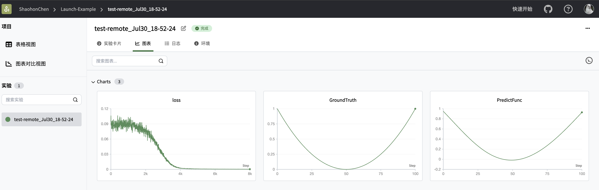

Click Logs to view the terminal output information on the cloud:

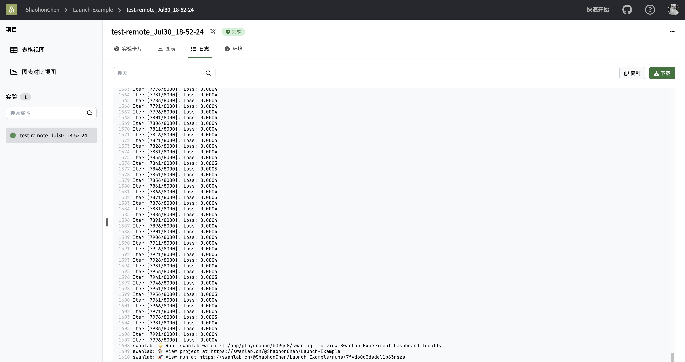

On the SwanLab cloud experiment dashboard interface (as shown below), click Environments -> System Hardware to see the current cloud server hardware:

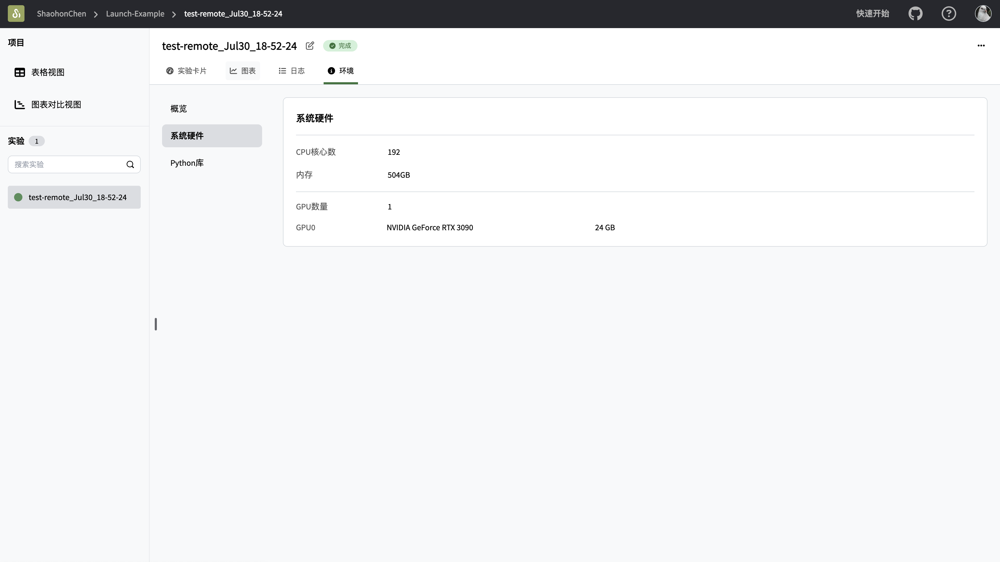

For commands related to debugging and stopping ongoing experiments, refer to [SwanLab Remote Task Deployment Commands](#swanlab-remote-task-deployment-commands).

## Design Philosophy

The **SwanLab Remote Task Deployment Documentation** feature aims to help AI researchers easily and efficiently utilize multiple different local GPU servers and conveniently plan their training tasks. Therefore, the **SwanLab Remote Task Deployment Documentation** feature focuses on solving how to make it easier for users to quickly deploy training to GPU servers.

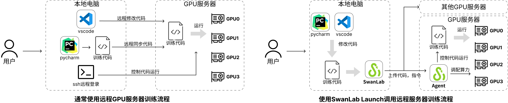

Usually, using a remote GPU server to complete training requires three steps (see the left side of the image above):

1. Write code locally.
2. Synchronize to the GPU server.
3. Use ssh to start the experiment.

However, if you have a multi-card GPU server or multiple GPU servers, the problem becomes more complicated, including:

* Need to check which GPU is idle.
* If the new server has not installed the environment, you need to configure the environment.
* Need to upload and download datasets.
* Multi-node experiments require repeating these actions on multiple servers.
* ...

Using the **SwanLab Remote Task Deployment Documentation** feature only requires the following operations (see the right side of the image above):

1. The GPU server runs **SwanLab Agent** in the background.
2. Complete the experiment script writing and environment dependency formulation locally.
3. Use the `swanlab launch ...` command to deploy to the GPU server and start training.

SwanLab will automatically complete the local code packaging and uploading, GPU server environment installation, and allocate corresponding GPU cards for training based on the GPU server's graphics card idle status. Researchers do not need to do tedious environment configuration, check server idle status, etc., and can focus on training itself.

## SwanLab Remote Task Deployment Commands

:::warning
Due to ongoing development, CLI commands and interfaces may change at any time. You can view the latest commands by using `--help` after any command.
:::

### Function Navigation

| Requirement | Navigation |
| --- | --- |
| Upload dataset | [swanlab upload](#swanlab-upload) |
| Deploy remote GPU training task | [swanlab launch](#swanlab-launch) |
| View uploaded tasks, datasets | [swanlab task list](#swanlab-task-list) |
| View task running status, failure logs | [swanlab task search](#swanlab-task-search) |
| Stop running task | [swanlab task stop](#swanlab-task-stop) |
| View command usage | Any command followed by `--help` parameter |

### swanlab launch

```bash
swanlab task launch -f <yaml configuration file>
```

Package and upload the tasks in the folder to the remote GPU server and execute the entry training function.

### YAML Configuration File and Functions

Below is a complete YAML file and its function description.

```yaml
apiVersion: swanlab/v1  # Interface version, no need to change
kind: Folder  # Task loading type, will support more types in the future
metadata:
  name: "Launch-Example"  # Task name
  desc: ""          # Description of the experiment, optional
  combo: RTX3090-1  # Compute power queue, options include RTX3090-1 and H800-1 queues
spec:
  python: "3.10"  # Currently only supports 3.8, 3.9, 3.10
  entry: "train.py" # Entry function to be executed
  volumes:
    - id: "<storage data ID>"    # Fill in the mounted storage ID
  exclude:
    - "<file or folder name>"  # Files to be ignored during packaging and uploading (used to shield unnecessary files such as datasets and model weights in the current folder)
```

For a new experiment, you need to pay attention to the following configuration information:

* **combo** Used to specify the GPU type, options include "H800-1" and "RTX3090-1", both single-card
* **entry** Used to specify the entry function to start training
* **volumes** For larger files, it is recommended to load them in the form of storage mounting

### swanlab upload

This command is used to upload larger files that need to be reused in multiple experiments. The command is as follows:

```bash
swanlab upload <file or folder>
```

The effect is as follows:

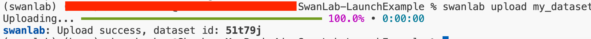

After the upload is completed, the `dataset id` will be displayed, which can be mounted in the [YAML configuration file](#yaml-configuration-file-and-functions).

The mounted files will be located in the `/data/` folder.

You can also view the mounted files (red box part) using the command `swanlab task list`:

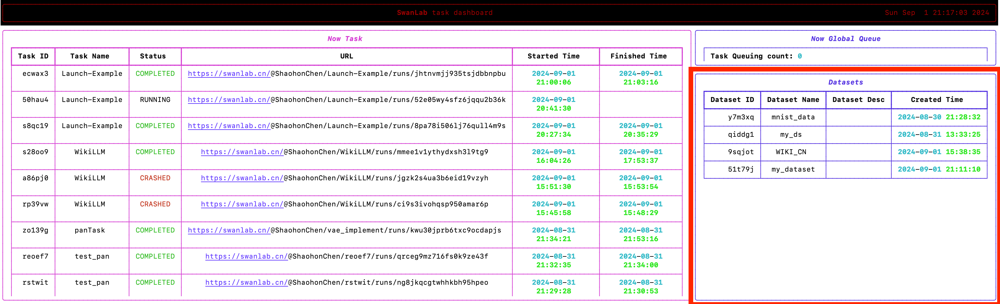

### swanlab download (In Development)

<span style="color: red;">(To be supplemented)</span>

### swanlab task list

```bash
swanlab task list
```

Prints out completed or running experiments (default prints the latest 10). The effect is as follows:


Where:

* **TASK ID**: Unique identifier of the task
* **Task Name**: Task name
* **URL**: Link to the SwanLab online experiment log tracking (only when the experiment script sets `swanlab.init` and enables cloud synchronization of experiment data)
* **Started Time**: Experiment deployment start time
* **Finished Time**: Experiment completion time

The tasks in the dashboard have three states:

* **QUEUING**: Remote GPU is busy, waiting in queue
* **PREPARE**: Deploying remote environment
* **RUNNING**: Running training
* **COMPLETED**: Completed tasks
* **CRASHED**: Environment deployment failure or code error

Use `ctrl+c` to exit the dashboard.

### swanlab task search

```bash
swanlab task search <TASK_ID>
```

This command is used to view the start and end time of the experiment, as well as the cluster type, execution environment, etc. The `TASK_ID` can be viewed using [swanlab task list](#swanlab-task-list).

```bash
Task Info
Task Name: Task_Jul31_02-44-38
Python Version: python3.10
Entry File: train.py
Status: ✅ COMPLETED
Combo: RTX3090-1
Created At: 2024-07-30 18:44:40
Started At: 2024-07-30 18:45:02
Finished At: 2024-07-30 18:52:49
```

This command can also be used to view error information for failed tasks (tasks with execution status CRASHED). For example, when I intentionally add error code to the test code in the [Quick Start section](#swanlab-task-quick-start-tutorial-in-3-minutes):

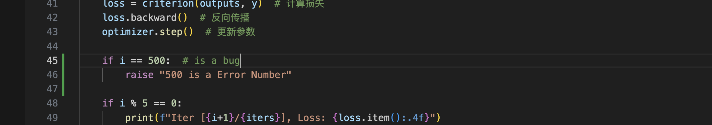

After using the `swanlab task search <TASK_ID>` command for the started task, the effect is as follows:

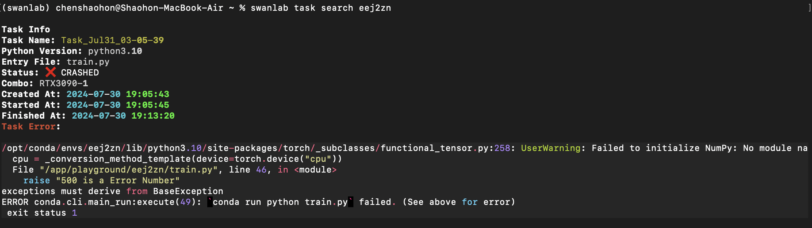

Of course, you can also view the error information in the [SwanLab online experiment dashboard](https://swanlab.cn) under the log:

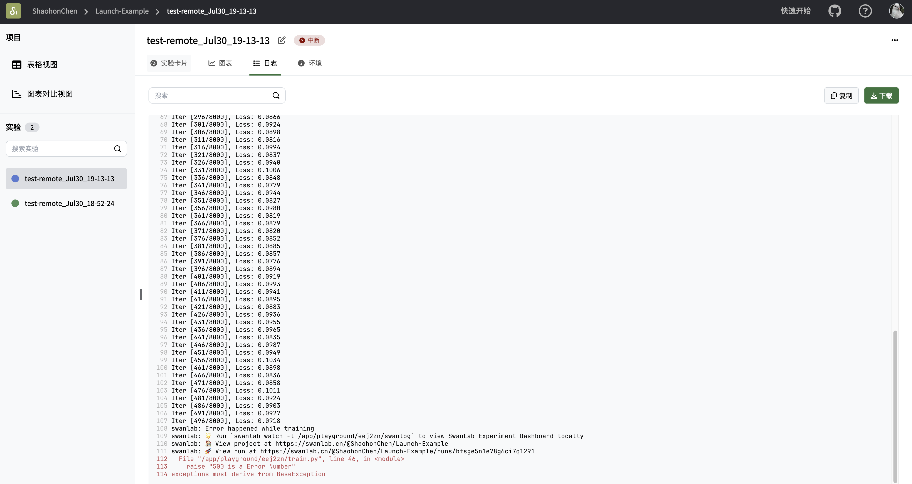

## swanlab task stop

Terminate a started task using the following method:

```bash
swanlab task stop <task ID>
```

## SwanLab Agent Installation (In Development)

<span style="color: red;">(To be supplemented)</span>

> Currently, this feature is under development and testing. To facilitate usage, SwanLab provides free cloud testing compute power. You can directly use cloud compute power to run and deploy via `swanlab launch`.

## Working Process and Principles

<span style="color: red;">(To be supplemented)</span>

## Feature Testing Instructions

:::info
It is strongly recommended to [click the link](https://geektechstudio.feishu.cn/wiki/Te1EwcLbrimD7Zk1fsrcCovanyg) to join the testing group before using this feature. We will respond to and solve any issues encountered in the group in a timely manner.
:::

The **SwanLab Remote Task Deployment Documentation** feature involves uploading the required running code and datasets to a public cloud server. We strive to ensure your data security, but there is still a risk of data leakage or loss during the testing phase. **Do not upload important data to the testing feature**.

The iteration of the **SwanLab Remote Task Deployment Documentation** feature depends on active feedback from community users. If you encounter any issues, please feel free to contact us. You can use [Github Issue](https://github.com/SwanHubX/SwanLab/issues), contact email <contact@swanlab.cn>, or join the [WeChat testing group](https://geektechstudio.feishu.cn/wiki/NIZ9wp5LRiSqQykizbGcVzUKnic?fromScene=spaceOverview) to communicate directly with us.

To facilitate smooth testing, the **SwanLab Remote Task Deployment Documentation** provides free testing running servers for users participating in the test. We strive to meet the testing and compute power needs of every user, but due to limited team resources and feature iteration, there may still be situations such as task queuing and training forced termination.

## Acknowledgments

🙏 We are extremely grateful to the users who are willing to participate in the feature testing, and we will continue to work hard.

🙏 We are also grateful to [H3C](https://www.h3c.com/cn/) for providing us with compute power support.

## Appendix

### Training Example Code

Step 1: Create an empty folder in the directory and navigate to the folder:

```bash
# Linux & Mac & Windows command
mkdir SwanLabLaunchExample
```

Step 2: Create `train.py` in the `SwanLabLaunchExample` folder and paste the following training code:

```python
################################
# File Name: train.py
################################

import torch
import torch.nn as nn
import torch.optim as optim
import swanlab
import logging

# 0. Initialize experiment environment
swanlab.init("Launch-Example", experiment_name="test-remote")  # Initialize swanlab
device = "cuda"
if not torch.cuda.is_available():  # Check if a GPU is available, if not, use CPU and log a warning
    device = "cpu"
    logging.warning("CUDA IS NOT AVAILIABLE, use cpu instead")

# 1. Define the function, target is a simple quadratic function, domain and range are both [0,1]
func = lambda x: (2 * x - 1) ** 2

# 2. Define the model, a 3-layer neural network (increasing parameters or layers will yield better results)
model = nn.Sequential(nn.Linear(1, 16), nn.Sigmoid(), nn.Linear(16, 1))
model = model.to(device)

# 3. Define the loss function and optimizer
criterion = nn.MSELoss().to(device)
optimizer = optim.AdamW(model.parameters(), lr=0.001)

# 4. Train the model
iters = 8000
batch_num = 256
for i in range(iters):
    # Generate data
    x = torch.rand(batch_num, 1)
    y = func(x)
    x, y = x.to(device), y.to(device)

    optimizer.zero_grad()  # Clear gradients
    outputs = model(x)  # Forward propagation
    loss = criterion(outputs, y)  # Calculate loss
    loss.backward()  # Backward propagation
    optimizer.step()  # Update parameters

    if i % 5 == 0:
        print(f"Iter [{i+1}/{iters}], Loss: {loss.item():.4f}")
        swanlab.log({"loss": loss.item()}, step=i)

# 5. Validate the model
model.eval()
with torch.no_grad():
    sample_num = 101
    inputs = torch.linspace(0, 1, sample_num).unsqueeze(1).to(device)