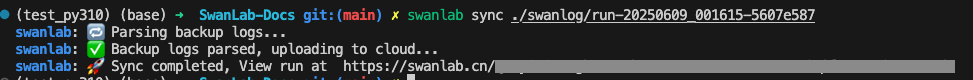

# swanlab sync

```bash
swanlab sync [options] [logdir]
```

| Option | Description |
| --- | --- |
| `-k`, `--api-key` | API key for authentication. If not specified, the default API key from the environment will be used. If specified, this API key will be used for login but won't be saved. |
| `-h`, `--host` | The host address for syncing logs. If not specified, the default host (`https://swanlab.cn`) will be used. |
| `-w`, `--workspace` | The workspace for syncing logs. If not specified, the default workspace will be used. |
| `-p`, `--project` | The project for syncing logs. If not specified, the default project will be used. |
| `-i`, `--id` | The experiment ID to sync the logs to. It can only be used when the path is a single directory. |

## Introduction

Sync local logs to SwanLab cloud or private deployment.

## Version Comparison

> The version comparison only applies to the `swanlab sync` command. For the Python library version comparison, please refer to [Python Library Version Comparison](./cli-swanlab-sync.md#python-library-version-comparison).

| swanlab library version | Feature | Supported log files |
| --- | --- | --- |
| >=0.6.8 | Support syncing logs from abnormal terminal of training; support `id` parameter | Logs generated by `>=0.6.8` version of swanlab library |
| <0.6.8 | - | Logs generated by `<0.6.8` version of swanlab library |

## Command Line Examples

Locate the log directory you want to upload to the cloud (by default, it's the `run-` prefixed directory under `swanlog`), then execute the command:

```bash
swanlab sync ./swanlog/run-xxx
```

::: info
By default, logs will be synced to the `project` recorded in the log files, which is the `project` set when running the experiment.  
If you want to sync to a different project, you can use the `-p` option to specify the project.
:::

If you see the following output, it indicates a successful sync:



## Python Code Example

```python
import swanlab

swanlab.login(api_key="Your API Key")

swanlab.sync(
    dir_path="./swanlog/run-xxx",
    workspace="swanlab",
    project_name="sync_test",
)
```

## Batch Upload

```bash
swanlab sync ./swanlog/run-*
```

## Resume Sync

If you don't want to create a new experiment, but sync on the existing experiment (it will compare the data and add the difference part), you can use the `--id` parameter:

```bash
swanlab sync ./swanlog/run-xxx --id <experiment ID>
```

Experiment ID can be obtained from [Resume Experiment/Resume Training](/guide_cloud/experiment_track/resume-experiment.md).