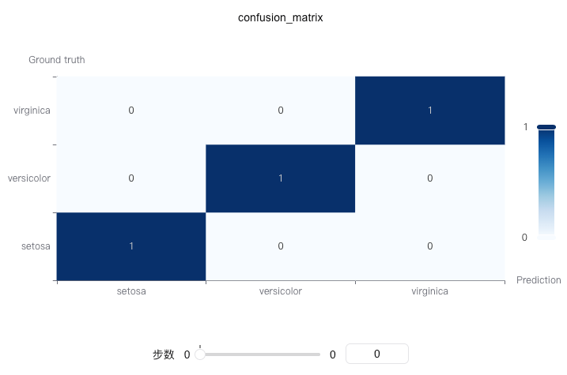

# swanlab.confusion_matrix

[Github Source Code](https://github.com/SwanHubX/SwanLab/blob/main/swanlab/data/modules/custom_charts/metrics.py)

```python
confusion_matrix(
    y_true: Union[List, np.ndarray],
    y_pred: Union[List, np.ndarray],
    class_names: List[str] = None,
) -> None
```

| Parameter     | Description                                                                                                                           |
|--------------|--------------------------------------------------------------------------------------------------------------------------------------|
| y_true       | (Union[List, np.ndarray]) True labels, the actual class labels in classification problems                                                                                    |
| y_pred       | (Union[List, np.ndarray]) Predicted labels, the class labels predicted by the model                                                                                        |
| class_names  | (List[str]) List of class names used to display class labels in the confusion matrix. If None, numeric indices will be used as labels                                                           |

## Introduction

Draw a confusion matrix to evaluate the performance of classification models. The confusion matrix shows the correspondence between model predictions and true labels, providing an intuitive display of prediction accuracy and error types for each class.

The confusion matrix is a fundamental tool for evaluating classification model performance, especially suitable for multi-classification problems.

### Basic Usage

```python
from sklearn.datasets import load_iris
from sklearn.model_selection import train_test_split
import xgboost as xgb
import swanlab

# Load iris dataset
iris_data = load_iris()
X = iris_data.data
y = iris_data.target
class_names = iris_data.target_names.tolist()

# Split training and test sets
X_train, X_test, y_train, y_test = train_test_split(X, y, test_size=0.2, random_state=42)

# Train model
model = xgb.XGBClassifier(objective='multi:softmax', num_class=len(class_names))
model.fit(X_train, y_train)

# Get predictions
y_pred = model.predict(X_test)

# Initialize SwanLab
swanlab.init(project="Confusion-Matrix-Demo", experiment_name="Confusion-Matrix-Example")

# Log confusion matrix
swanlab.log({
    "confusion_matrix": swanlab.confusion_matrix(y_test, y_pred, class_names)
})

swanlab.finish()
```



### Using Custom Class Names

```python
# Define custom class names
custom_class_names = ["Class A", "Class B", "Class C"]

# Log confusion matrix
confusion_matrix = swanlab.confusion_matrix(y_test, y_pred, custom_class_names)
swanlab.log({"confusion_matrix_custom": confusion_matrix})
```

### Without Class Names

```python
# Don't specify class names, numeric indices will be used
confusion_matrix = swanlab.confusion_matrix(y_test, y_pred)
swanlab.log({"confusion_matrix_default": confusion_matrix})
```

### Binary Classification Example

```python
import numpy as np
from sklearn.datasets import make_classification
from sklearn.model_selection import train_test_split
import xgboost as xgb
import swanlab

# Generate binary classification data
X, y = make_classification(n_samples=1000, n_features=20, n_informative=2, n_redundant=10, random_state=42)
X_train, X_test, y_train, y_test = train_test_split(X, y, test_size=0.3, random_state=42)

# Train model
model = xgb.XGBClassifier(use_label_encoder=False, eval_metric='logloss')
model.fit(X_train, y_train)

# Get predictions
y_pred = model.predict(X_test)

# Log confusion matrix
swanlab.log({
    "confusion_matrix": swanlab.confusion_matrix(y_test, y_pred, ["Negative", "Positive"])
})
```

### Notes

1. **Data Format**: `y_true` and `y_pred` can be lists or numpy arrays
2. **Multi-class Support**: This function supports both binary and multi-classification problems
3. **Class Names**: The length of `class_names` should match the number of classes
4. **Dependencies**: Requires installation of `scikit-learn` and `pyecharts` packages
5. **Coordinate Axes**: sklearn's confusion_matrix has (0,0) at the top-left corner, while pyecharts heatmap has it at the bottom-left corner. The function automatically handles coordinate conversion
6. **Matrix Interpretation**: In the confusion matrix, rows represent true labels and columns represent predicted labels
