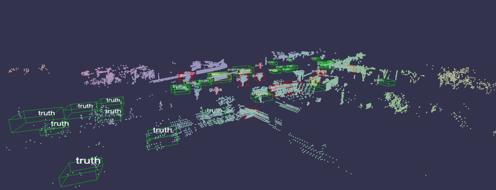

# swanlab.Object3D

[GitHub Source Code](https://github.com/SwanHubX/SwanLab/blob/main/swanlab/data/modules/object3d/object3d.py)

| Parameter | Description |
|---|---|
| data | (Union[np.ndarray, str, Path]) Accepts point cloud file paths or NumPy arrays. The Object3D class will determine the received data type and perform corresponding conversions. |
| caption | (str) Label for the 3D object. Used to mark the 3D object when displayed in the experiment dashboard. |

## Introduction

Converts various types of point cloud data to be logged by `swanlab.log()`.



### Creating from Files/Dictionaries

::: warning Example File
data.swanlab.pts.json: [Download from Google Drive](https://drive.google.com/file/d/1mFill-BXw3cirPHwIHndb1wNX4pWvSXb/view)
:::

The file format is `json`, with the following content structure:

```json
{
    "points": [
        [x1, y1, z1, r1, g1, b1],
        [x2, y2, z2, r2, g2, b2],
        ...
    ],
    // (Optional) Detection boxes for tasks such as point cloud detection, highlighting corresponding positions
    "boxes": [
        {
            "color": [r, g, b],
            "corners": [[x1,y1,z1], ..., [x8,y8,z8]],
            // (Optional) Label text for the detection box, displayed in the view
            "label": "class_name",
            // (Optional) Confidence score, displayed in the view
            "score": 0.95,
        },
        ...
    ]
}
```

**Detailed Explanation of JSON File Parameters:**

  * **`points`**:

      * This is an array used to store 3D point cloud data.
      * Each element is an array of 6 numerical values `[x, y, z, r, g, b]`, representing:
          * `x`, `y`, `z`: 3D coordinates of the point.
          * `r`, `g`, `b`: Color of the point, representing red, green, and blue channel values, typically in the range 0-255.

  * **`boxes`** (Optional):

      * This is an array used to store 3D detection box data.
      * Each element is an object representing a detection box, containing the following fields:
          * **`color`**: Color of the detection box, an `[r, g, b]` array representing red, green, and blue channel values.
          * **`corners`**: Coordinates of the eight vertices of the detection box, an `[[x1, y1, z1], ..., [x8, y8, z8]]` array, where each element is a 3D coordinate `[x, y, z]`.
          * **`label`** (Optional): Label text of the detection box, a string, used to display the category of the detection box in the view.
          * **`score`** (Optional): Confidence score of the detection box, a numerical value, typically in the range 0-1, representing the reliability of the detection box.

-----

Using SwanLab to log 3D point cloud data from a `json` file:

::: code-group

```python [Object3D]
import swanlab

swanlab.init()

obj = swanlab.Object3D("data.swanlab.pts.json", caption="3d_point_cloud")
swanlab.log({"examples": obj})
```

```python [Object3D.from_point_data]
import swanlab

swanlab.init()

with open("data.swanlab.pts.json", "r") as f:
    cloud_point = json.load(f)

obj = swanlab.Object3D.from_point_data(
    points=cloud_point["points"],
    boxes=cloud_point["boxes"],
    caption="3d_point_cloud"
)

swanlab.log({"examples": obj})
```

:::

<video controls src="./py-object3d/video.mp4"></video>

<br>

### Creating from NumPy Arrays

::: code-group

```python [Creating from Coordinates]
import numpy as np

# Example 1: Create point cloud from coordinates
points_xyz = np.array([
    [0, 0, 0],  # Point1: x=0, y=0, z=0
    [1, 1, 1],  # Point2: x=1, y=1, z=1
    [2, 0, 1]   # Point3: x=2, y=0, z=1
])

cloud_xyz = swanlab.Object3D(points_xyz, caption="Basic XYZ Points")
swanlab.log({"examples": cloud_xyz})
```

```python [Creating from Coordinates and Categories]
import numpy as np

# Example 2: Create point cloud with categories
points_xyzc = np.array([
    [0, 0, 0, 0],  # Point1: xyz + category 0
    [1, 1, 1, 1],  # Point2: xyz + category 1
    [2, 0, 1, 2]   # Point3: xyz + category 2
])

cloud_xyzc = swanlab.Object3D(points_xyzc, caption="Points with Categories")
swanlab.log({"examples": cloud_xyzc})
```

```python [Creating from Coordinates and RGB]
import numpy as np

# Example 3: Create point cloud with RGB colors
points_xyzrgb = np.array([
    [0, 0, 0, 255, 0, 0],    # Point1: xyz + red
    [1, 1, 1, 0, 255, 0],    # Point2: xyz + green
    [2, 0, 1, 0, 0, 255]     # Point3: xyz + blue
])

cloud_xyzrgb = swanlab.Object3D(points_xyzrgb, caption="Colored Points")
swanlab.log({"examples": cloud_xyzrgb})
```

:::

### Logging Multiple Point Clouds in a Single Step

```python
import swanlab

...

cloud1 = swanlab.Object3D(points1, caption="cloud1")
cloud2 = swanlab.Object3D(points2, caption="cloud2")
cloud3 = swanlab.Object3D(points3, caption="cloud3")

...

swanlab.log({"examples": [cloud1, cloud2, cloud3, ...]})
```
