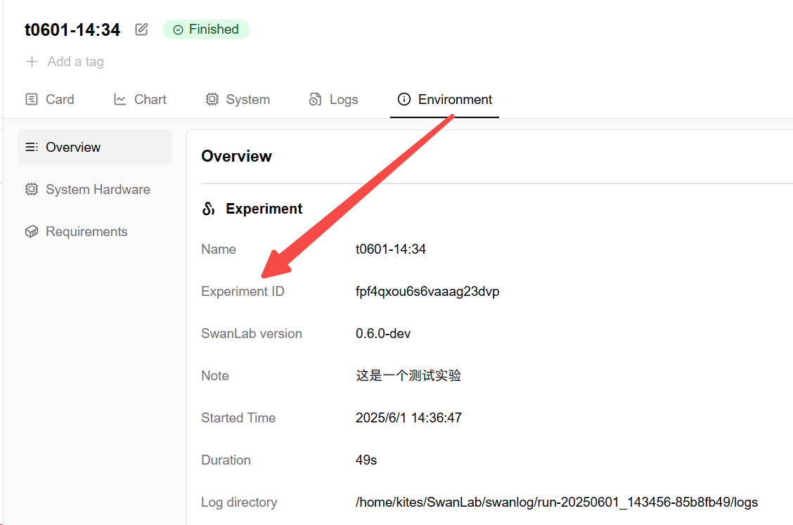

# swanlab.OpenApi

Based on SwanLab's cloud capabilities, the SDK provides access to **Open API** functionality, allowing users to programmatically operate and retrieve resources related to experiments, projects, and workspaces in the cloud environment from their local environment.


Through Open API, users can:

* Retrieve personal information, workspace details, and project lists
* Automatically manage experiments (e.g., querying, organizing, editing metadata, etc.)
* More easily integrate with other tools (e.g., CI/CD, experiment scheduling, etc.)

Making good use of this feature greatly enhances the flexibility and extensibility of the SDK, making it convenient to build advanced workflows or extended systems.

## Introduction

> Prerequisite: You need to have logged into your SwanLab account in your programming environment.

To use SwanLab's Open API, simply instantiate an `OpenApi` object.

```python
from swanlab import OpenApi

my_api = OpenApi() # Uses local login information
print(my_api.list_workspaces().data) # Get the list of workspaces for the current user
```

If you need to access data from another account:
```python
from swanlab import OpenApi

other_api = OpenApi(api_key='other_api_key') # Use another account's api_key
print(other_api.list_workspaces().data)
```

Specifically, the **OpenApi** authentication logic is as follows:

1. If the `api_key` parameter is explicitly provided, it will be used for authentication. You can find your API key [here](https://swanlab.cn/space/~/settings).
2. Otherwise, local authentication information will be used.

## Common Parameters

### Experiment ID `exp_id`

The unique identifier for an experiment is the **CUID**, i.e., `exp_id`, which can be obtained via the `list_experiments` method's `cuid` field.

To view the CUID of a specific experiment, go to the "Environment" tab of the experiment on the web version and check the "Experiment ID" row. Click to copy the CUID.



### Workspace Name `username`

The workspace name is `username`, used to identify the workspace:

- For a personal workspace, `username` is the user's username.
- For an organization workspace, `username` is the organization ID.

You can get the `username` via the `list_workspaces` method; the `username` field in each workspace entry is the workspace name.

Generally, if you do not specify `username` in OpenAPI calls, it **defaults** to your personal workspace.

## Model Definitions

When using Open API, some cloud resources, such as experiments and projects, are too complex to be a Python based data structure.

Therefore, these resources are defined as objects in the SDK, supporting IDE auto-completion and type checking for easier manipulation.

For example, to retrieve the start time of an experiment object, you can use:

```python
api_response: ApiResponse = my_api.get_experiment(project="project1", exp_cuid="cuid1")
my_exp: Experiment = api_response.data
created_time: str = my_exp.createdAt
```

Or, to retrieve the name of the workspace to which a project object belongs, you can use:

```python
api_response: ApiResponse = my_api.list_projects()
my_project: Project = api_response.data[0]
workspace_name: str = my_project.group["name"]
```

As a Model, its attributes can be accessed in three ways:

- `my_exp.createdAt`
- `my_exp["createdAt"]`
- `my_exp.get("createdAt")`

> Note: The model can be accessed in a dictionary-like manner, but it is not a true dictionary. You can obtain the corresponding dictionary of the model using `my_exp_dict: Dict = my_exp.model_dump()`.

### API Response `ApiResponse`

Each Open API method returns a `swanlab.api.openapi.types.ApiResponse` object, which contains the following fields:

| Field | Type | Description |
| --- | --- | --- |
| `code` | `int` | HTTP status code |
| `errmsg` | `str` | Error message, non-empty if the status code is not `2XX` |
| `data` | `Any` | Specific data returned, as mentioned in the API descriptions below |

### Experiment Model

The experiment object is of type `swanlab.api.openapi.types.Experiment`, containing the following fields:

| Field | Type | Description |
| --- | --- | --- |
| `cuid` | `str` | Unique identifier for the experiment |
| `name` | `str` | Name of the experiment |
| `description` | `str` | Description of the experiment |
| `state` | `str` | Status of the experiment, such as `FINISHED`, `RUNNING` |
| `show` | `bool` | Display status |
| `createdAt` | `str` | Time of experiment creation, formatted as `2024-11-23T12:28:04.286Z` |
| `finishedAt` | `str` | Time of experiment completion, formatted as `2024-11-23T12:28:04.286Z`, None if not finished |
| `user` | `Dict[str, str]` | Creator of the experiment, containing `username` and `name` |
| `profile` | `dict` | Detailed configuration information of the experiment, including user-defined configurations and Python runtime environment, etc. |

### Project Model

The project object is of type `swanlab.api.openapi.types.Project`, containing the following fields:

| Field | Type | Description |
| --- | --- | --- |
| `cuid` | `str` | Unique identifier for the project |
| `name` | `str` | Name of the project |
| `description` | `str` | Description of the project |
| `visibility` | `str` | Visibility, such as `PUBLIC` or `PRIVATE` |
| `createdAt` | `str` | Time of project creation, formatted as `2024-11-23T12:28:04.286Z` |
| `updatedAt` | `str` | Time of project update, formatted as `2024-11-23T12:28:04.286Z` |
| `group` | `Dict[str, str]` | Workspace information, containing `type`, `username`, and `name` |
| `count` | `Dict[str, int]` | Project statistics, such as the number of experiments, number of collaborators, etc. |

## OpenAPIs

Each Open API is a method of the `OpenApi` object.

Below is a list of all available SwanLab Open APIs.

### Workspaces

#### `list_workspaces`

Retrieve the list of all workspaces (organizations) associated with the current user.

**Returns**

`data` `(List[Dict])`: A list of workspaces the user has joined. Each element is a dictionary containing basic workspace information:

| Field | Type | Description |
| --- | --- | --- |
| `name` | `str` | Name of the workspace |
| `username` | `str` | Unique identifier for the workspace (used in URLs) |
| `role` | `str` | Role of the user in this workspace, such as `OWNER` or `MEMBER` |

**Example**

::: code-group  

```python [Retrieve the list of workspaces]
from swanlab import OpenApi
my_api = OpenApi()

my_api.list_workspaces().data
"""
[
    {
        "name": "workspace1",
        "username": "kites-test3",
        "role": "OWNER"
    },
    {
        "name": "hello-openapi",
        "username": "kites-test2",
        "role": "MEMBER"
    }
]
"""
```

```python [Retrieve the name of the first workspace]
from swanlab import OpenApi
my_api = OpenApi()

my_api.list_workspaces().data[0]["name"]
"""
"workspace1"
"""
```

```python [Retrieve the response code]
from swanlab import OpenApi
my_api = OpenApi()

my_api.list_workspaces().code
"""
200
"""
```

:::

<br>

### Experiments

#### `list_experiments`

Retrieve the list of experiments in a specified project.

**Method Parameters**

| Parameter | Type | Description |
| --- | --- | --- |
| `project` | `str` | Project name |
| `username` | `str` | Username of the workspace, defaults to the current user |

**Returns**

`data` `(List[Experiment])`: Returns a list of [Experiment](#experiment-model) objects.

**Example**

::: code-group

```python [Retrieve the list of experiments]
my_api.list_experiments(project="project1").data
"""
[
    {
        "cuid": "cuid1",
        "name": "experiment1",
        "description": "Description 1",
        "state": "RUNNING",
        "show": true,
        "createdAt": "2024-11-23T12:28:04.286Z",
        "finishedAt": null,
        "user": {
            "username": "kites-test3",
            "name": "Kites Test"
        },
        "profile": {
            "config": {
                "lr": 0.001,
                "epochs": 10
            }
        }
    },
    ...
]
"""
```

```python [Retrieve the CUID of the first experiment]
my_api.list_experiments(project="project1").data[0].cuid
"""
"cuid1"
"""
```

```python [Retrieve the name of the first experiment]
my_api.list_experiments(project="project1").data[0].name
"""
"experiment1"
"""
```

:::

<br>

#### `get_experiment`

Retrieve the information of an experiment.

**Method Parameters**

| Parameter | Type | Description |
| --- | --- | --- |
| `project` | `str` | Project name |
| `exp_id` | `str` | Unique identifier for the experiment (CUID), can be obtained via `list_experiments` or from the "Environment" tab on the web |
| `username` | `str` | Username of the workspace, defaults to the current user |

**Returns**

`data` `(Experiment)`: Returns an [Experiment](#experiment-model) object containing detailed information about the experiment.

**Example**

::: code-group

```python [Retrieve the information of an experiment]
my_api.get_experiment(project="project1", exp_id="cuid1").data
"""
{
    "cuid": "cuid1",
    "name": "experiment1",
    "description": "This is a test experiment",
    "state": "FINISHED",
    "show": true,
    "createdAt": "2024-11-23T12:28:04.286Z",
    "finishedAt": "2024-11-25T15:56:48.123Z",
    "user": {
        "username": "kites-test3",
        "name": "Kites Test"
    },
    "profile": {
        "conda": "...",
        "requirements": "...",
        ...
    }
}
"""
```

```python [Retrieve the status of the experiment]
my_api.get_experiment(project="project1", exp_id="cuid1").data.state
"""
"FINISHED"
"""
```

```python [Retrieve the creator's username]
my_api.get_experiment(project="project1", exp_id="cuid1").data.user["username"]
"""
"kites-test3"
"""
```

:::

<br>

#### `get_summary`

Retrieve the summary information of an experiment, including the final value and min/max of tracked metrics and their corresponding steps.

**Method Parameters**

| Parameter | Type | Description |
| --- | --- | --- |
| `project` | `str` | Project name |
| `exp_id` | `str` | Experiment CUID, unique identifier, can be obtained via `list_experiments` or from the "Environment" tab on the web |
| `username` | `str` | Username of the workspace, defaults to the current user |

**Returns**

`data` `(Dict[str, Dict])`: Returns a dictionary containing the summary information of the experiment.

Each key in the dictionary is a metric name, and the value is a dictionary with the following structure:

| Field | Type | Description |
| --- | --- | --- |
| `step` | `int` | Last step |
| `value` | `float` | Metric value at the last step |
| `min` | `Dict[str, float]` | Step and value for the minimum |
| `max` | `Dict[str, float]` | Step and value for the maximum |


**Example**

::: code-group

```python [Retrieve experiment summary information]
my_api.get_summary(project="project1", exp_id="cuid1").data
"""
{
    "loss": {
        "step": 47,
        "value": 0.1907215012216071,
        "min": {
            "step": 33,
            "value": 0.1745886406861026
        },
        "max": {
            "step": 0,
            "value": 0.7108771095136294
        }
    },
    ...
}
"""
```


```python [Retrieve the max value of a metric]
my_api.get_summary(project="project1", exp_id="cuid1").data["loss"]["max"]["value"]
"""
0.7108771095136294
"""
```

```python [Retrieve the step of the min value of a metric]
my_api.get_summary(project="project1", exp_id="cuid1").data["loss"]["min"]["step"]
"""
33
"""
```
:::

<br>

### Projects

#### `list_projects`

Retrieve the list of projects in a specified workspace.

**Method Parameters**

| Parameter | Type | Description |
| --- | --- | --- |
| `username` | `str` | Username of the workspace, defaults to the current user |
| `detail` | `bool` | Whether to include project statistics, defaults to True |

**Returns**

`data` `(List[Project])`: Returns a list of [Project](#project-model) objects.

**Example**

::: code-group

```python [Retrieve the list of projects]
my_api.list_projects().data
"""
[
    {
        "cuid": "project1",
        "name": "Project 1",
        "description": "Description 1",
        "visibility": "PUBLIC",
        "createdAt": "2024-11-23T12:28:04.286Z",
        "updatedAt": null,
        "group": {
            "type": "PERSON",
            "username": "kites-test3",
            "name": "Kites Test"
        },
        "count": {
            "experiments": 4,
            "contributors": 1,
            "children": 0,
            "runningExps": 0
        }
    },
    ...
]
"""
```

:::
