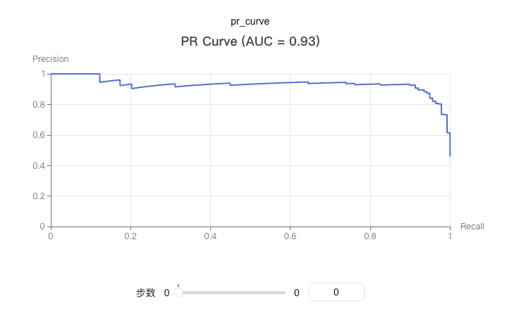

# swanlab.pr_curve

[Github Source Code](https://github.com/SwanHubX/SwanLab/blob/main/swanlab/data/modules/custom_charts/metrics.py)

```python
pr_curve(
    y_true: Union[List, np.ndarray],
    y_pred_proba: Union[List, np.ndarray],
    title: Optional[str, bool] = None,
) -> None
```

| Parameter      | Description                                                                                                                           |
|--------------|--------------------------------------------------------------------------------------------------------------------------------------|
| y_true       | (Union[List, np.ndarray]) True labels, the actual class labels (0 or 1) in binary classification problems                                                                        |
| y_pred_proba | (Union[List, np.ndarray]) Prediction probabilities, the model's predicted probability values for the positive class (range 0-1)                                                                        |
| title        | (Optional[str, bool]) Whether to display chart title, defaults to None                                                                                                           |

## Introduction

Draw a PR (Precision-Recall) curve to evaluate the performance of binary classification models. The PR curve shows the relationship between precision and recall at different thresholds.

PR curves are particularly suitable for handling imbalanced datasets and can better evaluate model performance on minority classes.

### Basic Usage

```python
from sklearn.datasets import make_classification
from sklearn.model_selection import train_test_split
import xgboost as xgb
import swanlab

# Generate sample data
X, y = make_classification(n_samples=1000, n_features=20, n_informative=2, n_redundant=10, random_state=42)
X_train, X_test, y_train, y_test = train_test_split(X, y, test_size=0.3, random_state=42)

# Train model
model = xgb.XGBClassifier(use_label_encoder=False, eval_metric='logloss')
model.fit(X_train, y_train)

# Get prediction probabilities
y_pred_proba = model.predict_proba(X_test)[:, 1]

# Initialize SwanLab
swanlab.init(project="PR-Curve-Demo", experiment_name="PR-Curve-Example")

# Log PR curve
swanlab.log({
    "pr_curve": swanlab.pr_curve(y_test, y_pred_proba, title=True)
})

swanlab.finish()
```



### Custom Title

```python
# Don't show title (default)
pr_curve = swanlab.pr_curve(y_test, y_pred_proba, title=False)
swanlab.log({"pr_curve_no_title": pr_curve})

# Show title
pr_curve = swanlab.pr_curve(y_test, y_pred_proba, title=True)
swanlab.log({"pr_curve_with_title": pr_curve})

# Custom title
pr_curve = swanlab.pr_curve(y_test, y_pred_proba, title="demo")
swanlab.log({"pr_curve_with_custom_title": pr_curve})
```

### Notes

1. **Data Format**: `y_true` and `y_pred_proba` can be lists or numpy arrays
2. **Binary Classification**: This function is specifically for binary classification problems
3. **Probability Values**: `y_pred_proba` should be the model's predicted probability for the positive class, ranging from 0-1
4. **Dependencies**: Requires installation of `scikit-learn` and `pyecharts` packages
5. **AUC Calculation**: The function automatically calculates the area under the PR curve (AUC), but does not display it in the title by default
