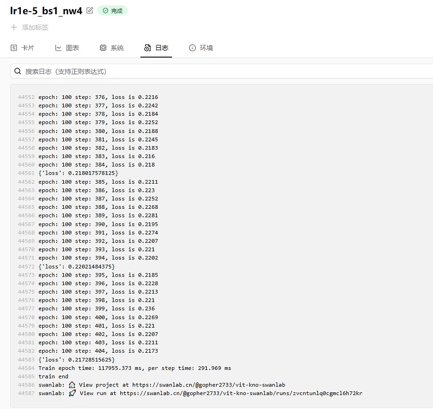
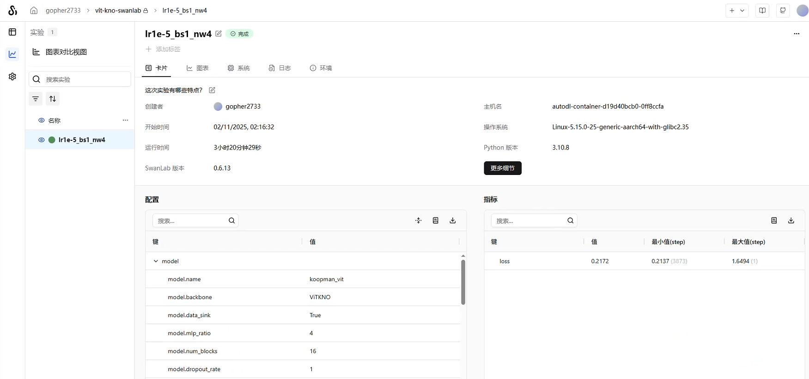
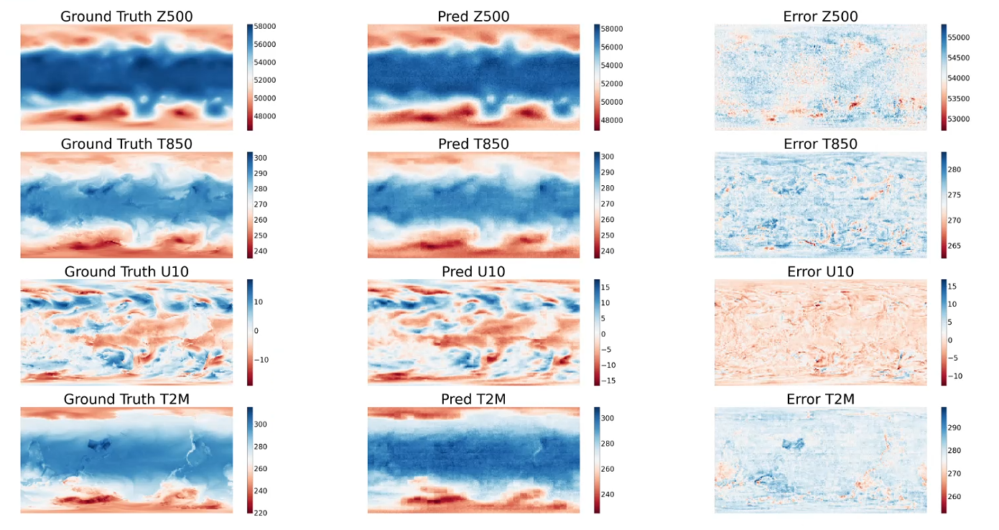
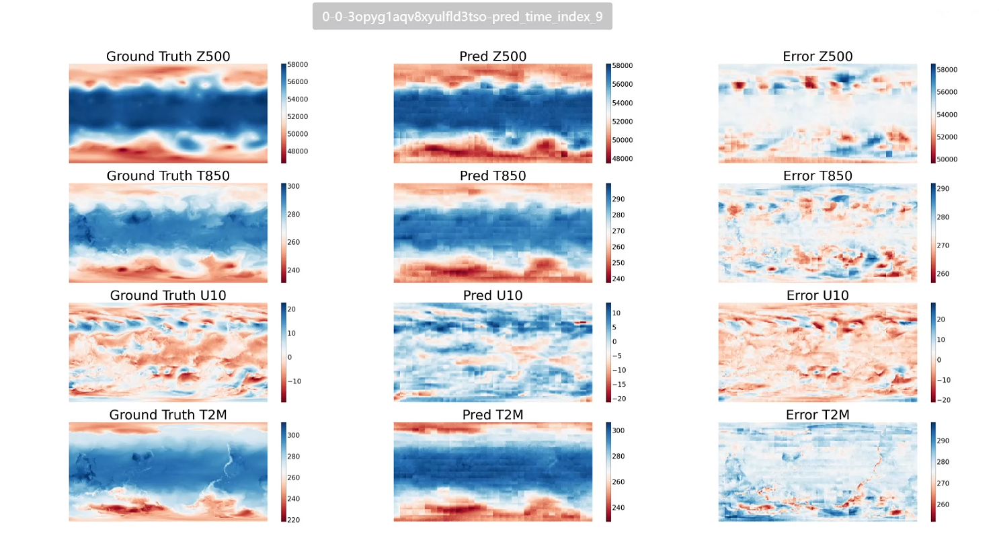

# Vit-KNO Weather Forecasting


## Overview

Weather is closely related to human production, daily life, economic activities, and social operations. Accurate weather forecasting not only reduces losses and ensures safety during severe weather events but also brings substantial benefits to industries such as energy, agriculture, transportation, and entertainment.

Traditional numerical weather prediction relies on data from meteorological satellites, observation stations, and radars, achieving forecasts by solving complex atmospheric dynamics equations. However, this method involves enormous computational costs and is time-consuming. In contrast, data-driven deep learning approaches can significantly reduce computational costs and improve forecasting efficiency.

MindSpore Earth is an intelligent suite for Earth sciences built on Ascend MindSpore. It supports AI-based forecasting for multiple spatiotemporal scales (short-term nowcasting, medium-range, and long-term) as well as severe weather phenomena like precipitation and typhoons. The suite aims to provide researchers and educational users with efficient and user-friendly intelligent weather forecasting software.

This document demonstrates how to train the ViT-KNO weather forecasting model on Huawei Ascend NPUs using MindSpore and MindEarth, and how to log training metrics and visualize results in real-time via SwanLab.


## Environment and Dependencies

- **Operating System**: Ubuntu 22.04
- **Programming Language**: Python 3.10
- **Environment/Dependency Management**: uv
- **Compute Card Configuration**: Huawei Kunpeng 910B2x * 1 card, 64GB VRAM
- **CANN**: 8.0.0
- **CPU**: 24 vCPU Kunpeng-920, 220GB RAM
- **Deep Learning Framework**: MindSpore 2.6.0
- **Scientific Computing Framework**: MindEarth 0.3.0 / r0.7
- **Experiment Management & Visualization**: SwanLab Platform

For MindSpore installation, refer to [Ascend NPU & MindSpore | SwanLab](https://docs.swanlab.cn/guide_cloud/integration/integration-ascend.html#安装mindspore) 。

For MindSpore Earth installation, refer to [MindSpore Earth 0.3](https://www.mindspore.cn/mindearth/docs/zh-CN/r0.3/mindearth_install.html) 。

The source code for the `ViT-KNO`model can be obtained from [koopman_vit](https://gitee.com/mindspore/mindscience/tree/r0.7/MindEarth/applications/medium-range/koopman_vit) .  Note that the Gitee branch version here is r0.7, which corresponds to MindSpore Earth version 0.3.


## Obtaining the Dataset

This project uses the [WeatherBench](https://download.mindspore.cn/mindscience/mindearth/dataset/WeatherBench_1.4_69/) dataset, a benchmark dataset primarily used for medium-range weather forecasting and sub-seasonal to seasonal forecasting research.

Before starting training, modify the `root_dir`parameter in the `vit_kno.yaml`configuration file to specify the dataset storage path. The default path is `./dataset`. After configuration, the project will load the required data files for training and validation from this path.

The dataset is stored in the `./dataset`directory. Its internal structure is as follows:

```sh
.
├── statistic
│   ├── mean.npy
│   ├── mean_s.npy
│   ├── std.npy
│   └── std_s.npy
├── train
│   └── 2015
├── train_static
│   └── 2015
├── train_surface
│   └── 2015
├── train_surface_static
│   └── 2015
├── valid
│   └── 2016
├── valid_static
│   └── 2016
├── valid_surface
│   └── 2016
├── valid_surface_static
│   └── 2016
```


## Directory Structure

Except for the dataset path specified in the `vit_kno.yaml`configuration file, the recommended project structure for other files is as follows:

```sh
.
├── vit_kno.yaml              # Model and training configuration file
├── src/
│   ├── __init__.py           
│	├── callback.py
│	├── solver.py
│	├── utils.py
├── main.py          		  # Main training script
└── summary/                  # SwanLab log and checkpoint directory (auto-generated)
```

**Complete Code**

vit_kno.yaml：

```yaml
model:
  name: koopman_vit
  backbone: "ViTKNO"
  encoder_depth: 16
  # encoder_depth: 8
  # encoder_depth: 1
  encoder_network: False
  encoder_embed_dim: 768
  # encoder_embed_dim: 384
  # encoder_embed_dim: 192
  num_blocks: 16
  # num_blocks: 8
  # num_blocks: 1
  mlp_ratio: 4
  dropout_rate: 1.
data:
  name: "era5"
  root_dir: "/root/autodl-tmp/dataset"
  feature_dims: 69
  data_sink: False
  pressure_level_num: 13
  patch: True
  patch_size: 8
  batch_size: 1
  t_in: 1
  t_out_train: 1
  t_out_valid: 20
  t_out_test: 20
  valid_interval: 1
  test_interval: 1
  train_interval: 1
  pred_lead_time: 6
  data_frequency: 6
  train_period: [2015, 2015]
  valid_period: [2016, 2016]
  test_period: [2017, 2017]
  grid_resolution: 1.4
  num_workers: 4
optimizer:
  name: "adam"
  weight_decay: 0.0
  epochs: 100
  finetune_epochs: 10
  warmup_epochs: 1
  initial_lr: 0.005
summary:
  summary_dir: "./summary"
  valid_frequency: 200
  save_checkpoint_epochs: 1
  keep_checkpoint_max: 1
  plt_key_info: True
  key_info_timestep: [6,72,120]
  ckpt_path: ""
train:
  name: "oop"
  distribute: False
  amp_level: O2
  load_ckpt: False
```

The complete source code under the `src`directory is stored in the official MindScience code repository's Gitee mirror. The specific path is: `https://gitee.com/mindspore/mindscience/tree/r0.7/MindEarth/applications/medium-range/koopman_vit/src`

main.py:

```python
import os
import numpy as np
import matplotlib.pyplot as plt

from mindspore import context, Model
from mindspore import dtype as mstype
from mindspore.train import load_checkpoint, load_param_into_net
from mindspore.train import DynamicLossScaleManager
from mindspore import _checkparam as Validator
from mindspore.train.callback._callback import Callback, _handle_loss
from mindspore._c_expression import collect_host_info, get_clock_syscnt
from mindspore.train.callback import LossMonitor, TimeMonitor
from mindspore.train import CheckpointConfig, ModelCheckpoint

from mindearth.cell import ViTKNO
from mindearth.utils import load_yaml_config, create_logger, plt_global_field_data, make_dir
from mindearth.data import Dataset, Era5Data, SIZE_DICT
from mindearth.module import Trainer

from src.callback import EvaluateCallBack, InferenceModule, Lploss, CustomWithLossCell

import swanlab

context.set_context(mode=context.GRAPH_MODE, device_target="Ascend", device_id=0)

config = load_yaml_config('vit_kno.yaml')
config['model']['data_sink'] = True  # Whether to use data sink feature

config['train']['distribute'] = False  # Whether to perform distributed training
config['train']['amp_level'] = 'O2'  # Set mixed precision level

config['data']['num_workers'] = 1  # Set number of parallel workers
config['data']['h_size'], config['data']['w_size'] = SIZE_DICT[1.4]  # Set meteorological resolution parameters

config['optimizer']['epochs'] = 100  # Set number of epochs
config['optimizer']['finetune_epochs'] = 1  # Set number of fine-tuning epochs
config['optimizer']['warmup_epochs'] = 1  # Set number of warm-up epochs
config['optimizer']['initial_lr'] = 0.00001  # Set initial learning rate

config['summary']["summary_dir"] = './summary'  # Set model checkpoint storage path
make_dir(os.path.join(config['summary']["summary_dir"], "image"))
logger = create_logger(path=os.path.join(config['summary']["summary_dir"], "results.log"))

swanlab.init(
    project="vit-kno-swanlab",
    experiment_name="lr1e-5_bs1_nw4",
    config=config
)

data_params = config["data"]
model_params = config["model"]
compute_type = mstype.float32

model = ViTKNO(image_size=(data_params["h_size"], data_params["w_size"]),
               in_channels=data_params["feature_dims"],
               out_channels=data_params["feature_dims"],
               patch_size=data_params["patch_size"],
               encoder_depths=model_params["encoder_depth"],
               encoder_embed_dims=model_params["encoder_embed_dim"],
               mlp_ratio=model_params["mlp_ratio"],
               dropout_rate=model_params["dropout_rate"],
               num_blocks=model_params["num_blocks"],
               high_freq=True,
               encoder_network=model_params["encoder_network"],
               compute_dtype=compute_type)

loss_fn = Lploss()
loss_net = CustomWithLossCell(model, loss_fn)

"""SwanLabMonitor Callback class."""
class SwanLabMonitor(Callback):
    def __init__(self, per_print_times=10):
        super(SwanLabMonitor, self).__init__()
        Validator.check_non_negative_int(per_print_times)
        self._per_print_times = per_print_times

    def on_train_step_end(self, run_context):
        cb_params = run_context.original_args()
        collect_host_info("Callback", "LossMonitor", "train_epoch_end", start_time=get_clock_syscnt(), level=1)
        loss = _handle_loss(cb_params.net_outputs)
        totle_step_nums = cb_params.cur_step_num
        if cb_params.cur_step_num % self._per_print_times == 0:
            swanlab.log({"loss": loss}, print_to_console=True)

    def on_train_end(self, run_context):
        print("train end")
        swanlab.finish()


class ViTKNOEra5Data(Era5Data):
    def _patch(self, *args):
        """ Partition the data into patches. """
        x = args[0]
        if self.run_mode == 'valid' or self.run_mode == 'test':
            x = x.transpose(1, 0, 2, 3)
        return x

class ViTKNOTrainer(Trainer):
    r"""
    Self-defined forecast model inherited from `Trainer`.

    Args:
        config (dict): parameters for training.
        model (Cell): network for training.
        loss_fn (str): user-defined loss function.
        logger (logging.RootLogger): tools for logging.

    Supported Platforms:
        ``Ascend`` ``GPU``

    """
    def __init__(self, config, model, loss_fn, logger):
        super(ViTKNOTrainer, self).__init__(config, model, loss_fn, logger)
        self.pred_cb = self.get_callback()

    def get_data_generator(self):
        """
        Get train and valid dataset.

        Returns:
            Dataset, train dataset.
            Dataset, valid dataset.
        """
        train_dataset_generator = ViTKNOEra5Data(data_params=self.data_params, run_mode='train')
        valid_dataset_generator = Era5Data(data_params=self.data_params, run_mode='valid')
        return train_dataset_generator, valid_dataset_generator

    def get_callback(self):
        pred_cb = EvaluateCallBack(self.model, self.valid_dataset_generator, self.config, self.logger)
        return pred_cb

    def get_solver(self):
        loss_scale = DynamicLossScaleManager()
        solver = Model(self.loss_fn,
                       optimizer=self.optimizer,
                       loss_scale_manager=loss_scale,
                       amp_level=self.train_params['amp_level']
                       )
        return solver
        
        
    def train(self):
        """
        Execute model training.
        """
        callback_lst = [LossMonitor(), TimeMonitor(), SwanLabMonitor(per_print_times=10)]
        if self.pred_cb:
            callback_lst.append(self.pred_cb)
        if not self.train_params.get('distribute') or D.get_rank() == 0:
            callback_lst.append(self.ckpt_cb)
        if self.step == 1:
            self.solver.train(epoch=self.optimizer_params.get("epochs"),
                              train_dataset=self.train_dataset,
                              callbacks=callback_lst,
                              dataset_sink_mode=self.data_params.get('data_sink'))
        else:
            self.solver.train(epoch=self.optimizer_params.get("finetune_epochs"),
                              train_dataset=self.train_dataset,
                              callbacks=callback_lst,
                              dataset_sink_mode=self.data_params.get('data_sink'))

    def get_checkpoint(self):
        """
        Get the checkpoint callback of the model.

        Returns:
            Callback, The checkpoint callback of the model.
        """
        ckpt_file_name = "ckpt/step_{}".format(self.step)
        ckpt_dir = os.path.join(self.callback_params.get('summary_dir'), ckpt_file_name)
        make_dir(ckpt_dir)
        model_name = self.model_params.get('name')
        if self.train_params.get('distribute'):
            rank_id = D.get_rank()
            ckpt_name = "{}-device{}".format(model_name, rank_id)
        else:
            ckpt_name = model_name
        ckpt_config = CheckpointConfig(
            save_checkpoint_steps=self.callback_params.get("save_checkpoint_epochs") * self.steps_per_epoch,
            keep_checkpoint_max=self.callback_params.get("keep_checkpoint_max"))
        ckpt_cb = ModelCheckpoint(prefix=ckpt_name, directory=ckpt_dir, config=ckpt_config)
        return ckpt_cb
 

trainer = ViTKNOTrainer(config, model, loss_net, logger)
print("trainer.valid_dataset.get_dataset_size: ", trainer.valid_dataset.get_dataset_size())

trainer.train()
swanlab.finish()
```


## Starting Training and Monitoring

Run the following command in the project's main directory:

```sh
python main.py
```

In the script, an experiment project is created via `swanlab.init()`, and the config dictionary read from the YAML file is passed as hyperparameters for SwanLab to read.

```python
import swanlab

swanlab.init(
    project="vit-kno-swanlab",
    experiment_name="lr1e-5_bs1_nw4",
    config=config
)
```

After executing this code, `SwanLab` will create a new experiment in the cloud or local dashboard, recording the following:

- Training/Validation loss curves
- Model parameters (hyperparameters)
- Run logs and timing
- Visualized outputs

**Core Monitoring Code**

The following code constructs a `SwanLabMonitor`class that inherits from the Callback class. The method `on_train_step_end()`implements logging the loss value during training every specified number of steps (here `per_print_times=10`) using `swanlab.log()`.

```python
"""SwanLabMonitor Callback class."""
class SwanLabMonitor(Callback):
    def __init__(self, per_print_times=10):
        super(SwanLabMonitor, self).__init__()
        Validator.check_non_negative_int(per_print_times)
        self._per_print_times = per_print_times

    def on_train_step_end(self, run_context):
        cb_params = run_context.original_args()
        collect_host_info("Callback", "LossMonitor", "train_epoch_end", start_time=get_clock_syscnt(), level=1)
        loss = _handle_loss(cb_params.net_outputs)
        totle_step_nums = cb_params.cur_step_num
        if cb_params.cur_step_num % self._per_print_times == 0:
            swanlab.log({"loss": loss}, print_to_console=True)

    def on_train_end(self, run_context):
        print("train end")
        swanlab.finish()
```

An instance of the above class is then passed into the `Callback`list of the `train()`method in the `ViTKNOTrainer`class, enabling the logging of loss values after each step throughout the training process.

```python
def train(self):
    """
    Execute model training.
    """
    callback_lst = [LossMonitor(), TimeMonitor(), SwanLabMonitor(per_print_times=10)]
    if self.pred_cb:
        callback_lst.append(self.pred_cb)
    if not self.train_params.get('distribute') or D.get_rank() == 0:
        callback_lst.append(self.ckpt_cb)
    if self.step == 1:
        self.solver.train(epoch=self.optimizer_params.get("epochs"),
                          train_dataset=self.train_dataset,
                          callbacks=callback_lst,
                          dataset_sink_mode=self.data_params.get('data_sink'))
    else:
        self.solver.train(epoch=self.optimizer_params.get("finetune_epochs"),
                          train_dataset=self.train_dataset,
                          callbacks=callback_lst,
                          dataset_sink_mode=self.data_params.get('data_sink'))
```


## Viewing Training Monitoring Results

During training, the `SwanLab`dashboard displays:

- **Loss Curve**: Monitoring model convergence.

  

- **Run Logs**: Detailed output information.

  

- **Experiment Overview**: Comprehensive display of model information.

  


## Inference and Metric Visualization

The `SwanLab`dashboard also supports visualization of the model inference process, facilitating the intuitive display of key metrics.

**Inference Code**

inference.py:

```python
import os
import numpy as np
import matplotlib.pyplot as plt

from mindspore import context
from mindspore import dtype as mstype
from mindspore.train import load_checkpoint, load_param_into_net

from mindearth.data import Dataset, Era5Data, SIZE_DICT
from mindearth.cell import ViTKNO
from mindearth.utils import load_yaml_config, create_logger, plt_global_field_data, make_dir

import swanlab

from src.callback import EvaluateCallBack, InferenceModule, Lploss, CustomWithLossCell

context.set_context(mode=context.GRAPH_MODE, device_target="Ascend", device_id=0)

config = load_yaml_config('vit_kno.yaml')
config['model']['data_sink'] = True  # Whether to use data sink feature

config['train']['distribute'] = False  # Whether to perform distributed training
config['train']['amp_level'] = 'O2'  # Set mixed precision level

config['data']['num_workers'] = 1  # Set number of parallel workers
config['data']['h_size'], config['data']['w_size'] = SIZE_DICT[1.4]  # Set meteorological resolution parameters

config['optimizer']['epochs'] = 100  # Set number of epochs
config['optimizer']['finetune_epochs'] = 1  # Set number of fine-tuning epochs
config['optimizer']['warmup_epochs'] = 1  # Set number of warm-up epochs
config['optimizer']['initial_lr'] = 0.00001  # Set initial learning rate

config['summary']["summary_dir"] = './summary'  # Set model checkpoint storage path
make_dir(os.path.join(config['summary']["summary_dir"], "image"))
logger = create_logger(path=os.path.join(config['summary']["summary_dir"], "results.log"))

swanlab.init(
    project="vit-kno-swanlab",
    experiment_name="lr1e-5_bs1_nw4_inference",
    config=config
)

data_params = config["data"]
model_params = config["model"]
compute_type = mstype.float32

model = ViTKNO(image_size=(data_params["h_size"], data_params["w_size"]),
               in_channels=data_params["feature_dims"],
               out_channels=data_params["feature_dims"],
               patch_size=data_params["patch_size"],
               encoder_depths=model_params["encoder_depth"],
               encoder_embed_dims=model_params["encoder_embed_dim"],
               mlp_ratio=model_params["mlp_ratio"],
               dropout_rate=model_params["dropout_rate"],
               num_blocks=model_params["num_blocks"],
               high_freq=True,
               encoder_network=model_params["encoder_network"],
               compute_dtype=compute_type)
params = load_checkpoint('./summary/ckpt/step_1/koopman_vit_4-100_404.ckpt')
load_param_into_net(model, params)

class FourCastNetInferenceModule(InferenceModule):
    def forecast(self, inputs):
        pred_lst = []
        for _ in range(self.t_out):
            pred, _ = self.model(inputs)
            pred_lst.append(pred)
            inputs = pred
        return pred_lst

inference_module = FourCastNetInferenceModule(model, config, logger)

class ViTKNOEra5Data(Era5Data):
    def _patch(self, *args):
        """ Partition the data into patches. """
        x = args[0]
        if self.run_mode == 'valid' or self.run_mode == 'test':
            x = x.transpose(1, 0, 2, 3)
        return x

def plt_data(pred, label, root_dir, index=0):
    """ Visualize the forecast results """
    std = np.load(os.path.join(root_dir, 'statistic/std.npy'))
    mean = np.load(os.path.join(root_dir, 'statistic/mean.npy'))
    std_s = np.load(os.path.join(root_dir, 'statistic/std_s.npy'))
    mean_s = np.load(os.path.join(root_dir, 'statistic/mean_s.npy'))

    # Convert pred from MindSpore Tensor to numpy array
    if hasattr(pred, 'asnumpy'):
        pred = pred.asnumpy()

    plt.figure(num='e_imshow', figsize=(100, 50), dpi=50)

    plt.subplot(4, 3, 1)
    plt_global_field_data(label, 'Z500', std, mean, 'Ground Truth')  # Z500
    plt.subplot(4, 3, 2)
    plt_global_field_data(pred, 'Z500', std, mean, 'Pred')  # Z500
    plt.subplot(4, 3, 3)
    plt_global_field_data(label - pred, 'Z500', std, mean, 'Error')  # Z500

    plt.subplot(4, 3, 4)
    plt_global_field_data(label, 'T850', std, mean, 'Ground Truth')  # T850
    plt.subplot(4, 3, 5)
    plt_global_field_data(pred, 'T850', std, mean, 'Pred')  # T850
    plt.subplot(4, 3, 6)
    plt_global_field_data(label - pred, 'T850', std, mean, 'Error')  # T850

    plt.subplot(4, 3, 7)
    plt_global_field_data(label, 'U10', std_s, mean_s, 'Ground Truth', is_surface=True)  # U10
    plt.subplot(4, 3, 8)
    plt_global_field_data(pred, 'U10', std_s, mean_s, 'Pred', is_surface=True)  # U10
    plt.subplot(4, 3, 9)
    plt_global_field_data(label - pred, 'U10', std_s, mean_s, 'Error', is_surface=True)  # U10

    plt.subplot(4, 3, 10)
    plt_global_field_data(label, 'T2M', std_s, mean_s, 'Ground Truth', is_surface=True)  # T2M
    plt.subplot(4, 3, 11)
    plt_global_field_data(pred, 'T2M', std_s, mean_s, 'Pred', is_surface=True)  # T2M
    plt.subplot(4, 3, 12)
    plt_global_field_data(label - pred, 'T2M', std_s, mean_s, 'Error', is_surface=True)  # T2M

    # Log the image to SwanLab
    swanlab.log({"pred_result_img": swanlab.Image(plt)})
    # Using SwanLab to log images avoids the need to save directly or display in jupyter notebook
    # plt.savefig(f'pred_result.png', bbox_inches='tight')
    # plt.show()


test_dataset_generator = ViTKNOEra5Data(data_params=config["data"], run_mode='test')
test_dataset = Dataset(test_dataset_generator, distribute=False,
                       num_workers=config["data"]['num_workers'], shuffle=False)
test_dataset = test_dataset.create_dataset(config["data"]['batch_size'])


data = next(test_dataset.create_dict_iterator())
inputs = data['inputs']
labels = data['labels']
pred_time_index = 0
pred = inference_module.forecast(inputs)
pred = pred[pred_time_index]
ground_truth = labels[..., pred_time_index, :, :].asnumpy()


plt_data(pred, ground_truth, config['data']['root_dir'])
```

When SwanLab initializes and finishes, the terminal will output prompt information containing the SwanLab dashboard link. Click the link to open the dashboard:


After opening the dashboard, you can view all visualization results generated during inference on the "Charts" page:




For convenient experiment management, the inference code initialization uses the same project name (`vit-kno-swanlab`) as the training phase but with a distinct experiment name. Users can easily distinguish and switch between different experiments using the left sidebar.

When multiple charts need to be generated during training or inference, `SwanLab`enables real-time synchronization and viewing of charts. Once an image is logged, it is immediately displayed in the dashboard.





## References

- Mindspore Official Website: [MindSpore](https://www.mindspore.cn/)

- Mindspore Earth: [MindSpore Earth 0.3](https://www.mindspore.cn/mindearth/docs/zh-CN/r0.3/index.html)

- ViT-KNO Model Paper: [arxiv.org/pdf/2301.01104](https://arxiv.org/pdf/2301.01104)

- ViT-KNO Model Source Code: [mindscience: MindScience is scientific computing kits for various industries based on the converged MindSpore framework. - Gitee.com](https://gitee.com/mindspore/mindscience/tree/r0.7/MindEarth/applications/medium-range/koopman_vit)

- WeatherBench Dataset:  [Index of /mindscience/mindearth/dataset/WeatherBench_1.4_69/](https://download.mindspore.cn/mindscience/mindearth/dataset/WeatherBench_1.4_69/)

- WeatherBench Introduction: [GitHub - guanqiyuan/WeatherBench](https://github.com/guanqiyuan/WeatherBench)

- SwanLab: [SwanLab](https://docs.swanlab.cn/guide_cloud/general/what-is-swanlab.html)

  

