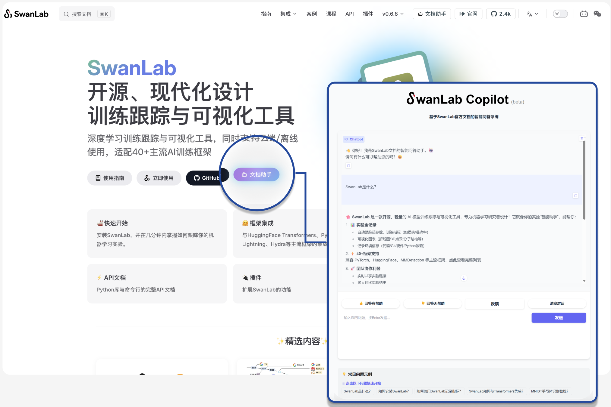

# Lazy Person's Guide: Drag and Drop Documents = Your Own AI Document Assistant? How to Build RAG? SwanLab Document Assistant Solution Open-Sourced! (With Detailed Code)
**Authors**: Chen Li, Chao Wang  
**Affiliation**: Graduate Students, International Joint Laboratory for Multilingual Cognitive Computing, Xinjiang University; Intern Researchers, Emotion Machine  
**Contact Emails**: lichen@stu.xju.edu.cn, wangchao@stu.xju.edu.cn  

**"With the explosive growth of official documentation APIs, reading them has become quite challenging for users. Today, we’ll use **SwanLab** + an **out-of-the-box RAG framework** to guide you through building a **production-grade document assistant** in just 30 minutes! (Complete source code and online demo included—no complex setup required, ready to run locally in 10 minutes!)"**

**AI Document Assistant Online Demo**: [https://chat.swanlab.cn/](https://chat.swanlab.cn/)  
**Open-Source GitHub Repository**: [https://github.com/EmotionMachine/swanlab-rag](https://github.com/EmotionMachine/swanlab-rag)  
**SwanLab Official Prompt Engineering Course**:fire:: [https://docs.swanlab.cn/course/prompt_engineering_course/01-preface/README.html](https://docs.swanlab.cn/course/prompt_engineering_course/01-preface/README.html)  

<div align="center">
  <figure>
  
  <figcaption>SwanLab Official Documentation Demo</figcaption>
  </figure>
</div>

---

## Abstract
In the era of information explosion, developers need to quickly extract accurate information from technical documentation. SwanLab’s official documentation is rich in content, but manual searching is time-consuming and inefficient. **To enable developers to retrieve information from SwanLab’s official documentation more quickly and accurately**, we developed an AI document assistant based on the **Retrieval-Augmented Generation (RAG) architecture**.  
This article details the implementation process of the SwanLab official document assistant, built entirely from scratch without relying on any existing agent frameworks—truly **handcrafted**. The article covers three main aspects: data preparation, document retrieval, and model generation.

<div align="center">
  <figure>
  
  <figcaption>Technical Architecture Overview of SwanLab Document Assistant</figcaption>
  </figure>
</div>

---

## Table of Contents
[[toc]]

## Data Preparation
This section introduces the detailed construction scheme for the **vector database**.

### Document Retrieval
The knowledge base for the AI assistant comes from the latest and most comprehensive official documentation. The first step is to enable the AI to “read” all of SwanLab’s official documentation. **GitHub, being a platform familiar to developers, reduces the learning curve.** We used the **GitHub API as the primary method for retrieving documentation**, ensuring both technical reliability and the real-time, comprehensive nature of the retrieved data.

The implementation involves **writing a Python web crawler script that uses the GitHub API to automatically scan the SwanLab documentation repository and retrieve metadata for all Markdown files**, such as titles, download links, and corresponding official webpage URLs, which are saved in a `JSON` file. The workflow is illustrated below:

<div align="center">
  <figure>
  
  <figcaption>GitHub API Call Workflow</figcaption>
  </figure>
</div>

The `swanlab.json` file contains the file name, document URL, webpage URL, and document theme, as shown below:

```json
{
  "theme": "cli-swanlab-convert",
  "url": "https://raw.githubusercontent.com/SwanHubX/SwanLab-Docs/main/zh/api/cli-swanlab-convert.md",
  "html_url": "https://docs.swanlab.cn/api/cli-swanlab-convert.html",
  "title": "swanlab convert"
}
```

### GitHub API and Its Usage
The GitHub API is a programming interface for interacting with the GitHub platform, allowing developers to access resources and data programmatically. The endpoint `https://api.github.com/repos/` is a key component, enabling users to retrieve resources from GitHub repositories.  

The API’s core functionality provides a programmatic way to access and manipulate GitHub data, eliminating the need for manual interaction through the user interface. Developers can retrieve detailed repository information, create new repositories, modify existing repository settings, or even delete repositories.

<div align="center">
  <figure>
  
  <figcaption>Automated Git Repository Workflow</figcaption>
  </figure>
</div>

The specific usage of the GitHub API in the code is as follows:

```python
# scrape_swanlab_docs_Internet.py
# Authentication and request headers: Use `Authorization: token {token}` for authentication to increase API rate limits (unauthenticated users: 60 requests/hour; authenticated users: 5000 requests/hour).
github_token = ""  # Replace with your GitHub Token
headers['Authorization'] = f'token {github_token}'  
# Configure retry mechanism using the requests library
session = requests.Session()
response = session.get("https://api.github.com/rate_limit", headers=headers, timeout=60)
response.raise_for_status()
contents = response.json()
"""
Retrieve
Args:
   repo_url (str): GitHub repository directory URL (e.g., 'https://github.com/SwanHubX/SwanLab-Docs/tree/main/zh')
   base_html_url (str): SwanLab documentation website root URL (e.g., 'https://docs.swanlab.cn')
"""
for item in contents:
    if item['type'] == 'file' and item['name'].endswith('.md'):
        theme = item['name'].replace('.md', '')
        md_url = item['download_url']
        relative_path = md_url.split('/main/zh/')[-1]
        html_filename = filename_map.get(theme, theme)
        html_path = relative_path.replace(theme + '.md', html_filename + '.html')
        html_url = f"{base_html_url}/{html_path}"
        title = get_markdown_title(md_url, headers, session)
        docs.append({
            "theme": theme,
            "url": md_url,
            "html_url": html_url,
            "title": title
        })
        logger.info(
            f"{'  ' * depth}Added file: {theme}, Markdown: {md_url}, HTML: {html_url}, Title: {title}")
    elif item['type'] == 'dir':
        logger.info(f"{'  ' * depth}Entering directory: {item['path']}")
        scan_directory(item['url'], docs, depth + 1)
```

### Document Parsing and Chunking
In the previous step, we obtained a list of document “addresses” (in the `JSON` file). Next, we need to “follow the map” to access each link, asynchronously fetch the raw content of all Markdown files, and use an LLM to parse and chunk the documents based on their content, extracting key sections to build the knowledge base.

First, let’s discuss the chunking strategy and why it’s necessary. Chunking involves dividing text into manageable units or “chunks” for efficient processing. This segmentation is critical for tasks like semantic search, information retrieval, and generative AI applications. Each chunk retains contextual and semantic integrity to ensure coherent results. The chunking strategy plays a vital role in Retrieval-Augmented Generation (RAG) by dividing documents into manageable parts while preserving context.

<div align="center">
  <figure>
  
  <figcaption>Chunking Strategy Diagram</figcaption>
  </figure>
</div>

In our tests, directly vectorizing long texts led to issues like semantic dilution, high computational resource consumption, and reduced retrieval efficiency. Proper chunking of long texts is a prerequisite for building an efficient vector database. It improves retrieval accuracy while ensuring that recalled content aligns closely with the user’s query intent, thereby enhancing the quality of answers generated by the large language model. Our final approach was to chunk documents based on their secondary headings, incorporating valuable structural metadata while balancing chunk granularity to maintain semantic integrity and focus. When a user’s query is highly relevant to a specific subtopic, the model can accurately recall text chunks containing the relevant heading and content, avoiding interference from irrelevant information and improving the reliability and usability of answers. Through continuous experimentation, we achieved an ideal balance between retrieval efficiency and generation quality.

The chunked content is then merged to form complete knowledge blocks, each containing a relatively comprehensive theme and content. The code to implement this logic is straightforward:

```python
# create_vector.py
def split_text(text: str, separator: str = "################") -> list[str]:
    """
    Split text: Divide text based on the specified separator.
    """
    chunks = text.split(separator)
    # Filter out any empty strings
    return [chunk.strip() for chunk in chunks if chunk.strip()]
```

The configuration file and chunking prompt are shown in `config.py` and `prompt.py`. During processing, we use a special separator `################` to divide document content based on secondary headings, forming a complete SwanLab documentation knowledge base.

```yaml
# config.yaml
llm:
  api_type: "openai"  # or "groq", etc.
  model: "Qwen/Qwen2.5-32B-Instruct"  # or "GPT-4o", etc.
  api_key: ""    # Replace with your API key
  base_url: ""  # LLM service URL
```

```python
# prompt.py
llm = LLM()
prompt = f"""
Analyze the following Markdown content and organize it into chunks.
Format as follows:
Primary Heading: (Document Title)
Secondary Heading (Document Secondary Heading): Content
################
Primary Heading: (Document Title)
Secondary Heading (Document Secondary Heading): Content
################
...
################
Reference Content: {content}
"""
```

### Document Encoding
Now that we have a collection of text chunks, computers don’t understand text—they understand numbers. We need a “translator” to convert each text chunk into a numerical “vector.” This process is called **Embedding**.

<div align="center">
  <figure>
  
  <figcaption>Generating Word Vectors</figcaption>
  </figure>
</div>

We call an API-provided `Embedding` model to accomplish this task. The process is relatively straightforward, requiring key parameters like `API_KEY` and `Base_URL`. The implementation is shown below. For each text chunk, we obtain an embedded vector.

```python
# create_vector.py
def get_embeddings_from_api(texts: list[str], batch_size: int = 16) -> list[list[float]]:
    all_embeddings = []
    headers = {
        "Authorization": f"Bearer {API_KEY}",
        "Content-Type": "application/json"
    }
    url = f"{BASE_URL.rstrip('/')}/embeddings"
    for i in range(0, len(texts), batch_size):
        batch = texts[i:i + batch_size]
        payload = {
            "model": EMBEDDING_MODEL,
            "input": batch
        }
        # ... Send request and retrieve vectors ...
        response_data = response.json()
        batch_embeddings = [item['embedding'] for item in response_data['data']]
        all_embeddings.extend(batch_embeddings)
    return all_embeddings
```

After obtaining all the vectors, how do we manage them? We chose Facebook’s open-source `FAISS` library to build a vector database, which supports fast processing of large-scale data and similarity searches in high-dimensional spaces. Think of `FAISS` as an efficient “library” designed for vectors, capable of quickly finding the vectors most similar to a given vector.

At this point, our “SwanLab Official Documentation Vector Knowledge Base” is fully prepared for document retrieval!

---

## Document Retrieval (RAG)
**Retrieval-Augmented Generation (RAG)** is an AI technique that combines information retrieval with language generation models. By retrieving relevant information from an external knowledge base and using it as a prompt for large language models (LLMs), RAG enhances the model’s ability to handle knowledge-intensive tasks like question answering, text summarization, and content generation. Introduced by Facebook AI Research (FAIR) in 2020, RAG has become a popular approach in large-scale model applications.

<div align="center">
  <figure>
  
  <figcaption>Document Retrieval Workflow Diagram</figcaption>
  </figure>
</div>

Data preparation is done offline, while question-answering retrieval is a real-time interaction between the user and the AI. This process is like giving the AI an “open-book exam,” where we first retrieve relevant reference materials and then let it answer user questions based on those official documents.

### Retrieving Relevant Documents
When a user asks a question, we first use the same `Embedding` model to convert the question into a vector. Using this “question vector,” we employ a hybrid retrieval strategy (vector retrieval + keyword retrieval) to search the FAISS vector database, instructing it to: “Find the text chunk vectors closest to this vector in spatial distance!” We’ll discuss why we use this hybrid approach in the section on hybrid retrieval. First, let’s review the core logic of vector retrieval and keyword retrieval.

<div align="center">
  <figure>
  
  <figcaption>FAISS Vector Database</figcaption>
  </figure>
</div>

#### Vector Retrieval
**Faiss** (Facebook AI Similarity Search) is an open-source library by Facebook AI, designed for efficient similarity search and clustering of dense vectors. It supports billion-scale vector searches and is widely used in recommendation systems, image retrieval, and natural language processing.

Faiss offers various algorithms for handling vector sets of any size, supporting efficient approximate nearest neighbor (ANN) search and clustering. Its core algorithms include Inverted File Index (IVF) and Product Quantization (PQ), with GPU acceleration for enhanced performance. Most importantly, Faiss provides seamless integration with Python and NumPy, enabling us to implement it purely in Python without relying on any frameworks.

<div align="center">
  <figure>
  
  <figcaption>FAISS</figcaption>
  </figure>
</div>

Vector retrieval overcomes lexical barriers, understanding the user’s true intent. Even if the user’s phrasing differs from the document’s wording, as long as the meaning is similar, it can easily find the relevant content. It also helps users discover highly relevant content they didn’t directly ask for, providing more exploratory results.

The implementation of vector retrieval is shown below:

```python
# chat_logic.py
# 1. Convert user question to vector
query_embedding = self._get_query_embedding(question)
query_vector = np.array([query_embedding]).astype('float32')
# 2. Perform search in FAISS, k=10 means finding the 10 most similar chunks (adjustable)
distances, indices = self.index.search(query_vector, k=10)
# 3. Retrieve original text chunks based on returned indices
retrieved_chunks = [self.index_to_chunk[str(i)] for i in indices[0]]
```

#### Keyword Retrieval
**Keyword Search**, also known as lexical search, is a traditional information retrieval method based on exact word matching. Its core mechanism relies on an inverted index structure, consisting of a lexicon and corresponding posting lists, enabling efficient lookup through their mapping. The process involves query parsing, extracting query terms through lexical analysis, and optionally applying techniques like stopword filtering to optimize retrieval. This method excels in precise matching of query keywords with document terms, offering high computational efficiency and simplicity.

```python
# Use regular expressions (re module) for keyword retrieval, selecting the 10 most similar text chunks
def _keyword_search(self, query: str, k: int = 10):
    keywords = [word for word in re.split(r'\W+', query.lower()) if word]
    if not keywords:
        return []
    all_chunks = list(self.index_to_chunk.values())
    chunk_scores = {}
    for chunk in all_chunks:
        score = 0
        chunk_lower = chunk.lower()
        for keyword in keywords:
            score += chunk_lower.count(keyword)
        if score > 0:
            chunk_scores[chunk] = score
    sorted_chunks = sorted(chunk_scores.items(), key=lambda item: item[1], reverse=True)
    return [chunk for chunk, score in sorted_chunks[:k]]
```

#### Hybrid Retrieval
We adopted a hybrid retrieval approach (vector retrieval + keyword retrieval) because the two methods complement each other. Vector retrieval provides “intelligence” and “depth” to understand user intent, while keyword retrieval ensures “precision” and “reliability” in capturing key details. This combination achieves a “1+1 > 2” effect and is a mainstream and best-practice approach for building advanced RAG systems.

<div align="center">
  <figure>
  
  <figcaption>Hybrid Retrieval Diagram</figcaption>
  </figure>
</div>

Advantages of hybrid retrieval:
- **Ensures High Recall**: Hybrid retrieval maximizes the likelihood of retrieving all potentially relevant documents. Vector retrieval handles documents that “match in meaning,” while keyword retrieval acts as a safety net, ensuring documents with specific keywords are not missed.
- **Improves Answer Precision**: By providing the large language model with context that includes both high-level conceptual understanding and fine-grained key details, the model can generate more reliable and accurate answers based on richer, unbiased information.
- **Handles Complex Query Scenarios**:
  - For vague queries like “My experiment results seem off,” vector retrieval excels by finding documents related to “debugging,” “data anomalies,” or “result analysis.”
  - For precise queries like “How to use the `swanlab.log` function?,” keyword retrieval ensures documents containing `swanlab.log` are accurately retrieved, while vector retrieval supplements with related context like “logging best practices.”

Deduplication of retrieved text chunks:

```python
for chunk in all_retrieved:
    processed_chunk = chunk
    # Check if chunk is a list; if so, merge into a string
    if isinstance(chunk, list):
        processed_chunk = "\n".join(chunk)
    # Ensure processed chunk is a non-empty string
    if isinstance(processed_chunk, str) and processed_chunk:
        combined_chunks[processed_chunk] = None
```

The retrieved text chunks are carefully curated background knowledge for the LLM, representing the best content to address the user’s query.

---

## Model Generation

### API Selection and Latency Testing
For the API, we chose the **Alibaba Cloud Bailian API** to provide a better user experience.

<div align="center">
  <figure>
  
  <figcaption></figcaption>
  </figure>
</div>

We selected the `Qwen3-30B` model as the project’s LLM, evaluated based on three factors: instruction following, generation quality, and first-token response time. Compared to other LLMs, the `Qwen` series demonstrated superior instruction-following accuracy during testing. For generation quality stability, larger models typically offer better stability, but cost is a limiting factor. After testing, `Qwen3-30B` met expectations (users can choose a suitable model during implementation). The first-token response time, critical to user experience, was exceptional on the **Alibaba Cloud Bailian platform**, with an average response time of 1 second.

**Alibaba Cloud Bailian Platform**: [Bailian Large Model Service Platform](https://www.aliyun.com/product/bailian)  
The Bailian platform provides all Qwen series models, allowing users to select the appropriate model.

<div align="center">
  <figure>
  
  <figcaption></figcaption>
  </figure>
</div>

We used the **Evalscope** framework for latency testing, with the test script shown below:

```bash
evalscope perf \
 --parallel 1 \
 --url https://dashscope.aliyuncs.com/compatible-mode/v1/chat/completions \
 --api-key "Replace with your API key" \
 --model qwen3-30b-a3b-instruct-2507 \
 --log-every-n-query 5 \
 --connect-timeout 6000 \
 --read-timeout 6000 \
 --max-tokens 2048 \
 --min-tokens 2048 \
 --api openai \
 --dataset openqa \
 --number 5 \
 --swanlab-api-key "Replace with SwanLab key for inference visualization" \
 --stream
```

Test results are shown below:

| Throughput Metric             | Value    |
|------------------------------|----------|
| Output Token Throughput (tok/s) | 91.8166 |
| Total Token Throughput (tok/s)  | 95.4285 |
| Request Throughput (req/s)      | 0.1235  |

| Latency Metric                  | Value   |
|---------------------------------|---------|
| Average Latency (s)             | 8.0971  |
| First Token Average Time (s)    | 0.4173  |
| Average Time per Output Token (s) | 0.0102 |
| Average Packet Latency (s)      | 0.0403  |

Quick example of using the Alibaba Cloud Bailian API:

```python
# Configure API parameters
import os
from openai import OpenAI

client = OpenAI(
    # If not using environment variables, replace with: api_key="sk-xxx"
    api_key=os.getenv("DASHSCOPE_API_KEY"),
    base_url="https://dashscope.aliyuncs.com/compatible-mode/v1",
)
# Test
completion = client.chat.completions.create(
    # Model list: https://help.aliyun.com/zh/model-studio/getting-started/models
    model="qwen3-30b-a3b-instruct-2507",
    messages=[
        {"role": "system", "content": "You are a helpful assistant."},
        {"role": "user", "content": "Who are you?"},
    ],
    # Qwen3 models control thinking process via enable_thinking (open-source: True by default; commercial: False by default)
    # Uncomment the following line for Qwen3 open-source models without streaming output to avoid errors
    # extra_body={"enable_thinking": False},
)
```

### Building the Prompt
During testing, we found that directly feeding “background knowledge” and “questions” to the LLM often produced suboptimal results. The importance of prompts was evident during experiments with text-to-image models. Thus, we carefully designed a **Prompt** to define the LLM’s role and response format, making answers more human-like and structured.

<div align="center">
  <figure>
  
  <figcaption>Importance of Prompts</figcaption>
  </figure>
</div>

The prompt template is as follows:

```python
prompt = f"""
        # Role
        You are a documentation Q&A assistant for the SwanLab open-source project. SwanLab is a product developed by Emotion Machine (Beijing) Technology Co., Ltd.
        
        # Instructions
        1. Answer the [question] based on the provided [background knowledge]. If no relevant information is found, notify the user that no reference material was located and provide suggestions based on your existing knowledge.
        2. When answering, you may use some emojis in your narrative style to make it more human-like.
        3. After answering, you can guide the user to ask some related follow-up questions.
        4. If you encounter incomplete web addresses, please prepend "https://docs.swanlab.cn/" and replace ".md" with ".html".
        5. Also consider whether the user's [historical questions] are relevant to the current question and incorporate that into your response.
        
        ---
        [Historical Questions]
        {history_prompt}
        ---
        [Background Knowledge]
        {context}
        ---
        # Current Question
        [Question]
        {question}
        ---
        Your response:
        """
```

This carefully crafted prompt provides all necessary information to the LLM, guiding it to produce the most accurate and comprehensive answers. Finally, the LLM returns referenced documents for frontend display.

### Model Generation
The final step is to send the complete prompt to a powerful large language model (in this project, we used the `qwen3-30b-a3b-instruct-2507` model provided by Alibaba Cloud Bailian). The model synthesizes all the information to generate a fluent and accurate response.

<div align="center">
  <figure>
  
  <figcaption></figcaption>
  </figure>
</div>

We also added a small detail: from the retrieved knowledge chunks, we extract the “primary heading” and use the `html_url` collected earlier to generate a clickable “reference materials” list for users, enhancing the credibility of answers and providing additional guidance.

## Quick Start
SwanLab’s official website provides two entry points for the document assistant, or you can directly visit the [SwanLab AI Document Assistant](https://chat.swanlab.cn/), as shown below (one in the navigation bar on the right, one on the main interface). If you encounter any bugs during use, please contact the authors to provide feedback and valuable suggestions.

<div align="center">
  <figure>
  
  <figcaption></figcaption>
  </figure>
</div>

In tests with complex questions, the document assistant accurately answers and provides precise reference links to documentation.

<div align="center">
  <figure>
  
  <figcaption></figcaption>
  </figure>
</div>

For a particularly tricky question where the documentation does not explicitly state the `leader`’s contact information, the assistant can still summarize the correct contact details from the content.

<div align="center">
  <figure>
  
  <figcaption></figcaption>
  </figure>
</div>

---
For more content, please refer to:

**AI Document Assistant Online Demo**: [https://chat.swanlab.cn/](https://chat.swanlab.cn/)  
**Open-Source GitHub Repository**: [https://github.com/EmotionMachine/swanlab-rag](https://github.com/EmotionMachine/swanlab-rag)  
**SwanLab Official Prompt Engineering Course**:fire:: [https://docs.swanlab.cn/course/prompt_engineering_course/01-preface/README.html](https://docs.swanlab.cn/course/prompt_engineering_course/01-preface/README.html)  

