# Cat and Dog Classification

:::info
Image Classification, Machine Learning Introduction, RGB Images, Custom Dataset
:::

[Zhihu](https://zhuanlan.zhihu.com/p/676430630)

Cat and dog classification is one of the most fundamental tasks in computer vision—if completing the MNIST handwritten digit recognition is the "Hello World" of computer vision, then cat and dog classification is the next stop on the journey. In this article, I will guide you through the entire process of using three open-source tools—SwanLab, PyTorch, and Gradio—to complete the tasks of dataset preparation, code writing, training visualization, and building a demo webpage.

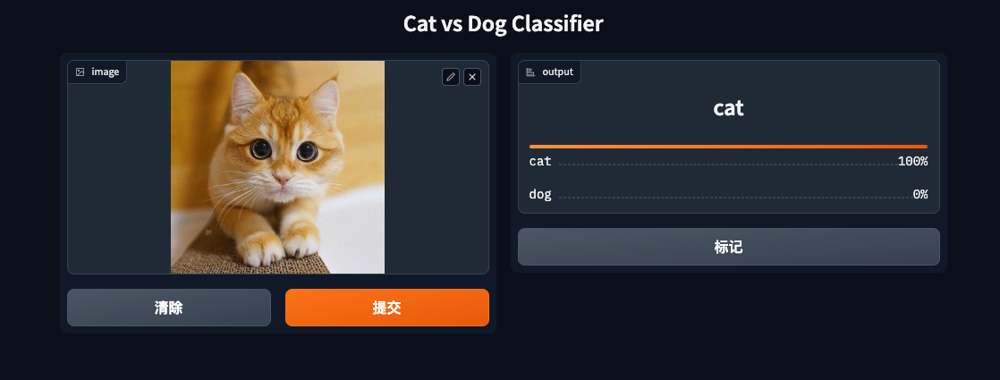

- You can view the experiment process on this webpage: [Cat and Dog Classification | SwanLab](https://swanlab.cn/@ZeyiLin/Cats_Dogs_Classification/runs/jzo93k112f15pmx14vtxf/chart)
- Code: [Github](https://github.com/Zeyi-Lin/Resnet50-cats_vs_dogs)
- Online Demo: [HuggingFace](https://huggingface.co/spaces/TheEeeeLin/Resnet50-cats_vs_dogs)
- Dataset: [Baidu Cloud](https://pan.baidu.com/s/1qYa13SxFM0AirzDyFMy0mQ) Extraction code: 1ybm
- Three open-source libraries: [SwanLab](https://github.com/swanhubx/swanlab), [Gradio](https://github.com/gradio-app/gradio), [PyTorch](https://github.com/pytorch/pytorch)

## 1. Preparation
### 1.1 Install Python Libraries
You need to install the following 4 libraries:
```bash
torch>=1.12.0
torchvision>=0.13.0
swanlab
gradio
```
Installation command:
```bash
pip install torch>=1.12.0 torchvision>=0.13.0 swanlab gradio
```

### 1.2 Create File Directory
Now open a folder and create the following 5 files:


Their respective functions are:
| File | Purpose |
| --- | --- |
| `checkpoint` | This folder is used to store the model weights generated during training. |
| `datasets` | This folder is used to place the dataset. |
| `app.py` | The Python script to run the Gradio Demo. |
| `load_datasets.py` | Responsible for loading the dataset, including data preprocessing, loading, etc., ensuring that the data is provided to the model in the appropriate format. |
| `train.py` | The core script for model training. It includes model loading, training loop, loss function selection, optimizer configuration, and other key components, guiding how to use the data to train the model. |

### 1.3 Download the Cat and Dog Classification Dataset

The dataset source is the [Cat and Dog Classification Dataset](https://modelscope.cn/datasets/tany0699/cats_and_dogs/summary) on Modelscope, which contains 275 images for training and 70 images for testing, totaling less than 10MB.
I have organized the data, so it is recommended to download it using the following Baidu Netdisk link:
> Baidu Netdisk: Link: https://pan.baidu.com/s/1qYa13SxFM0AirzDyFMy0mQ Extraction code: 1ybm

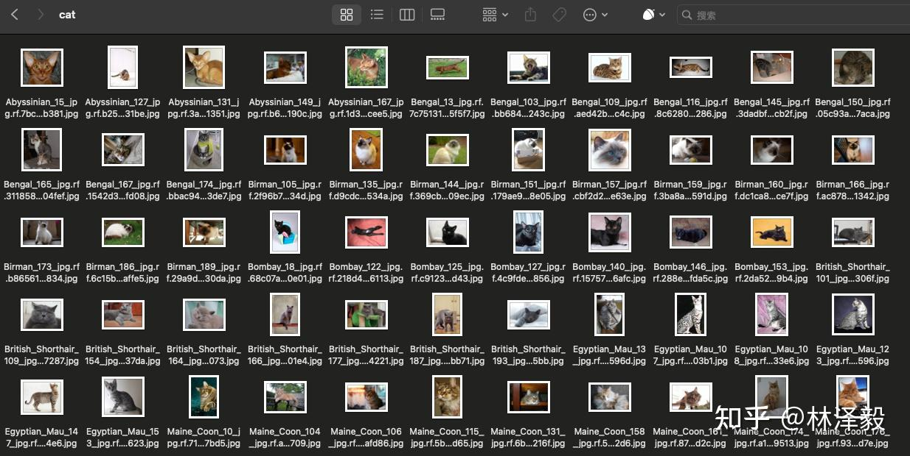

Place the dataset in the `datasets` folder:

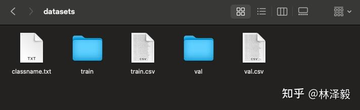

OK, now we start the training part!
> PS: If you want to train the cat and dog classification model with a larger dataset, please refer to the related links at the end of the article.

## 2. Training Part
PS: If you want to directly view the complete code and results, you can jump to section 2.9.

### 2.1 load_datasets.py
First, we need to create a class `DatasetLoader`, whose purpose is to complete the dataset reading and preprocessing. We will write it in `load_datasets.py`.
Before writing this class, let's analyze the dataset.
In the datasets directory, `train.csv` and `val.csv` respectively record the relative paths of the images in the training and testing sets (the first column is the relative path of the image, the second column is the label, 0 represents cat, 1 represents dog):
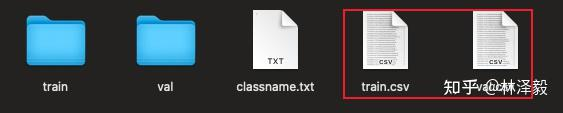
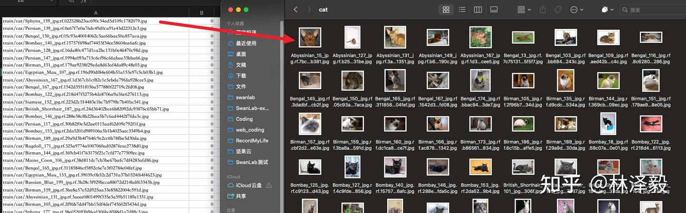
Left image as train.csv, right image as the image in the cat folder in the train folder.

So our goal is clear:
1. Parse these two CSV files to get the image relative paths and labels.
2. Read the images based on the relative paths.
3. Preprocess the images.
4. Return the preprocessed images and corresponding labels.

With the goal clear, let's start writing the `DatasetLoader` class:

```python
import csv
import os
from torchvision import transforms
from PIL import Image
from torch.utils.data import Dataset

class DatasetLoader(Dataset):
    def __init__(self, csv_path):
        self.csv_file = csv_path
        with open(self.csv_file, 'r') as file:
            self.data = list(csv.reader(file))

        self.current_dir = os.path.dirname(os.path.abspath(__file__))

    def preprocess_image(self, image_path):
        full_path = os.path.join(self.current_dir, 'datasets', image_path)
        image = Image.open(full_path)
        image_transform = transforms.Compose([
            transforms.Resize((256, 256)),
            transforms.ToTensor(),
            transforms.Normalize(mean=[0.485, 0.456, 0.406], std=[0.229, 0.224, 0.225])
        ])

        return image_transform(image)

    def __getitem__(self, index):
        image_path, label = self.data[index]
        image = self.preprocess_image(image_path)
        return image, int(label)

    def __len__(self):
        return len(self.data)
```

The `DatasetLoader` class consists of four parts:
1. `__init__`: Contains one input parameter `csv_path`. After passing `csv_path` from the outside, the read data is stored in `self.data`. `self.current_dir` obtains the absolute path of the directory where the current code is located, preparing for subsequent image reading.

2. `preprocess_image`: This function is used for image preprocessing. First, it constructs the absolute path of the image file, then uses the PIL library to open the image. Next, it defines a series of image transformations: resizing the image to 256x256, converting the image to a tensor, and normalizing the image. Finally, it returns the preprocessed image.

3. `__getitem__`: When the dataset class is called in a loop, the `__getitem__` method returns the data at the specified index, i.e., the image and label. First, it retrieves the image path and label from `self.data` based on the index. Then, it calls the `preprocess_image` method to process the image data. Finally, it returns the processed image data and label after converting them to integers.

4. `__len__`: Used to return the total number of images in the dataset.

### 2.2 Load the Dataset
> Starting from this section, the code will be written in train.py.
```python
from torch.utils.data import DataLoader
from load_datasets import DatasetLoader

batch_size = 8

TrainDataset = DatasetLoader("datasets/train.csv")
ValDataset = DatasetLoader("datasets/val.csv")
TrainDataLoader = DataLoader(TrainDataset, batch_size=batch_size, shuffle=True)
ValDataLoader = DataLoader(ValDataset, batch_size=batch_size, shuffle=False)
```

We pass the paths of those two CSV files to instantiate the `DatasetLoader` class, then use PyTorch's `DataLoader` to encapsulate it. `DataLoader` can take two additional parameters:
- `batch_size`: Defines how many images each data batch contains. In deep learning, we usually do not process all data at once but divide the data into small batches. This helps the model learn faster and also saves memory. Here we define `batch_size = 8`, meaning each batch will contain 8 images.
- `shuffle`: Defines whether to randomly shuffle the data at the beginning of each epoch. This is usually used for training datasets to ensure that the data order is different in each epoch, helping the model generalize better. If set to True, the data will be shuffled at the beginning of each epoch. Here we shuffle during training but not during testing.

### 2.3 Load the ResNet50 Model

We choose the classic **ResNet50** as the model. The specific principles of the model will not be detailed in this article, focusing on the engineering implementation.
We use **torchvision** to create a ResNet50 model and load the pre-trained weights on the Imagenet1k dataset:

```python
from torchvision.models import ResNet50_Weights

# Load the pre-trained ResNet50 model
model = torchvision.models.resnet50(weights=ResNet50_Weights.IMAGENET1K_V2)
```

Since cat and dog classification is a binary classification task, and the ResNet50 provided by torchvision is a 1000-class classification by default, we need to replace the output dimension of the last fully connected layer with 2:

```python
from torchvision.models import ResNet50_Weights

num_classes=2

# Load the pre-trained ResNet50 model
model = torchvision.models.resnet50(weights=ResNet50_Weights.IMAGENET1K_V2)

# Replace the output dimension of the fully connected layer with num_classes
in_features = model.fc.in_features
model.fc = torch.nn.Linear(in_features, num_classes)
```

### 2.4 Set cuda/mps/cpu
If your computer has an **NVIDIA GPU**, then CUDA can greatly accelerate your training;
If your computer is a **Macbook Apple Silicon (M-series chip)**, then MPS can also greatly accelerate your training;
If neither, then use CPU:
```python
# Check if MPS is available
try:
    use_mps = torch.backends.mps.is_available()
except AttributeError:
    use_mps = False

# Check if CUDA is available
if torch.cuda.is_available():
    device = "cuda"
elif use_mps:
    device = "mps"
else:
    device = "cpu"
```

Load the model to the corresponding device:

```python
model.to(torch.device(device))
```

### 2.5 Set Hyperparameters, Optimizer, Loss Function

**Hyperparameters**
Set the number of training epochs to 20, learning rate to 1e-4, training batch size to 8, and number of classes to 2.

```python
num_epochs = 20
lr = 1e-4
batch_size = 8
num_classes = 2
```

### Loss Function and Optimizer
Set the loss function to cross-entropy loss and the optimizer to Adam.

```python
criterion = torch.nn.CrossEntropyLoss()
optimizer = torch.optim.Adam(model.parameters(), lr=lr)
```

### 2.6 Initialize SwanLab

In training, we use the `swanlab` library as the experiment management and metric visualization tool.
[swanlab](https://github.com/SwanHubX/SwanLab) is an open-source training chart visualization library similar to Tensorboard, with a lighter volume and more friendly API. In addition to recording metrics, it can automatically record training logs, hardware environment, Python environment, training time, and other information.

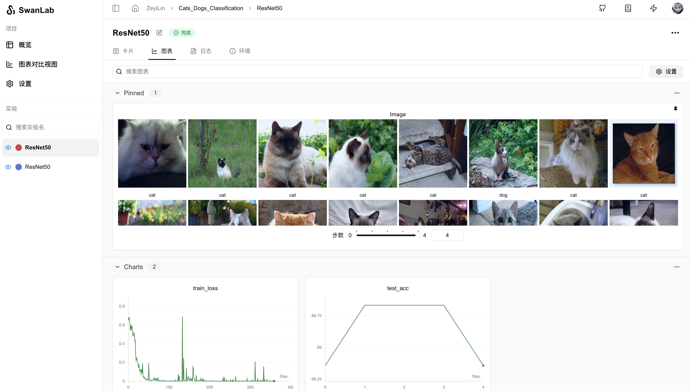

#### 2.6.1 Set Initial Configuration Parameters
The swanlab library uses `swanlab.init` to set the experiment name, experiment description, record hyperparameters, and the location of the log file.
Subsequent opening of the visualization dashboard requires the log file.

```python
import swanlab

swanlab.init(
    # Set the experiment name
    experiment_name="ResNet50",
    # Set the experiment description
    description="Train ResNet50 for cat and dog classification.",
    # Record hyperparameters
    config={
        "model": "resnet50",
        "optim": "Adam",
        "lr": lr,
        "batch_size": batch_size,
        "num_epochs": num_epochs,
        "num_class": num_classes,
        "device": device,
    }
)
```

#### 2.6.2 Track Key Metrics
The swanlab library uses `swanlab.log` to record key metrics. Specific usage cases are in sections 2.7 and 2.8.

### 2.7 Training Function

We define a training function `train`:
```python
def train(model, device, train_dataloader, optimizer, criterion, epoch):
    model.train()
    for iter, (inputs, labels) in enumerate(train_loader):
        inputs, labels = inputs.to(device), labels.to(device)
        optimizer.zero_grad()
        outputs = model(inputs)
        loss = criterion(outputs, labels)
        loss.backward()
        optimizer.step()
        print('Epoch [{}/{}], Iteration [{}/{}], Loss: {:.4f}'.format(epoch, num_epochs, iter + 1, len(TrainDataLoader),
                                                                      loss.item()))
        swanlab.log({"train_loss": loss.item()})
```

The training logic is simple: we loop through `train_dataloader`, each time taking out a batch of images and labels, passing them to the ResNet50 model to get the prediction results, passing the results and labels to the loss function to calculate the cross-entropy loss, and finally calculating the backpropagation based on the loss, with the Adam optimizer performing the model parameter update, and so on.
During training, the most concerning metric is the loss value `loss`, so we use `swanlab.log` to track its changes.

### 2.8 Testing Function
We define a testing function `test`:
```python
def test(model, device, test_dataloader, epoch):
    model.eval()
    correct = 0
    total = 0
    with torch.no_grad():
        for inputs, labels in test_dataloader:
            inputs, labels = inputs.to(device), labels.to(device)
            outputs = model(inputs)
            _, predicted = torch.max(outputs.data, 1)
            total += labels.size(0)
            correct += (predicted == labels).sum().item()
    accuracy = correct / total * 100
    print('Accuracy: {:.2f}%'.format(accuracy))
    swanlab.log({"test_acc": accuracy})
```

The testing logic is also simple: we loop through `test_dataloader`, pass the test set images to the ResNet50 model to get the prediction results, compare them with the labels, and calculate the overall accuracy.
During testing, the most concerning metric is the accuracy `accuracy`, so we use `swanlab.log` to track its changes.

### 2.9 Complete Training Code

We train for `num_epochs` rounds, testing every 4 rounds, and save the weight file at the end:

```python
for epoch in range(1, num_epochs + 1):
    train(model, device, TrainDataLoader, optimizer, criterion, epoch)
    if epoch % 4 == 0: 
        accuracy = test(model, device, ValDataLoader, epoch)

if not os.path.exists("checkpoint"):
    os.makedirs("checkpoint")
torch.save(model.state_dict(), 'checkpoint/latest_checkpoint.pth')
print("Training complete")
```

The combined complete `train.py` code:

```python
import torch
import torchvision
from torchvision.models import ResNet50_Weights
import swanlab
from torch.utils.data import DataLoader
from load_datasets import DatasetLoader
import os

# Define the training function
def train(model, device, train_dataloader, optimizer, criterion, epoch):
    model.train()
    for iter, (inputs, labels) in enumerate(train_dataloader):
        inputs, labels = inputs.to(device), labels.to(device)
        optimizer.zero_grad()
        outputs = model(inputs)
        loss = criterion(outputs, labels)
        loss.backward()
        optimizer.step()
        print('Epoch [{}/{}], Iteration [{}/{}], Loss: {:.4f}'.format(epoch, num_epochs, iter + 1, len(TrainDataLoader),
                                                                      loss.item()))
        swanlab.log({"train_loss": loss.item()})


# Define the testing function
def test(model, device, test_dataloader, epoch):
    model.eval()
    correct = 0
    total = 0
    with torch.no_grad():
        for inputs, labels in test_dataloader:
            inputs, labels = inputs.to(device), labels.to(device)
            outputs = model(inputs)
            _, predicted = torch.max(outputs.data, 1)
            total += labels.size(0)
            correct += (predicted == labels).sum().item()
    accuracy = correct / total * 100
    print('Accuracy: {:.2f}%'.format(accuracy))
    swanlab.log({"test_acc": accuracy})


if __name__ == "__main__":
    num_epochs = 20
    lr = 1e-4
    batch_size = 8
    num_classes = 2
    
    # Set device
    try:
        use_mps = torch.backends.mps.is_available()
    except AttributeError:
        use_mps = False

    if torch.cuda.is_available():
        device = "cuda"
    elif use_mps:
        device = "mps"
    else:
        device = "cpu"

    # Initialize swanlab
    swanlab.init(
        experiment_name="ResNet50",
        description="Train ResNet50 for cat and dog classification.",
        config={
            "model": "resnet50",
            "optim": "Adam",
            "lr": lr,
            "batch_size": batch_size,
            "num_epochs": num_epochs,
            "num_class": num_classes,
            "device": device,
        }
    )

    TrainDataset = DatasetLoader("datasets/train.csv")
    ValDataset = DatasetLoader("datasets/val.csv")
    TrainDataLoader = DataLoader(TrainDataset, batch_size=batch_size, shuffle=True)
    ValDataLoader = DataLoader(ValDataset, batch_size=batch_size, shuffle=False)

    # Load the ResNet50 model
    model = torchvision.models.resnet50(weights=ResNet50_Weights.IMAGENET1K_V2)

    # Replace the fully connected layer for 2-class classification
    in_features = model.fc.in_features
    model.fc = torch.nn.Linear(in_features, num_classes)

    model.to(torch.device(device))
    criterion = torch.nn.CrossEntropyLoss()
    optimizer = torch.optim.Adam(model.parameters(), lr=lr)
    
    # Start training
    for epoch in range(1, num_epochs + 1):
        train(model, device, TrainDataLoader, optimizer, criterion, epoch)  # Train for one epoch

        if epoch % 4 == 0:  # Test every 4 epochs
            accuracy = test(model, device, ValDataLoader, epoch)
    
    # Save the weights
    if not os.path.exists("checkpoint"):
        os.makedirs("checkpoint")
    torch.save(model.state_dict(), 'checkpoint/latest_checkpoint.pth')
    print("Training complete")
```

### 2.10 Start Training!

🔥You can view the experiment process on this webpage: [Cat and Dog Classification | SwanLab](https://swanlab.cn/@ZeyiLin/Cats_Dogs_Classification/runs/jzo93k112f15pmx14vtxf/chart)
If you are using SwanLab for the first time, you need to log in first. In the terminal, enter:

```bash
swanlab login
```

You will be prompted to enter an API Key. Go to the [SwanLab](https://swanlab.cn) website, log in to your account, and copy the API Key from the settings page, then paste it here:

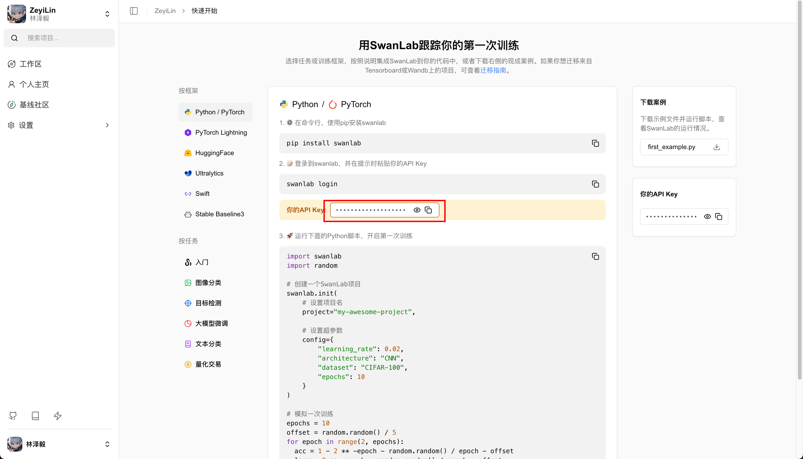

Then, we run `train.py`:

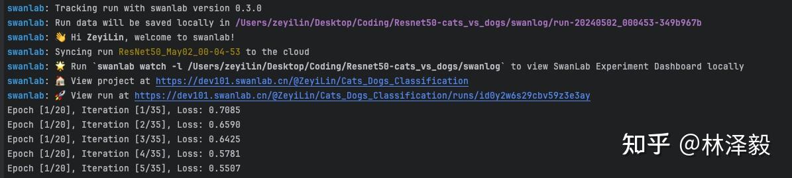

At this point, you will see two links at the beginning. Click the first one, which contains the project information and a comparison experiment table:

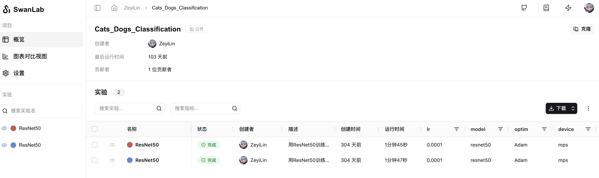

Click on an ongoing experiment to see the overall change curves of `train_loss` and `test_acc`, as well as the images in the test set and their corresponding predicted labels:

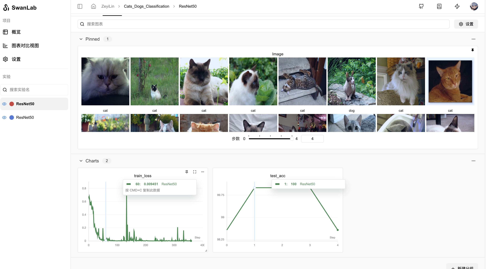

Switch to the experiment card, which records various information about the experiment, including hyperparameters, final experiment metrics, experiment status, training duration, Git repository link, hostname, operating system, Python version, hardware configuration, etc.

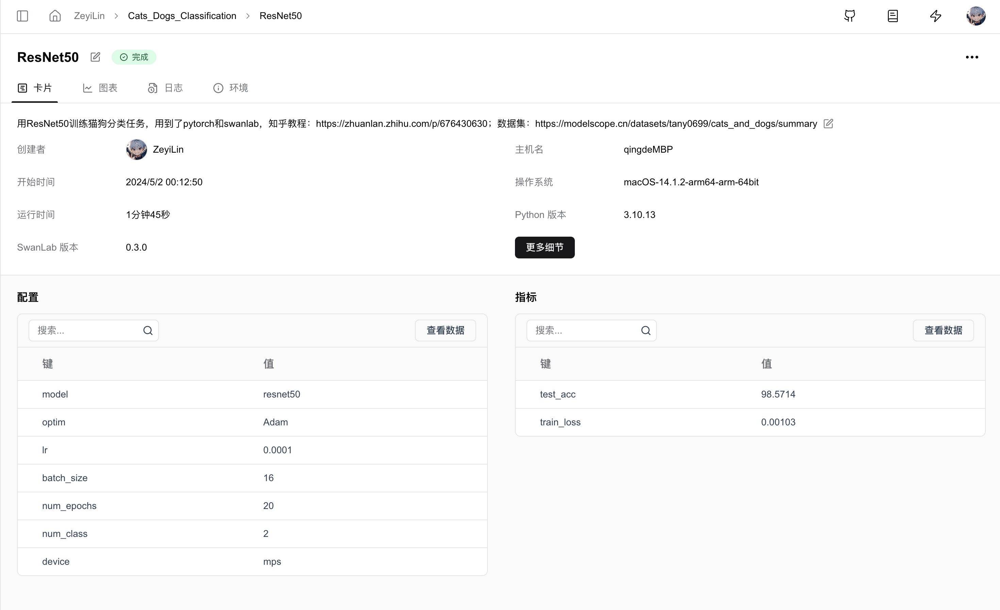

You can see that the model has already achieved 100% test accuracy in the middle, but it drops at the end—this could be due to overfitting or normal fluctuations, depending on how it is optimized later.
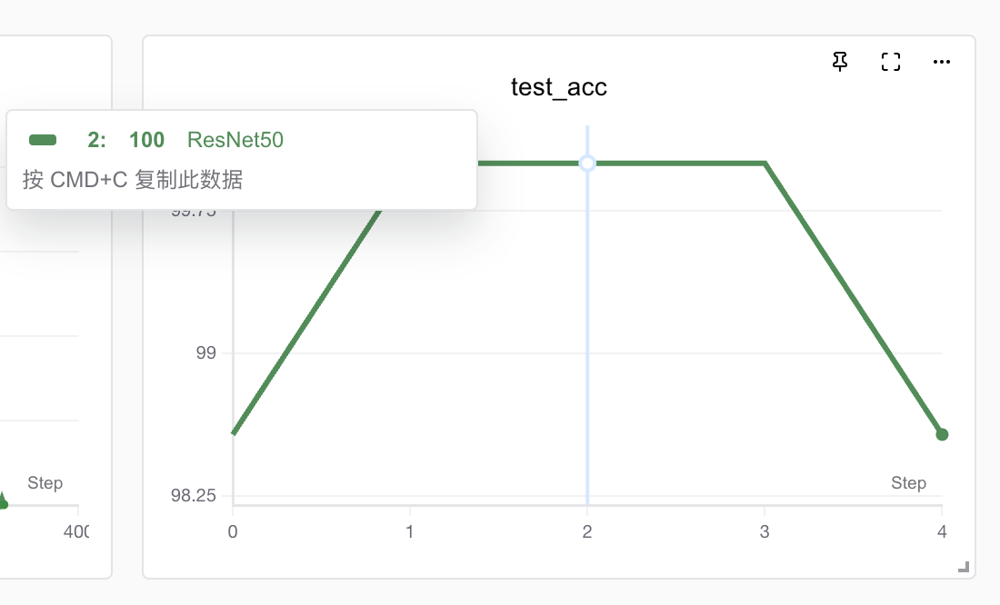

## 3. Gradio Demo Program
Gradio is an open-source Python library designed to help data scientists, researchers, and developers in the field of machine learning quickly create and share user interfaces for machine learning models.
Here, we use Gradio to build a demo interface for cat and dog classification. Write the `app.py` program:

```python
import gradio as gr
import torch
import torchvision.transforms as transforms
import torch.nn.functional as F
import torchvision


# Load the model with the same structure used in training
def load_model(checkpoint_path, num_classes):
    # Load the pre-trained ResNet50 model
    try:
        use_mps = torch.backends.mps.is_available()
    except AttributeError:
        use_mps = False

    if torch.cuda.is_available():
        device = "cuda"
    elif use_mps:
        device = "mps"
    else:
        device = "cpu"

    model = torchvision.models.resnet50(weights=None)
    in_features = model.fc.in_features
    model.fc = torch.nn.Linear(in_features, num_classes)
    model.load_state_dict(torch.load(checkpoint_path, map_location=device))
    model.eval()  # Set model to evaluation mode
    return model


# Function to load and preprocess the image
def process_image(image, image_size):
    # Define the same transforms as used during training
    preprocessing = transforms.Compose([
        transforms.Resize((image_size, image_size)),
        transforms.ToTensor(),
        transforms.Normalize(mean=[0.485, 0.456, 0.406], std=[0.229, 0.224, 0.225]),
    ])
    image = preprocessing(image).unsqueeze(0)
    return image


# Function to predict the image class and return probabilities
def predict(image):
    classes = {'0': 'cat', '1': 'dog'}  # Update or extend this dictionary based on your actual classes
    image = process_image(image, 256)  # Using the image size from training
    with torch.no_grad():
        outputs = model(image)
        probabilities = F.softmax(outputs, dim=1).squeeze()  # Apply softmax to get probabilities
    # Mapping class labels to probabilities
    class_probabilities = {classes[str(i)]: float(prob) for i, prob in enumerate(probabilities)}
    return class_probabilities


# Define the path to your model weights
checkpoint_path = 'checkpoint/latest_checkpoint.pth'
num_classes = 2
model = load_model(checkpoint_path, num_classes)

# Define the Gradio Interface
iface = gr.Interface(
    fn=predict,
    inputs=gr.Image(type="pil"),
    outputs=gr.Label(num_top_classes=num_classes),
    title="Cat vs Dog Classifier",
)

if __name__ == "__main__":
    iface.launch()
```

After running the program, the following output will appear:

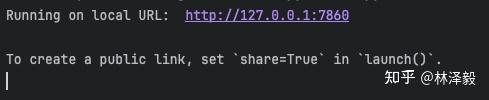
Open the link to see the cat and dog classification demo webpage:

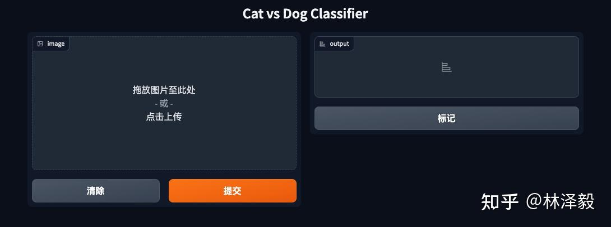

Try it with cat and dog images:

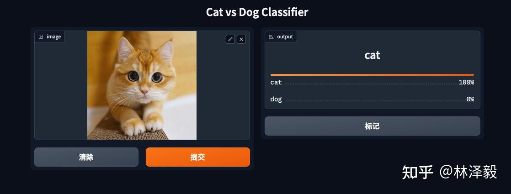

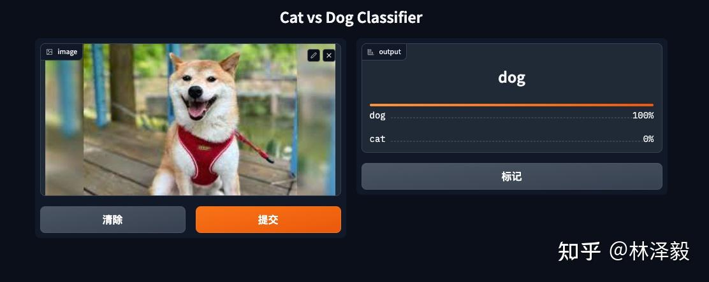

The results are perfect!

At this point, we have completed the entire process of training a cat and dog classification model using three open-source tools: PyTorch, SwanLab, and Gradio. For more information, please refer to the related links or comment on this article.

If this was helpful, please give it a thumbs up and save it!

## 4. Related Links

- View the experiment process online: [Cat and Dog Classification · SwanLab](https://swanlab.cn/@ZeyiLin/Cats_Dogs_Classification/runs/jzo93k112f15pmx14vtxf/chart)
- SwanLab: [Github](https://github.com/SwanHubX/SwanLab)
- Cat and Dog Classification Code: [Github](https://github.com/xiaolin199912/Resnet50-cats_vs_dogs)
- Online Demo: [HuggingFace](https://huggingface.co/spaces/TheEeeeLin/Resnet50-cats_vs_dogs)
- Cat and Dog Classification Dataset (300 images): [ModelScope](https://modelscope.cn/datasets/tany0699/cats_and_dogs/summary)
  - Baidu Cloud Download: [Link](https://pan.baidu.com/s/1qYa13SxFM0AirzDyFMy0mQ) Extraction code: 1ybm
- Cat and Dog Classification Dataset (10k images): [ModelScope](https://modelscope.cn/datasets/XCsunny/cat_vs_dog_class/summary)