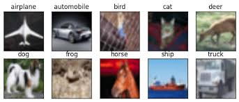

# CIFAR10 Image Classification  

:::info  
Introduction to Image Classification and Machine Learning  
:::  

[](https://swanlab.cn/@ZeyiLin/CIFAR10/runs/5q3sh20ni2zs6p28ja8qm/chart)  

## Overview  

CIFAR-10 is a classic image classification dataset comprising 60,000 32×32-pixel color images divided into 10 categories (e.g., airplane, automobile, bird, etc.), with 50,000 for training and 10,000 for testing.  

  

CIFAR-10 is widely used for image classification tasks. The objective is to build a model that performs 10-class classification on input images, outputting probability scores for each category. Due to its low resolution, complex backgrounds, and limited data volume, this dataset is often employed to test model generalization and feature extraction capabilities, serving as a benchmark for deep learning beginners. Typical approaches include CNNs (e.g., ResNet, AlexNet) with data augmentation and cross-entropy loss optimization, achieving top accuracy above 95%. Its lightweight nature makes CIFAR-10 popular for education and research, spawning more complex variants like CIFAR-100.  

CIFAR-10 includes images from the following 10 classes:  
- Airplane  
- Automobile    
- Bird  
- Cat  
- Deer  
- Dog  
- Frog  
- Horse  
- Ship  
- Truck  

**This case study focuses on:**

- Implementing, training, and evaluating a [ResNet50](https://arxiv.org/abs/1512.03385) (Residual Neural Network) using `PyTorch`.  
- Tracking hyperparameters, logging metrics, and visualizing training progress with `SwanLab`.  


## Environment Setup  

This example requires `Python>=3.8`. Ensure Python is installed on your system.  

Dependencies:  
```
torch  
torchvision  
swanlab  
```  

Quick installation:  
```bash  
pip install torch torchvision swanlab  
```  

## Full Code  

```python  
import os  
import random  
import numpy as np  
import torch  
from torch import nn, optim, utils  
from torchvision.datasets import CIFAR10  
from torchvision.transforms import ToTensor, Compose, Resize, Lambda  
import swanlab  

def set_seed(seed=42):  
    """Set all random seeds for reproducibility."""  
    random.seed(seed)  
    np.random.seed(seed)  
    torch.manual_seed(seed)  
    torch.cuda.manual_seed_all(seed)  
    if torch.cuda.is_available():  
        torch.backends.cudnn.deterministic = True  
        torch.backends.cudnn.benchmark = False  

def log_images(loader, num_images=16):  
    """Capture and visualize the first N images."""  
    images_logged = 0  
    logged_images = []  
    for images, labels in loader:  
        for i in range(images.shape[0]):  
            if images_logged < num_images:  
                logged_images.append(swanlab.Image(images[i], caption=f"Label: {labels[i]}", size=(128, 128)))  
                images_logged += 1  
            else:  
                break  
        if images_logged >= num_images:  
            break  
    swanlab.log({"Preview/CIFAR10": logged_images})  

if __name__ == "__main__":  
    # Set random seed  
    set_seed(42)  

    # Configure device  
    try:  
        use_mps = torch.backends.mps.is_available()  
    except AttributeError:  
        use_mps = False  

    device = "cuda" if torch.cuda.is_available() else "mps" if use_mps else "cpu"  

    # Initialize SwanLab  
    run = swanlab.init(  
        project="CIFAR10",  
        experiment_name="resnet50-pretrained",  
        config={  
            "model": "Resnet50",  
            "optim": "Adam",  
            "lr": 1e-4,  
            "batch_size": 32,  
            "num_epochs": 5,  
            "train_dataset_num": 45000,  
            "val_dataset_num": 5000,  
            "device": device,  
            "num_classes": 10,  
        },  
    )  

    # Define transforms: resize and convert to 3 channels  
    transform = Compose([  
        ToTensor(),  
        Resize((224, 224), antialias=True),  # ResNet expects 224x224 input  
    ])  

    # Load datasets  
    dataset = CIFAR10(os.getcwd(), train=True, download=True, transform=transform)  
    train_dataset, val_dataset = utils.data.random_split(  
        dataset,  
        [run.config.train_dataset_num, run.config.val_dataset_num],  
        generator=torch.Generator().manual_seed(42)  
    )  

    train_loader = utils.data.DataLoader(train_dataset, batch_size=run.config.batch_size, shuffle=True)  
    val_loader = utils.data.DataLoader(val_dataset, batch_size=1, shuffle=False)  

    # Initialize model, loss, and optimizer  
    if run.config.model == "Resnet18":  
        from torchvision.models import resnet18  
        model = resnet18(pretrained=True)  
        model.fc = nn.Linear(model.fc.in_features, run.config.num_classes)  
    elif run.config.model == "Resnet34":  
        from torchvision.models import resnet34  
        model = resnet34(pretrained=True)  
        model.fc = nn.Linear(model.fc.in_features, run.config.num_classes)  
    elif run.config.model == "Resnet50":  
        from torchvision.models import resnet50  
        model = resnet50(pretrained=True)  
        model.fc = nn.Linear(model.fc.in_features, run.config.num_classes)  
    elif run.config.model == "Resnet101":  
        from torchvision.models import resnet101  
        model = resnet101(pretrained=True)  
        model.fc = nn.Linear(model.fc.in_features, run.config.num_classes)  
    elif run.config.model == "Resnet152":  
        from torchvision.models import resnet152  
        model = resnet152(pretrained=True)  
        model.fc = nn.Linear(model.fc.in_features, run.config.num_classes)  

    model.to(torch.device(device))  
    criterion = nn.CrossEntropyLoss()  
    optimizer = optim.Adam(model.parameters(), lr=run.config.lr)  

    # Optional: Preview dataset images  
    log_images(train_loader, 8)  

    # Training loop  
    for epoch in range(1, run.config.num_epochs+1):  
        swanlab.log({"train/epoch": epoch}, step=epoch)  
        model.train()  
        train_correct = 0  
        train_total = 0  

        for iter, batch in enumerate(train_loader):  
            x, y = batch  
            x, y = x.to(device), y.to(device)  
            optimizer.zero_grad()  
            output = model(x)  
            loss = criterion(output, y)  
            loss.backward()  
            optimizer.step()  

            _, predicted = torch.max(output, 1)  
            train_total += y.size(0)  
            train_correct += (predicted == y).sum().item()  

            if iter % 40 == 0:  
                print(f"Epoch [{epoch}/{run.config.num_epochs}], Iteration [{iter + 1}/{len(train_loader)}], Loss: {loss.item()}")  
                swanlab.log({"train/loss": loss.item()}, step=(epoch - 1) * len(train_loader) + iter)  

        train_accuracy = train_correct / train_total  
        swanlab.log({"train/acc": train_accuracy}, step=(epoch - 1) * len(train_loader) + iter)  

        # Validation  
        model.eval()  
        correct = 0  
        total = 0  
        val_loss = 0  
        with torch.no_grad():  
            for batch in val_loader:  
                x, y = batch  
                x, y = x.to(device), y.to(device)  
                output = model(x)  
                val_loss += criterion(output, y).item()  
                _, predicted = torch.max(output, 1)  
                total += y.size(0)  
                correct += (predicted == y).sum().item()  

        accuracy = correct / total  
        avg_val_loss = val_loss / len(val_loader)  
        swanlab.log({"val/acc": accuracy, "val/loss": avg_val_loss}, step=(epoch - 1) * len(train_loader) + iter)  
```  

## Switching ResNet Models  

The code supports the following ResNet variants:  
- ResNet18  
- ResNet34  
- ResNet50  
- ResNet101  
- ResNet152  


To switch models, modify the `model` parameter in `config`:  
```python (5)  
    run = swanlab.init(  
        ...  
        config={  
            "model": "Resnet50",  
        ...  
        },  
    )  
```  

- How does `config` work? 👉 [Configure Experiments](/guide_cloud/experiment_track/set-experiment-config)  


## Demo  

[](https://swanlab.cn/@ZeyiLin/CIFAR10/runs/5q3sh20ni2zs6p28ja8qm/chart)  

  
