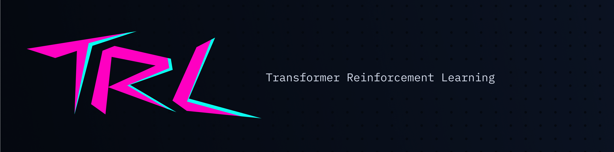
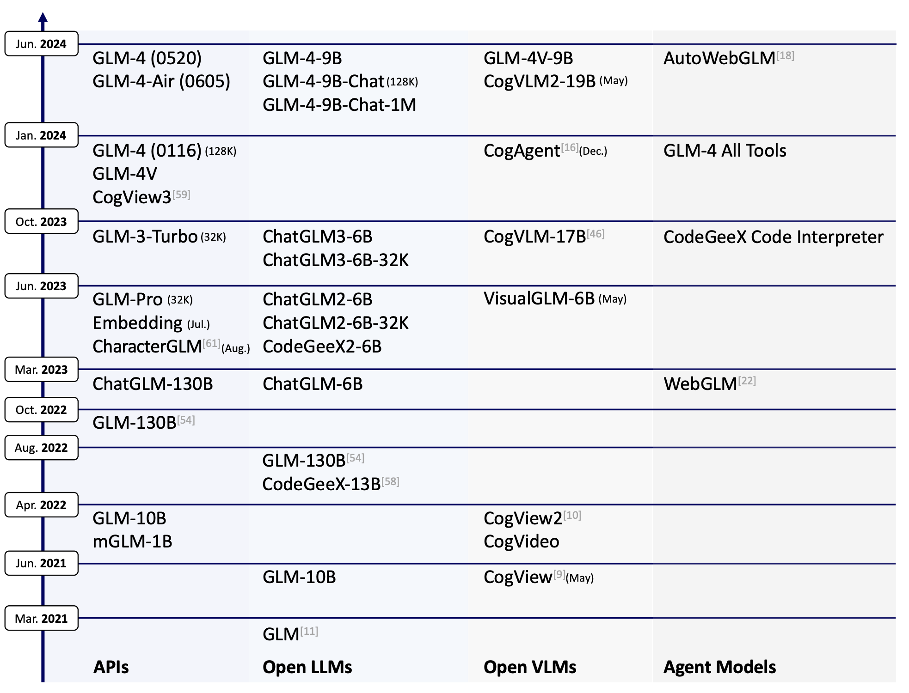
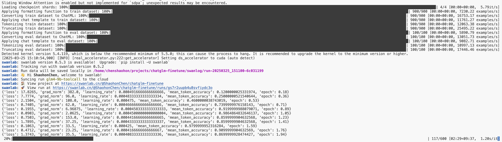
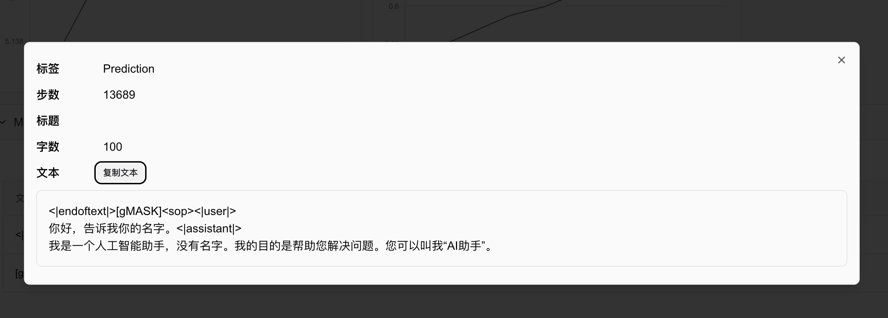

# Fine-tuning ChatGLM4 for Large Model Instruction Following (with Code and Test Scripts)  

Author: Emotional Machine Lab - Chen Shaohong  
Email: <shaohon_chen@115lab.club>  

[[toc]]

## Abstract  

This tutorial primarily implements a fine-tuning method for large model instruction following. To simplify implementation and reduce code complexity, this article uses the 🤗HuggingFace TRL framework. In addition to supporting SFT, this framework provides excellent support for popular reinforcement fine-tuning algorithms such as DPO, PPO, and GRPO.  

While using frameworks can significantly reduce workload, it inevitably poses challenges for beginners. Therefore, this tutorial will include comprehensive documentation references to help readers further understand the framework. Although implementing the fine-tuning process from scratch with PyTorch can greatly enhance understanding, and there are many excellent community projects available, the author still recommends using frameworks for training. This approach saves substantial time, allowing users to focus more on innovation.  

Thus, this tutorial is recommended for readers with some familiarity with the 🤗HuggingFace Transformers framework.  

Note: Due to the relatively large size of the ChatGLM model, actual execution requires approximately >=16GB of GPU memory.  

🎉 **SwanLab has been officially integrated into 🤗HuggingFace Transformers:** If SwanLab is installed locally, it will be enabled by default! It can also be activated via `report_to="swanlab"` for training tracking.  

**References:**  

• Zhipu AI Official Website: [https://www.zhipuai.cn/](https://www.zhipuai.cn/)  
• ChatGLM-9B Base Model: [https://huggingface.co/THUDM/glm-4-9b-hf](https://huggingface.co/THUDM/glm-4-9b-hf/tree/main)  
• ChatGLM-9B-Chat Model: [https://huggingface.co/THUDM/glm-4-9b-chat-hf](https://huggingface.co/THUDM/glm-4-9b-chat-hf/tree/main)  
• Chinese Version of Alpaca Dataset: [https://huggingface.co/datasets/llamafactory/alpaca_gpt4_zh](https://huggingface.co/datasets/llamafactory/alpaca_gpt4_zh)  
• This Blog's Open-Source Project Link: [https://github.com/SwanHubX/glm4-finetune](https://github.com/SwanHubX/glm4-finetune)  
• SwanLab Training Logs: [https://swanlab.cn/@ShaohonChen/chatglm-finetune/](https://swanlab.cn/@ShaohonChen/chatglm-finetune/)  

## TRL Package Introduction + Environment Setup  

  

This tutorial uses the [🤗HuggingFace TRL](https://huggingface.co/docs/trl/index) framework to implement the fine-tuning code. TRL is a powerful and user-friendly fine-tuning framework that not only supports SFT but also easily integrates popular reinforcement fine-tuning algorithms like DPO, PPO, and GRPO through its interfaces. Additionally, it is fully compatible with the Transformers architecture.  

First, set up the environment for this tutorial with the following installation command:  

```bash  
pip install transformers trl datasets peft swanlab  
```  

Here, `transformers`, `trl`, and `peft` are used for model loading and training, `datasets` for importing datasets, and `swanlab` for visualizing and tracking the training process.  

Below is a simple fine-tuning example to introduce the usage of the HF TRL framework:  

```python  
from datasets import load_dataset  
from trl import SFTConfig, SFTTrainer  

dataset = load_dataset("stanfordnlp/imdb", split="train")   # Set the fine-tuning dataset; here, IMDB movie review classification data is used  

training_args = SFTConfig(  # Set fine-tuning parameters  
    max_length=512,  
    output_dir="/tmp",  
)  
trainer = SFTTrainer(   # Set the model; here, Facebook's opt-350M is used, which has a small parameter count for easy downloading  
    "facebook/opt-350m",  
    train_dataset=dataset,  
    args=training_args,  
)  
trainer.train() # Start training; the process is similar to TRL  
```  

The above code is from the HF official documentation [https://huggingface.co/docs/trl/sft_trainer](https://huggingface.co/docs/trl/sft_trainer), with added comments for better understanding.  

In short, the TRL package is used similarly to Transformers, but with two additional steps:  

• Import the `SFTConfig` module, which is based on `transformers`' `TrainingArguments` but introduces some extra parameters for SFT and LoRA support.  
• Import the `SFTTrainer` module, which includes the SFT implementation code and some additional support for `peft`'s LoRA and dataset format conversion.  

The following sections will provide a complete guide on using the TRL package to achieve large model instruction following.  

## ChatGLM4 Introduction + Model Preparation  

  

GLM-4-9B is the latest open-source version of the GLM-4 series of pre-trained models released by [Zhipu AI](https://www.zhipuai.cn/). ChatGLM has released multiple versions, with GLM-4-9B being the fourth-generation base model. Its fine-tuned version, GLM-4-9B-Chat, includes advanced features such as web browsing, code execution, custom tool invocation (Function Call), and long-context reasoning (supporting up to 128K tokens).  

This tutorial uses the GLM-4-9B model for instruction following fine-tuning and employs SwanLab for model performance tracking.  

⚠️ Note: To align with HuggingFace Transformers updates, ChatGLM has released two versions of weights: `THUDM/glm-4-9b` and `THUDM/glm-4-9b-hf`. The latter corresponds to newer versions of transformers, so this tutorial uses the latter.  

This tutorial provides a script to download the model. The download method is as follows:  

```bash  
huggingface-cli download --local-dir ./weights/glm-4-9b-hf THUDM/glm-4-9b-hf  
```  

The model will be downloaded to `./weights/glm-4-9b-hf` in the project directory.  

Below is an example of loading the ChatGLM model using `transformers` and performing inference:  

```python  
from transformers import AutoTokenizer, AutoModelForCausalLM  
device = "cuda"  
tokenizer = AutoTokenizer.from_pretrained("THUDM/glm-4-9b-chat-hf")  
model = AutoModelForCausalLM.from_pretrained("THUDM/glm-4-9b-chat-hf").eval().to(device)  
inputs = tokenizer.encode("我是ChatGLM，是", return_tensors="pt").to(device)  
outputs = model.generate(inputs)  
print(tokenizer.decode(outputs[0]))  
```  

Since this is a base model without fine-tuning, it will only complete the text following `"我是ChatGLM，是"`. Running this will generate the following output:  

```bash  
Loading checkpoint shards: 100%|██████████| 4/4 [00:01<00:00,  2.35it/s]  
[gMASK]<sop>我是ChatGLM，是人工智能助手。我是ChatGLM，是人工智能助手。我是ChatGLM，是人工智能助手  
```  

The above example demonstrates inference with a base model, which can only perform text generation. To enable conversational capabilities, the fine-tuned chat model must be loaded, as shown below:  

```python  
from transformers import pipeline  

messages = [  
    {"role": "user", "content": "你是谁"},  
]  
pipe = pipeline("text-generation", model="THUDM/glm-4-9b-chat-hf")  
print(pipe(messages))  
```  

Here, we use the `pipeline` interface for inference. Running this will generate the following output:  

```bash  
Loading checkpoint shards: 100%|██████████| 4/4 [00:01<00:00,  2.24it/s]  
Device set to use cuda:0  
[{'generated_text': [{'role': 'user', 'content': '你是谁'}, {'role': 'assistant', 'content': '\n我是一个人工智能助手，名为 ChatGLM。我是基于清华大学 KEG 实验室和'}]}]  
```  

Printing the model structure with `print(model)` reveals the following:  

```text  
GlmForCausalLM(  
  (model): GlmModel(  
    (embed_tokens): Embedding(151552, 4096, padding_idx=151329)  
    (layers): ModuleList(  
      (0-39): 40 x GlmDecoderLayer(  
        (self_attn): GlmAttention(  
          (q_proj): Linear(in_features=4096, out_features=4096, bias=True)  
          (k_proj): Linear(in_features=4096, out_features=256, bias=True)  
          (v_proj): Linear(in_features=4096, out_features=256, bias=True)  
          (o_proj): Linear(in_features=4096, out_features=4096, bias=False)  
        )  
        (mlp): GlmMLP(  
          (gate_up_proj): Linear(in_features=4096, out_features=27392, bias=False)  
          (down_proj): Linear(in_features=13696, out_features=4096, bias=False)  
          (activation_fn): SiLU()  
        )  
        (input_layernorm): GlmRMSNorm((4096,), eps=1.5625e-07)  
        (post_attention_layernorm): GlmRMSNorm((4096,), eps=1.5625e-07)  
      )  
    )  
    (norm): GlmRMSNorm((4096,), eps=1.5625e-07)  
    (rotary_emb): GlmRotaryEmbedding()  
  )  
  (lm_head): Linear(in_features=4096, out_features=151552, bias=False)  
)  
```  

The GLM model has an impressive 40 layers 😂, so when using LoRA for fine-tuning, the number of trainable parameters will be larger compared to other models.  

## Dataset Preparation  

The dataset has already been included in the GitHub project and can be downloaded directly using the following command to obtain the complete experimental code:  

```bash  
git clone https://github.com/SwanHubX/glm4-finetune.git  
```  

If you only want to download the dataset, you can directly download the following file:  

```bash  
wget https://github.com/SwanHubX/glm4-finetune/blob/main/data/alpaca_gpt4_data_zh.json  
```  

Alternatively, it can be downloaded from 🤗HuggingFace: [https://huggingface.co/datasets/llamafactory/alpaca_gpt4_zh](https://huggingface.co/datasets/llamafactory/alpaca_gpt4_zh)  

## Code Explanation + Hyperparameter Tuning  

The complete fine-tuning code is publicly available on GitHub. You can download it using the following command:  

```bash  
git clone https://github.com/SwanHubX/glm4-finetune.git  
```  

The article's attachments also include the full implementation code [#Code Attachment](#Attachment: Full Code).  

This article will now focus on explaining the functional modules of the code.  

### Model Loading and Hyperparameter Settings  
Here, special attention should be paid to the LoRA parameter settings. The LoRA parameters in this article are based on the official ChatGLM fine-tuning code.  

Note that the learning rate is set to 5e-4. For full fine-tuning, it should be reduced by an order of magnitude.  

```python  
################  
# Model kwargs  
################  
@dataclass  
class ChatGLM4ModelConfig(ModelConfig):  
    model_name_or_path: Optional[str] = field(  
        default="./weights/glm-4-9b-hf",  
        metadata={  
            "help": "Model checkpoint for weights initialization. default used glm4"  
        },  
    )  
    torch_dtype: Optional[str] = field(  
        default="bfloat16",  
        metadata={  
            "help": "Override the default `torch.dtype` and load the model under this dtype.",  
            "choices": ["auto", "bfloat16", "float16", "float32"],  
        },  
    )  
    use_peft: bool = field(  
        default=True,  
        metadata={"help": "Whether to use PEFT for training. Default true"},  
    )  
    lora_r: int = field(  
        default=8,  
        metadata={"help": "LoRA R value."},  
    )  
    lora_alpha: int = field(  
        default=32,  
        metadata={"help": "LoRA alpha."},  
    )  
    lora_dropout: float = field(  
        default=0.1,  
        metadata={"help": "LoRA dropout."},  
    )  
    lora_target_modules: Optional[list[str]] = field(  
        default_factory=lambda: ["q_proj", "k_proj", "v_proj"],  
        metadata={"help": "LoRA target modules."},  
    )  
```  

### Dataset Hyperparameter Settings  
This part is relatively simple, as it only loads a local dataset.  

```python  
################  
# Datasets kwargs  
################  
@dataclass  
class DataTrainingArguments:  
    data_files: Optional[str] = field(  
        default="./data/alpaca_gpt4_data_zh.json.json",  
        metadata={"help": "The name of the dataset to use (via the datasets library)."},  
    )  
```  

However, to help readers understand what the dataset looks like, a dataset display script is provided:  

```python  
import datasets  
raw_dataset=datasets.load_dataset("json", data_files="data/glaive_toolcall_zh_1k.json")  
print(raw_dataset)  
"""Print Output  
DatasetDict({  
    train: Dataset({  
        features: ['instruction', 'input', 'output'],  
        num_rows: 42677  
    })  
})  
"""  
```  

The dataset contains 1,000 entries, with fields including `'conversations', 'tools'`.  

To further examine a single entry:  

```python  
print(raw_dataset["train"][0])  
```  

Output:  

```json  
{  
    "instruction": "保持健康的三个提示。",  
    "input": "",  
    "output": "以下是保持健康的三个提示：\n\n1. 保持身体活动。每天做适当的身体运动，如散步、跑步或游泳，能促进心血管健康，增强肌肉力量，并有助于减少体重。\n\n2. 均衡饮食。每天食用新鲜的蔬菜、水果、全谷物和脂肪含量低的蛋白质食物，避免高糖、高脂肪和加工食品，以保持健康的饮食习惯。\n\n3. 睡眠充足。睡眠对人体健康至关重要，成年人每天应保证 7-8 小时的睡眠。良好的睡眠有助于减轻压力，促进身体恢复，并提高注意力和记忆力。"  
}  
```  

Here, readers might wonder why there are both `instruction` and `input` sections. Early research on instruction-following aimed to create a general-purpose task-processing model (e.g., capable of both translation and calculations). Thus, task descriptions were placed in `instruction`, while the actual task text was placed in `input`.  
However, with the advent of general-purpose AI assistants like ChatGPT, users have grown accustomed to directly issuing instructions. As a result, separating `instruction` and `prompt` has become less necessary. Fundamentally, whether separated or not, the model's core function remains predicting subsequent text based on context. The separation only affects the format, not the final outcome.  
Modern open-source chat-based large language models (LLMs) often place "persona" in the `system prompt` and user instructions in `input`. Therefore, we will later reformat the Alpaca dataset to align with mainstream chat model conventions.  

The recommended input fine-tuning data structure provided by ChatGLM is as follows:  

```json  
{  
  "messages": [  
    {  
      "role": "user",  
      "content": "类型#裤*材质#牛仔布*风格#性感"  
    },  
    {  
      "role": "assistant",  
      "content": "3x1的这款牛仔裤采用浅白的牛仔面料为裤身材质，其柔然的手感和细腻的质地，在穿着舒适的同时，透露着清纯甜美的个性气质。除此之外，流畅的裤身剪裁将性感的腿部曲线彰显的淋漓尽致，不失为一款随性出街的必备单品。"  
    }  
  ]  
}  
```  

Experienced readers might argue that since we are training from scratch, we can define our own data structure. While this is true, to leverage ChatGLM's native `chat_template`, we recommend adhering to the official data format. This ensures compatibility with ChatGLM's tools and full utilization of its special tokens.  

The native `chat_template` can be found in the `tokenizer_config.json` of the open-source `glm-4-9b-chat-hf` on HuggingFace. The following script prints the `chat_template`:  

```python  
from transformers import AutoTokenizer, AutoModelForCausalLM  
device = "cuda"  
tokenizer = AutoTokenizer.from_pretrained("THUDM/glm-4-9b-chat-hf")  
print(tokenizer.chat_template)  
```  

Link to the tokenizer configuration:  
[https://huggingface.co/THUDM/glm-4-9b-chat-hf/blob/main/tokenizer_config.json](https://huggingface.co/THUDM/glm-4-9b-chat-hf/blob/main/tokenizer_config.json)  

Below is a simple demonstration of the final dataset format after conversion:  

```python  
def formatting_func(example):  
    """  
    process data format  
    """  
    prompt = example["instruction"]  
    if len(example["input"]) != 0:  
        prompt += "\n\n" + example["input"]  
    conversations = [  
        {"role": "user", "content": prompt},  
        {"role": "assistant", "content": example["output"]},  
    ]  
    output_text = tokenizer.apply_chat_template(  
        conversation=conversations, tokenize=False  
    )  
    return output_text  
```  

Output example (this is the actual data format fed to the model during fine-tuning):  

```text  
[gMASK]<sop><|user|>  
保持健康的三个提示。<|assistant|>  
以下是保持健康的三个提示：  

1. 保持身体活动。每天做适当的身体运动，如散步、跑步或游泳，能促进心血管健康，增强肌肉力量，并有助于减少体重。  

2. 均衡饮食。每天食用新鲜的蔬菜、水果、全谷物和脂肪含量低的蛋白质食物，避免高糖、高脂肪和加工食品，以保持健康的饮食习惯。  

3. 睡眠充足。睡眠对人体健康至关重要，成年人每天应保证 7-8 小时的睡眠。良好的睡眠有助于减轻压力，促进身体恢复，并提高注意力和记忆力。  
```  

### Training Hyperparameters and Implementation  
Given the small dataset size, we train for 600 steps with a per-GPU batch size of 1*4:  

```python  
################  
# Train kwargs  
################  
@dataclass  
class MySFTConfig(SFTConfig):  
    output_dir: Optional[str] = field(  
        default="./output/lora-glm4-9b-alpaca",  
        metadata={  
            "help": "The output directory where the model predictions and checkpoints will be written. Defaults to 'lora-glm4-9b-toolcall' if not provided."  
        },  
    )  
    num_train_epochs: float = field(  
        default=3.0, metadata={"help": "Total number of training epochs to perform."}  
    )  
    per_device_train_batch_size: int = field(  
        default=2,  
        metadata={"help": "Batch size per GPU/TPU/MPS/NPU core/CPU for training."},  
    )  
    per_device_eval_batch_size: int = field(  
        default=4,  
        metadata={"help": "Batch size per GPU/TPU/MPS/NPU core/CPU for evaluation."},  
    )  
    gradient_accumulation_steps: int = field(  
        default=1,  
        metadata={  
            "help": "Number of updates steps to accumulate before performing a backward/update pass."  
        },  
    )  
    learning_rate: float = field(  
        default=5e-4, metadata={"help": "The initial learning rate for AdamW."}  
    )  
    bf16: bool = field(  
        default=True,  
        metadata={  
            "help": (  
                "Whether to use bf16 (mixed) precision instead of 32-bit. Requires Ampere or higher NVIDIA"  
                " architecture or using CPU (use_cpu) or Ascend NPU. This is an experimental API and it may change."  
            )  
        },  
    )  
    bf16_full_eval: bool = field(  
        default=True,  
        metadata={  
            "help": (  
                "Whether to use full bfloat16 evaluation instead of 32-bit. This is an experimental API and it may"  
                " change."  
            )  
        },  
    )  
    max_seq_length: Optional[int] = field(  
        default=512,  
        metadata={  
            "help": "Maximum length of the tokenized sequence. Sequences longer than `max_seq_length` are truncated "  
            "from the right. If `None`, no truncation is applied. When packing is enabled, this value sets the "  
            "sequence length."  
        },  
    )  
    eval_strategy: Union[str] = field(  
        default="steps",  
        metadata={"help": "The evaluation strategy to use."},  
    )  
    eval_steps: Optional[float] = field(  
        default=0.1,  
        metadata={  
            "help": (  
                "Run an evaluation every X steps. Should be an integer or a float in range `[0,1)`. "  
                "If smaller than 1, will be interpreted as ratio of total training steps."  
            )  
        },  
    )  
    logging_steps: float = field(  
        default=10,  
        metadata={  
            "help": (  
                "Log every X updates steps. Should be an integer or a float in range `[0,1)`. "  
                "If smaller than 1, will be interpreted as ratio of total training steps."  
            )  
        },  
    )  
    save_steps: float = field(  
        default=0.1,  
        metadata={  
            "help": (  
                "Save checkpoint every X updates steps. Should be an integer or a float in range `[0,1)`. "  
                "If smaller than 1, will be interpreted as ratio of total training steps."  
            )  
        },  
    )  
```  

The training process is streamlined using HF TRL:  

```python  
################  
# Training  
################  
trainer = SFTTrainer(  
    model=model_args.model_name_or_path,  
    args=training_args,  
    data_collator=None,  
    train_dataset=raw_datasets["train"],  
    eval_dataset=(  
        raw_datasets["test"] if training_args.eval_strategy != "no" else None  
    ),  
    processing_class=tokenizer,  
    peft_config=get_peft_config(model_args),  
    formatting_func=formatting_func,  
    callbacks=[SavePredictCallback()],  
)  
trainer.train()  
```  

## Starting Training + Performance Evaluation  
By default, this code enables [SwanLab](https://swanlab.cn) during training. SwanLab is officially integrated into 🤗HuggingFace Transformers and can be enabled via `report_to="swanlab"`. If SwanLab is installed locally, it will be enabled by default!  

Start training with the following command:  

```bash  
python instruct_train.py  
```  

You will see the following startup information:  

  

If you are not logged into SwanLab, a login prompt may appear. We recommend selecting option 1 and registering at [https://swanlab.cn](https://swanlab.cn) to view training progress online.  

Login command:  

```bash  
swanlab login  
```  

Click the printed link to view training logs via the dashboard:  

  

By configuring `callback`, SwanLab can also automatically record model predictions. Code and example:  

```python  
################  
# Print prediction text callback  
################  
class SavePredictCallback(TrainerCallback):  
    def __init__(self, num_steps=10):  
        self.num_steps = num_steps  

    def on_save(self, args, state, control, model, processing_class, **kwargs):  
        if state.is_world_process_zero:  
            tokenizer = processing_class  
            batch_test_message = [  
                [{"role": "user", "content": "你好，告诉我你的名字。"}],  
                [{"role": "user", "content": "告诉我1+2等于多少？"}],  
            ]  
            batch_inputs_text = tokenizer.apply_chat_template(  
                batch_test_message,  
                return_tensors="pt",  
                return_dict=True,  
                padding=True,  
                padding_side="left",  
                add_generation_prompt=True,  
            ).to(model.device)  

            # print(batch_inputs_text)  
            outputs = model.generate(**batch_inputs_text, max_new_tokens=512)  
            batch_reponse = tokenizer.batch_decode(  
                outputs, skip_special_tokens=False  
            )  
            log_text_list = [swanlab.Text(response) for response in batch_reponse]  
            swanlab.log({"Prediction": log_text_list}, step=state.global_step)  
```  

  

**Multi-GPU Training**  
If you have multiple GPUs, we recommend using multi-GPU training to significantly speed up training! First, install HuggingFace `accelerate` and `deepspeed` to easily enable Zero2 multi-GPU training:  

```bash  
pip install accelerate deepspeed  
```  

Then, use the following command to start multi-GPU training (default: 8 GPUs; adjust `num_processes` as needed):  

```bash  
accelerate launch --num_processes 8 --config_file configs/zero2.yaml train.py  
```  

Detailed Zero2 settings are in `configs/zero2.yaml`.  

The model will be saved in `output/lora-glm4-9b-alpaca`. Due to limited disk space, only LoRA weights are saved. Remember to load the original model during inference.  

**Inference + Performance Comparison**  
Use the following command for command-line chat:  

```bash  
bash chat_cli.py  
```  

Example output (note: overfitting may occur; earlier checkpoints are recommended for inference):  

  

## Attachment: Full Code  
The full code is provided below, but we recommend downloading the complete code from GitHub:  

[https://github.com/SwanHubX/glm4-finetune](https://github.com/SwanHubX/glm4-finetune)  

Don't forget to give it a star🌟!  

```python  
"""
Refer: https://huggingface.co/docs/trl/sft_trainer#add-special-tokens-for-chat-format for more advance tools
"""

import argparse
from typing import Optional, Union, List
from dataclasses import dataclass, field

import datasets
from transformers import AutoTokenizer, TrainerCallback
from trl import (
    ModelConfig,
    SFTConfig,
    SFTTrainer,
    TrlParser,
    get_kbit_device_map,
    get_peft_config,
    get_quantization_config,
)
import swanlab


################
# Model kwargs
################
@dataclass
class ChatGLM4ModelConfig(ModelConfig):
    model_name_or_path: Optional[str] = field(
        default="./weights/glm-4-9b-hf",
        metadata={
            "help": "Model checkpoint for weights initialization. default used glm4"
        },
    )
    torch_dtype: Optional[str] = field(
        default="bfloat16",
        metadata={
            "help": "Override the default `torch.dtype` and load the model under this dtype.",
            "choices": ["auto", "bfloat16", "float16", "float32"],
        },
    )
    use_peft: bool = field(
        default=True,
        metadata={"help": "Whether to use PEFT for training. Default true"},
    )
    lora_r: int = field(
        default=8,
        metadata={"help": "LoRA R value."},
    )
    lora_alpha: int = field(
        default=32,
        metadata={"help": "LoRA alpha."},
    )
    lora_dropout: float = field(
        default=0.1,
        metadata={"help": "LoRA dropout."},
    )
    lora_target_modules: Optional[list[str]] = field(
        default_factory=lambda: ["q_proj", "k_proj", "v_proj"],
        metadata={"help": "LoRA target modules."},
    )


################
# Datasets kwargs
################
@dataclass
class DataTrainingArguments:
    data_files: Optional[str] = field(
        default="./data/alpaca_gpt4_data_zh.json",
        metadata={"help": "The name of the dataset to use (via the datasets library)."},
    )


################
# Train kwargs
################
@dataclass
class MySFTConfig(SFTConfig):
    output_dir: Optional[str] = field(
        default="./output/lora-glm4-9b-alpaca",
        metadata={
            "help": "The output directory where the model predictions and checkpoints will be written. Defaults to 'lora-glm4-9b-toolcall' if not provided."
        },
    )
    num_train_epochs: float = field(
        default=3.0, metadata={"help": "Total number of training epochs to perform."}
    )
    per_device_train_batch_size: int = field(
        default=2,
        metadata={"help": "Batch size per GPU/TPU/MPS/NPU core/CPU for training."},
    )
    per_device_eval_batch_size: int = field(
        default=4,
        metadata={"help": "Batch size per GPU/TPU/MPS/NPU core/CPU for evaluation."},
    )
    gradient_accumulation_steps: int = field(
        default=1,
        metadata={
            "help": "Number of updates steps to accumulate before performing a backward/update pass."
        },
    )
    learning_rate: float = field(
        default=5e-4, metadata={"help": "The initial learning rate for AdamW."}
    )
    bf16: bool = field(
        default=True,
        metadata={
            "help": (
                "Whether to use bf16 (mixed) precision instead of 32-bit. Requires Ampere or higher NVIDIA"
                " architecture or using CPU (use_cpu) or Ascend NPU. This is an experimental API and it may change."
            )
        },
    )
    bf16_full_eval: bool = field(
        default=True,
        metadata={
            "help": (
                "Whether to use full bfloat16 evaluation instead of 32-bit. This is an experimental API and it may"
                " change."
            )
        },
    )
    max_seq_length: Optional[int] = field(
        default=512,
        metadata={
            "help": "Maximum length of the tokenized sequence. Sequences longer than `max_seq_length` are truncated "
            "from the right. If `None`, no truncation is applied. When packing is enabled, this value sets the "
            "sequence length."
        },
    )
    eval_strategy: Union[str] = field(
        default="steps",
        metadata={"help": "The evaluation strategy to use."},
    )
    eval_steps: Optional[float] = field(
        default=0.1,
        metadata={
            "help": (
                "Run an evaluation every X steps. Should be an integer or a float in range `[0,1)`. "
                "If smaller than 1, will be interpreted as ratio of total training steps."
            )
        },
    )
    logging_steps: float = field(
        default=10,
        metadata={
            "help": (
                "Log every X updates steps. Should be an integer or a float in range `[0,1)`. "
                "If smaller than 1, will be interpreted as ratio of total training steps."
            )
        },
    )
    save_steps: float = field(
        default=0.1,
        metadata={
            "help": (
                "Save checkpoint every X updates steps. Should be an integer or a float in range `[0,1)`. "
                "If smaller than 1, will be interpreted as ratio of total training steps."
            )
        },
    )


################
# Print prediction text callback
################
class SavePredictCallback(TrainerCallback):
    def __init__(self, num_steps=10):
        self.num_steps = num_steps

    def on_save(self, args, state, control, model, processing_class, **kwargs):
        if state.is_world_process_zero:
            tokenizer = processing_class
            batch_test_message = [
                [{"role": "user", "content": "你好，告诉我你的名字。"}],
                [{"role": "user", "content": "告诉我1+2等于多少？"}],
            ]
            batch_inputs_text = tokenizer.apply_chat_template(
                batch_test_message,
                return_tensors="pt",
                return_dict=True,
                padding=True,
                padding_side="left",
                add_generation_prompt=True,
            ).to(model.device)

            # print(batch_inputs_text)
            outputs = model.generate(**batch_inputs_text, max_new_tokens=512)
            batch_reponse = tokenizer.batch_decode(outputs, skip_special_tokens=False)
            log_text_list = [swanlab.Text(response) for response in batch_reponse]
            swanlab.log({"Prediction": log_text_list}, step=state.global_step)


def main(model_args, data_args, training_args):
    ################
    # Model init kwargs & Tokenizer
    ################
    quantization_config = get_quantization_config(model_args)
    model_kwargs = dict(
        trust_remote_code=model_args.trust_remote_code,
        attn_implementation=model_args.attn_implementation,
        torch_dtype=model_args.torch_dtype,
        use_cache=False if training_args.gradient_checkpointing else True,
        device_map=get_kbit_device_map() if quantization_config is not None else None,
        quantization_config=quantization_config,
    )
    training_args.model_init_kwargs = model_kwargs
    tokenizer = AutoTokenizer.from_pretrained(
        model_args.model_name_or_path,
        trust_remote_code=model_args.trust_remote_code,
        use_fast=True,
    )
    if tokenizer.pad_token is None:
        tokenizer.pad_token = tokenizer.eos_token
    if tokenizer.chat_template is None:
        tokenizer.chat_template = "[gMASK]<sop><|system|>\n你是一个名为 ChatGLM 的人工智能助手。你是基于智谱AI训练的语言模型 GLM-4 模型开发的，你的任务是针对用户的问题和要求提供适当的答复和支持。\n\n# 可用工具\n\n## {{ tool['function']['name'] }}\n\n{{ tool['function'] | tojson(indent=4) }}\n在调用上述函数时，请使用 Json 格式表示调用的参数。\n\n## python\n\n当你向 `python` 发送包含 Python 代码的消息时，该代码将会在一个有状态的 Jupyter notebook 环境中执行。\n`python` 返回代码执行的输出，或在执行 60 秒后返回超时。\n`/mnt/data` 将会持久化存储你的文件。在此会话中，`python` 无法访问互联网。不要使用 `python` 进行任何网络请求或者在线 API 调用，这些在线内容的访问将不会成功。\n\n## simple_browser\n\n你可以使用 `simple_browser` 工具。该工具支持以下函数：\n`search(query: str, recency_days: int)`：使用搜索引擎进行查询并显示结果，可以使用 `recency_days` 参数控制搜索内容的时效性。\n`mclick(ids: list[int])`：获取一系列指定 id 的页面内容。每次调用时，须选择3-10个页面。选择多个角度的页面，同时尽可能选择可信任的信息来源。考虑到部分页面是无法加载的，你也可以多打开一些可能有用的页面而不用担心内容过多。\n`open_url(url: str)`：打开指定的 URL。\n\n使用 `【{引用 id}†{引用文本}】` 来引用内容。\n\n操作步骤：1. 使用 `search` 来获得信息列表; 2. 使用 `mclick` 来获取指定 ID 页面的内容; 3. 根据获得的内容进行回复。在回复中应当引用信息来源。\n 如果用户提供了 URL，也可以用 `open_url` 直接打开页面。\n如果初次搜索结果没有找到合适的信息，也可以再次使用 `search` 进行搜索。\n\n## cogview\n\n如果用户的请求中包含了对图像的描述，你可以使用 `cogview` 来生成图像并展示给用户。你需要向 `cogview` 发送图像描述，规则：\n- 发送给 `cogview` 的消息必须使用英语。用户的中文描述必须完全翻译为英语。\n- 应当尽可能详细地描述图像生成的需求，需求描述约 100 英文单词。\n- 保持用户原始描述的意图。不要虚构内容或者没见过的人物。\n- 如无特殊说明，所在地为中国，持有中国立场并遵循中国社会主义价值观。<|{{ item['role'] }}|>{{ item['metadata'] }}\n{{ item['content'] }}<|assistant|>"
    ################
    # Dataset
    ################
    raw_datasets = datasets.load_dataset("json", data_files=data_args.data_files)
    raw_datasets = raw_datasets["train"].train_test_split(0.05)  # split train test data

    def formatting_func(example):
        """
        process data format
        """
        prompt = example["instruction"]
        if len(example["input"]) != 0:
            prompt += "\n\n" + example["input"]
        conversations = [
            {"role": "user", "content": prompt},
            {"role": "assistant", "content": example["output"]},
        ]
        output_text = tokenizer.apply_chat_template(
            conversation=conversations, tokenize=False
        )
        return output_text

    ################
    # Training
    ################
    trainer = SFTTrainer(
        model=model_args.model_name_or_path,
        args=training_args,
        data_collator=None,
        train_dataset=raw_datasets["train"],
        eval_dataset=(
            raw_datasets["test"] if training_args.eval_strategy != "no" else None
        ),
        processing_class=tokenizer,
        peft_config=get_peft_config(model_args),
        formatting_func=formatting_func,
        callbacks=[SavePredictCallback()],
    )
    trainer.train()

    # Save
    trainer.save_model(training_args.output_dir)


def make_parser(subparsers: argparse._SubParsersAction = None):
    dataclass_types = (ChatGLM4ModelConfig, DataTrainingArguments, MySFTConfig)
    if subparsers is not None:
        parser = subparsers.add_parser(
            "sft", help="Run the SFT training script", dataclass_types=dataclass_types
        )
    else:
        parser = TrlParser(dataclass_types)
    return parser


if __name__ == "__main__":
    parser = make_parser()
    model_args, data_args, training_args = parser.parse_args_and_config()
    main(model_args, data_args, training_args)
```