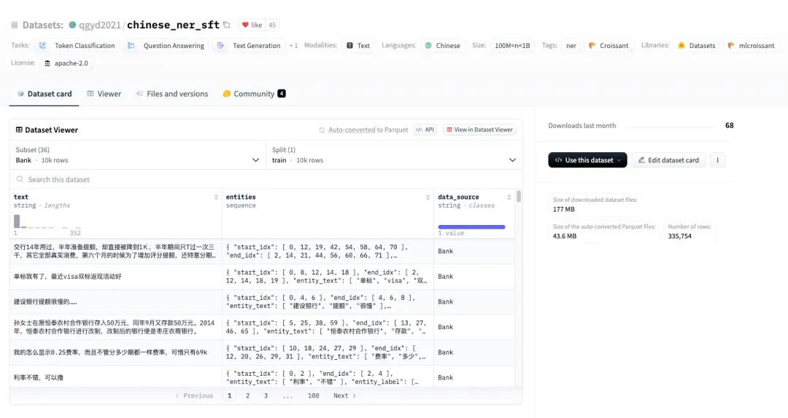
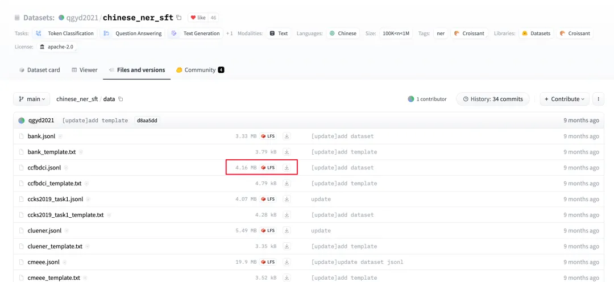
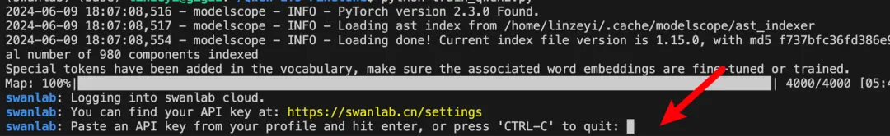
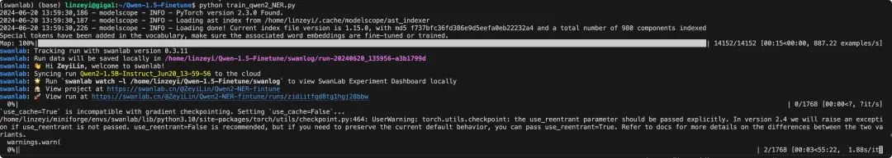
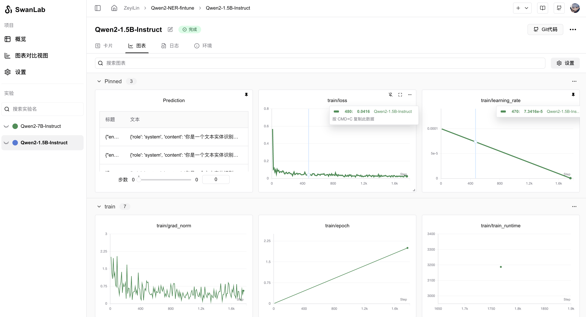
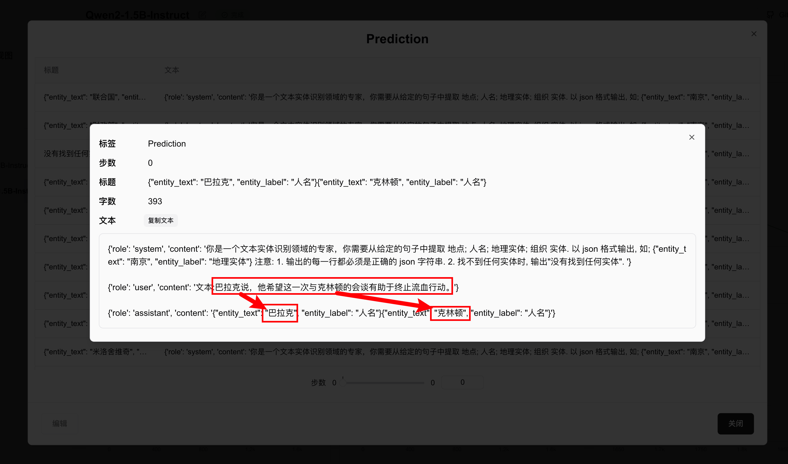

# Qwen2 Named Entity Recognition

[](https://swanlab.cn/@ZeyiLin/Qwen2-NER-fintune/runs/9gdyrkna1rxjjmz0nks2c/chart)

[Qwen2](https://modelscope.cn/models/qwen/Qwen2-1.5B-Instruct/summary) is the recently open-sourced large language model developed by Alibaba Cloud's Tongyi Lab.

Using Qwen2 as the base model, we perform high-precision Named Entity Recognition (NER) through **instruction fine-tuning**, making this an excellent task for learning **LLM fine-tuning** and building foundational knowledge about large models.


> Training with the LoRA method requires modest GPU memory (~10GB) for the 1.5B model.

In this tutorial, we'll fine-tune the [Qwen2-1.5b-Instruct](https://modelscope.cn/models/qwen/Qwen2-1.5B-Instruct/summary) model on the [Chinese NER](https://huggingface.co/datasets/qgyd2021/chinese_ner_sft) dataset while monitoring the training process and evaluating model performance using [SwanLab](https://swanlab.cn).

• Code: See Section 5 or [Github](https://github.com/Zeyi-Lin/LLM-Finetune)
• Training logs: [Qwen2-1.5B-NER-Fintune - SwanLab](https://swanlab.cn/@ZeyiLin/Qwen2-NER-fintune/runs/9gdyrkna1rxjjmz0nks2c/chart)
• Model: [Modelscope](https://modelscope.cn/models/qwen/Qwen2-1.5B-Instruct/summary)
• Dataset: [chinese_ner_sft](https://huggingface.co/datasets/qgyd2021/chinese_ner_sft)
• SwanLab: [https://swanlab.cn](https://swanlab.cn)

## What is Instruction Fine-Tuning?

Instruction fine-tuning is a technique for adapting large pre-trained language models, **with the core objective of enhancing the model's ability to understand and execute specific instructions**, enabling it to generate appropriate outputs or perform tasks accurately based on natural language instructions.

Instruction fine-tuning particularly focuses on improving the model's **instruction-following consistency and accuracy**, thereby expanding its generalization capabilities and practical utility across various applications.

In practice, instruction fine-tuning treats LLMs as **more intelligent and powerful versions of traditional NLP models (like BERT)** to achieve higher precision in NLP tasks. This approach covers traditional NLP scenarios and is often used by teams for **annotating internet data**.

## What is Named Entity Recognition?

Named Entity Recognition (NER) is an NLP technique primarily used to identify and categorize key information (keywords) in text. These entities can include person names, locations, organizations, dates, times, monetary values, etc. The goal of NER is to transform unstructured text into structured information for easier computer processing.


NER is highly practical, with applications in internet data annotation, search engines, recommendation systems, knowledge graphs, healthcare, and many other fields.

## 1. Environment Setup

This tutorial requires `Python>=3.8` and an NVIDIA GPU (with ~10GB VRAM).

Install the following Python libraries (ensure **PyTorch** and **CUDA** are already installed):

```txt
swanlab
modelscope
transformers
datasets
peft
accelerate
pandas
```

One-command installation:

```bash 
pip install swanlab modelscope transformers datasets peft pandas accelerate
```

> Tested with modelscope==1.14.0, transformers==4.41.2, datasets==2.18.0, peft==0.11.1, accelerate==0.30.1, swanlab==0.3.11

## 2. Prepare the Dataset

We use the [chinese_ner_sft](https://huggingface.co/datasets/qgyd2021/chinese_ner_sft) dataset from HuggingFace, designed for training NER models.



chinese_ner_sft contains hundreds of thousands of diverse Chinese NER samples, making it one of the most comprehensive Chinese NER datasets available.

For this tutorial, we'll use only the CCFBDCI subset (a Chinese NER robustness evaluation dataset), which includes four entity types: LOC (location), GPE (geopolitical entity), ORG (organization), and PER (person). Example data format:

```json
{
  "text": "Today, the 12th APEC Ministerial Meeting opened here. Chinese Foreign Minister Tang Jiaxuan and Minister of Foreign Trade Shi Guangsheng attended the meeting.",
  "entities": [
    {
        "start_idx": 23,
        "end_idx": 25,
        "entity_text": "China",
        "entity_label": "GPE",
        "entity_names": ["Geopolitical Entity", "Political Entity", "Geographical Entity", "Social Entity"]},
        {
            "start_idx": 25,
            "end_idx": 28,
            "entity_text": "Foreign Ministry",
            "entity_label": "ORG",
            "entity_names": ["Organization", "Group", "Institution"]
        },
        {
            "start_idx": 30,
            "end_idx": 33,
            "entity_text": "Tang Jiaxuan",
            "entity_label": "PER",
            "entity_names": ["Person Name", "Full Name"]
        }, 
        ...
    ],
"data_source": "CCFBDCI"
}
```

Our goal is to fine-tune the model to predict JSON-formatted entity information from input text:

```txt
Input: Today, the 12th APEC Ministerial Meeting opened here. Chinese Foreign Minister Tang Jiaxuan and Minister of Foreign Trade Shi Guangsheng attended the meeting.

Model Output: {"entity_text":"China", "entity_label":"Organization"}{"entity_text":"Tang Jiaxuan", "entity_label":"Person Name"}...
```

---

Download the dataset from [chinese_ner_sft - huggingface](https://huggingface.co/datasets/qgyd2021/chinese_ner_sft/tree/main/data) by saving `ccfbdci.jsonl` to the project root directory:



## 3. Load the Model

We'll download the Qwen2-1.5B-Instruct model via Modelscope (which has stable domestic speeds in China) and load it into Transformers for training:

```python
from modelscope import snapshot_download, AutoTokenizer
from transformers import AutoModelForCausalLM, TrainingArguments, Trainer, DataCollatorForSeq2Seq

model_id = "qwen/Qwen2-1.5B-Instruct"    
model_dir = "./qwen/Qwen2-1___5B-Instruct"

# Download Qwen model from Modelscope
model_dir = snapshot_download(model_id, cache_dir="./", revision="master")

# Load model weights into Transformers
tokenizer = AutoTokenizer.from_pretrained(model_dir, use_fast=False, trust_remote_code=True)
model = AutoModelForCausalLM.from_pretrained(model_dir, device_map="auto", torch_dtype=torch.bfloat16)
model.enable_input_require_grads()  # Required for gradient checkpointing
```

## 4. Configure Training Visualization

We'll use SwanLab to monitor training and evaluate model performance.

Integration with Transformers is straightforward:

```python
from swanlab.integration.huggingface import SwanLabCallback

swanlab_callback = SwanLabCallback(...)

trainer = Trainer(
    ...
    callbacks=[swanlab_callback],
)
```

First-time SwanLab users should register at [https://swanlab.cn](https://swanlab.cn), copy their API Key from **User Settings**, and paste it when prompted during training:



## 5. Complete Code

Directory structure before training:

```txt
|--- train.py
|--- train.jsonl
|--- test.jsonl
```

train.py:

```python
import json
import pandas as pd
import torch
from datasets import Dataset
from modelscope import snapshot_download, AutoTokenizer
from swanlab.integration.huggingface import SwanLabCallback
from peft import LoraConfig, TaskType, get_peft_model
from transformers import AutoModelForCausalLM, TrainingArguments, Trainer, DataCollatorForSeq2Seq
import os
import swanlab


def dataset_jsonl_transfer(origin_path, new_path):
    """
    Convert raw dataset to instruction-tuning format
    """
    messages = []

    with open(origin_path, "r") as file:
        for line in file:
            data = json.loads(line)
            input_text = data["text"]
            entities = data["entities"]
            match_names = ["Location", "Person Name", "Geographical Entity", "Organization"]
            
            entity_sentence = ""
            for entity in entities:
                entity_json = dict(entity)
                entity_text = entity_json["entity_text"]
                entity_names = entity_json["entity_names"]
                for name in entity_names:
                    if name in match_names:
                        entity_label = name
                        break
                
                entity_sentence += f"""{{"entity_text": "{entity_text}", "entity_label": "{entity_label}"}}"""
            
            if entity_sentence == "":
                entity_sentence = "No entities found"
            
            message = {
                "instruction": """You are an expert in text entity recognition. Extract entities (Location; Person Name; Geographical Entity; Organization) from the given sentence. Output in JSON format, e.g., {"entity_text": "Nanjing", "entity_label": "Geographical Entity"}. Note: 1. Each line must be valid JSON. 2. If no entities are found, output "No entities found".""",
                "input": f"Text:{input_text}",
                "output": entity_sentence,
            }
            
            messages.append(message)

    with open(new_path, "w", encoding="utf-8") as file:
        for message in messages:
            file.write(json.dumps(message, ensure_ascii=False) + "\n")
            
            
def process_func(example):
    """
    Preprocess dataset
    """
    MAX_LENGTH = 384 
    input_ids, attention_mask, labels = [], [], []
    system_prompt = """You are an expert in text entity recognition. Extract entities (Location; Person Name; Geographical Entity; Organization) from the given sentence. Output in JSON format, e.g., {"entity_text": "Nanjing", "entity_label": "Geographical Entity"}. Note: 1. Each line must be valid JSON. 2. If no entities are found, output "No entities found"."""
    
    instruction = tokenizer(
        f"<|im_start|>system\n{system_prompt}<|im_end|>\n<|im_start|>user\n{example['input']}<|im_end|>\n<|im_start|>assistant\n",
        add_special_tokens=False,
    )
    response = tokenizer(f"{example['output']}", add_special_tokens=False)
    input_ids = instruction["input_ids"] + response["input_ids"] + [tokenizer.pad_token_id]
    attention_mask = (
        instruction["attention_mask"] + response["attention_mask"] + [1]
    )
    labels = [-100] * len(instruction["input_ids"]) + response["input_ids"] + [tokenizer.pad_token_id]
    if len(input_ids) > MAX_LENGTH:  # Truncate if needed
        input_ids = input_ids[:MAX_LENGTH]
        attention_mask = attention_mask[:MAX_LENGTH]
        labels = labels[:MAX_LENGTH]
    return {"input_ids": input_ids, "attention_mask": attention_mask, "labels": labels}   


def predict(messages, model, tokenizer):
    device = "cuda"
    text = tokenizer.apply_chat_template(
        messages,
        tokenize=False,
        add_generation_prompt=True
    )
    model_inputs = tokenizer([text], return_tensors="pt").to(device)

    generated_ids = model.generate(
        model_inputs.input_ids,
        max_new_tokens=512
    )
    generated_ids = [
        output_ids[len(input_ids):] for input_ids, output_ids in zip(model_inputs.input_ids, generated_ids)
    ]
    
    response = tokenizer.batch_decode(generated_ids, skip_special_tokens=True)[0]
    
    print(response)
     
    return response


model_id = "qwen/Qwen2-1.5B-Instruct"    
model_dir = "./qwen/Qwen2-1___5B-Instruct"

# Download model
model_dir = snapshot_download(model_id, cache_dir="./", revision="master")

# Load model
tokenizer = AutoTokenizer.from_pretrained(model_dir, use_fast=False, trust_remote_code=True)
model = AutoModelForCausalLM.from_pretrained(model_dir, device_map="auto", torch_dtype=torch.bfloat16)
model.enable_input_require_grads()

# Load and process dataset
train_dataset_path = "ccfbdci.jsonl"
train_jsonl_new_path = "ccf_train.jsonl"

if not os.path.exists(train_jsonl_new_path):
    dataset_jsonl_transfer(train_dataset_path, train_jsonl_new_path)

# Prepare training set
total_df = pd.read_json(train_jsonl_new_path, lines=True)
train_df = total_df[int(len(total_df) * 0.1):]
train_ds = Dataset.from_pandas(train_df)
train_dataset = train_ds.map(process_func, remove_columns=train_ds.column_names)


config = LoraConfig(
    task_type=TaskType.CAUSAL_LM,
    target_modules=["q_proj", "k_proj", "v_proj", "o_proj", "gate_proj", "up_proj", "down_proj"],
    inference_mode=False,
    r=8,
    lora_alpha=32,
    lora_dropout=0.1,
)

model = get_peft_model(model, config)

args = TrainingArguments(
    output_dir="./output/Qwen2-NER",
    per_device_train_batch_size=4,
    per_device_eval_batch_size=4,
    gradient_accumulation_steps=4,
    logging_steps=10,
    num_train_epochs=2,
    save_steps=100,
    learning_rate=1e-4,
    save_on_each_node=True,
    gradient_checkpointing=True,
    report_to="none",
)

swanlab_callback = SwanLabCallback(
    project="Qwen2-NER-fintune",
    experiment_name="Qwen2-1.5B-Instruct",
    description="Fine-tuning Qwen2-1.5B-Instruct on NER dataset for entity recognition.",
    config={
        "model": model_id,
        "model_dir": model_dir,
        "dataset": "qgyd2021/chinese_ner_sft",
    },
)

trainer = Trainer(
    model=model,
    args=args,
    train_dataset=train_dataset,
    data_collator=DataCollatorForSeq2Seq(tokenizer=tokenizer, padding=True),
    callbacks=[swanlab_callback],
)

trainer.train()

# Test model on 20 random samples
test_df = total_df[:int(len(total_df) * 0.1)].sample(n=20)

test_text_list = []
for index, row in test_df.iterrows():
    instruction = row['instruction']
    input_value = row['input']
    
    messages = [
        {"role": "system", "content": f"{instruction}"},
        {"role": "user", "content": f"{input_value}"}
    ]

    response = predict(messages, model, tokenizer)
    messages.append({"role": "assistant", "content": f"{response}"})
    result_text = f"{messages[0]}\n\n{messages[1]}\n\n{messages[2]}"
    test_text_list.append(swanlab.Text(result_text, caption=response))
    
swanlab.log({"Prediction": test_text_list})
swanlab.finish()
```

Training progress will appear as:



## 5. Training Results

View final results on [SwanLab](https://swanlab.cn/@ZeyiLin/Qwen2-NER-fintune/runs/9gdyrkna1rxjjmz0nks2c/chart):

After 2 epochs, the fine-tuned Qwen2 achieves satisfactory loss reduction—though true evaluation requires qualitative assessment.



Test examples show accurate entity extraction:




Congratulations! You've completed Qwen2 instruction fine-tuning!

## 6. Inference with the Fine-Tuned Model

The trained model is saved in `./output/Qwen2-NER`.

Inference code:

```python
import torch
from transformers import AutoModelForCausalLM, AutoTokenizer
from peft import PeftModel

def predict(messages, model, tokenizer):
    device = "cuda"

    text = tokenizer.apply_chat_template(messages, tokenize=False, add_generation_prompt=True)
    model_inputs = tokenizer([text], return_tensors="pt").to(device)

    generated_ids = model.generate(model_inputs.input_ids, max_new_tokens=512)
    generated_ids = [output_ids[len(input_ids):] for input_ids, output_ids in zip(model_inputs.input_ids, generated_ids)]
    response = tokenizer.batch_decode(generated_ids, skip_special_tokens=True)[0]

    return response


# Load original model and tokenizer
tokenizer = AutoTokenizer.from_pretrained("./qwen/Qwen2-1___5B-Instruct/", use_fast=False, trust_remote_code=True)
model = AutoModelForCausalLM.from_pretrained("./qwen/Qwen2-1___5B-Instruct/", device_map="auto", torch_dtype=torch.bfloat16)

# Load fine-tuned LoRA weights (replace [checkpoint-XXX] with actual checkpoint)
model = PeftModel.from_pretrained(model, model_id="./output/Qwen2-NER/checkpoint-1700")

input_text = "Chen Zhiming from Xidian University fell in love with Su Chunhong from Northwestern Polytechnical University. They agreed to settle in Suzhou, China after graduation."
test_texts = {
    "instruction": """You are an expert in text entity recognition. Extract entities (Location; Person Name; Geographical Entity; Organization) from the given sentence. Output in JSON format, e.g., {"entity_text": "Nanjing", "entity_label": "Geographical Entity"}. Note: 1. Each line must be valid JSON. 2. If no entities are found, output "No entities found".""",
    "input": f"Text:{input_text}"
}

instruction = test_texts['instruction']
input_value = test_texts['input']

messages = [
    {"role": "system", "content": f"{instruction}"},
    {"role": "user", "content": f"{input_value}"}
]

response = predict(messages, model, tokenizer)
print(response)
```

Output:

```json
{"entity_text": "Xidian University", "entity_label": "Organization"}
{"entity_text": "Chen Zhiming", "entity_label": "Person Name"}
{"entity_text": "Northwestern Polytechnical University", "entity_label": "Organization"}
{"entity_text": "Su Chunhong", "entity_label": "Person Name"}
{"entity_text": "China", "entity_label": "Geographical Entity"}
{"entity_text": "Suzhou", "entity_label": "Geographical Entity"}
```

## Related Links

- Code: See Section 5 or [Github](https://github.com/Zeyi-Lin/LLM-Finetune)
- Training logs: [Qwen2-1.5B-NER-Fintune - SwanLab](https://swanlab.cn/@ZeyiLin/Qwen2-NER-fintune/runs/9gdyrkna1rxjjmz0nks2c/chart)
- Model: [Modelscope](https://modelscope.cn/models/qwen/Qwen2-1.5B-Instruct/summary)
- Dataset: [chinese_ner_sft](https://huggingface.co/datasets/qgyd2021/chinese_ner_sft)
- SwanLab: [https://swanlab.cn](https://swanlab.cn)