# Qwen3-"VL" — The Path to "Splicing Fine-Tuning" for an Ultra-Small Chinese Multimodal Model (With Code and SwanLab Records)

* Author: Shaohon Chen
* Email: <shaohon_chen@115lab.club>  
* GitHub: [https://github.com/ShaohonChen/Qwen3-SmVL](https://github.com/ShaohonChen/Qwen3-SmVL)  
* SwanLab: [https://swanlab.cn/@ShaohonChen/Qwen3-SmVL/overview](https://swanlab.cn/@ShaohonChen/Qwen3-SmVL/overview)  
* Dataset: [https://huggingface.co/datasets/HuggingFaceM4/the_cauldron](https://huggingface.co/datasets/HuggingFaceM4/the_cauldron)  

[](https://swanlab.cn/@ShaohonChen/Qwen3-SmVL/overview)


## Abstract  

Recently, the HuggingFace team released an ultra-small multimodal model, SmolVLM2, capable of edge-side inference with just 1GB of VRAM. After testing it with great excitement, I found that while the model has incredibly powerful visual-text understanding capabilities, it cannot comprehend Chinese. This was quite unfriendly for someone like me who barely passed the CET-4 and CET-6 exams. Coincidentally, while working on SwanLab hardware detection and adaptation, I had access to an unused Muxi Xiyun C500 server that hadn't expired yet. This led to the idea of using **MetaX GPU chips** to fine-tune and directly splice the current top Chinese small model, Qwen3, with SmolVLM2.  

This tutorial will introduce an approach to model splicing, aligning and fine-tuning SmolVLM2's vision module (0.09B) with Qwen3's smallest model (0.6B), ultimately enabling the Qwen model to possess certain visual understanding capabilities. Due to time constraints and considerations for article length, this series will be released in installments. The planned content is as follows:  

* **Part 1**: How to construct and fine-tune a spliced model (**this blog post**)  
* **Part 2**: Model evaluation, dataset optimization, and human-aligned responses  
* **Part 3**: Fine-tuning techniques, modifications to visual positional encoding, and model architecture optimization  

<div align="center">  
  <figure>  
    
  <figcaption>I have a Qwen, I have a SmolVLM...</figcaption>  
  </figure>  
</div>  

<div style="background-color:#fff3cd; color:black; padding:10px; border-radius:4px; border:1px solid #fbe5b0; width: 90%; max-width: 100%; margin: auto;">  
  ⚠️Note on Computing Power: This tutorial involves VLM fine-tuning and training, which requires significant computing resources. You will need a GPU with at least 40GB of VRAM to run the training code in this tutorial.  
</div>  

## Table of Contents  

[[toc]]  

## Background on SmolVLM2  

First, let’s review the construction of the SmolVLM2 model. The overall architecture of SmolVLM2 consists of three main components: the vision model layer, the feature mapping layer, and the large language model (LLM) layer, as shown below:  

<div align="center">  
  <figure>  
    
  <figcaption>Architecture of SmolVLM2</figcaption>  
  </figure>  
</div>  

This design is now a relatively common VLM approach. The core idea is to concatenate the output features of the vision model with the text features (after embedding) and feed them directly into the language model (LLM), without cross-attention or other modules. Compared to earlier architectures like LLaVA, the biggest advantage of this approach is that it maximizes the reuse of existing language models. For example, in Qwen2.5-VL, the model sizes of 3B, 7B, and 72B refer only to the LLM portion and do not include the vision module. In reality, the 3B model has nearly 4B parameters, with the vision module accounting for about 0.4B. The three VLMs of different sizes share the same vision model.  

For larger VLMs, most of the training during vision model construction focuses on the feature mapping module and the vision module. Only in the final stage, to achieve optimal performance, is the entire model fine-tuned, ensuring the VLM's language capabilities.  

Below is a brief overview of each module:  

* **Vision Model Layer**: The SmolVLM2-256M version uses Google's SigLip model, a ViT-based vision model. The smallest SigLip-93M version was selected. The HuggingFace paper does not specify whether they used SigLip's parameters directly or built it from scratch (if any readers have noticed, please leave a comment). In the SmolVLM2 code, this corresponds to the `SmolVLMVisionTransformer` class.  

* **Feature Mapping Layer**: This is simply an MLP. However, SmolVLM2 also uses a pixel shuffle to reduce image resolution, further decreasing the number of visual tokens and shortening the text length. The HuggingFace team mentions in their paper that for smaller VLMs, using pixel shuffle can improve performance. The trainable parameters are essentially a single-layer neural network. The core function of this module is feature alignment, mapping visual features from 768 dimensions (SigLip's dimension) to 576 dimensions (SmolLLM2's dimension).  

* **Large Language Model**: The SmolVLM2-256M model uses the SmolLM-135M version for text. Due to the model's small size, the HuggingFace team states in the paper that training involves only two stages: large-scale image-text training and specialized fine-tuning for video tasks. To ensure the model's text capabilities, about 14% of the training data consists of pure text fine-tuning data. However, given that the vision module's parameter count (93M) is close to that of the text model (135M), I speculate that data balancing plays a more critical role than freezing the text model.  

The HuggingFace team also mentions many tricks that affect the performance of small VLMs in the paper. Interested readers can refer to the SmolVLM2 paper for further details.  

## Model Splicing and Fine-Tuning Approach  

As the saying goes, "Top-tier ingredients (models) require the simplest cooking." The idea of model splicing is straightforward and involves just three steps:  

1. Adjust SmolVLM2's "context control format" to make it compatible with Qwen3.  
2. Replace the text portion of the model directly from SmolLM2 to Qwen3-0.6B, including its text tokenizer, word embeddings, text model, and the final output language model head (LM Head).  
3. Reinitialize the feature mapping layer's MLP, changing the single-layer neural network from 768->576 to 768->1024.  

The overall architecture and pre/post-processing for image-text pairs remain unchanged from SmolVLM2's workflow. The specific modifications are shown below:  

<div align="center">  
  <figure>  
  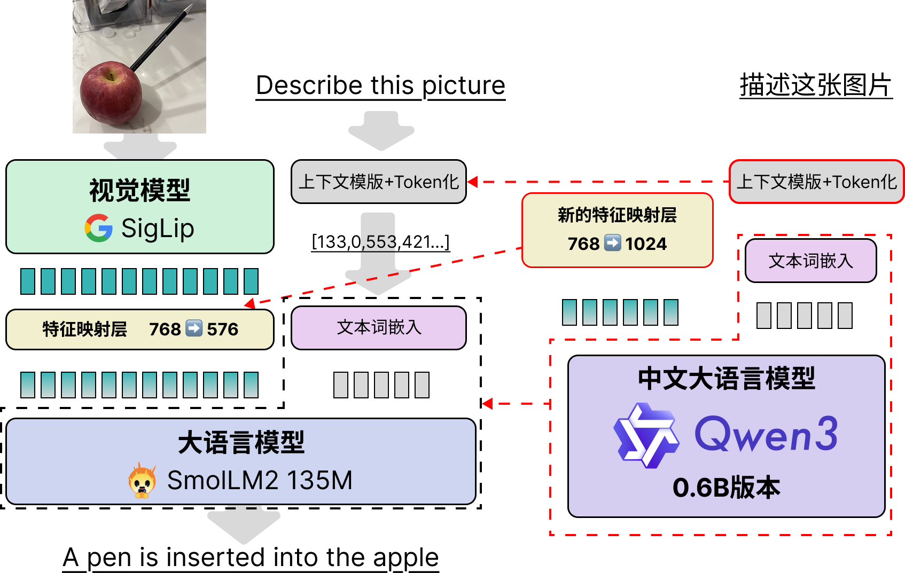  
  <figcaption>Replacing SmolVLM2's language model with Qwen3-0.6B</figcaption>  
  </figure>  
</div>  

Next, I will detail the specific changes made to achieve "splicing," providing a reference for readers working on similar tasks in the future.  

## Implementation of Model Splicing and Key Code Explanation  

### First Modification: SmolVLM2's Tokenizers  

The first change involves SmolVLM2's tokenizers, primarily addressing two issues:  

* **First Issue**: Adding SmolVLM2's special tokens (for indicating image positions) to Qwen3's tokenizer. This prevents SmolVLM2's image token `<image>` from being split into `<`, `image`, and `>`. Fortunately, Qwen3 itself reserves special tokens like `<|image_pad|>` for future multimodal use. Therefore, I directly used `<|image_pad|>` to replace `<image>`, serving as the insertion point for image features in the text.  

* **Second Issue**: The `chat_template` of SmolVLM2 and Qwen3 differ significantly. The `chat_template` formats text to help the model understand the contextual information represented by different tokens. In more popular terms, this is "context engineering."  

Below, I compare the chat context formats of Qwen3, SmolVLM2, and Qwen2.5-VL for reference.  

**Qwen3 Chat Context Format**  

For example, given an image and the question "What is your name?", with the model responding "My name is Qwen," the context is as follows:  

```txt  
<|im_start|>user  
What is your name?<|im_end|>  
<|im_start|>assistant  
<think>  

</think>  

My name is Qwen<|im_end|>  
```  

Note that Qwen3's context does not reserve space for images. However, compared to typical LLMs and VLMs, it includes an additional `<think></think>` section for inserting the model's thought process, as well as extra function call control text. Below is an example of a function call context, which controls the model's invocation of external functions, APIs, or MCP interfaces and the reception of their returned information.  

Due to space constraints, I won’t paste the full context with function calls, reasoning, and thought processes (it’s quite lengthy). Interested readers can refer to Qwen3's official documentation for details.  

* [Qwen3 Function Call Example](https://qwen.readthedocs.io/zh-cn/latest/framework/function_call.html#the-example-case)  

These complex contextual elements enable the model to perform reasoning, function calls, and other diverse capabilities, including multimodal understanding tasks, which also require careful context design.  

**SmolVLM2 Chat Context Format**  

For example, given an image and the question "How many dogs are there?", with the model responding "There are three dogs," the context is as follows:  

```txt  
<|im_start|>User:<fake_token_around_image><row_1_col_1><image>...<image><fake_token_around_image><row_1_col_2><image>...<image><fake_token_around_image><row_1_col_3><image>...<image>...<fake_token_around_image><row_4_col_4><image>...<image>  

<fake_token_around_image><global-img><image>...<image><fake_token_around_image>How many dogs are there.<end_of_utterance>  
Assistant: There are three dogs.<end_of_utterance>  
Assistant:  
```  

This looks messy due to the numerous `<image>` placeholders. The `...` between `<image>` tokens represents many omitted placeholders for readability. Note that line breaks and spaces are part of the context, and indentation must be strictly followed during inference.  

However, familiar elements like `User:` and `Assistant:` can still be identified, indicating where user input and model responses should be. These keywords are similar to Qwen's.  

Besides `<fake_token_around_image>` and `<image>`, position indicators like `<row_1_col_1>` appear. This is because SmolVLM2 uses "image splitting" to mitigate the impact of downsampling on image resolution. Essentially, the global image and high-resolution local images are jointly fed into the model (see the `image splitting` module in the figure below). Interested readers can refer to HuggingFace's technical report for details.  

<div align="center">  
  <figure>  
    
  <figcaption>SmolVLM2's full inference pipeline, showing pre-splitting with `image splitting` before image input</figcaption>  
  </figure>  
</div>  

**The Spliced Model in This Blog: Qwen3-SmVL**  

Compared to Qwen3, SmolVLM2 lacks many context controls.  

To preserve Qwen3's reasoning, function calling, and other capabilities as much as possible, I chose to insert SmolVLM2's image feature arrangement into Qwen3's context format. The final context format is as follows:  

```txt  
<|im_start|>user  
<vision_start><row_1_col_1><|image_pad|>(image insertion point)<|image_pad|><vision_start>  
(user question)  
<|im_end|>  
<|im_start|>assistant  
<think>  

</think>  

(model response)<|im_end|>  
<|endoftext|>  
```  

This maintains Qwen3's style and reuses special tokens, ensuring that the spliced Qwen3-0.6B model doesn't suffer significant performance degradation due to context differences. In practice, fine-tuning contexts should align as closely as possible with the model's pre-training tasks to minimize performance loss.  

The code for controlling model context formats in Transformers isn't written in Python but in Jinja, a front-end text templating language with somewhat magical variable scoping. Combined with Qwen3's feature-rich and complex context strategies, modifying the `chat_template` took me two hours. I won’t delve into the details here, but interested readers can refer to the `chat_template.jinja` file in the code repository. I’ve extracted and formatted the template for easier reading. I may write a separate blog on model context control and Jinja in the future.  

### Second Modification: Replacing SmolVLM2's SmolLM2 Model with Qwen3-0.6B  

Replacing the model isn’t particularly complex, but it requires navigating Transformers' nested logic. Transformers typically separate pre-trained model backbones from downstream tasks. The modification logic is shown below:  

<div align="center">  
  <figure>  
  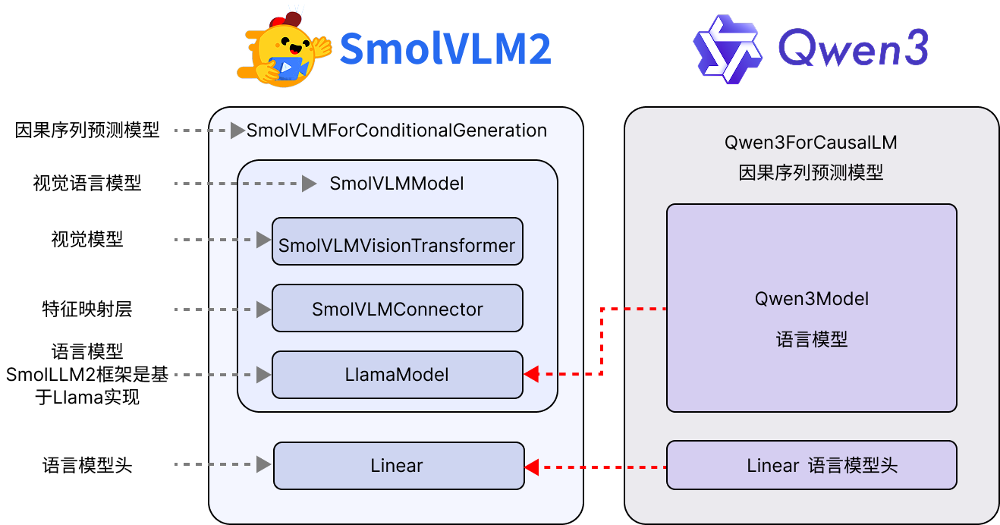  
  <figcaption>Replacing SmolVLM2's text module and language model head</figcaption>  
  </figure>  
</div>  

For Qwen3, the pre-trained backbone model is `Qwen3Model`, which includes only the embedding layer, decoder layers, and outputs the hidden states of all input tokens. For downstream tasks, Qwen3 provides:  

* `Qwen3ForCausalLM`: Used for causal language sequence generation (the commonly used text generation).  
* `Qwen3ForSequenceClassification`: Uses the last generated token fed into a single-layer MLP for sequence-level classification (e.g., sentiment analysis).  
* `Qwen3ForTokenClassification`: Used for token-level classification (e.g., named entity recognition).  
* `Qwen3ForQuestionAnswering`: Designed for extractive question-answering tasks, where the model finds the most relevant segment from reference text given a question. This task has become less popular with the rise of RAG systems. I may write a tutorial series on fine-tuning tasks beyond causal language generation in the future.  

**Key Code**  

```python  
from transformers import (  
    AutoProcessor,  
    AutoModelForImageTextToText,  
    AutoTokenizer,  
    AutoModelForCausalLM  
)  

# Replace text model and head  
smolvlm2_02B_model = AutoModelForImageTextToText.from_pretrained(  
    "model/SmolVLM2-256M-Video-Instruct",  
    torch_dtype=torch.bfloat16,  
    _attn_implementation="eager",  
).to(device)  

qwen3_06b_model = AutoModelForCausalLM.from_pretrained(  
    "model/Qwen3-0.6B", torch_dtype=torch.bfloat16  
).to(device)  

smolvlm2_02B_model.model.text_model = qwen3_06b_model.model  
smolvlm2_02B_model.lm_head = qwen3_06b_model.lm_head  
...  
```  

Next, replacing key variables is more complex, such as the `image_token_id` for reserving space for image features in the text sequence, the `eos_token_id` for stopping generation, and the `vocab_size` used for loss calculation. Qwen's vocabulary size is 151,936, far larger than SmolVLM2's 49,280. The specific code is as follows:  

```python  
...  
# Replace vocabulary size  
smolvlm2_02B_model.vocab_size = qwen3_06b_model.vocab_size  
smolvlm2_02B_model.model.vocab_size = qwen3_06b_model.vocab_size  
smolvlm2_02B_model.config.vocab_size = qwen3_06b_model.vocab_size  
smolvlm2_02B_model.config.text_config.vocab_size = qwen3_06b_model.vocab_size  
smolvlm2_02B_model.model.config.vocab_siz = qwen3_06b_model.vocab_size  
smolvlm2_02B_model.model.config.text_config.vocab_size = qwen3_06b_model.vocab_size  
# Replace image token  
smolvlm2_02B_model.image_token_id = 151655  
smolvlm2_02B_model.model.image_token_id = 151655  
smolvlm2_02B_model.config.image_token_id = 151655  
smolvlm2_02B_model.model.config.image_token_id = 151655  
# Replace model generation stop token  
smolvlm2_02B_model.generation_config.eos_token_id = 151645  
...  
```  

The code above shows that when replacing variables, nested model variables must also be replaced. During an earlier training session, I only replaced `SmolVLMForConditionalGeneration` and forgot to replace `image_token_id` in `SmolVLMModel`, causing the language model to miss image features. The result was rapid loss decline and low values, with `grad_norm` appearing normal, but inference performance was terrible. Below is the loss graph from that failed training:  

<div align="center">  
  <figure>  
  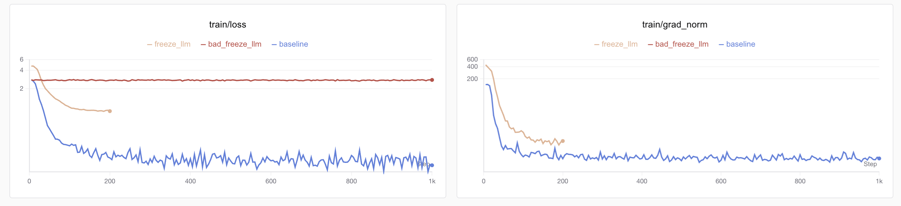  
  <figcaption>SwanLab training results: Blue shows the loss curve of the failed full fine-tuning, where loss drops quickly but the model lacks visual understanding. Freezing the LM head (red) reveals zero grad_norm and non-converging loss. The correct curve is yellow.</figcaption>  
  </figure>  
</div>  

Initially unaware of the error, I performed full fine-tuning (blue curve) and saw loss drop quickly below 0.1, but inference revealed no visual understanding. I then tried freezing the LM head and fine-tuning only the vision model (red curve), but loss didn’t decrease, leading me to identify the feature transmission issue. The correct loss curve is shown in yellow.  

### Third Modification: Building and Replacing the Feature Mapping Layer  

This is relatively straightforward. Simply rebuild a dimension-aligned `SmolVLMConnector`. Qwen3's hidden_dim is 1024, and SigLip's is 768, so a 768→1024 `SmolVLMConnector` is needed. The code is as follows:  

```python  
...  
# Build configuration and create connector  
@dataclass  
class VisionConfig:  
    hidden_size: int = 768  

@dataclass  
class TextConfig:  
    hidden_size: int = 1024  

@dataclass  
class ConnectConfig:  
    scale_factor: int = 4  
    vision_config: VisionConfig = VisionConfig()  
    text_config: TextConfig = TextConfig()  

new_connector_config = ConnectConfig()  

# Replace SigLip-to-LLM connector layer  
new_connector = SmolVLMConnector(new_connector_config).to(device).to(torch.bfloat16)  
smolvlm2_02B_model.model.connector = new_connector  
...  
```  

## Fine-Tuning Dataset Construction  

Initially, I planned to find a Chinese multimodal dataset but discovered limited resources. I decided to use an English multimodal dataset temporarily and later consider translating some data into Chinese via synthesis. Data synthesis and balancing will be discussed in a future blog.  

<div align="center">  
  <figure>  
    
  <figcaption>Logo of the_cauldron dataset</figcaption>  
  </figure>  
</div>  

For convenience, this project directly uses HuggingFace's integrated multimodal dataset, "the Cauldron." "Cauldron" translates to "釜" in Chinese, perhaps a nod to "alchemy." This dataset combines training sets from 50 visual fine-tuning tasks, processed into a consistent format (see below), totaling 1,880,992 entries (~169GB when fully downloaded).  

<div align="center">  
  <figure>  
  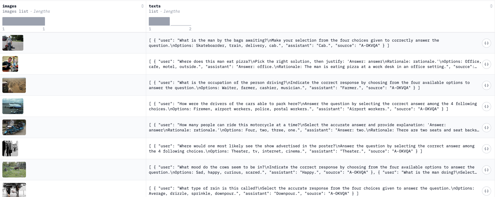  
  <figcaption>Dataset sample display</figcaption>  
  </figure>  
</div>  

Unfortunately, the dataset's text is entirely in English, and most responses are very short (single words), which later caused training challenges. This blog won’t delve into data construction and balancing but focuses on equipping Qwen3 with visual capabilities.  

Dataset download links (recommend ModelScope for users in China):  

* [HuggingFace Hub](https://huggingface.co/datasets/HuggingFaceM4/the_cauldron)  
* [ModelScope](https://modelscope.cn/datasets/AI-ModelScope/the_cauldron)  

During testing, I found issues with subsets like "mimic_cgd," "localized_narratives," "okvqa," "ocrvqa," and "clevr_math." Community feedback suggests downloading these separately from their original sources. I plan to complete and re-upload a full version of the Cauldron dataset in the future.  

## Fine-Tuning Methods and Code Implementation  

### Frozen Model Parameter Fine-Tuning  

The overall fine-tuning method uses Teacher Forcing with standard cross-entropy loss. Since the goal is to ensure Chinese multimodal capabilities (optimization will be covered later), **only the feature mapper and LM head are fine-tuned**, with the vision and text models frozen.  

Key code for freezing parameters:  

```python  
def freeze_model(qwen_smvl):  
    for _, param in qwen_smvl.model.text_model.named_parameters():  
        param.requires_grad = False  
    for _, param in qwen_smvl.model.vision_model.named_parameters():  
        param.requires_grad = False  
    return qwen_smvl  
```  

After freezing, trainable parameters, total parameters, and their proportions are:  

```txt  
trainable params: 12.00M || all params: 662.87M || trainable%: 1.81  
```  

### Text Length, Loss Masking, and Truncation Strategies  

**Text Length**  

Visual features occupy significant text length. Testing showed that images in "the_cauldron" consume 0.8K–1.3K tokens, while most text tokens range from 200–500, rarely reaching 3K–4K. Thus, a uniform 2K text length was adopted, with overflow truncated.  

A key detail: truncation length must not be shorter than image tokens, or feature concatenation will fail (truncated image features render the training sample useless). For those with <64GB VRAM, reducing text length (not below 1.5K) should accompany lower image resolution. Future blogs will explore reducing image token usage.  

Due to length limits and non-truncatable image features, "packing dataset" methods weren’t used to improve training efficiency.  

For samples with multiple images, only the first was used (vs. SmolVLM-256M's 8K and 2.2B's 16K lengths).  

**Loss Masking**  

In Teacher Forcing, two loss masking strategies exist:  

1. Fine-tuning the full text (user question + model response).  
2. Fine-tuning only the model response.  

The latter generally improves generalization (aligned with SmolVLM2's paper). However, I chose full-text fine-tuning for efficiency.  

Note: When fine-tuning full text, image tokens must be masked to avoid loss calculation on placeholders.  

**Key Code**:  

```python  
def data_collate_fix2k(examples, processor, device, max_length=2048):  
    batch_text = []  
    batch_image = []  
    for example in examples:  
        images = example["images"][:1]  # Only one image to reduce VRAM pressure  
        batch_image.append(images)  
        image_num = len(images)  
        chat_texts = example["texts"][0]  
        messages = [  
            {  
                "role": "user",  
                "content": [{"type": "image"}] * image_num  
                + [{"type": "text", "text": chat_texts["user"]}],  
            },  
            {  
                "role": "assistant",  
                "content": [{"type": "text", "text": chat_texts["assistant"]}],  
            },  
        ]  
        text = processor.apply_chat_template(  
            messages, enable_thinking=False, add_generation_prompt=False  
        )  

        batch_text.append(text)  

    batch = processor(  
        text=batch_text,  
        images=batch_image,  
        max_length=max_length,  
        return_tensors="pt",  
        padding="max_length",  
        truncation=True,  
    )  
    labels = batch["input_ids"].clone()  
    labels[labels == processor.tokenizer.pad_token_id] = -100  
    labels[labels == processor.image_token_id] = -100  
    batch["labels"] = labels  
    return batch.to(device, dtype=torch.bfloat16)  
```  

### Fine-Tuning Hyperparameters  

**Learning Rate**  

Since only the feature mapper (connector) is trained (randomly initialized due to Qwen3's dimensions), a 1e-4 learning rate (popular in LoRA) was chosen.  

Cosine decay (to 0) was used for convergence, with 10% warm-up (fixed at 50 if steps exceed 1,000K).  

**Batch Size**  

Larger batches are generally better, but VLM text lengths are prohibitive. Thus, 1 batch per GPU with 4 gradient accumulation steps (effective batch size = 32 on 8 GPUs).  

**Training Parameter Code**:  

```python  
training_args = TrainingArguments(  
    seed=42,  
    data_seed=42,  
    max_steps=200,  
    # num_train_epochs=1,  # ~1k steps per epoch  
    per_device_train_batch_size=1,  
    gradient_accumulation_steps=4,  
    dataloader_pin_memory=False,  
    warmup_ratio=0.1,  
    learning_rate=1e-4,  
    lr_scheduler_type="cosine",  
    weight_decay=0.01,  
    logging_steps=5,  
    eval_strategy="steps",  
    eval_steps=0.125,  
    save_strategy="steps",  
    save_steps=0.125,  
    save_total_limit=8,  
    optim="adamw_torch",  
    bf16=True,  
    output_dir=f"./model/freeze_except_connector_cocovqa",  
    overwrite_output_dir=False,  
    report_to="swanlab",  
    run_name="freeze_except_connector_cocovqa",  
    remove_unused_columns=False,  
    gradient_checkpointing=False,  
)  
```  

### Training Environment  

Fine-tuning was performed on Muxi's C500 domestic GPUs (64GB VRAM). Muxi's AI chips are fully compatible with PyTorch and HuggingFace Transformers, with no compatibility issues in multimodal training—a rarity among domestic AI chips. Readers can use NVIDIA GPUs with ≥40GB VRAM.  

**Personal note**: Muxi's GPU adaptation is excellent, with no compatibility issues. The experience is indistinguishable from NVIDIA GPUs, even supporting flash attention. Kudos to Muxi's team!  

<div align="center">  
  <figure>  
  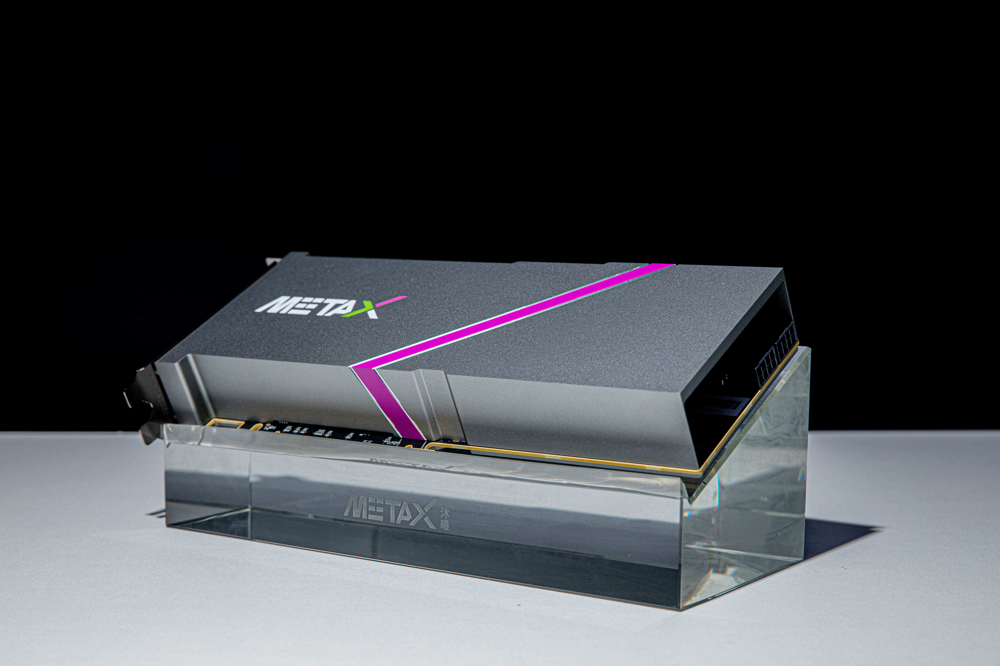  
  <figcaption>Muxi domestic GPU (I used cloud servers, so this is a web image)</figcaption>  
  </figure>  
</div>  

Besides GPU drivers and PyTorch, this tutorial requires HuggingFace libraries:  

```txt  
torch   # Recommended >=6.0  
torchvision  
transformers>=4.53.0  
accelerate  
datasets  
num2words   # SmolVLM2 dependency  
```  

For Muxi GPUs, download [Muxi's PyTorch](https://developer.metax-tech.com/softnova/index) from their official docs. Other HuggingFace setups mirror NVIDIA. Muxi's GPU monitoring command:  

```bash  
mx-smi  
```  

Output example:  

```bash  
=================== MetaX System Management Interface Log ===================  
Timestamp                                         : Sat Jul 12 14:58:51 2025  

Attached GPUs                                     : 8  
+---------------------------------------------------------------------------------+  
| MX-SMI 2.1.12                       Kernel Mode Driver Version: 2.12.13         |  
| MACA Version: 2.29.0.19             BIOS Version: 1.22.3.0                      |  
|------------------------------------+---------------------+----------------------+  
| GPU         NAME                   | Bus-id              | GPU-Util             |  
| Temp        Pwr:Usage/Cap          | Memory-Usage        |                      |  
|====================================+=====================+======================|  
| 0           MetaX C500             | 0000:0e:00.0        | 0%                   |  
| 36C         69W / 350W             | 5680/65536 MiB      |                      |  
+------------------------------------+---------------------+----------------------+  
| 1           MetaX C500             | 0000:0f:00.0        | 0%                   |  
| 38C         70W / 350W             | 4986/65536 MiB      |                      |  
+------------------------------------+---------------------+----------------------+  
| 2           MetaX C500             | 0000:10:00.0        | 0%                   |  
| 37C         69W / 350W             | 4986/65536 MiB      |                      |  
+------------------------------------+---------------------+----------------------+  
| 3           MetaX C500             | 0000:12:00.0        | 1%                   |  
| 37C         71W / 350W             | 4986/65536 MiB      |                      |  
+------------------------------------+---------------------+----------------------+  
| 4           MetaX C500             | 0000:35:00.0        | 0%                   |  
| 37C         70W / 350W             | 4986/65536 MiB      |                      |  
+------------------------------------+---------------------+----------------------+  
| 5           MetaX C500             | 0000:36:00.0        | 1%                   |  
| 36C         68W / 350W             | 4986/65536 MiB      |                      |  
+------------------------------------+---------------------+----------------------+  
| 6           MetaX C500             | 0000:37:00.0        | 0%                   |  
| 39C         73W / 350W             | 4986/65536 MiB      |                      |  
+------------------------------------+---------------------+----------------------+  
| 7           MetaX C500             | 0000:38:00.0        | 0%                   |  
| 38C         71W / 350W             | 4986/65536 MiB      |                      |  
+------------------------------------+---------------------+----------------------+  

+---------------------------------------------------------------------------------+  
| Process:                                                                        |  
|  GPU                    PID         Process Name                 GPU Memory     |  
|                                                                  Usage(MiB)     |  
|=================================================================================|  
|  0                  3496691         python3.10                   4066           |  
|  0                  3496692         python3.10                   102            |  
|  0                  3496693         python3.10                   102            |  
|  0                  3496694         python3.10                   102            |  
|  0                  3496695         python3.10                   102            |  
|  0                  3496696         python3.10                   102            |  
|  0                  3496697         python3.10                   102            |  
|  0                  3496698         python3.10                   170            |  
|  1                  3496692         python3.10                   4154           |  
|  2                  3496693         python3.10                   4154           |  
|  3                  3496694         python3.10                   4154           |  
|  4                  3496695         python3.10                   4154           |  
|  5                  3496696         python3.10                   4154           |  
|  6                  3496697         python3.10                   4154           |  
|  7                  3496698         python3.10                   4154           |  
+---------------------------------------------------------------------------------+  
```  

### Training Code Implementation  

The training code uses HuggingFace's `Trainer` class, which handles most fine-tuning tasks. Notably, Qwen3-0.6B (instruction-tuned) was used instead of Qwen3-0.6B-Base. Typically, fine-tuning pre-aligned models incurs performance loss, but since LLM parameters were frozen, the instruction-tuned version was necessary for multimodal QA.  

bfloat16 was used for higher precision during training (vs. float16).  

For initial validation, the cocoqa dataset (200 steps) was used. After confirming feasibility, 60K samples (text length = 2K) were sampled from the full dataset (parameter-to-token ratio ~1:10). Experiments confirmed this was sufficient for convergence.  

**Key Training Code**  

The code is lengthy due to checkpoint resuming:  

```python  
################  
# Start Training  
################  
last_checkpoint = None  # load last checkpoint if available  
if (  
    os.path.isdir(training_args.output_dir)  
    and not training_args.overwrite_output_dir  
):  
    last_checkpoint = get_last_checkpoint(training_args.output_dir)  
    if last_checkpoint is None and len(os.listdir(training_args.output_dir)) > 0:  
        raise ValueError(  
            f"Output directory ({training_args.output_dir}) already exists"  
        )  
    print(  
        f"Checkpoint detected, resuming training at {last_checkpoint}."  
    )  
# Init Trainer  
trainer = Trainer(  
    model=qwen_smvl,  
    args=training_args,  
    train_dataset=raw_data["train"],  
    eval_dataset=raw_data["test"],  
    data_collator=collate_fn,  
)  
trainer.train(resume_from_checkpoint=last_checkpoint)  
qwen_smvl.save_pretrained(training_args.output_dir)  
```  

Full code: [Code and Dataset Links](#code-and-dataset-links) or [GitHub](https://github.com/ShaohonChen/Qwen3-SmVL).  

## Fine-Tuning Training & Results  

### Environment Setup and Execution  

**Code and Environment**  

Clone the [GitHub repo](https://github.com/ShaohonChen/Qwen3-SmVL) and install dependencies:  

```bash  
pip install -r requirements.txt  
```  

**Dataset and Model Download**  

An automatic download script (using [ModelScope](https://modelscope.cn/)) is provided:  

```bash  
bash download_resource.sh  
```  

### Small-Batch Fine-Tuning  

For quick validation, cocoqa (200 steps) was used. Run the following (8 Muxi GPUs recommended, ~20min):  

```bash  
# Single GPU  
CUDA_VISIBLE_DEVICES=0 python train.py ./cocoqa_train.yaml  
# 8 GPUs  
accelerate --num_process 8 train.py ./cocoqa_train.yaml  
```  

This project uses SwanLab for logging. If not logged in, run `swanlab login`. Successful execution displays:  

<div align="center">  
  <figure>  
  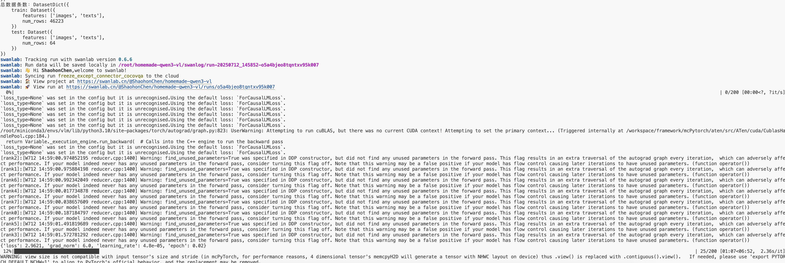  
  <figcaption>SwanLab link appears upon successful training</figcaption>  
  </figure>  
</div>  

Training and test loss graphs:  

<div align="center">  
  <figure>  
  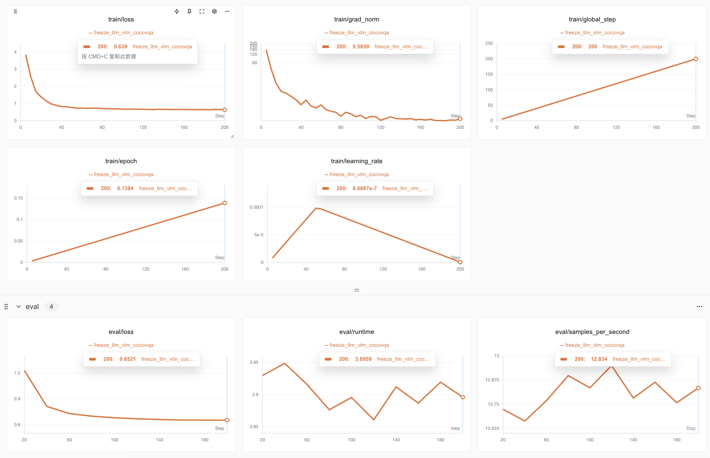  
  <figcaption>SwanLab visualization: Final training/test losses converge at ~0.65</figcaption>  
  </figure>  
</div>  

Post-training, the model is tested with a dog image and the question "What animal is in the picture?" The result:  

<div align="center">  
  <figure>  
  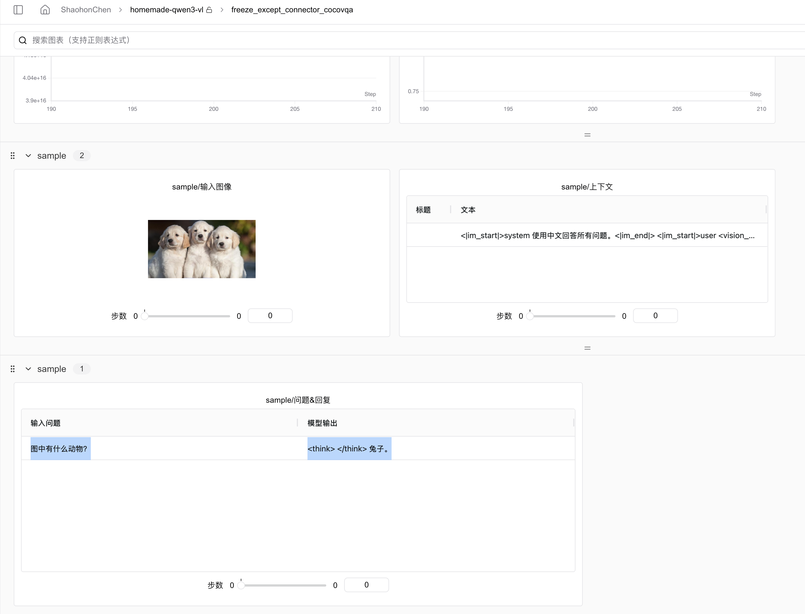  
  <figcaption>SwanLab records inference: The model understands and responds in Chinese but misidentifies dogs as rabbits</figcaption>  
  </figure>  
</div>  

Initially, I thought training had failed, but models that fail typically output gibberish or claim no image is seen. The error stemmed from insufficient training steps. Later, with more steps/data, the model correctly identified three dogs.  

<div align="center">  
  <figure>  
  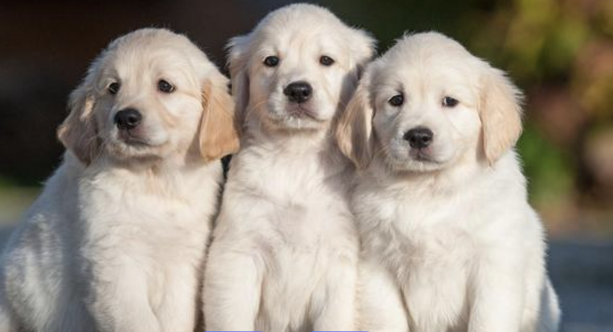  
  <figcaption>Three melancholic dogs—do they resemble rabbits?</figcaption>  
  </figure>  
</div>  

PS: Training logs are public on [SwanLab](https://swanlab.cn/@ShaohonChen/Qwen3-SmVL/overview). Readers can clone my project for comparison.  

### Full Fine-Tuning Results  

Run the following (8 Muxi C500 GPUs, ~1.5h):  

```bash  
# Single GPU  
CUDA_VISIBLE_DEVICES=0 python train.py ./full_train.yaml  
# 8 GPUs  
accelerate --num_process 8 train.py ./full_train.yaml  
```  

Full-data fine-tuning (red) shows more loss fluctuation than small-batch (yellow), likely due to diverse data types:  

<div align="center">  
  <figure>  
  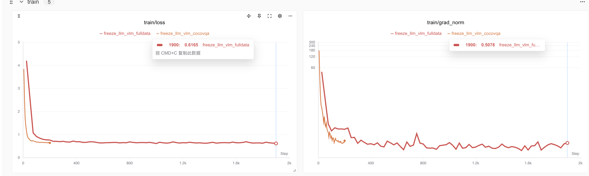  
  <figcaption>Red: Full training loss; Yellow: Small-batch results</figcaption>  
  </figure>  
</div>  

Full training achieved lower training loss (0.61) and evaluation loss (0.58):  

<div align="center">  
  <figure>  
  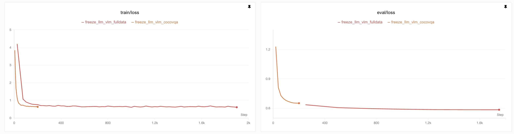  
  <figcaption>Red: Full training; Yellow: Small-batch</figcaption>  
  </figure>  
</div>  

Note: The small test set (64 samples) means the train-test gap isn’t necessarily overfitting. For large models, train loss ≈ test loss if data is sufficient.  

After 1K steps (mid-training, LR decay), loss plateaus, indicating sufficient training:  

<div align="center">  
  <figure>  
  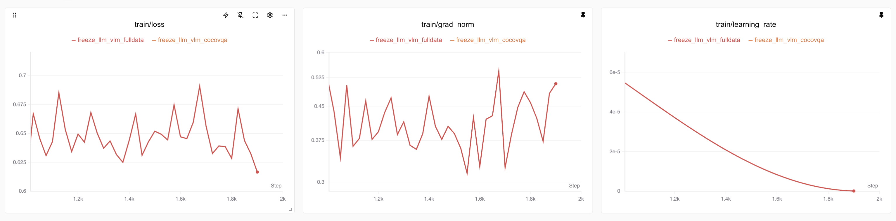  
  <figcaption>Training loss post-1K steps</figcaption>  
  </figure>  
</div>  

GPU utilization isn’t maxed due to multimodal architecture complexity (image/text concatenation):  

<div align="center">  
  <figure>  
  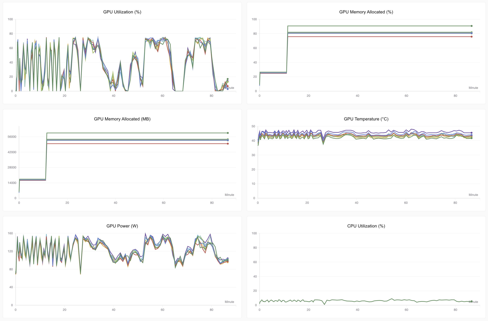  
  <figcaption>SwanLab’s automatic Muxi C500 efficiency tracking</figcaption>  
  </figure>  
</div>  

Post-training, the model correctly understands images, Chinese, and retains Qwen3-0.6B’s original capabilities (function calling, reasoning), gaining visual understanding with just +0.09B parameters!  

<div align="center">  
  <figure>  
    
  <figcaption>Same image/question: More data enables correct responses</figcaption>  
  </figure>  
</div>  

### Model Inference and Analysis  

Testing details will be added after dataset downloads. Follow [SwanLab tutorials](https://docs.swanlab.cn/examples/qwen3_smolvlm_muxi.html) for updates!  

## Code and Dataset Links  

Fine-tuning dataset "the Cauldron":  

* HuggingFace Hub: [https://huggingface.co/datasets/HuggingFaceM4/the_cauldron](https://huggingface.co/datasets/HuggingFaceM4/the_cauldron)  
* ModelScope: [https://modelscope.cn/datasets/AI-ModelScope/the_cauldron](https://modelscope.cn/datasets/AI-ModelScope/the_cauldron)  

Qwen3-0.6B model:  

* HuggingFace Hub: [https://huggingface.co/Qwen/Qwen3-0.6B](https://huggingface.co/Qwen/Qwen3-0.6B)  
* ModelScope: [https://modelscope.cn/Qwen/Qwen3-0.6B](https://modelscope.cn/Qwen/Qwen3-0.6B)  

Full project code:  

* GitHub: [https://github.com/ShaohonChen/Qwen3-SmVL](https://github.com/ShaohonChen/Qwen3-SmVL)  

SwanLab logs:  

* [https://swanlab.cn/@ShaohonChen/Qwen3-SmVL/overview](https://swanlab.cn/@ShaohonChen/Qwen3-SmVL/overview)  

## References  

* HuggingFace SmolVLM2 technical report: [https://arxiv.org/pdf/2504.05299](https://arxiv.org/pdf/2504.05299)