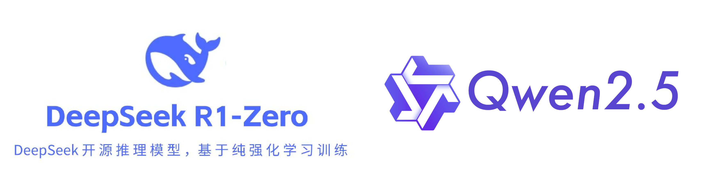

# Qwen2.5 Reproduction of DeepSeek-R1-ZERO

[](https://swanlab.cn/@LiXinYu/Try_r1/overview)

## Introduction  
This document aims to reproduce the deepseek-r1-zero experiment, briefly introducing the entire process from the principles of R1 to code implementation and result observation. The experiment process is monitored using SwanLab to ensure precise tracking and debugging at each stage. Through this series of experimental steps, one can master the implementation method of GRPO.



---

## Reference Materials  

This experiment references the excellent open-source project [philschmid/deep-learning-pytorch-huggingface](https://github.com/philschmid/deep-learning-pytorch-huggingface/blob/main/training/mini-deepseek-r1-aha-grpo.ipynb), authored by Google DeepMind engineer Philipp Schmid. The idea of using Countdown for R1 training originated from this project.

> Model Address: Qwen2.5-3B-Instruct: [HuggingFace Community](https://huggingface.co/Qwen/Qwen2.5-3B-Instruct) | [ModelScope Community](https://modelscope.cn/models/Qwen/Qwen2.5-3B-Instruct)  
>  
> Dataset Address: Countdown-Tasks-3to4: [HuggingFace](https://huggingface.co/datasets/Jiayi-Pan/Countdown-Tasks-3to4) | [ModelScope](https://modelscope.cn/datasets/zouxuhong/Countdown-Tasks-3to4)  
>  
> Visualization Tool SwanLab Project Address: [SwanLab Result Visualization](https://swanlab.cn/@LiXinYu/Try_r1/overview)  

---

## DeepSeek-R1 Principles  

**Paper Title:** DeepSeek-R1: Incentivizing Reasoning Capability in LLMs via Reinforcement Learning  

**Paper Link:** [Paper Link](https://arxiv.org/pdf/2501.12948?)  

**Code Address:** [GitHub Link](https://github.com/deepseek-ai/DeepSeek-R1)  

**Below is the flowchart representation from DeepSeek-V3 to DeepSeek-R1 in the paper.**  

This tutorial only considers the reproduction process from DeepSeek-V3 → DeepSeek-R1-Zero, implemented based on the Qwen2.5-3B-Instruct model.  

  

**GRPO Principles:**  

`Group Relative Policy Optimization (GRPO)` is a reinforcement learning (RL) algorithm specifically designed to enhance reasoning capabilities in large language models (LLMs). Unlike traditional RL methods that heavily rely on external evaluation models (value functions) to guide learning, GRPO optimizes the model by evaluating groups of responses relative to each other. This approach improves training efficiency, making GRPO an ideal choice for reasoning tasks requiring complex problem-solving and long-chain thinking.  

> The essence of GRPO: By generating multiple responses to the same question and performing "relative comparisons" among them, it replaces the "value model" in traditional PPO.  

`Traditional reinforcement learning algorithms (such as Proximal Policy Optimization, PPO)` face significant challenges when applied to reasoning tasks in LLMs:  

1. **Dependence on critic models:**  
   PPO requires an independent critic model to evaluate the value of each response, doubling memory and computational requirements.  
   Training critic models is highly complex and error-prone, especially for tasks requiring subjective or nuanced evaluations.  

2. **High computational costs:**  
   RL workflows typically require substantial computational resources to iteratively evaluate and optimize responses.  
   Scaling these methods to larger LLMs further exacerbates costs.  

3. **Scalability issues:**  
   Absolute reward evaluation struggles with diverse tasks, making generalization across reasoning domains difficult.  

---  
`How GRPO addresses these challenges:`  

1. **Critic-free optimization:**  
   GRPO eliminates the need for critic models by comparing responses within groups, significantly reducing computational overhead.  

2. **Relative evaluation:**  
   Instead of relying on external evaluators, GRPO leverages group dynamics to assess the relative performance of each response within the same batch.  

3. **Efficient training:**  
   By focusing on group advantages, GRPO simplifies the reward estimation process, making training faster and more scalable for large models.  

The figure below compares PPO and GRPO. GRPO abandons the value model and estimates from group scores, significantly reducing training resources.  

  

> One author likened GRPO to a teacher guiding students in a classroom. The teacher asks a group of students to solve a problem together.  
> Instead of grading each student individually, the teacher encourages students to compare their answers within the group. Better-performing students receive encouragement, while others learn from mistakes. Over time, the entire group improves, becoming more accurate and consistent. GRPO applies this principle to training AI models, enabling efficient learning.  

---

## Experimental Code  

### 1. Environment Setup  

> Environment settings:  
> 
> ```bash
> pip install transformers==4.48.1  
> pip install peft==0.14.0  
> conda install pytorch==2.4.0 torchvision==0.19.0 torchaudio==2.4.0 -c pytorch  
> pip install datasets  
> pip install accelerate  
> pip install trl  
> pip install -U swanlab  
> pip install deepspeed  
> ```

### 2. Data Preprocessing  

This experiment uses a [Countdown dataset](https://huggingface.co/datasets/Jiayi-Pan/Countdown-Tasks-3to4) with 490K entries. The dataset contains two fields: `target` (result data) and `nums` (combination data). The goal is to train the model to think about how to derive `target` from `nums` using `+`, `-`, `*`, and `/`.  

To better activate the model's reasoning ability, we set a prompt template to ensure the model responds in the following format:  

```text
<think>:  
Let’s think about this step by step...  
</think>  

<answer>  
...  
</answer>  
```  

Additionally, since each model has its own training format template (e.g., Qwen's template is in `tokenizer_config.json` in its weight files), we use `tokenizer.apply_chat_template` to format the data correctly.  

```python
### Mimic R1's prompt format to process the dataset, ensuring GRPO data includes reasoning steps.
def generate_r1_prompt(question: str, target: str):
    """
    Activate Qwen's reasoning process.
    :param question: Dataset question for Qwen to think about.
    :param target: Dataset answer.
    :return: Formatted prompt.
    """
    r1_prefix = [
        {
            "role": "user",
            "content": f"Now there's a math problem: {question}, and the answer is {target}. You need to think about the reasoning process to arrive at the correct answer. Show your reasoning steps between <think> and </think> tags, and provide the final answer between <answer> and </answer> tags, e.g., <answer>19</answer>. Start step-by-step thinking after the <think> tag."
        },
        {
            "role": "assistant",
            "content": "Let's solve this step by step.\n<think>"
        }
    ]
    # `apply_chat_template` applies Qwen's chat_template from tokenizer_config.json.
    return {
        "prompt": tokenizer.apply_chat_template(r1_prefix, tokenize=False, continue_final_message=True),
        "question": question,
        "target": target
    }

### Convert the dataset to R1 Countdown prompt format.
def train_dataset_process(train_data_path: str):
    dataset = read_jsonl_to_dataset(train_data_path)
    dataset = dataset.map(lambda x: generate_r1_prompt(x["sni_text"], x["ans"]))

    train_test_split = dataset.train_test_split(test_size=0.1)
    train_dataset = train_test_split["train"]
    test_dataset = train_test_split["test"]

    return {
        "train_dataset": train_dataset,
        "test_dataset": test_dataset
    }
```

> **❗Note:** `generate_r1_prompt` must return a dictionary containing the question and answer. The `map` method will populate the actual `question` and `answer` into the prompt.

### 3. Reward Function Setup  

In reinforcement learning, the reward function is the core signal guiding the agent's behavior. It provides immediate feedback to evaluate actions and influences future decisions.  

This experiment only sets reward functions for output format (`format`) and final answer (`answer`), continuously correcting format and answer outputs.  

**Format Reward Function**  

```python
### Format reward function: Checks if the output matches `<think>...</think><answer>...</answer>`.
def format_reward_func(completions, **kwargs):
    rewards = []
    for completion in completions:
        try:
            completion = "<think>" + completion
            if random.random() < 0.1:  # Log 1% of outputs for debugging.
                os.makedirs("completion_samples", exist_ok=True)
                with open("completion_samples/completion_samples.txt", "a") as f:
                    f.write(f"\n\n==============\n{completion}")

            regex = r"^<think>([^<]*(?:<(?!/?think>)[^<]*)*)<\/think>\n<answer>([\s\S]*?)<\/answer>$"
            match = re.search(regex, completion, re.DOTALL)
            rewards.append(1.0 if match and len(match.groups()) == 2 else 0.0)
        except Exception:
            rewards.append(0.0)
    return rewards
```

**Answer Reward Function**  

```python
### Answer reward function: Checks if the equation is correct and uses numbers properly.
def equation_reward_func(completions, target, nums, **kwargs):
    rewards = []
    for completion, gt, numbers in zip(completions, target, nums):
        try:
            completion = "<think>" + completion
            match = re.search(r"<answer>(.*?)<\/answer>", completion)
            if not match:
                rewards.append(0.0)
                continue

            equation = match.group(1).strip()
            used_numbers = [int(n) for n in re.findall(r"\d+", equation)]

            # Check if numbers are used exactly once.
            if sorted(used_numbers) != sorted(numbers):
                rewards.append(0.0)
                continue

            # Allow only digits, operators, parentheses, and whitespace.
            allowed_pattern = r"^[\d+\-*/().\s]+$"
            if not re.match(allowed_pattern, equation):
                rewards.append(0.0)
                continue

            # Evaluate the equation.
            result = eval(equation, {"__builtins__": None}, {})
            if abs(float(result) - float(gt)) < 1e-5:
                rewards.append(1.0)
                if random.random() < 0.10:  # Log 10% of successful outputs.
                    os.makedirs("completion_samples", exist_ok=True)
                    with open("completion_samples/success_samples.txt", "a") as f:
                        f.write(f"\n\n==============\n{completion}")
            else:
                rewards.append(0.0)
        except Exception:
            rewards.append(0.0)
    return rewards
```

> **Additional Notes:** You can also set reward functions for reasoning length and linguistic consistency to improve model performance.

### 4. Model Parameter Setup  

```python
# Model configuration.
model_config = ModelConfig(
    model_name_or_path=model_path,
    torch_dtype="bfloat16",
    # attn_implementation="flash_attention_2",  # Optional: Optimizes memory and speed.
    use_peft=True,
    load_in_4bit=True
)
```

`attn_implementation`: Using `flash_attention_2` optimizes memory usage and speeds up computation, especially for large models. If enabled, it reduces memory consumption and accelerates training, particularly on multi-GPU setups. If disabled, performance and memory efficiency may suffer.

### 5. Training Parameter Setup  

```python
# Training arguments.
training_args = GRPOConfig(
    output_dir="/root/test/outputs",
    learning_rate=5e-7,
    lr_scheduler_type="cosine",
    logging_steps=2,
    max_steps=200,
    per_device_train_batch_size=1,
    gradient_checkpointing=False,
    gradient_accumulation_steps=8,
    gradient_checkpointing_kwargs={"use_reentrant": False},
    bf16=True,
    save_steps=50,
    # GRPO-specific parameters.
    max_prompt_length=256,
    max_completion_length=1024,
    num_generations=2,
    beta=0.001,
    # vLLM acceleration (disabled for this experiment).
    use_vllm=False,
    vllm_device="cuda:1",
    vllm_gpu_memory_utilization=0.8
)
```

`vLLM` is a library for accelerating inference, optimizing memory usage and computational performance on GPUs. Enabling `use_vllm=True` can speed up computation during inference through efficient memory management and multi-device parallelism, especially for large language models. It also allows specifying acceleration devices via `vllm_device` (e.g., `cuda:1`).  

⚠️**Note:**  
> We use the `trl` library for GRPO, which currently has a minor bug: `gradient_checkpointing` and `vllm` must both be `True` or `False`. Otherwise, an error occurs. Both parameters reduce memory usage and improve training/inference speed, so their settings can be adjusted by practitioners.

### 6. Visualization Tool Setup  

```python
# SwanLab configuration.
swanlab_callback = SwanLabCallback(
    workspace=None,  # Project is private.
    project="DeepSeek-R1-zero",
    experiment_name="4090-grpo",
)
```

### 7. Train and Save the Model  

```python
# Trainer configuration.
trainer = GRPOTrainer(
    model=model_config.model_name_or_path,
    reward_funcs=[format_reward_func, answer_reward_func],
    args=training_args,
    train_dataset=train_dataset,
    eval_dataset=test_dataset,
    peft_config=get_peft_config(model_config),
    callbacks=[swanlab_callback]
)

trainer.train()
trainer.save_model(training_args.output_dir)
```

### Full Process Code  

To manage distributed training environments, RL hyperparameters, and the main training function systematically, we recommend using YAML configuration files and Python scripts.  

**Project Structure:**  
```
root/project/  
├── data/  
│   └── zouxuhong___countdown-tasks-3to4  
├── models/  
│   ├── Qwen  
│   │   └── Qwen2___5-3B-Instruct  
├── config/  
│   ├── 2rtx4090.yaml  
│   └── grpo-qwen-2.5-3b-deepseek-r1-zero-countdown.yaml  
├── train_r1_grpo.py  
└── train_r1_grpo.sh  
```

**1. Accelerate Configuration (for distributed training on 2 GPUs)**  
Create `deepspeed_zero3.yaml`:  

```yaml
compute_environment: LOCAL_MACHINE  
debug: false  
deepspeed_config:  
  gradient_accumulation_steps: 8  
  gradient_clipping: 1.0  
  offload_optimizer_device: cpu  # Offload optimizer to CPU to save GPU memory.  
  offload_param_device: cpu      # Offload model params to CPU.  
  zero3_init_flag: false  
  zero3_save_16bit_model: true  
  zero_stage: 3  
distributed_type: DEEPSPEED  
downcast_bf16: 'no'  
machine_rank: 0  
main_training_function: main  
mixed_precision: bf16  
num_machines: 1  
num_processes: 2  
```

⚠️**Note:**  
Since this experiment has limited resources, we offload the optimizer and model parameters to the CPU to reduce GPU memory pressure.  

**2. Training Hyperparameters**  
Create `grpo-qwen-2.5-3b-deepseek-r1-zero-countdown.yaml`:  

```yaml
# Model arguments  
model_name_or_path: /root/epfs/ascend_r1_turtorial/models/Qwen/Qwen2___5-3B-Instruct  
model_revision: main  
torch_dtype: bfloat16  
bf16: true  
output_dir: /root/epfs/ascend_r1_turtorial/output  

# Dataset arguments  
dataset_id_or_path: /root/epfs/zouxuhong___countdown-tasks-3to4  

# Training arguments  
max_steps: 450  
per_device_train_batch_size: 1  
gradient_accumulation_steps: 8  
gradient_checkpointing: false  
learning_rate: 5.0e-7  
lr_scheduler_type: cosine  
warmup_ratio: 0.03  

# GRPO-specific parameters  
beta: 0.001  
max_prompt_length: 256  
max_completion_length: 1024  
num_generations: 2  
use_vllm: false  
vllm_device: "cuda:1"  
vllm_gpu_memory_utilization: 0.8  

# Logging arguments  
logging_steps: 1  
save_steps: 100  
seed: 2025  

# SwanLab logging  
swanlab: true  
project: Try_r1  
experiment_name: qingyun-4090-jupyter  
```

**3. Training Script (`train_r1_grpo.py`)**  
See the full code in the original document.  

**4. Distributed Training Script (`train_r1_grpo.sh`)**  

```bash
accelerate launch \
    --num_processes 2 \
    --config_file config/2rtx4090.yaml \
    train_r1_grpo.py \
    --config config/grpo-qwen-2.5-3b-deepseek-r1-zero-countdown.yaml
```

**5. Start Training**  

```bash
bash train_r1_grpo.sh
```

## Model Deployment and Inference  

The saved model contains only weights and configurations. To use it, merge it with the base model:  

```python
from peft import PeftModel  
from transformers import AutoModelForCausalLM, AutoTokenizer  
import torch  
import os  
import shutil  

def copy_files_not_in_B(A_path, B_path):  
    """Copy files from A to B if they don't exist in B"""  
    if not os.path.exists(A_path):  
        raise FileNotFoundError(f"Directory {A_path} not found")  
    if not os.path.exists(B_path):  
        os.makedirs(B_path)  

    files_in_A = set(f for f in os.listdir(A_path) if not (".bin" in f or "safetensors" in f))  
    files_in_B = set(os.listdir(B_path))  
    files_to_copy = files_in_A - files_in_B  

    for file in files_to_copy:  
        src = os.path.join(A_path, file)  
        dst = os.path.join(B_path, file)  
        if os.path.isdir(src):  
            shutil.copytree(src, dst)  
        else:  
            shutil.copy2(src, dst)  

def merge_lora_to_base_model(adapter_path, save_path, base_model="Qwen/Qwen2-0.5B"):  
    """Merge LoRA adapter with base model"""  
    if not os.path.exists(save_path):  
        os.makedirs(save_path)  

    tokenizer = AutoTokenizer.from_pretrained(base_model, trust_remote_code=True)  
    model = AutoModelForCausalLM.from_pretrained(  
        base_model,  
        trust_remote_code=True,  
        low_cpu_mem_usage=True,  
        torch_dtype=torch.float16,  
        device_map="auto"  
    )  

    # Load adapter  
    model = PeftModel.from_pretrained(model, adapter_path, device_map="auto", trust_remote_code=True)  
    merged_model = model.merge_and_unload()  

    # Save merged model  
    tokenizer.save_pretrained(save_path)  
    merged_model.save_pretrained(save_path, safe_serialization=False)  
    copy_files_not_in_B(base_model, save_path)  
    print(f"Merged model saved to: {save_path}")  

if __name__ == '__main__':  
    merge_lora_to_base_model(  
        adapter_path="your_adapter_folder",  
        save_path="output/merged_model"  
    )
```

### Inference with Merged Model

```python
from transformers import AutoModelForCausalLM, AutoTokenizer  

MODEL_PATH = "output/merged_model"  
PROMPT = """Use numbers [80, 9, 18] to create equation = 53.  
You may use +,-,*,/ but each number only once.  
Show reasoning in <think></think> and final answer in <answer></answer>.  
Let's solve step by step.\n<think>"""  

model = AutoModelForCausalLM.from_pretrained(MODEL_PATH, torch_dtype="auto", device_map="auto")  
tokenizer = AutoTokenizer.from_pretrained(MODEL_PATH)  

messages = [  
    {"role": "system", "content": "You are a helpful assistant."},  
    {"role": "user", "content": PROMPT}  
]  

text = tokenizer.apply_chat_template(messages, tokenize=False, add_generation_prompt=True)  
inputs = tokenizer([text], return_tensors="pt").to(model.device)  

outputs = model.generate(  
    inputs.input_ids,  
    max_new_tokens=512,  
    top_p=0.95,  
    temperature=0.7  
)  

response = tokenizer.decode(outputs[0][len(inputs.input_ids[0]):], skip_special_tokens=True)  
print(response)
```

## Experimental Results

Due to long training times, we recommend using `tmux` to maintain sessions. Training progress can be monitored on [SwanLab](https://swanlab.cn/@LiXinYu/Try_r1/runs/iunfsosyp8ryfanbjcv7g/chart):


---

## References

• [philschmid/deep-learning-pytorch-huggingface](https://github.com/philschmid/deep-learning-pytorch-huggingface)  
• [TinyZero](https://github.com/Jiayi-Pan/TinyZero)  
• [unlock-deepseek](https://github.com/datawhalechina/unlock-deepseek)  
• [DeepSeek-R1 Paper](https://arxiv.org/pdf/2501.12948)  
• [DeepSeek-R1 GitHub](https://github.com/deepseek-ai/DeepSeek-R1)  
• [GRPO Paper](https://arxiv.org/pdf/2402.03300)  
• [HuggingFace Open-R1](https://github.com/huggingface/open-r1)  

This concludes the complete English translation of the document. The translation maintains all technical details while improving readability for an international audience.