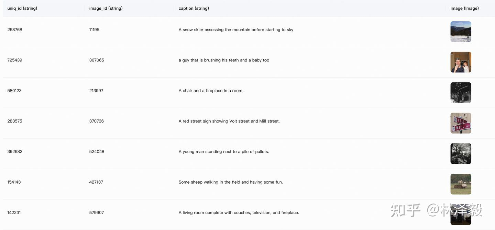
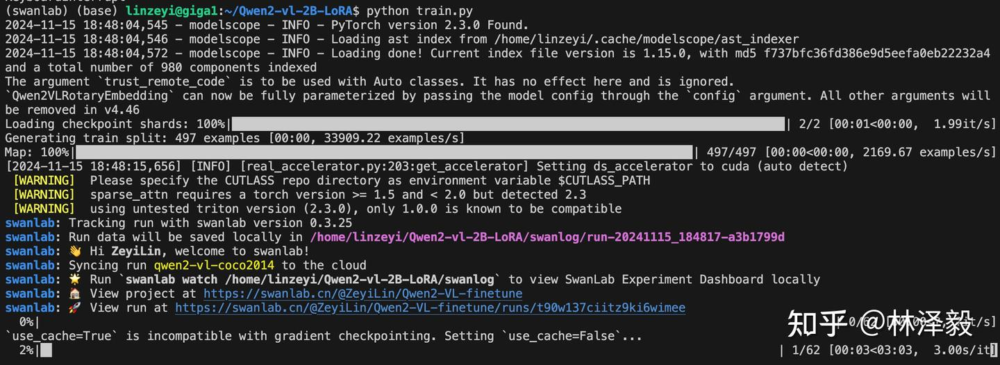
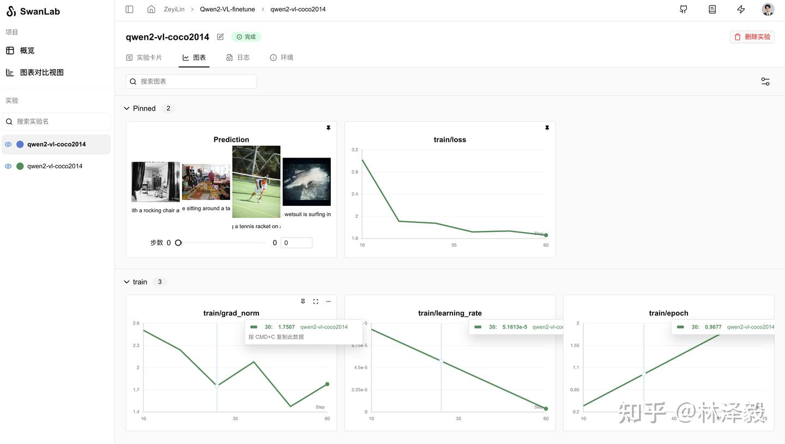
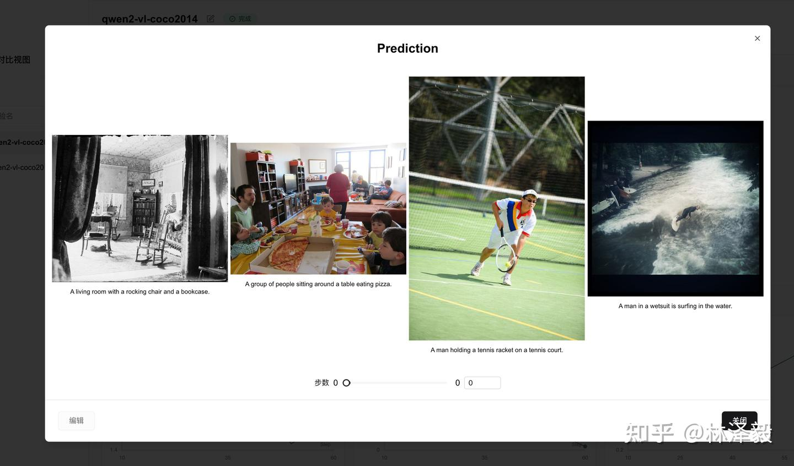
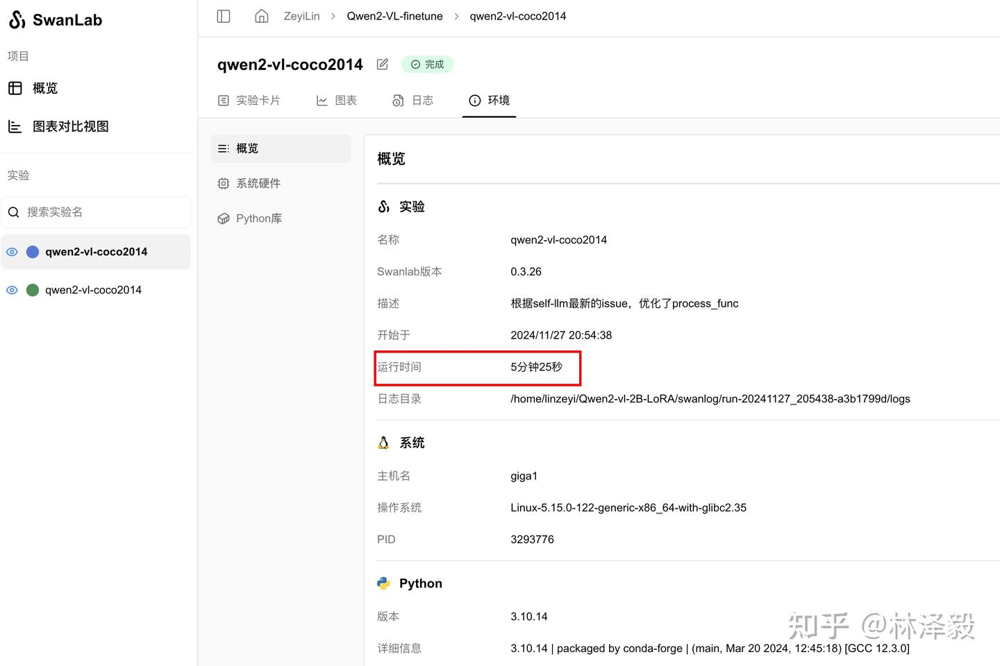
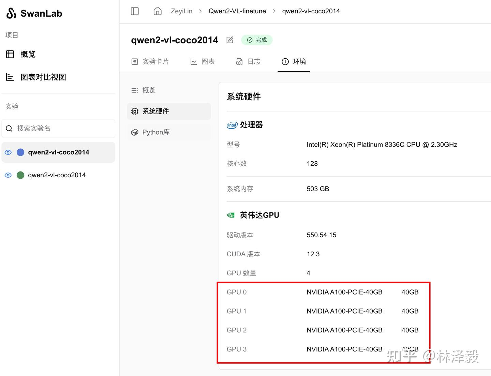

# Qwen2-VL Multimodal Large Model Fine-Tuning Practice

:::info
Multimodal, Large Language Model, Model Fine-Tuning
:::

[](https://swanlab.cn/@ZeyiLin/Qwen2-VL-finetune/runs/pkgest5xhdn3ukpdy6kv5/chart)

[Training Process](https://swanlab.cn/@ZeyiLin/Qwen2-VL-finetune/runs/pkgest5xhdn3ukpdy6kv5/chart) | [Zhihu Tutorial](https://zhuanlan.zhihu.com/p/7144893529)

Qwen2-VL is a multimodal large model developed by Alibaba's Tongyi Lab. This article briefly introduces how to fine-tune the Qwen2-VL-2B-Instruct model on the COCO2014 image caption dataset using frameworks such as `transformers` and `peft`, while monitoring the training process and evaluating the model's performance with SwanLab.


LoRA is an efficient fine-tuning method. For a deeper understanding of its principles, refer to the blog: [Zhihu | An In-Depth Explanation of LoRA](https://zhuanlan.zhihu.com/p/650197598).

• Training Process: [Qwen2-VL-finetune](https://swanlab.cn/@ZeyiLin/Qwen2-VL-finetune/runs/pkgest5xhdn3ukpdy6kv5/chart)
• Github: [Code Repository](https://github.com/Zeyi-Lin/LLM-Finetune/tree/main/qwen2_vl), [self-llm](https://github.com/datawhalechina/self-llm)
• Dataset: [coco_2014_caption](https://modelscope.cn/datasets/modelscope/coco_2014_caption/summary)
• Model: [Qwen2-VL-2B-Instruct](https://modelscope.cn/models/Qwen/Qwen2-VL-2B-Instruct)

OCR Fine-Tuning Version: [Qwen2-VL-Latex-OCR](https://zhuanlan.zhihu.com/p/10705293665)

---

## 1. Environment Setup

Environment setup involves three steps:

1. Ensure your computer has at least one NVIDIA GPU and that the CUDA environment is installed.
2. Install Python (version >= 3.8) and PyTorch with CUDA acceleration support.
3. Install third-party libraries required for Qwen2-VL fine-tuning using the following commands:

```bash
python -m pip install --upgrade pip
# Change the pypi source to speed up library installation
pip config set global.index-url https://pypi.tuna.tsinghua.edu.cn/simple

pip install modelscope==1.18.0
pip install transformers==4.46.2
pip install sentencepiece==0.2.0
pip install accelerate==1.1.1
pip install datasets==2.18.0
pip install peft==0.13.2
pip install swanlab==0.3.25
pip install qwen-vl-utils==0.0.8
```

## 2. Dataset Preparation

This section uses the [coco_2014_caption](https://modelscope.cn/datasets/modelscope/coco_2014_caption/summary) dataset (500 images), which is primarily used for multimodal (Image-to-Text) tasks.

> Dataset Introduction: The COCO 2014 Caption dataset is part of the Microsoft Common Objects in Context (COCO) dataset, mainly used for image captioning tasks. It contains approximately 400,000 images, each with at least one manually generated English caption. These captions aim to help computers understand image content and provide training data for automatic image caption generation.



In this task, we use the first 500 images from the dataset, process and format them, and aim to combine them into a JSON file in the following format:

```json
[
{
    "id": "identity_1",
    "conversations": [
      {
        "from": "user",
        "value": "COCO Yes: <|vision_start|>image_file_path<|vision_end|>"
      },
      {
        "from": "assistant",
        "value": "A snow skier assessing the mountain before starting to ski"
      }
    ]
},
...
]
```

Here, "from" represents the role (`user` for human, `assistant` for the model), and "value" is the chat content. The markers `<|vision_start|>` and `<|vision_end|>` are used by the Qwen2-VL model to identify images, and the image file path or URL can be placed between them.

**Dataset Download and Processing Steps**

1. **We need to do four things:**
    ◦ Download the coco_2014_caption dataset via Modelscope.
    ◦ Load the dataset and save the images locally.
    ◦ Convert the image paths and captions into a CSV file.
    ◦ Convert the CSV file into a JSON file.

2. **Use the following code to complete the process from data download to CSV generation:**

data2csv.py:

```python
# Import required libraries
from modelscope.msdatasets import MsDataset
import os
import pandas as pd

MAX_DATA_NUMBER = 500

# Check if the directory already exists
if not os.path.exists('coco_2014_caption'):
    # Download the COCO 2014 image caption dataset from Modelscope
    ds = MsDataset.load('modelscope/coco_2014_caption', subset_name='coco_2014_caption', split='train')
    print(len(ds))
    # Set the maximum number of images to process
    total = min(MAX_DATA_NUMBER, len(ds))

    # Create a directory to save the images
    os.makedirs('coco_2014_caption', exist_ok=True)

    # Initialize lists to store image paths and captions
    image_paths = []
    captions = []

    for i in range(total):
        # Get information for each sample
        item = ds[i]
        image_id = item['image_id']
        caption = item['caption']
        image = item['image']
        
        # Save the image and record the path
        image_path = os.path.abspath(f'coco_2014_caption/{image_id}.jpg')
        image.save(image_path)
        
        # Add the path and caption to the lists
        image_paths.append(image_path)
        captions.append(caption)
        
        # Print progress every 50 images
        if (i + 1) % 50 == 0:
            print(f'Processing {i+1}/{total} images ({(i+1)/total*100:.1f}%)')

    # Save the image paths and captions as a CSV file
    df = pd.DataFrame({
        'image_path': image_paths,
        'caption': captions
    })
    
    # Save the data as a CSV file
    df.to_csv('./coco-2024-dataset.csv', index=False)
    
    print(f'Data processing completed, {total} images processed')

else:
    print('coco_2014_caption directory already exists, skipping data processing')
```

**3. In the same directory, use the following code to convert the CSV file into a JSON file:**

csv2json.py:

```python
import pandas as pd
import json

# Load the CSV file
df = pd.read_csv('./coco-2024-dataset.csv')
conversations = []

# Add conversation data
for i in range(len(df)):
    conversations.append({
        "id": f"identity_{i+1}",
        "conversations": [
            {
                "from": "user",
                "value": f"COCO Yes: <|vision_start|>{df.iloc[i]['image_path']}<|vision_end|>"
            },
            {
                "from": "assistant", 
                "value": df.iloc[i]['caption']
            }
        ]
    })

# Save as JSON
with open('data_vl.json', 'w', encoding='utf-8') as f:
    json.dump(conversations, f, ensure_ascii=False, indent=2)
```

At this point, two files will be added to the directory:
• coco-2024-dataset.csv
• data_vl.json

With this, the dataset preparation is complete.

## 3. Model Download and Loading

Here, we use Modelscope to download the Qwen2-VL-2B-Instruct model and load it into Transformers for training:

```python
from modelscope import snapshot_download, AutoTokenizer
from transformers import TrainingArguments, Trainer, DataCollatorForSeq2Seq, Qwen2VLForConditionalGeneration, AutoProcessor
import torch

# Download the Qwen2-VL model from Modelscope to a local directory
model_dir = snapshot_download("Qwen/Qwen2-VL-2B-Instruct", cache_dir="./", revision="master")

# Load the model weights using Transformers
tokenizer = AutoTokenizer.from_pretrained("./Qwen/Qwen2-VL-2B-Instruct/", use_fast=False, trust_remote_code=True)
# Specifically, the Qwen2-VL-2B-Instruct model needs to be loaded using Qwen2VLForConditionalGeneration
model = Qwen2VLForConditionalGeneration.from_pretrained("./Qwen/Qwen2-VL-2B-Instruct/", device_map="auto", torch_dtype=torch.bfloat16, trust_remote_code=True,)
model.enable_input_require_grads()  # Execute this method when gradient checkpointing is enabled
```

The model size is 4.5GB, and downloading it takes approximately 5 minutes.

## 4. Integrating SwanLab

[SwanLab](https://github.com/swanhubx/swanlab) is an open-source model training recording tool. SwanLab provides AI researchers with training visualization, automatic logging, hyperparameter recording, experiment comparison, and multi-user collaboration features. Researchers can use SwanLab's intuitive visual charts to identify training issues, compare multiple experiments for research inspiration, and break communication barriers through online link sharing and organizational collaboration.

SwanLab is already integrated with Transformers. To use it, add a `SwanLabCallback` instance to the `callbacks` parameter of the `Trainer` to automatically record hyperparameters and training metrics. Simplified code is as follows:

```python
from swanlab.integration.transformers import SwanLabCallback
from transformers import Trainer

swanlab_callback = SwanLabCallback()

trainer = Trainer(
    ...
    callbacks=[swanlab_callback],
)
```

First-time users of SwanLab need to register an account on the [official website](https://swanlab.cn), copy their API Key from the user settings page, and paste it when prompted to log in during training. Subsequent logins are not required.


For more usage, refer to the [Quick Start](https://docs.swanlab.cn/zh/guide_cloud/general/quick-start.html) and [Transformers Integration](https://docs.swanlab.cn/zh/guide_cloud/integration/integration-huggingface-transformers.html).

## 5. Starting Fine-Tuning

View the visualized training process: <a href="https://swanlab.cn/@ZeyiLin/Qwen2-VL-finetune/runs/53vm3y7sp5h5fzlmlc5up/chart" target="_blank">Qwen2-VL-finetune</a>

**This section does the following:**
1. Download and load the Qwen2-VL-2B-Instruct model.
2. Load the dataset, using the first 496 entries for training and 4 entries for subjective evaluation.
3. Configure LoRA with parameters: `r=64`, `lora_alpha=16`, `lora_dropout=0.05`.
4. Use SwanLab to record the training process, including hyperparameters, metrics, and final model outputs.
5. Train for 2 epochs.

The directory structure when starting the code should be:
```
|———— train.py
|———— coco_2014_caption
|———— coco-2024-dataset.csv
|———— data_vl.json
|———— data2csv.py
|———— csv2json.py
```

**Complete Code**

train.py:

```python
import torch
from datasets import Dataset
from modelscope import snapshot_download, AutoTokenizer
from swanlab.integration.transformers import SwanLabCallback
from qwen_vl_utils import process_vision_info
from peft import LoraConfig, TaskType, get_peft_model, PeftModel
from transformers import (
    TrainingArguments,
    Trainer,
    DataCollatorForSeq2Seq,
    Qwen2VLForConditionalGeneration,
    AutoProcessor,
)
import swanlab
import json


def process_func(example):
    """
    Preprocess the dataset
    """
    MAX_LENGTH = 8192
    input_ids, attention_mask, labels = [], [], []
    conversation = example["conversations"]
    input_content = conversation[0]["value"]
    output_content = conversation[1]["value"]
    file_path = input_content.split("<|vision_start|>")[1].split("<|vision_end|>")[0]  # Get the image path
    messages = [
        {
            "role": "user",
            "content": [
                {
                    "type": "image",
                    "image": f"{file_path}",
                    "resized_height": 280,
                    "resized_width": 280,
                },
                {"type": "text", "text": "COCO Yes:"},
            ],
        }
    ]
    text = processor.apply_chat_template(
        messages, tokenize=False, add_generation_prompt=True
    )  # Get the text
    image_inputs, video_inputs = process_vision_info(messages)  # Get the data (preprocessed)
    inputs = processor(
        text=[text],
        images=image_inputs,
        videos=video_inputs,
        padding=True,
        return_tensors="pt",
    )
    inputs = {key: value.tolist() for key, value in inputs.items()} #tensor -> list, for easier concatenation
    instruction = inputs

    response = tokenizer(f"{output_content}", add_special_tokens=False)


    input_ids = (
            instruction["input_ids"][0] + response["input_ids"] + [tokenizer.pad_token_id]
    )

    attention_mask = instruction["attention_mask"][0] + response["attention_mask"] + [1]
    labels = (
            [-100] * len(instruction["input_ids"][0])
            ▪ response["input_ids"]
            ▪ [tokenizer.pad_token_id]
    )
    if len(input_ids) > MAX_LENGTH:  # Truncate if necessary
        input_ids = input_ids[:MAX_LENGTH]
        attention_mask = attention_mask[:MAX_LENGTH]
        labels = labels[:MAX_LENGTH]

    input_ids = torch.tensor(input_ids)
    attention_mask = torch.tensor(attention_mask)
    labels = torch.tensor(labels)
    inputs['pixel_values'] = torch.tensor(inputs['pixel_values'])
    inputs['image_grid_thw'] = torch.tensor(inputs['image_grid_thw']).squeeze(0)  # Transform from (1,h,w) to (h,w)
    return {"input_ids": input_ids, "attention_mask": attention_mask, "labels": labels,
            "pixel_values": inputs['pixel_values'], "image_grid_thw": inputs['image_grid_thw']}


def predict(messages, model):
    # Prepare for inference
    text = processor.apply_chat_template(
        messages, tokenize=False, add_generation_prompt=True
    )
    image_inputs, video_inputs = process_vision_info(messages)
    inputs = processor(
        text=[text],
        images=image_inputs,
        videos=video_inputs,
        padding=True,
        return_tensors="pt",
    )
    inputs = inputs.to("cuda")

    # Generate output
    generated_ids = model.generate(**inputs, max_new_tokens=128)
    generated_ids_trimmed = [
        out_ids[len(in_ids) :] for in_ids, out_ids in zip(inputs.input_ids, generated_ids)
    ]
    output_text = processor.batch_decode(
        generated_ids_trimmed, skip_special_tokens=True, clean_up_tokenization_spaces=False
    )
    
    return output_text[0]


# Download the Qwen2-VL model from Modelscope to a local directory
model_dir = snapshot_download("Qwen/Qwen2-VL-2B-Instruct", cache_dir="./", revision="master")

# Load the model weights using Transformers
tokenizer = AutoTokenizer.from_pretrained("./Qwen/Qwen2-VL-2B-Instruct/", use_fast=False, trust_remote_code=True)
processor = AutoProcessor.from_pretrained("./Qwen/Qwen2-VL-2B-Instruct")

model = Qwen2VLForConditionalGeneration.from_pretrained("./Qwen/Qwen2-VL-2B-Instruct/", device_map="auto", torch_dtype=torch.bfloat16, trust_remote_code=True,)
model.enable_input_require_grads()  # Execute this method when gradient checkpointing is enabled

# Process the dataset: Read the JSON file
# Split into training and test sets, saved as data_vl_train.json and data_vl_test.json
train_json_path = "data_vl.json"
with open(train_json_path, 'r') as f:
    data = json.load(f)
    train_data = data[:-4]
    test_data = data[-4:]

with open("data_vl_train.json", "w") as f:
    json.dump(train_data, f)

with open("data_vl_test.json", "w") as f:
    json.dump(test_data, f)

train_ds = Dataset.from_json("data_vl_train.json")
train_dataset = train_ds.map(process_func)

# Configure LoRA
config = LoraConfig(
    task_type=TaskType.CAUSAL_LM,
    target_modules=["q_proj", "k_proj", "v_proj", "o_proj", "gate_proj", "up_proj", "down_proj"],
    inference_mode=False,  # Training mode
    r=64,  # LoRA rank
    lora_alpha=16,  # LoRA alpha, see LoRA principles for details
    lora_dropout=0.05,  # Dropout rate
    bias="none",
)

# Get the LoRA model
peft_model = get_peft_model(model, config)

# Configure training parameters
args = TrainingArguments(
    output_dir="./output/Qwen2-VL-2B",
    per_device_train_batch_size=4,
    gradient_accumulation_steps=4,
    logging_steps=10,
    logging_first_step=5,
    num_train_epochs=2,
    save_steps=100,
    learning_rate=1e-4,
    save_on_each_node=True,
    gradient_checkpointing=True,
    report_to="none",
)
        
# Set up SwanLab callback
swanlab_callback = SwanLabCallback(
    project="Qwen2-VL-finetune",
    experiment_name="qwen2-vl-coco2014",
    config={
        "model": "https://modelscope.cn/models/Qwen/Qwen2-VL-2B-Instruct",
        "dataset": "https://modelscope.cn/datasets/modelscope/coco_2014_caption/quickstart",
        "github": "https://github.com/datawhalechina/self-llm",
        "prompt": "COCO Yes: ",
        "train_data_number": len(train_data),
        "lora_rank": 64,
        "lora_alpha": 16,
        "lora_dropout": 0.1,
    },
)

# Configure Trainer
trainer = Trainer(
    model=peft_model,
    args=args,
    train_dataset=train_dataset,
    data_collator=DataCollatorForSeq2Seq(tokenizer=tokenizer, padding=True),
    callbacks=[swanlab_callback],
)

# Start model training
trainer.train()

# ====================Test Mode===================
# Configure test parameters
val_config = LoraConfig(
    task_type=TaskType.CAUSAL_LM,
    target_modules=["q_proj", "k_proj", "v_proj", "o_proj", "gate_proj", "up_proj", "down_proj"],
    inference_mode=True,  # Inference mode
    r=64,  # LoRA rank
    lora_alpha=16,  # LoRA alpha, see LoRA principles for details
    lora_dropout=0.05,  # Dropout rate
    bias="none",
)

# Load the fine-tuned model for testing
val_peft_model = PeftModel.from_pretrained(model, model_id="./output/Qwen2-VL-2B/checkpoint-62", config=val_config)

# Load test data
with open("data_vl_test.json", "r") as f:
    test_dataset = json.load(f)

test_image_list = []
for item in test_dataset:
    input_image_prompt = item["conversations"][0]["value"]
    # Remove <|vision_start|> and <|vision_end|>
    origin_image_path = input_image_prompt.split("<|vision_start|>")[1].split("<|vision_end|>")[0]
    
    messages = [{
        "role": "user", 
        "content": [
            {
            "type": "image", 
            "image": origin_image_path
            },
            {
            "type": "text",
            "text": "COCO Yes:"
            }
        ]}]
    
    response = predict(messages, val_peft_model)
    messages.append({"role": "assistant", "content": f"{response}"})
    print(messages[-1])

    test_image_list.append(swanlab.Image(origin_image_path, caption=response))

swanlab.log({"Prediction": test_image_list})

# Stop SwanLab recording when running in Jupyter Notebook
swanlab.finish()
```

When you see the following progress bar, it means training has started:



## 6. Training Results Demonstration

View the detailed training process here: [qwen2-vl-coco2014](https://swanlab.cn/@ZeyiLin/Qwen2-VL-finetune/runs/pkgest5xhdn3ukpdy6kv5/chart)



From the SwanLab charts, we can see that the learning rate (`lr`) decreases linearly, the loss decreases with each epoch, and the gradient norm (`grad_norm`) increases. This pattern often indicates a risk of overfitting, so training should not exceed 2 epochs.

The `Prediction` chart records the model's final output results, showing that the model adopts the short English caption style of the COCO dataset:



For comparison, here are the outputs from the non-fine-tuned model:

```
1-No Fine-Tuning: The image depicts a cozy living room with a rocking chair in the center, a bookshelf filled with books, and a table with a vase and a few other items. The walls are decorated with wallpaper, and there are curtains on the windows. The room appears to be well-lit, with sunlight streaming in from the windows.
1-Fine-Tuned: A living room with a rocking chair, a bookshelf, and a table with a vase and a bowl.

2-No Fine-Tuning: It looks like a family gathering or a party in a living room. There are several people sitting around a dining table, eating pizza. The room has a cozy and warm atmosphere.
2-Fine-Tuned: A group of people sitting around a dining table eating pizza.
```

The change in style after fine-tuning is evident.

## 7. Inference with the Fine-Tuned LoRA Model

Load the fine-tuned LoRA model and perform inference:

```python
from transformers import Qwen2VLForConditionalGeneration, AutoProcessor
from qwen_vl_utils import process_vision_info
from peft import PeftModel, LoraConfig, TaskType

config = LoraConfig(
    task_type=TaskType.CAUSAL_LM,
    target_modules=["q_proj", "k_proj", "v_proj", "o_proj", "gate_proj", "up_proj", "down_proj"],
    inference_mode=True,
    r=64,  # LoRA rank
    lora_alpha=16,  # LoRA alpha, see LoRA principles for details
    lora_dropout=0.05,  # Dropout rate
    bias="none",
)

# Load the base model
model = Qwen2VLForConditionalGeneration.from_pretrained(
    "./Qwen/Qwen2-VL-2B-Instruct", torch_dtype="auto", device_map="auto"
)
# Load the fine-tuned LoRA model
model = PeftModel.from_pretrained(model, model_id="./output/Qwen2-VL-2B/checkpoint-62", config=config)
processor = AutoProcessor.from_pretrained("./Qwen/Qwen2-VL-2B-Instruct")

messages = [
    {
        "role": "user",
        "content": [
            {
                "type": "image",
                "image": "test_image_path",
            },
            {"type": "text", "text": "COCO Yes:"},
        ],
    }
]

# Prepare for inference
text = processor.apply_chat_template(
    messages, tokenize=False, add_generation_prompt=True
)
image_inputs, video_inputs = process_vision_info(messages)
inputs = processor(
    text=[text],
    images=image_inputs,
    videos=video_inputs,
    padding=True,
    return_tensors="pt",
)
inputs = inputs.to("cuda")

# Generate output
generated_ids = model.generate(**inputs, max_new_tokens=128)
generated_ids_trimmed = [
    out_ids[len(in_ids) :] for in_ids, out_ids in zip(inputs.input_ids, generated_ids)
]
output_text = processor.batch_decode(
    generated_ids_trimmed, skip_special_tokens=True, clean_up_tokenization_spaces=False
)
print(output_text)
```

## Additional Notes

### Hardware Configuration and Parameter Details

• Used 4 A100 40GB GPUs.
• Batch size: 4.
• Gradient accumulation steps: 4.
• Training time for 2 epochs: 1 minute 57 seconds.





### Important Notes

• In the fine-tuning script, `val_peft_model` loads a fixed checkpoint file. If you add data or modify hyperparameters, adjust the checkpoint file path accordingly.    