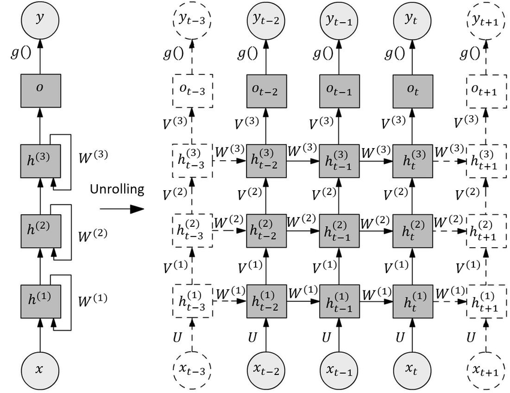
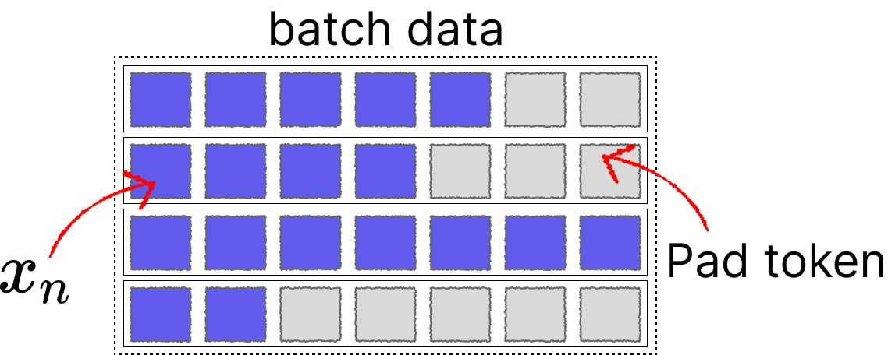
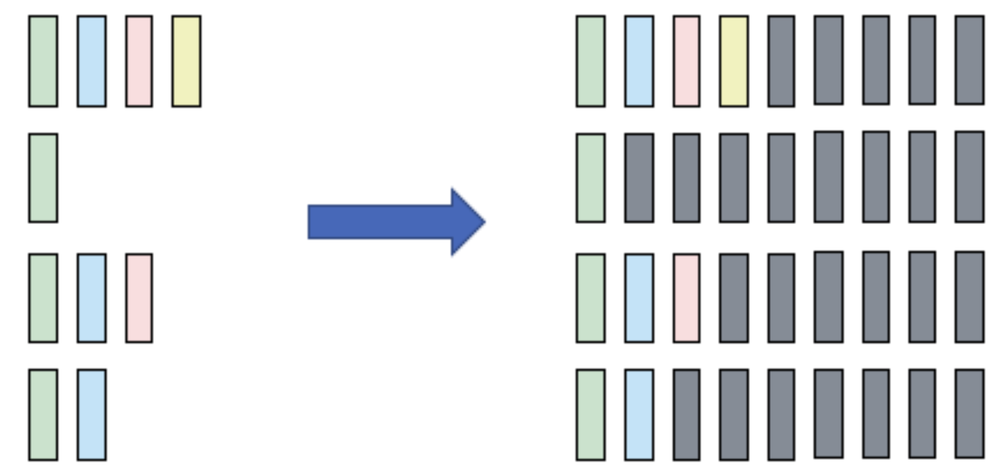

# Archaeological RNN Series (Part 1): Understanding How PyTorch RNN Handles Variable-Length Batch Training

## Introduction

Recently while studying linear attention, I realized that although I had some understanding of RNN networks before, I hadn't delved into the details of how RNNs are stacked and how they handle parallel training. This blog will explain the usage of `torch.nn.RNN` in PyTorch, focusing on the following two aspects:

* How RNNs are stacked, what structure lies behind the `num_layers` parameter, and the role of the `bidirectional` parameter
* How RNNs perform batch training for variable-length sequence inputs

## Series Directory

* [Archaeological RNN Series (Part 1): Understanding How PyTorch RNN Handles Variable-Length Batch Training](https://github.com/ShaohonChen/tutorial_with_rnn/blob/main/README.md) — Introduction to RNN principles and methods for handling variable-length batch sequences
* [Archaeological RNN Series (Part 2): How to Use RNN Networks for Sequence Prediction](https://github.com/ShaohonChen/tutorial_with_rnn/blob/main/README_next.md) — Training an RNN classification network for sequence sum and remainder prediction, along with some parameter tuning tips

## Introduction to RNN Principles

Let's first briefly introduce the RNN formula:

$$
h_t = \tanh(W_{xh} x_t + W_{hh} h_{t-1} + b_h)
$$

Key variables in the formula:

* $ x_t $ : Input vector at time step $ t $
* $ h_t $ : Hidden state at time step $ t $
* $ W_{xh} $ , $ W_{hh} $ , $ b_h $ : Model parameter matrices

When I first learned about RNNs, I was always confused about the relationship between the hidden state $ h_t $ and the network output (online diagrams were quite messy, sometimes showing $ h $ and sometimes $ y $). Actually, for RNNs, the hidden state is the output. The update relationship between hidden state and output can be explained with the following diagram:

<div align="center">
  <figure>
  
  <figcaption>Unfolding the RNN input process over time</figcaption>
  </figure>
</div>

The important point is that for RNNs, the hidden variable is directly output as the RNN network's output, while this output is also combined with the input of the next sequence token. The combination of hidden state $ h_t $ and $ x_t $ forms the input to the $ \tanh $ function:

$$
W_{xh} x_t + W_{hh} h_{t-1} + b_h
$$

PyTorch's official implementation of the `torch.nn.RNN` module supports the following input parameters:

* input_size: Input dimension
* hidden_size: Hidden layer dimension - no matter how long the historical sequence is, the model will compress it into this small vector representation
* num_layers: Number of layers for multi-layer RNN, **explained later**
* nonlinearity: Choice of nonlinear function, only supports `"tanh"` and `"relu"`, if you want to use sigmoid you'll need to implement it yourself
* bias: Whether to enable bias, which is $ b_h $ in the formula above
* batch_first: Whether the input is batch-first, related to the shape of input_size
* dropout: Whether to add dropout to the output
* bidirectional: Whether to use bidirectional RNN, **explained later**

A typical usage example looks like this:

```python
rnn = torch.nn.RNN(10, 20, 1) # Input vector sequence dimension is 10, hidden layer size (i.e., output size) is 20, RNN stacking layer count is 1
input = torch.randn(5, 3, 10)   # Sequence length 5, batch size 3 vector sequence, each vector dimension 5
h0 = None  # Default doesn't require input of first hidden state; if not provided, model automatically initializes an all-zero hidden vector
output, hn = rnn(input, h0) # Output
print(output.shape) # torch.Size([5, 3, 20])    output contains all hidden states: h_1,h_2,...,h_n
print(hn.shape) # torch.Size([1, 3, 20])    hn only contains the last layer's hidden state: h_n
```

I also recommend readers check out PyTorch's official documentation for the RNN module:

* Link: <https://docs.pytorch.org/docs/stable/generated/torch.nn.RNN.html>

Next, let's explain the role of the `num_layers` parameter and the `bidirectional` parameter.

### Multi-layer RNN Stacking

PyTorch's official documentation describes the `num_layers` parameter as follows:

>num_layers – Number of recurrent layers. E.g., setting num_layers=2 would mean stacking two RNNs together to form a stacked RNN, with the second RNN taking in outputs of the first RNN and computing the final results. Default: 1

Translated by Qwen3:

>num_layers —— Number of recurrent layers. For example, setting num_layers=2 means stacking two RNNs together to form a stacked RNN, where the second RNN receives the output of the first RNN and computes the final result. Default: 1

Actually, this explanation is still quite unclear. After consulting many blogs and looking at official example code, I finally understood that the so-called Stacked RNN has the following structure:

<div align="center">
  <figure>
  
  <figcaption>Unfolding the RNN input process over time, image from [1]</figcaption>
  </figure>
</div>

I'll also provide calculation code for multi-layer stacked RNN (Stacked RNN) for readers' reference (code from PyTorch official documentation):

```python
# Efficient implementation equivalent to the following with bidirectional=False
rnn = nn.RNN(input_size, hidden_size, num_layers)
params = dict(rnn.named_parameters())
def forward(x, hx=None, batch_first=False):
    if batch_first:
        x = x.transpose(0, 1)
    seq_len, batch_size, _ = x.size()
    if hx is None:
        hx = torch.zeros(rnn.num_layers, batch_size, rnn.hidden_size)
    h_t_minus_1 = hx.clone()
    h_t = hx.clone()
    output = []
    for t in range(seq_len):
        for layer in range(rnn.num_layers):
            input_t = x[t] if layer == 0 else h_t[layer - 1]
            h_t[layer] = torch.tanh(
                input_t @ params[f"weight_ih_l{layer}"].T
                + h_t_minus_1[layer] @ params[f"weight_hh_l{layer}"].T
                + params[f"bias_hh_l{layer}"]
                + params[f"bias_ih_l{layer}"]
            )
        output.append(h_t[-1].clone())
        h_t_minus_1 = h_t.clone()
    output = torch.stack(output)
    if batch_first:
        output = output.transpose(0, 1)
    return output, h_t
```

Through the above code, we can understand the relationship between output and h_t:

* output represents the changes in the last layer's hidden state corresponding to each vector in the vector sequence, so the shape is `(sequence length, batch size, hidden state dimension)`
* h_t represents the last hidden state of all layers after the entire sequence is input, so the shape is `(number of layers, batch size, hidden state dimension)`

### Bidirectional RNN

Bidirectional RNN is relatively easy to understand. In simple terms, it allows the model to understand the sequence both from front to back and from back to front (somewhat similar to the difference between Bert and GPT). Therefore, we use two identical RNNs: feed the sequence forward into the first RNN to get hidden states, then feed it backward into the second RNN to get hidden states. Enable this by setting the `bidirectional` variable to True.

Schematic diagram:

<div align="center">
  <figure>
  
  <figcaption>Two RNNs processing forward and backward sequences respectively, image from [1]</figcaption>
  </figure>
</div>

Two details to note here:

1. After enabling `bidirectional`, the model will directly generate two sets of RNN parameters, so the RNN model parameters will double in size
2. Both `output` and `h_n` will provide two sets (one from each RNN). The reference diagram above has a slight issue in that $ y_0 $ appears to be the sum of forward and backward RNN hidden states, **but actually PyTorch's RNN implementation directly returns both forward and backward RNN hidden states**.

## Sequence Processing Model Design Based on RNN Networks

Due to the RNN model structure's inherent gradient explosion problems and other issues, networks based on RNN are significantly fewer than those based on LSTM. However, whether it's LSTM, RNN, or even transformers, sequence processing models can be simply classified into the following categories:

<div align="center">
  <figure>
  
  <figcaption>Different RNN network structures, red is input, blue is output (also hidden state), green is RNN network [2]</figcaption>
  </figure>
</div>

The green part in the above diagram can actually be replaced with LSTM, RNN, or Transformers logic. Below are the functions of each network:

* **one to one:** Generally doesn't have this structure 😂, no different from fully connected
* **one to many:** Early image-to-text models used this structure, or older text generation models
* **many to many (encode-decode):** Early very popular NLP network architecture, generally used for text generation, translation, sequence prediction tasks, many LSTMs use this architecture (Bert can be roughly classified into this architecture, though not entirely correct, the design philosophy is similar)
* **many to many:** I've seen this architecture less, but some translation tasks, sequence feature extraction (like real-time speech-to-text) use similar architectures. Including recent popular linear attention models, which can be loosely classified into this category

Of course, RNN's modeling capability itself is not particularly strong, so the popular ones are still the **encode-decode** architecture, or use the **many to one** architecture for simple prediction and classification tasks. The tutorial later in this article is based on the **many to one** architecture.

> Gradient vanishing and explosion problems: <https://en.wikipedia.org/wiki/Vanishing_gradient_problem>  
> Of course, the RNN structure itself also has problems like low parallel efficiency and poor long-range understanding ability. Parallel efficiency will be analyzed later

## RNN Handling of Variable-Length Sequences

To improve GPU computing efficiency and gradient direction accuracy, training is generally done by packaging a batch of sequences together, but this creates a problem. For tasks like text classification, sequences generally have varying lengths.

For multiple sequences x of different lengths, we typically use padding to fill them to a specific length before feeding them into the network.

<div align="center">
  <figure>
  
  <figcaption>Padding method, generally during training padding is done from the right (left aligned)</figcaption>
  </figure>
</div>

For Transformers, this problem is relatively easy to solve as we can achieve parallelism by adding attention masks. However, for networks like LSTM and RNN, since the hidden state $ h_n $ is updated step by step with each sequence, directly padding + batch input would cause the hidden state $ h_n $ calculation to include pad tokens.

<div align="center">
  <figure>
  
  <figcaption>Using conventional batch processing methods on RNN doesn't handle pad tokens well</figcaption>
  </figure>
</div>

Fortunately, PyTorch engineers also considered this and created two utility functions specifically to help handle it:

* **pack_padded_sequence** Combine padded batch and sequence lengths into one long sequence: (seq, batch, dim) -> (seq*batch, dim)
* **pad_packed_sequence** Reverse of the above function, typically used to process RNN output results: (seq*batch, dim) -> (seq, batch, dim)

This can achieve parallel computing to some extent, though the efficiency of parallel computing is naturally still low (this is also one reason why RNNs can't be made large). But at least it can utilize vector computation + pipeline processing to accelerate to some extent.

Below is a schematic diagram of the `pack_padded_sequence` function from Zhihu, which I'll directly use:

<div align="center">
  <figure>
  
  <figcaption>`pack_padded_sequence` function processing method [3]</figcaption>
  </figure>
</div>

It should be noted that pack_padded_sequence has a parameter `enforce_sorted` that is enabled by default, meaning it requires sequences in the batch to be sorted from longest to shortest (to reduce interrupted computation on GPU). However, in practice we don't sort a batch of data every time in training code. Here we just specify it as false, whether to enable it only affects model export to onnx behavior. Generally, we specify it as false and let PyTorch handle it itself.

Example code for using pack_padded_sequence and pad_packed_sequence is as follows (many online examples are wrong T_T, including some on foreign Stack Overflow; you can refer to this code I've verified):

```python
import torch
import torch.nn as nn
from torch.autograd import Variable


input_dim=2
batch_size = 3
max_length = 4
hidden_size = 2
n_layers =1

# container
batch_in = torch.zeros(
    (
        batch_size,
        max_length,input_dim
    )
)

# data
vec_1 = torch.FloatTensor([[1, 1.1], [2, 2.2], [0, 0], [0, 0]])
vec_2 = torch.FloatTensor([[[1, 1.1], [2, 2.2], [3, 3.3], [4, 4.4]]])
vec_3 = torch.FloatTensor([[[1, 1.1], [0, 0], [0, 0], [0, 0]]])


# print(batch_in[0].shape)
batch_in[0] = vec_1
batch_in[1] = vec_2
batch_in[2] = vec_3

batch_in = Variable(batch_in)

seq_lengths = [4,2,1,] # list of integers holding information about the batch size at each sequence step

# pack it
pack = torch.nn.utils.rnn.pack_padded_sequence(batch_in, seq_lengths, batch_first=True,enforce_sorted=False)

print(pack)
# PackedSequence(data=tensor([[1.0000, 1.1000],
#         [1.0000, 1.1000],
#         [1.0000, 1.1000],
#         [2.0000, 2.2000],
#         [2.0000, 2.2000],
#         [0.0000, 0.0000],
#         [0.0000, 0.0000]]), batch_sizes=tensor([3, 2, 1, 1]), sorted_indices=tensor([0, 1, 2]), unsorted_indices=tensor([0, 1, 2]))
```

`pack` will contain the constructed sequence, batch size information (for future recovery), and sorting information.

Then the code for batch forward propagation of RNN and batch recovery of output is as follows:

```python
# initialize
rnn = nn.RNN(input_dim, hidden_size, n_layers, batch_first=True)
h0 = Variable(torch.zeros(n_layers, batch_size, hidden_size))

# forward
out, h_n = rnn(pack, h0)

# unpack
unpacked, unpacked_len = torch.nn.utils.rnn.pad_packed_sequence(out ,batch_first=True)


print(unpacked)
# tensor([[[ 0.6948, -0.4382],
#          [ 0.5995,  0.0263],
#          [ 0.7160,  0.0732],
#          [ 0.7253,  0.1289]],

#         [[ 0.6948, -0.4382],
#          [ 0.5995,  0.0263],
#          [ 0.0000,  0.0000],
#          [ 0.0000,  0.0000]],

#         [[ 0.6948, -0.4382],
#          [ 0.0000,  0.0000],
#          [ 0.0000,  0.0000],
#          [ 0.0000,  0.0000]]], grad_fn=<IndexSelectBackward0>)
```

Here are the official documentation links for both functions, I recommend reading them:

* pack_padded_sequence documentation: <https://docs.pytorch.org/docs/stable/generated/torch.nn.utils.rnn.pack_padded_sequence.html>
* pad_packed_sequence documentation: <https://docs.pytorch.org/docs/stable/generated/torch.nn.utils.rnn.pad_packed_sequence.html>

Besides these two functions, there's another frequently used function `pad_sequence`, which automatically pads data from tensor lists of different lengths into a batch. This function is typically used for data preprocessing.

* pad_sequence documentation: <https://docs.pytorch.org/docs/stable/generated/torch.nn.utils.rnn.pad_sequence.html>

<div align="center">
  <figure>
  
  <figcaption>`pad_sequence` function processing method [3]</figcaption>
  </figure>
</div>

The next part will introduce how to build a training script for sequence classification. (You can find `README_next.md` on GitHub)

## References

* [1] <https://www.researchgate.net/figure/Stacked-RNN-Generalized-structure-and-temporal-unrolled-variant_fig4_376204636>

* [2] <https://medium.com/data-science/pytorch-basics-how-to-train-your-neural-net-intro-to-rnn-cb6ebc594677>

* [3] <https://zhuanlan.zhihu.com/p/601705984>