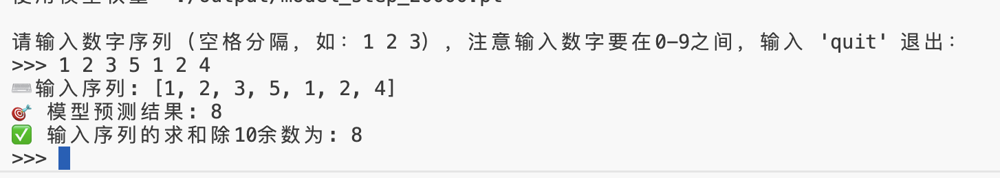
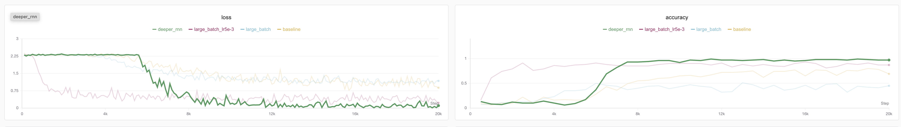

# Archaeological RNN Tutorial (Part 2): How to Use RNN Networks for Sequence Prediction

## Introduction

In the previous chapter, we explained the basic structure and principles of RNN, as well as how to use PyTorch's `pack_padded_sequence` and `pad_packed_sequence` functions to handle variable-length batch data.

This chapter mainly introduces how to use these functions to build an RNN model capable of training classification tasks, and how to write batch training scripts.

Finally, we also include some parameter tuning tips for sequence networks 😊

## Series Directory

* [Archaeological RNN Tutorial (Part 1): Understanding How PyTorch RNN Handles Variable-Length Batch Training](https://github.com/ShaohonChen/tutorial_with_rnn/blob/main/README.md) — Introduction to RNN principles and methods for handling variable-length sequence batches
* [Archaeological RNN Tutorial (Part 2): How to Use RNN Networks for Sequence Prediction](https://github.com/ShaohonChen/tutorial_with_rnn/blob/main/README_next.md) — Training an RNN classification network for sequence sum and remainder calculation, plus some parameter tuning tips

## Training Task Introduction

We use the **sequence sum and remainder calculation** task to verify the performance of the RNN model.

**Sequence Sum and Remainder Calculation**: The dataset consists of input-output pairs `(X, Y)`, formally defined as follows:

* **Model Input X**:  
  A random integer sequence of arbitrary length $ n \in \mathbb{N}^+ $, $ X = (x_1, x_2, \dots, x_n) $, where each element $ x_i $ is independently and identically distributed from the set $ \{0, 1, 2, \dots, 9\} $, i.e.:

  $$
  x_i \overset{\text{i.i.d.}}{\sim} \text{Uniform}\{0, 1, \dots, 9\}, \quad \forall i = 1, \dots, n
  $$

* **Target Output Y**:  
  The result of taking the sum of all elements in the sequence modulo 10:

  $$
  Y = \left( \sum_{i=1}^{n} x_i \right) \bmod 10
  $$

Here are some dataset examples:

| Model Input X                     | Calculation Process               | Target Output Y |
|-----------------------------------|-----------------------------------|-----------------|
| `[3, 7, 1, 9]`                    | (3+7+1+9) = 20 → 20 mod 10        | `0`             |
| `[5]`                             | 5 mod 10                          | `5`             |
| `[1,2,3,4,5,6,7,8,9,0]`           | 45 mod 10                         | `5`             |
| `[8, 8, 8]`                       | 24 mod 10                         | `4`             |

This task can be considered as a sequence-to-scalar mapping problem, with the goal of learning the mapping function from arbitrary-length digit sequences to the sum of their digits modulo 10. Due to variable input lengths and random elements, this dataset can be used to test the RNN model's ability to model variable-length sequences, perform modular arithmetic reasoning, and generalize.

The PyTorch code for synthesizing this dataset is as follows:

```python
# Variable-length dataset, X is a sequence of 0-N, Y is the sum of the sequence modulo N+1, range also 0-N
class SeqSumModDataset(IterableDataset):
    def __init__(self, total_samples=None, min_seq_len=2, max_seq_len=5, max_number=4):
        """
        :param total_samples: Total number of samples (None = infinite generation)
        :param min_len: Minimum sequence length
        :param max_len: Maximum sequence length
        :param max_number: Maximum number that can appear in the sequence
        """
        self.total_samples = total_samples
        self.min_len = min_seq_len
        self.max_len = max_seq_len
        self.max_number = max_number
        self.count = 0  # Counter for limiting total samples

    def __iter__(self):
        self.count = 0  # Reset counter each time iteration restarts
        return self

    def __next__(self):
        # Control epoch
        if self.total_samples is not None and self.count >= self.total_samples:
            raise StopIteration

        # Dynamically generate a sample
        seq_length = random.randint(self.min_len, self.max_len)
        input_seq = [random.randint(0, self.max_number) for _ in range(seq_length)]
        target_num = sum(input_seq) % (self.max_number + 1)
        self.count += 1
        return input_seq, seq_length, target_num
```

## Building the Prediction Model

Since this is a "discrete sequence → discrete number" prediction task, it can be treated as a sequence classification task. Input is a variable-length discrete sequence, output is one of the 10 digit categories (0-9). We can build a "many to one" model. The model architecture designed by the author is as follows:

<div align="center">
  <figure>
  
  <figcaption>Network architecture diagram, using embedding to convert sequence digits to vectors, followed by multi-layer RNN network and FFN classification head</figcaption>
  </figure>
</div>

As shown in the diagram, the sequence is converted to vectors by the embedding network, then fed into multi-layer stacked RNN networks, using the last hidden state $ h_n $ of the last RNN layer to predict the sum of the last input sequence.

Of course, readers might ask why bother with an embedding model when it's simpler to convert the input sequence $ x_i $ to one-hot encoding or directly map to floating-point numbers?

Actually, both approaches are correct hhh, but the author uses the embedding model to help readers better understand how text token sequences are processed in natural language. As for why not convert to scalars, scalar values would indeed allow the model to converge faster since numbers, unlike characters, inherently have magnitude relationships. Considering RNN's excellent performance in natural language tasks, this implementation makes it easier to migrate the network to NLP tasks in the future.

The network code implementation is as follows:

```python
import torch.nn as nn
from torch.nn.utils.rnn import pack_padded_sequence

class RnnClsNet(nn.Module):
    """
    RNN-based sequence classification network, suitable for variable-length input sequences (such as sentences, digit sequences, etc.).
    Uses Embedding + Multi-layer RNN + Fully Connected layer structure, ultimately outputting classification probabilities.
    Supports handling padded sequences, improving computational efficiency through pack_padded_sequence.
    """
    def __init__(self, vocab_size=5, embed_dim=5, hidden_dim=16, num_layers=2, cls_num=5):
        super().__init__()
        # Embedding layer, note that the last sequence is the padding sequence, so vocabulary size needs to be increased by 1
        self.embedding = nn.Embedding(vocab_size + 1, embed_dim, padding_idx=-1)
        # RNN layer: handles variable-length sequences, batch_first=True means input shape is (batch, seq_len, embed_dim)
        self.rnn = nn.RNN(
            embed_dim,           # Input feature dimension
            hidden_dim,          # Hidden state dimension
            num_layers=num_layers,  # Number of RNN layers
            batch_first=True     # First dimension of input/output is batch_size
        )
        self.rnn = nn.RNN(embed_dim, hidden_dim, num_layers=num_layers, batch_first=True)
        self.fc = nn.Linear(hidden_dim, cls_num)

    def forward(self, x, seq_lengths):
        # Word embedding: convert indices to vectors
        embedded = self.embedding(x)  # Shape: (batch, seq_len, embed_dim)
        # Pack variable-length sequences: improves RNN computational efficiency for padding parts, avoiding invalid computations
        pack = pack_padded_sequence(embedded, seq_lengths, enforce_sorted=False, batch_first=True)
        # RNN forward computation
        out, h_n = self.rnn(pack)   # h_n shape (num_layers, batch, hidden_dim)
        # Take the final hidden state of the last layer as sequence representation
        out = self.fc(h_n[-1])  # Map to classification space, shape: (batch, cls_num)
        return out
```

The author has provided complete annotations to help readers understand how the model is implemented.

Here, focus on the use of `pack_padded_sequence` in the `forward` function to pack the input sequence, where padding tokens will be removed after packing.

## Complete Training Code Acquisition and Execution

Complete training code can be viewed on GitHub (training code is also included later in case some readers cannot access GitHub, see [#Appendix: Training Code](#appendix-training-code))

* GitHub link: <https://github.com/ShaohonChen/tutorial_with_rnn>

Download code & environment installation commands:

```bash
git clone https://github.com/ShaohonChen/tutorial_with_rnn.git
cd tutorial_with_rnn
pip install torch swanlab
```

Command to run training code:

```bash
python train_cls_rnn.py
```

Since the model is relatively small with less than 1k parameters, it can complete training in about two minutes using the author's Mac laptop CPU.

Running effect is as follows:

<div align="center">
  <figure>
  
  <figcaption>Network architecture diagram, using embedding to convert sequence digits to vectors, followed by multi-layer RNN network and FFN classification head</figcaption>
  </figure>
</div>

> Experiment records: <https://swanlab.cn/@ShaohonChen/tutorial_with_rnn/charts>

It can be seen that the model basically has an "Aha moment🤪" around 4k training steps, suddenly understanding how to calculate remainders, after which accuracy rapidly increases to 75%.

P.S. The author initially set it to run only 1k-2k steps. Found it couldn't converge. Later, after increasing the training steps, a miracle occurred.

> If prompted to enter SwanLab API key, refer to [SwanLab Login Guide](https://docs.swanlab.cn/guide_cloud/general/quick-start.html) to use SwanLab for training monitoring～ SwanLab is a very useful and free online training monitoring tool, hope everyone can support it more.

<div align="center">
  <figure>
  
  <figcaption>SwanLab tool, experimental results for the parameter tuning part in later tutorials can be viewed on SwanLab</figcaption>
  </figure>
</div>

## Evaluation Inference Code

Last time when the author was writing the tutorial on building multimodal models [Qwen-SmlVL](https://github.com/ShaohonChen/Qwen3-SmVL), I forgot to include the evaluation script and got heavily criticized in issues. This time the author obediently submitted the inference script. Run command as follows:

```bash
python predict_cls_rnn.py
```

Running effect is as follows:

<div align="center">
  <figure>
  
  <figcaption>This time the author seriously included the inference standard, no longer worried about being caught by issues🐦</figcaption>
  </figure>
</div>

> Thanks to Qwen teacher for helping write the inference script and adding detailed annotations.

## How to Improve Performance

However, the current accuracy is only 75%, meaning on average one wrong answer out of every four questions🤔. The author wanted to make the model more accurate and came up with the following two strategies:

### Strategy 1: Increase Batch Size

<div align="center">
  <figure>
  
  <figcaption>Baseline shows relatively large loss oscillation in the later stages</figcaption>
  </figure>
</div>

The author observed that training loss oscillates somewhat after 4k steps. An intuitive idea is to increase batch size to reduce jitter. The author increased batch size from 16→64 (which also introduced more datasets). Experimental results are as follows:

<div align="center">
  <figure>
  
  <figcaption>Yellow is baseline, blue is training effect with batch size increased by 4 times, result shows lower accuracy</figcaption>
  </figure>
</div>

It can be seen that loss jitter is indeed smaller than before, but accuracy is lower. The author suspects this is because it fell into a local optimum. Since batch size increased, theoretically learning rate can also be increased to help the model jump out of local optima.

### Strategy 2: Increase Batch Size and Learning Rate Lr

Then increase LR from 1e-3 to 5e-3

```bash
python train_cls_rnn.py --batch_size 64 --lr 0.005 --run_name large_batch_lr5e-3
```

> * 💡 According to scaling law principles, when batch size increases four times, learning rate should also increase approximately 4 times, but the author thinks 4e-3 is not auspicious hahaha🤣, actually as long as the order of magnitude isn't too far off, hyperparameters aren't that sensitive. The relationship between batch and lr isn't strictly linear, but generally for small models it can be approximately considered linear.  
> * Regarding the relationship between learning rate and batch size, it is recommended to read OpenAI's classic work "An Empirical Model of Large-Batch Training" [4], which proved that under SGD optimizer, the relationship between batch size and learning rate is monotonic and bounded. When both are relatively small, learning rate and batch size are basically in a **linear relationship**.

Effect as follows⬇️

<div align="center">
  <figure>
  
  <figcaption>Yellow is baseline, magenta is the curve with increased learning rate</figcaption>
  </figure>
</div>

> Experiment records: <https://swanlab.cn/@ShaohonChen/tutorial_with_rnn/charts>

A beautiful loss curve! Not only converged earlier, but accuracy reached 91%! 😄

But still not enough, this task theoretically has a better solution.

### Strategy 3: Scaling Law (Directly Increase Model Size)

This principle is easy to understand. Actually, for summing sequences of arbitrary length and taking remainders, RNN doesn't need to remember all the accumulated numbers, nor does it need to learn the mathematical formula for remainder calculation.

A clever strategy is: deducing all integer addition combinations where the sum doesn't exceed 10 from the remainder is also a finite set. The model only needs to memorize the range of this finite set. The author roughly estimates this combination relationship is less than 10 squared divided by 2, about 50+ combinations.

So the simple and understandable idea is to increase the model size to expand its memory.

Training script to increase model scale:

```bash
python train_cls_rnn.py --hidden_dim 32 --num_layers 3  --run_name deeper_rnn
```

The result is immediate, accuracy directly rushed to 99%🎉 (99%-97 fluctuation)

<div align="center">
  <figure>
  
  <figcaption>Yellow is baseline, green is deeper and larger RNN network, showing that after deepening the network, accuracy peak reached 99%</figcaption>
  </figure>
</div>

> Experiment records: <https://swanlab.cn/@ShaohonChen/tutorial_with_rnn/charts>

Although model training is more delayed, this still brings obvious benefits.

### SOTA Model Birth: Performance Improvement from Combined Strategies

So the intuitive thought is to combine all tricks, the effect must be better

```bash
python train_cls_rnn.py --hidden_dim 32 --num_layers 3  --batch_size 64 --lr 0.005  --run_name sota
```

The result was disappointing, and more painfully, the author ran three models and found one actually converged??? (The author realized I forgot to fix the random seed😭)

> ⚠️Everyone must remember to record random seeds when training themselves. The author also submitted a PR to SwanLab hoping to add automatic random seed recording to prevent future experiments from being unreproducible.

<div align="center">
  <figure>
  
  <figcaption>Yellow is baseline, three combined SOTA strategies found one converged</figcaption>
  </figure>
</div>

> Experiment records: <https://swanlab.cn/@ShaohonChen/tutorial_with_rnn/charts>

The author further analyzed the experimental results and found that compared to the converged experiment, the non-converging models had obvious oscillation in the early loss stage. Here's another plug for SwanLab - without numerical analysis, these problems really couldn't be found;-)

<div align="center">
  <figure>
  
  <figcaption>Compared to the converged experiment, the other two non-converging experiments had severe loss oscillation in the early stages</figcaption>
  </figure>
</div>

Considering that the RNN structure itself is not very friendly to gradient transmission, we only need to eliminate the loss oscillation problem in the early training stage (the lack of oscillation later doesn't mean convergence, it's just that cosine learning rate decay reduced the learning rate)

> 💡Regarding why RNN oscillates, Su Shen's (Su Jianlin) manual derivation tutorial is recommended: <https://spaces.ac.cn/archives/7888>

Options include gradient clipping, changing optimizers, adding cross-layer connections or gating to the network, and strategies popular in LLM, **increasing learning rate warm up in the early stages**.

<div align="center">
  <figure>
  
  <figcaption>Learning rate warm up + cosine decay</figcaption>
  </figure>
</div>

Here's an introduction to the warmup technique. Learning Rate Warmup is an optimization strategy that gradually increases the learning rate in the early stages of training. Its core idea is: at the beginning of model training, parameters are not yet stable. If a large learning rate is used directly, it can easily cause gradient oscillation, training instability, or even divergence. Warmup gradually increases from a very small learning rate to the target learning rate in the first few training steps (or epochs), allowing model parameters to "start gently", thereby improving training stability and final convergence performance.

After adding warmup, the training command is as follows:

```bash
python train_cls_rnn.py --hidden_dim 32 --num_layers 3  --batch_size 64 --lr 0.005 --warmup_step 2000  --run_name sota_warmup
```

Bingo! This time the model converged very stably. The author repeated the experiment three times and found no cases of failure to converge!

And accuracy also reached an astonishing 100%. Since the test set is randomly generated 100% each time, theoretically there is no overfitting problem.

> Experiment records: <https://swanlab.cn/@ShaohonChen/tutorial_with_rnn/charts>

<div align="center">
  <figure>
  
  <figcaption>Experiment after adding warmup strategy, showing that all three experiments converged stably</figcaption>
  </figure>
</div>

<div align="center">
  <figure>
  
  <figcaption>After warmup, stability in the early training stages improved significantly</figcaption>
  </figure>
</div>

### Evaluation Effect

Inference on the model shows overall performance is quite satisfactory, and it has some extrapolation ability. The model was trained on sequence lengths of 2-5, but during inference, it can still accurately calculate even with more than 10 digits hhh.

<div align="center">
  <figure>
  
  <figcaption>Effect diagram</figcaption>
  </figure>
</div>

<div align="center">
  <figure>
  
  <figcaption>Extrapolation performance beyond training length is also good</figcaption>
  </figure>
</div>

## Appendix: Complete Code (Includes Evaluation Part🍎)

### Appendix: Training Code

Complete training code `train_cls_rnn.py` is as follows:

```python
import os
import argparse
import random
from functools import partial

import torch
import torch.nn as nn
import torch.optim as optim
from torch.utils.data import DataLoader, IterableDataset
from torch.nn.utils.rnn import pad_sequence, pack_padded_sequence
import swanlab


# ========== 1. Data Part ==========


# Variable-length dataset, X is a sequence of 0-N, Y is the sum of the sequence modulo N+1, range also 0-N
class SeqSumModDataset(IterableDataset):
    def __init__(self, total_samples=None, min_seq_len=2, max_seq_len=5, max_number=4):
        """
        :param total_samples: Total number of samples (None = infinite generation)
        :param min_len: Minimum sequence length
        :param max_len: Maximum sequence length
        :param max_number: Maximum number that can appear in the sequence
        """
        self.total_samples = total_samples
        self.min_len = min_seq_len
        self.max_len = max_seq_len
        self.max_number = max_number
        self.count = 0  # Counter for limiting total samples

    def __iter__(self):
        self.count = 0  # Reset counter each time iteration restarts
        return self

    def __next__(self):
        # Control epoch
        if self.total_samples is not None and self.count >= self.total_samples:
            raise StopIteration

        # Dynamically generate a sample
        seq_length = random.randint(self.min_len, self.max_len)
        input_seq = [random.randint(0, self.max_number) for _ in range(seq_length)]
        target_num = sum(input_seq) % (self.max_number + 1)
        self.count += 1
        return input_seq, seq_length, target_num


# ========== 2. Model Part (Example: Character-level Simple RNN Model) ==========


class RnnClsNet(nn.Module):
    def __init__(
        self, vocab_size=5, embed_dim=5, hidden_dim=16, num_layers=2, cls_num=5
    ):
        super().__init__()
        self.embedding = nn.Embedding(
            vocab_size + 1, embed_dim, padding_idx=-1
        )  # Extra padding position
        self.rnn = nn.RNN(
            embed_dim, hidden_dim, num_layers=num_layers, batch_first=True
        )
        self.fc = nn.Linear(hidden_dim, cls_num)

    def forward(self, x, seq_lengths):
        # x: [batch_size, seq_len] (character indices)
        embedded = self.embedding(x)
        pack = pack_padded_sequence(
            embedded, seq_lengths, enforce_sorted=False, batch_first=True
        )
        out, h_n = self.rnn(pack)
        out = self.fc(h_n[-1])
        return out


# ========== 3. Training Script ==========


def train(args, device):
    # Initialize SwanLab for logging
    swanlab.init(experiment_name=args.run_name, config=args)

    # Create dataset
```