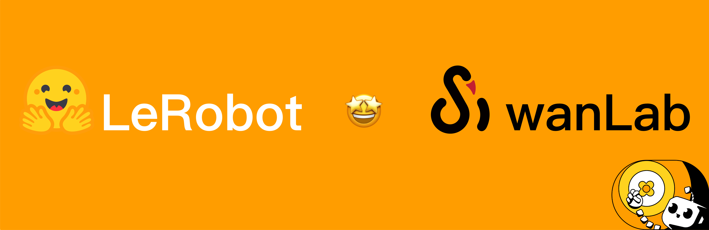
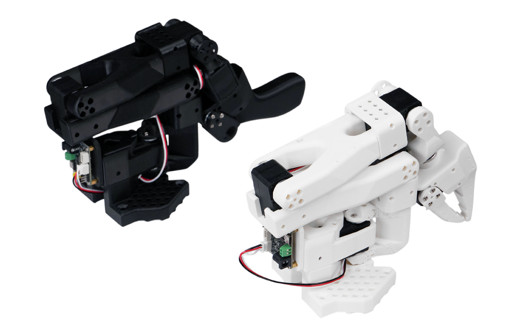
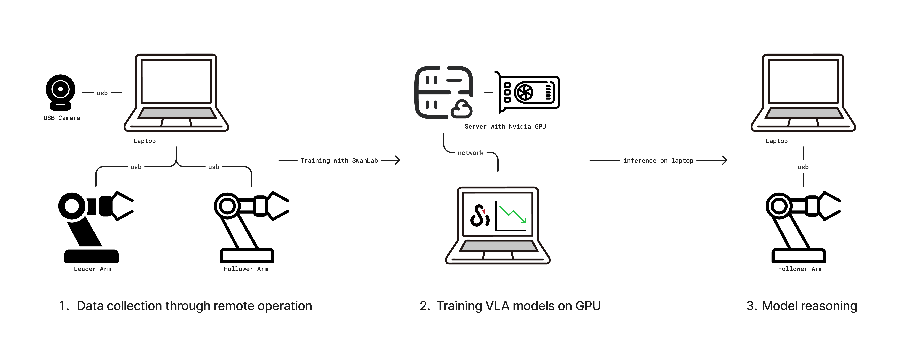
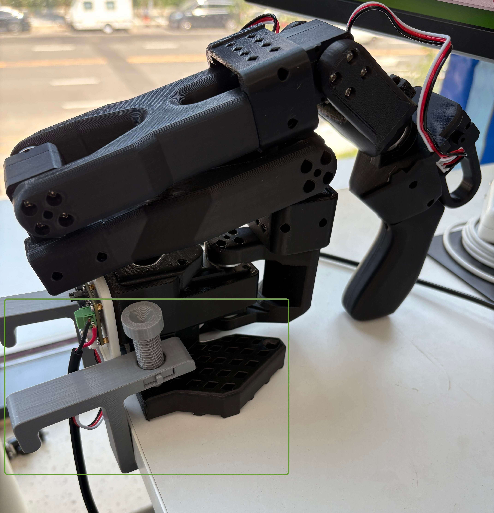
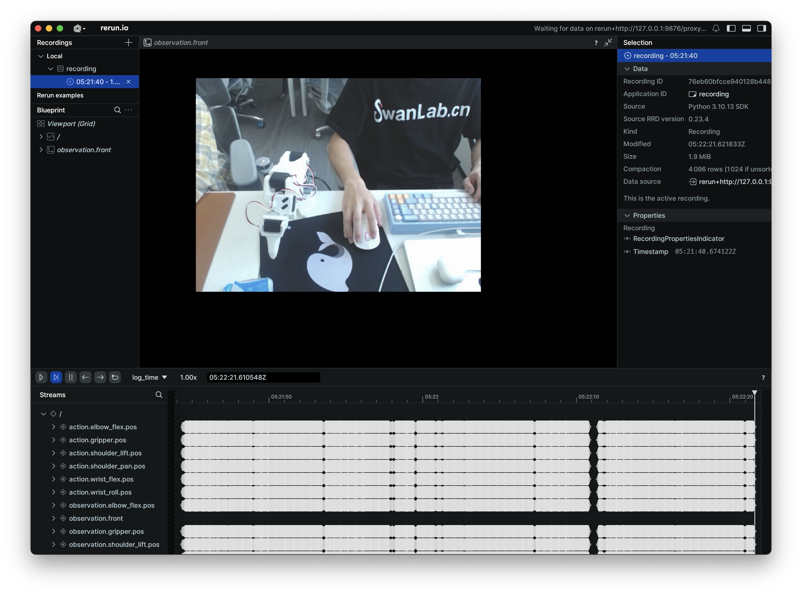
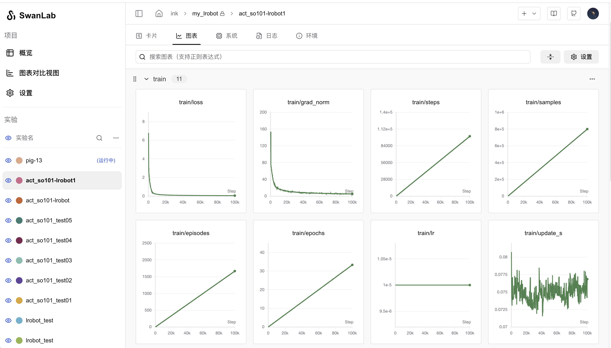

# Getting Started with Embodied AI using LeRobot

[LeRobot](https://github.com/huggingface/lerobot) is an open-source robotics project initiated by [Hugging Face](https://huggingface.co/lerobot). It aims to provide datasets, models, and tools for real-world robotics, lowering the barrier to entry. LeRobot includes methods for imitation learning and reinforcement learning, and also offers a series of pre-trained models, datasets with human-collected demonstrations, and simulation environments.



The following tutorial focuses on how to train your own VLA model based on LeRobot, covering the entire pipeline from data collection and model training to model inference, ultimately enabling a robotic arm to perform grasping tasks autonomously.

> [!NOTE]
>
> **VLA (Vision Language Action)** is an advanced multimodal machine learning model that combines vision, language, and action capabilities. It aims to achieve a complete closed-loop capability, directly mapping perceptual input to robot control actions. To learn more, check out [SmolVLA](https://huggingface.co/blog/en/smolvla).

[[toc]]

## 0. List of Materials

Here's what you'll need:

- **A laptop computer**: To configure the LeRobot environment, control the robotic arm, and collect robot data.
- **LeRobot Robotic Arm Kit**: Includes two arms, a leader and a follower. The leader arm is used for teleoperation, and the follower arm executes the actions.
- **A USB camera**: To provide video input of the environment, acting as the "eyes" for the robotic arm.
- **A GPU server**: For training the model. If your laptop has a GPU, you can also use it for training.

In this tutorial, we use the [SO-101](https://huggingface.co/docs/lerobot/so101) model robotic arm. The SO-101 kit includes a leader arm (black) and a follower arm (white), as shown below.



[Taobao Purchase Link](https://item.taobao.com/item.htm?ali_trackid=2%3Amm_7587494315_3230200107_115939450462%3A1752723707645_554211053_0&bxsign=tbk5vSLE-62O97Or9VaJAjw5S3OKWmab7-z32DrQ05EAZ5wURXVAqGEK07y49vI0Gv46kNi9NtLNfx3lJJq50RWzGgfWOYS4UXVj1KT7Bx6Ue05TNdo_qHq8mJqBQerRa7N1D2J4ymc4BuoAgmDTgq4M7oXrg2QG3wfsGMA3f5nwRx6RKBu6IuGXUtOv6plztbN&id=878010637397&skuId=5915703371831&union_lens=lensId%3APUB%401742290075%4021662a24_0e69_195a894c064_d4e6%40023oEhJMJDAYtsRzhzp9pESW%40eyJmbG9vcklkIjo4MDY3NCwiic3BtQiiI6Il9wb3J0YWxfdjJfcGFnZXNfcHJvbW9fZ29vZHNfaW5kZXhfaHRtIiiwiic3JjRmxvb3JJZCI6IjgwNjc0In0ie%3BtkScm%3AselectionPlaza_site_4358_0_0_0_30_17422900758127587494315%3Bscm%3A1007.30148.424730.pub_search-item_034ace60-dfa1-4b94-8e7c-d9c9b4cd4b97_%3Brecoveryid%3A554211053_0%401752723707647)

> [!warning]
>
> When purchasing, make sure to select both "SOARM101" and "Servos + Control Board + 3D Printed Parts". You will receive the components as a kit and will need to assemble it yourself.

You'll also need a spacious desk for operating the robotic arm. Once everything is ready, the workflow is as follows:



1.  Connect the leader and follower arms and the camera to the laptop, then collect data via teleoperation.
2.  After collecting the data, train the model on a GPU-equipped server, using [SwanLab](https://swanlab.io/) for training tracking.
3.  Finally, once the model is trained, deploy it on the laptop for inference, enabling the robotic arm to perform grasping tasks autonomously.

> [!Note]
>
> **Teleoperation** is a technique for manually controlling a robot from a distance. It involves a leader arm and a follower arm; as you manually control the leader arm's movements, the follower arm mimics them.

## 1. Install the LeRobot Environment

You need to set up the LeRobot environment on both your laptop (for controlling the arm) and the training server (for model training).

First, clone the LeRobot source code:

```bash
git clone https://github.com/swpfY/lerobot.git
cd lerobot
```

Use [miniconda](https://docs.anaconda.com/free/miniconda/miniconda-install/) to create and activate a Python 3.10 virtual environment:

```bash
conda create -y -n lerobot python=3.10
conda activate lerobot
```

Then, install `ffmpeg` in the conda environment:

```bash
conda install ffmpeg=7.0 -c conda-forge
```

> Note: It's important to install this specific `ffmpeg=7.0` version, as the latest version may have compatibility issues.

Finally, install 🤗 LeRobot:

```bash
pip install -e .
```

> [!Important]
>
> The LeRobot repository is currently under active development, so APIs and scripts may change. This tutorial is based on the version corresponding to [commit cf86b93](https://github.com/huggingface/lerobot/commit/cf86b9300dc83fdad408cfe4787b7b09b55f12cf).

Next, install [SwanLab](https://github.com/SwanHubX/SwanLab) and log in:

```bash
pip install -U swanlab
swanlab login
```

## 2. Assembling the Robotic Arm

### 2.1 Arm Assembly

The assembly process varies for different kit models. Please refer to seeed's [assembly tutorial](https://wiki.seeedstudio.com/lerobot_so100m/#servo-calibration) for specific instructions.

This step can be challenging for those not accustomed to hands-on assembly. If an assembled kit is available, consider purchasing it to skip this step.

### 2.2 Important Notes

(1) The servo models provided with the SO-101 kit are not all the same. The leader arm (black) uses a 5V power supply, and all its servos are the same 7.4V model. The follower arm, however, uses a 12V power supply and has different servos for different joints. Be extremely careful during assembly and label everything to avoid burning out the servos. For details, see [Servo Calibration](https://wiki.seeedstudio.com/lerobot_so100m/#servo-calibration).

(2) The USB and power cables are separate; USB does not power the servos. It's a good idea to use a powered USB hub between your computer and the servo control board to prevent potential damage to your computer's USB port (though most circuits have overcurrent protection).

(3) For kits purchased before June 30th, you may need to upgrade the servo driver from version 3.9 to 3.10 to avoid compatibility issues. Refer to the [assembly tutorial](https://wiki.seeedstudio.com/lerobot_so100m/#calibrate-the-servos-and-assemble-the-robotic-arm).

(4) The [tutorial provided by seeed](https://wiki.seeedstudio.com/lerobot_so100m/#calibrate-the-servos-and-assemble-the-robotic-arm) is not fully compatible with the latest LeRobot code. The servo calibration script it provides is from an older version of the repository. You should cross-reference it with the [official LeRobot tutorial](https://huggingface.co/docs/lerobot/so101).

(5) Make sure to fix the robotic arm to the edge of the desk using the clamp as shown below to ensure stability:



## 3. Calibrating the Robotic Arm

> Note: This tutorial uses the LeRobot code corresponding to [commit cf86b93](https://github.com/huggingface/lerobot/commit/cf86b9300dc83fdad408cfe4787b7b09b55f12cf).

### 3.1 Get the Robotic Arm's USB Port

Use the following command:

```bash
python -m lerobot.find_port
```

Example output:

```bash
['/dev/tty.usbmodem5AA90178121', '/dev/tty.usbmodem5A7A0161371']
Remove the USB cable from your MotorsBus and press Enter when done.
```

The output `/dev/tty.usbmodem5AA90178121` corresponds to either the leader or follower arm. You can identify each one by plugging them in one at a time.

### 3.2 Arm Calibration

We'll calibrate the arms one by one, starting with the follower arm. Use the following command:

```bash
python -m lerobot.calibrate \
   --robot.type=so101_follower \
   --robot.port=/dev/tty.usbmodem5AA90178121 \
   --robot.id=my_red_robot_arm
```

- `--robot.port`: The port you identified in the previous step.
- `--robot.id`: A unique ID for the arm. Here, I've named the follower arm `my_red_robot_arm`.

Example output:

```bash
❯ python -m lerobot.calibrate \
    --robot.type=so101_follower \
    --robot.port=/dev/tty.usbmodem5AA90178121 \
    --robot.id=my_red_robot_arm

INFO 2025-07-18 11:47:47 calibrate.py:73 {'robot': {'calibration_dir': None,
           'cameras': {},
           'disable_torque_on_disconnect': True,
           'id': 'my_red_robot_arm',
           'max_relative_target': None,
           'port': '/dev/tty.usbmodem5AA90178121',
           'use_degrees': False},
 'teleop': None}
INFO 2025-07-18 11:47:48 follower.py:101 my_red_robot_arm SO101Follower connected.
INFO 2025-07-18 11:47:48 follower.py:108
Running calibration of my_red_robot_arm SO101Follower
Move my_red_robot_arm SO101Follower to the middle of its range of motion and press ENTER....
Move all joints sequentially through their entire ranges of motion.
Recording positions. Press ENTER to stop...

-------------------------------------------
NAME            |    MIN |    POS |    MAX
shoulder_pan    |    790 |   2067 |   3372
shoulder_lift   |    822 |    848 |   3181
elbow_flex      |   1037 |   3076 |   3080
wrist_flex      |    920 |   2879 |   3283
wrist_roll      |    160 |   2036 |   4002
gripper         |   2020 |   2081 |   3391
```

First, move all joints of the robotic arm to the middle of their range of motion and press Enter. Then, move each joint through its full range, from its minimum to its maximum position.

As shown in the output above, you'll see `MIN`, `POS`, and `MAX` values. The purpose of calibration is to set the operating range for each joint.

Next, calibrate the leader arm with a similar command:

```bash
python -m lerobot.calibrate \
    --teleop.type=so101_leader \
    --teleop.port=/dev/tty.usbmodem5A7A0161371 \
    --teleop.id=my_blue_leader_arm
```

> [!Note]
>
> For a detailed walkthrough of the procedure, watch the [official calibration video](https://huggingface.co/docs/lerobot/so101?calibrate_follower=Command#calibration-video).

## 4. Teleoperation Control

Use the following script to start teleoperation:

```python
python -m lerobot.teleoperate \
    --robot.type=so101_follower \
    --robot.port=/dev/tty.usbmodem5AA90178121 \
    --robot.id=my_red_robot_arm \
    --teleop.type=so101_leader \
    --teleop.port=/dev/tty.usbmodem5A7A0161371 \
    --teleop.id=my_blue_leader_arm
```

Make sure to replace `--robot.port`, `--robot.id`, `--teleop.port`, and `--teleop.id` with your own settings.

After running the script, you might be prompted to recalibrate the follower arm (SO101Follower):

```bash
Move my_red_robot_arm SO101Follower to the middle of its range of motion and press ENTER....
Move all joints sequentially through their entire ranges of motion.
Recording positions. Press ENTER to stop...
```

Once successful, you can control the leader arm, and the follower arm will mimic its movements.

> [!TIP]
>
> Consider saving the command above into a shell script for quick access later.

## 5. Collecting Datasets with Teleoperation

### 5.1 Adding a Camera

Use the following command to find the index of your connected camera. The default camera is usually index `0`:

```bash
python -m lerobot.find_cameras opencv
```

> For more information, see: [Cameras](https://huggingface.co/docs/lerobot/cameras)

You can use the following Python script to check if the camera is working correctly:

::: details Click to view code

```python
from lerobot.cameras.opencv.configuration_opencv import OpenCVCameraConfig
from lerobot.cameras.opencv.camera_opencv import OpenCVCamera
from lerobot.cameras.configs import ColorMode, Cv2Rotation

# Construct an `OpenCVCameraConfig` with your desired FPS, resolution, color mode, and rotation.
config = OpenCVCameraConfig(
    index_or_path=0,
    fps=15,
    width=1920,
    height=1080,
    color_mode=ColorMode.RGB,
    rotation=Cv2Rotation.NO_ROTATION
)

# Instantiate and connect an `OpenCVCamera`, performing a warm-up read (default).
camera = OpenCVCamera(config)
camera.connect()

# Read frames asynchronously in a loop via `async_read(timeout_ms)`
try:
    for i in range(10):
        frame = camera.async_read(timeout_ms=200)
        print(f"Async frame {i} shape:", frame.shape)
finally:
    camera.disconnect()
```

:::

### 5.2 Log in to Hugging Face CLI

You will need to upload your datasets and models to the [Hugging Face Hub](https://huggingface.co/). Log in using the following command:

```bash
huggingface-cli login --token ${HUGGINGFACE_TOKEN} --add-to-git-credential
```

Replace `${HUGGINGFACE_TOKEN}` with your Hugging Face access token, which you can get from your [settings](https://huggingface.co/settings/tokens).

Check if the login was successful with:

```bash
huggingface-cli whoami
```

### 5.3 Recording the Dataset

Use the following script to control the arm and collect the dataset.

::: details Full Code

```python
from lerobot.cameras.opencv.configuration_opencv import OpenCVCameraConfig
from lerobot.datasets.lerobot_dataset import LeRobotDataset
from lerobot.datasets.utils import hw_to_dataset_features
from lerobot.robots.so101_follower import SO101Follower, SO101FollowerConfig
from lerobot.teleoperators.so101_leader.config_so101_leader import SO101LeaderConfig
from lerobot.teleoperators.so101_leader.so101_leader import SO101Leader
from lerobot.utils.control_utils import init_keyboard_listener
from lerobot.utils.utils import log_say
from lerobot.utils.visualization_utils import _init_rerun
from lerobot.record import record_loop

NUM_EPISODES = 50
FPS = 30
EPISODE_TIME_SEC = 60
RESET_TIME_SEC = 10
TASK_DESCRIPTION = "my first task"

# Create the robot and teleoperator configurations
camera_config = {"front": OpenCVCameraConfig(index_or_path=0, width=640, height=480, fps=FPS)}
robot_config = SO101FollowerConfig(
    port="/dev/tty.usbmodem5AA90178121", id="my_red_robot_arm", cameras=camera_config
)
teleop_config = SO101LeaderConfig(port="/dev/tty.usbmodem5A7A0161371", id="my_blue_leader_arm")

# Initialize the robot and teleoperator
robot = SO101Follower(robot_config)
teleop = SO101Leader(teleop_config)

# Configure the dataset features
action_features = hw_to_dataset_features(robot.action_features, "action")
obs_features = hw_to_dataset_features(robot.observation_features, "observation")
dataset_features = {**action_features, **obs_features}

# Create the dataset
dataset = LeRobotDataset.create(
    repo_id="<hf_username>/<dataset_repo_id>",
    fps=FPS,
    features=dataset_features,
    robot_type=robot.name,
    use_videos=True,
    image_writer_threads=4,
)

# Initialize the keyboard listener and rerun visualization
_, events = init_keyboard_listener()
_init_rerun(session_name="recording")

# Connect the robot and teleoperator
robot.connect()
teleop.connect()

episode_idx = 0
while episode_idx < NUM_EPISODES and not events["stop_recording"]:
    log_say(f"Recording episode {episode_idx + 1} of {NUM_EPISODES}")

    record_loop(
        robot=robot,
        events=events,
        fps=FPS,
        teleop=teleop,
        dataset=dataset,
        control_time_s=EPISODE_TIME_SEC,
        single_task=TASK_DESCRIPTION,
        display_data=True,
    )

    # Reset the environment if not stopping or re-recording
    if not events["stop_recording"] and (episode_idx < NUM_EPISODES - 1 or events["rerecord_episode"]):
        log_say("Reset the environment")
        record_loop(
            robot=robot,
            events=events,
            fps=FPS,
            teleop=teleop,
            control_time_s=RESET_TIME_SEC,
            single_task=TASK_DESCRIPTION,
            display_data=True,
        )

    if events["rerecord_episode"]:
        log_say("Re-recording episode")
        events["rerecord_episode"] = False
        events["exit_early"] = False
        dataset.clear_episode_buffer()
        continue

    dataset.save_episode()
    episode_idx += 1

# Clean up
log_say("Stop recording")
robot.disconnect()
teleop.disconnect()
dataset.push_to_hub()
```

:::

You need to modify some important parameters in the code above:

-   `SO101FollowerConfig` and `SO101LeaderConfig`: Update these with your own arm's configuration, specifically the `port` and `id` parameters.
-   `<hf_username>/<dataset_repo_id>`: This is the path to your Hugging Face repository. Replace it with your own, for example: `swanlab101/lerobot-dataset`.

Here are some global configuration parameters you can optionally change, with explanations:

-   `NUM_EPISODES = 50`: This means you will record 50 episodes. One complete grasping action is one episode.
-   `FPS = 30`: The camera's recording frame rate is 30 frames per second.
-   `EPISODE_TIME_SEC = 60`: The maximum duration for each episode is set to 60 seconds.
-   `RESET_TIME_SEC = 10`: The time allotted to reset the environment before starting a new episode.

These settings mean you will record a dataset of 50 episodes, with each recording session lasting up to 60 seconds. The dataset will include video of the arm's movements and data from the arm's motors.

### 5.4 Start Recording

After starting the script, you will hear a voice prompt. Be sure to complete the action within the allotted time. If you finish the action in under 60 seconds, you can use hotkeys to end the current episode and start the next one. The hotkeys are:

-   **Right Arrow (`→`)**: End the current episode early and start the next one.
-   **Left Arrow (`←`)**: Cancel the current episode and start a new recording.
-   **`ESC` key**: Stop the recording process immediately.

::: details Example Console Output

```bash
> python record.py
[2025-07-18T05:21:41Z INFO  re_grpc_server] Listening for gRPC connections on 0.0.0.0:9876. Connect by running `rerun --connect rerun+http://127.0.0.1:9876/proxy`
WARNING:pynput.keyboard.Listener:This process is not trusted! Input event monitoring will not be possible until it is added to accessibility clients.
2025-07-18 13:21:41.595 rerun[50048:3893684] +[IMKClient subclass]: chose IMKClient_Modern
2025-07-18 13:21:41.595 rerun[50048:3893684] +[IMKInputSession subclass]: chose IMKInputSession_Modern
Right arrow key pressed. Exiting loop...
Left arrow key pressed. Exiting loop and rerecord the last episode...
Right arrow key pressed. Exiting loop...
Map: 100%|█████████████████████████████████████████████████████████████████████████████| 39/39 [00:00<00:00, 2760.85 examples/s]
Creating parquet from Arrow format: 100%|████████████████████████████████████████████████████████| 1/1 [00:00<00:00, 353.47ba/s]
Svt[info]: -------------------------------------------
Svt[info]: SVT [version]:	SVT-AV1 Encoder Lib v3.0.0
Svt[info]: SVT [build]  :	Apple LLVM 15.0.0 (clang-1500.3.9.4)	 64 bit
Svt[info]: LIB Build date: Jul  3 2025 03:06:26
Svt[info]: -------------------------------------------
Svt[info]: Level of Parallelism: 5
Svt[info]: Number of PPCS 140
Svt[info]: [asm level on system : up to neon_i8mm]
Svt[info]: [asm level selected : up to neon_i8mm]
Svt[info]: -------------------------------------------
Svt[info]: SVT [config]: main profile	tier (auto)	level (auto)
Svt[info]: SVT [config]: width / height / fps numerator / fps denominator 		: 640 / 480 / 30 / 1
Svt[info]: SVT [config]: bit-depth / color format 					: 8 / YUV420
Svt[info]: SVT [config]: preset / tune / pred struct 					: 8 / PSNR / random access
Svt[info]: SVT [config]: gop size / mini-gop size / key-frame type 			: 2 / 32 / key frame
Svt[info]: SVT [config]: BRC mode / rate factor 					: CRF / 30
Svt[info]: SVT [config]: AQ mode / variance boost 					: 2 / 0
Svt[info]: SVT [config]: sharpness / luminance-based QP bias 			: 0 / 0
Svt[info]: Svt[info]: -------------------------------------------
```

:::

During recording, [rerun.io](https://rerun.io/) will launch, displaying motor parameters and a video feed of the arm's movements. You can use it to monitor the state of the follower arm.



Here is an example video of one recording episode:

<video height="400" controls>
  <source src="./assets/episode_000000.mp4" type="video/mp4">
  Your browser does not support the video tag.
</video>

> [!Note]
>
> Example dataset for reference: [ink-swpfy/lrobot4](https://huggingface.co/datasets/ink-swpfy/lrobot4)

### 5.5 Recording Tips

-   Start by collecting a small dataset (e.g., 5 episodes) to get familiar with the workflow. Once you're comfortable, you can create a larger dataset for training.
-   A good starting task is to pick up a brightly colored rectangular block and place it in a box. The object should have a distinct color (like yellow), and its rectangular shape makes it easier to grasp without being obscured by the gripper.
-   It's recommended to record at least 50 episodes, with about 10 episodes for each initial object position. Keep the camera fixed and maintain consistent grasping behavior throughout the recording process.
-   A good rule of thumb is that you should be able to perform the task by only looking at the camera feed.

> For more tips, see the [official tutorial](https://huggingface.co/docs/lerobot/il_robots?record=API+example#tips-for-gathering-data)

## 6. Training the Model

### 6.1 Start Training

On your GPU server, use the following script to start training:

```bash
python -m lerobot.scripts.train \
  --dataset.repo_id=${HF_USER}/lerobot-dataset \
  --policy.type=act \
  --output_dir=outputs/train/lerobot \
  --job_name=lerobot_test \
  --policy.device=cuda \
  --wandb.enable=false \
  --policy.repo_id=${HF_USER}/lerobot_model \
  --tracker=swanlab \
  --swanlab.project=my_lerobot \
  --swanlab.mode=cloud
```

-   `--dataset.repo_id`: Set this to the path of the dataset you uploaded to Hugging Face.
-   `--policy.type=act`: This is the training policy, which will automatically adapt to the motor states, motor actions, and number of cameras saved in the dataset.
-   `--output_dir`: The path where the model will be saved. The final model checkpoints will be in `outputs/train/lerobot/checkpoints`.
-   `--policy.device=cuda`: Indicates we are using an Nvidia GPU for training. If you are training on an Apple M-series chip, set this to `--policy.device=mps`.
-   `--swanlab.project=my_lerobot`: The name of the corresponding SwanLab project.

Training will take several hours. On a laptop with an 8GB 3060 GPU, training with 50 episodes takes about 6 hours. On a 4090 or A100, it takes about 2-3 hours.

::: details Example Command Line Output

```bash
swanlab: 👋 Hi ink,welcome to swanlab!
swanlab: Syncing run pig-13 to the cloud
swanlab: 🏠 View project at https://swanlab.cn/@ink/my_lrobot
swanlab: 🚀 View run at https://swanlab.cn/@ink/my_lrobot/runs/6er56ixwsjqq5v5chwxyz
Logs will be synced with swanlab.
INFO 2025-07-18 06:09:22 lab_utils.py:95 Track this run --> https://swanlab.cn/@ink/my_lrobot/runs/ogl0bza0i5xlorw08bp4r
INFO 2025-07-18 06:09:22 ts/train.py:134 Creating dataset
Resolving data files: 100%|████████████████████████████████████████████████████████████| 50/50 [00:00<00:00, 157562.13it/s]
=== Debug Info ===
datasets version: 2.19.0
torch version: 2.7.1+cu126
hf_dataset type: <class 'datasets.arrow_dataset.Dataset'>
timestamp column type: <class 'list'>
timestamp column methods: [...]
Has transform: False
===============
INFO 2025-07-18 06:09:24 ts/train.py:145 Creating policy
INFO 2025-07-18 06:09:25 ts/train.py:151 Creating optimizer and scheduler
INFO 2025-07-18 06:09:25 ts/train.py:163 Output dir: outputs/train/lrobot4
INFO 2025-07-18 06:09:25 ts/train.py:166 cfg.steps=100000 (100K)
INFO 2025-07-18 06:09:25 ts/train.py:167 dataset.num_frames=23984 (24K)
INFO 2025-07-18 06:09:25 ts/train.py:168 dataset.num_episodes=50
INFO 2025-07-18 06:09:25 ts/train.py:169 num_learnable_params=51597190 (52M)
INFO 2025-07-18 06:09:25 ts/train.py:170 num_total_params=51597232 (52M)
INFO 2025-07-18 06:09:25 ts/train.py:209 Start offline training on a fixed dataset
INFO 2025-07-18 06:09:42 ts/train.py:239 step:200 smpl:2K ep:3 epch:0.07 loss:6.785 grdn:153.774 lr:1.0e-05 updt_s:0.078 data_s:0.003
INFO 2025-07-18 06:09:56 ts/train.py:239 step:400 smpl:3K ep:7 epch:0.13 loss:3.020 grdn:83.672 lr:1.0e-05 updt_s:0.071 data_s:0.000
```

:::

> [!Note]
>
> Hugging Face is hosted overseas. If you have trouble uploading your dataset to the Hugging Face Hub, you can manually transfer the locally collected dataset from your laptop to the server using SFTP. The local dataset path is: `~/.cache/huggingface/lerobot/<HF_USER>/<dataset_repo>`.
>
> The path on the GPU server should be the same, as LeRobot will look for datasets in `~/.cache/huggingface/lerobot` by default.

### 6.2 Monitoring Training with SwanLab

After starting the training command, a SwanLab project link will be printed in the console. You can open this link in your browser to monitor the model's training progress. It will look something like this:



Key metrics to watch are `train/loss` and `train/grad_norm`. The model is typically well-trained after about 40,000 steps. By default, LeRobot trains for 100,000 steps, but you can control this by setting the `--steps=40000` argument.

> [!Note]
>
> [Example SwanLab Project](https://swanlab.cn/@ink/my_lrobot/runs/6er56ixwsjqq5v5chwxyz/chart)

## 7. Model Inference & Autonomous Arm Control

### 7.1 Run Inference

After training is complete, the model will be uploaded to the Hugging Face Hub. Now you can use the model to have the arm perform autonomous grasping. Use the following code:

::: details Code Details

```python
from lerobot.cameras.opencv.configuration_opencv import OpenCVCameraConfig
from lerobot.datasets.lerobot_dataset import LeRobotDataset
from lerobot.datasets.utils import hw_to_dataset_features
from lerobot.policies.act.modeling_act import ACTPolicy
from lerobot.robots.so101_follower.config_so101_follower import SO101FollowerConfig
from lerobot.robots.so101_follower.so101_follower import SO101Follower
from lerobot.utils.control_utils import init_keyboard_listener
from lerobot.utils.utils import log_say
from lerobot.utils.visualization_utils import _init_rerun
from lerobot.record import record_loop

NUM_EPISODES = 10
FPS = 30
EPISODE_TIME_SEC = 60
TASK_DESCRIPTION = "My task description"

# Create the robot configuration
camera_config = {"front": OpenCVCameraConfig(index_or_path=0, width=640, height=480, fps=FPS)}
robot_config = SO101FollowerConfig(
    port="/dev/tty.usbmodem5AA90178121", id="my_red_robot_arm", cameras=camera_config
)

# Initialize the robot
robot = SO101Follower(robot_config)

# Initialize the policy
policy = ACTPolicy.from_pretrained("<HF_USER>/lerobot_model")

# Configure the dataset features
action_features = hw_to_dataset_features(robot.action_features, "action")
obs_features = hw_to_dataset_features(robot.observation_features, "observation")
dataset_features = {**action_features, **obs_features}

# Create the dataset
dataset = LeRobotDataset.create(
    repo_id="<HF_USER>/eval_lerobot_dataset",
    fps=FPS,
    features=dataset_features,
    robot_type=robot.name,
    use_videos=True,
    image_writer_threads=4,
)

# Initialize the keyboard listener and rerun visualization
_, events = init_keyboard_listener()
_init_rerun(session_name="recording")

# Connect the robot
robot.connect()

for episode_idx in range(NUM_EPISODES):
    log_say(f"Running inference, recording eval episode {episode_idx + 1} of {NUM_EPISODES}")

    # Run the policy inference loop
    record_loop(
        robot=robot,
        events=events,
        fps=FPS,
        policy=policy,
        dataset=dataset,
        control_time_s=EPISODE_TIME_SEC,
        single_task=TASK_DESCRIPTION,
        display_data=True,
    )

    dataset.save_episode()

# Clean up
robot.disconnect()
dataset.push_to_hub()
```

:::

You need to modify the following in the code:

-   `SO101FollowerConfig`: Change this to your follower arm's configuration.
-   `ACTPolicy.from_pretrained()`: Change this to the path of your trained model.
-   `LeRobotDataset`: This is for the model evaluation dataset. Change `<HF_USER>` to your Hugging Face username.

This script is used to collect a dataset for model evaluation. Therefore, like data collection with teleoperation, it will record episodes, but it does so with the follower arm moving autonomously, without the leader arm. The parameter meanings are:

-   `NUM_EPISODES`: The number of times to run the inference.
-   `EPISODE_TIME_SEC`: The duration for each run, set to 60 seconds.

>[!Note]
>
>[Example Model](https://huggingface.co/ink-swpfy/lrobot2)

### 7.2 Autonomous Grasping Example

Here is a video of an example run:

<video height="400" controls>
  <source src="./assets/episode_000000_eval.mp4" type="video/mp4">
  Your browser does not support the video tag.
</video>

The grasping performance is heavily influenced by the training dataset and the environment. For example, inference results can vary significantly between daytime and nighttime. The camera's position affects the dataset and, consequently, the model's performance. It is recommended to work in a large, clutter-free space with minimal environmental interference.

## 8. Related Links

-   [Robotic Arm Assembly Tutorial - seeed studio](https://wiki.seeedstudio.com/lerobot_so100m/#calibrate-the-servos-and-assemble-the-robotic-arm)
-   [LeRobot Fork with SwanLab Integration](https://github.com/swpfY/lerobot) (Official repo has not yet merged the SwanLab PR)
-   [LeRobot Official Documentation](https://huggingface.co/docs/lerobot/index)
-   [SO101 Robotic Arm Taobao Purchase Link](https://item.taobao.com/item.htm?ali_trackid=2%3Amm_7587494315_3230200107_115939450462%3A1752723707645_554211053_0&bxsign=tbk5vSLE-62O97Or9VaJAjw5S3OKWmab7-z32DrQ05EAZ5wURXVAqGEK07y49vI0Gv46kNi9NtLNfx3lJJq50RWzGgfWOYS4UXVj1KT7Bx6Ue05TNdo_qHq8mJqBQerRa7N1D2J4ymc4BuoAgmDTgq4M7oXrg2QG3wfsGMA3f5nwRx6RKBu6IuGXUtOv6plztbN&id=878010637397&skuId=5915703371831&union_lens=lensId%3APUB%401742290075%4021662a24_0e69_195a894c064_d4e6%40023oEhJMJDAYtsRzhzp9pESW%40eyJmbG9vcklkIjo4MDY3NCwiic3BtQiiI6Il9wb3J0YWxfdjJfcGFnZXNfcHJvbW9fZ29vZHNfaW5kZXhfaHRtIiiwiic3JjRmxvb3JJZCI6IjgwNjc0In0ie%3BtkScm%3AselectionPlaza_site_4358_0_0_0_30_17422900758127587494315%3Bscm%3A1007.30148.424730.pub_search-item_034ace60-dfa1-4b94-8e7c-d9c9b4cd4b97_%3Brecoveryid%3A554211053_0%401752723707647)
-   [SwanLab Official Website](https://swanlab.io/)
