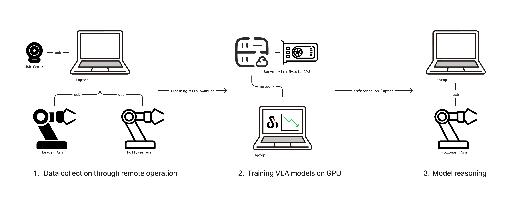

# Getting Started with LeRobot for Embodied Intelligence

[LeRobot](https://github.com/huggingface/lerobot) is an open-source robotics project initiated by [Hugging Face](https://huggingface.co/lerobot). It aims to provide datasets, models, and related tools for real-world robots, lowering the barrier to entry in robotics. LeRobot includes methods for imitation learning and reinforcement learning, and also offers a series of pre-trained models, datasets with human-collected demonstrations, and simulation environments.


The following tutorial primarily discusses how to train your own VLA model based on LeRobot, covering the entire pipeline from data collection and model training to model inference, ultimately enabling a robotic arm to perform grasping tasks autonomously.

> [!NOTE]
>
> **VLA (Vision-Language-Action)** is an advanced multimodal machine learning model that combines vision, language, and action capabilities. It aims to achieve a complete closed-loop capability, directly mapping from perceptual input to robot control actions. To learn more, check out [SmolVLA](https://huggingface.co/blog/smolvla).

## 0. Preparation Phase

Materials needed:

-   A laptop: To set up the LeRobot environment, control the robotic arm, and collect robot data.
-   LeRobot robotic arm kit: Includes a leader and a follower arm. The leader arm is for teleoperation, and the follower arm is for executing actions.
-   A USB camera: To provide video input of the environment, acting as the "eyes" for the robotic arm.
-   A GPU server: For training the model. If your laptop has a GPU, you can also use it for training.

You will also need a large table to provide ample space for the robotic arm's operation. Once everything is ready, the operational flow is as shown in the diagram below:



1.  Connect the leader and follower arms and the camera to the laptop, then collect data via teleoperation.
2.  After collecting the data, train the model on a server with a GPU, and use [SwanLab](https://swanlab.dev/) for training tracking.
3.  Finally, after the model is trained, deploy it on the laptop for inference, enabling the robotic arm to perform grasping tasks autonomously.

> [!Note]
>
> **Teleoperation** is a technique for manually remote-controlling a robotic arm. It involves a leader arm and a follower arm; you manually control the movement of the leader arm, and the follower arm will mimic the motion.

## 1. Installing the LeRobot Environment

You need to set up the LeRobot environment on both your laptop and the training server. The laptop is for controlling the robotic arm, and the server is for model training.

First, clone the LeRobot source code:

```bash
git clone https://github.com/swpfY/lerobot.git
cd lerobot
```

Use [miniconda](https://www.anaconda.com/docs/getting-started/miniconda/install) to create a Python 3.10 virtual environment and activate it:

```bash
conda create -y -n lerobot python=3.10
conda activate lerobot
```

Then, install `ffmpeg` in the conda environment:

```bash
conda install ffmpeg=7.1.1 -c conda-forge
```

> Note that this step requires the specific installation of `ffmpeg=7.1.1`. The latest version of ffmpeg is not compatible at the moment.

Finally, install 🤗LeRobot:

```bash
pip install -e .
```

> [!Important]
>
> Please be aware that the LeRobot repository is currently not stable, and API and script changes may occur. This tutorial uses the LeRobot version corresponding to [commit cf86b93](https://github.com/huggingface/lerobot/commit/cf86b9300dc83fdad408cfe4787b7b09b55f12cf).

Next, install [SwanLab](https://github.com/SwanHubX/SwanLab) and log in:

```bash
pip install -U swanlab
swanlab login
```

## 2. Preparing the Robotic Arm

In this tutorial, we will use the [SO-101](https://huggingface.co/docs/lerobot/so101) model robotic arm for our experiments. The SO-101 kit includes a leader arm (black) and a follower arm (white), as shown below.


[Taobao Purchase Link](https://item.taobao.com/item.htm?ali_trackid=2%3Amm_7587494315_3230200107_115939450462%3A1752723707645_554211053_0&bxsign=tbk5vSLE-62O97Or9VaJAjw5S3OKWmab7-z32DrQ05EAZ5wURXVAqGEK07y49vI0Gv46kNi9NtLNfx3lJJq50RWzGgfWOYS4UXVj1KT7Bx6Ue05TNdo_qHq8mJqBQerRa7N1D2J4ymc4BuoAgmDTgq4M7oXrg2QG3wfsGMA3f5nwRx6RKBu6IuGXUtOv6plztbN&id=878010637397&skuId=5915703371831&union_lens=lensId%3APUB%401742290075%4021662a24_0e69_195a894c064_d4e6%40023oEhJMJDAYtsRzhzp9pESW%40eyJmbG9vcklkIjo4MDY3NCwiic3BtQiiI6Il9wb3J0YWxfdjJfcGFnZXNfcHJvbW9fZ29vZHNfaW5kZXhfaHRtIiiwiic3JjRmxvb3JJZCI6IjgwNjc0In0ie%3BtkScm%3AselectionPlaza_site_4358_0_0_0_30_17422900758127587494315%3Bscm%3A1007.30148.424730.pub_search-item_034ace60-dfa1-4b94-8e7c-d9c9b4cd4b97_%3Brecoveryid%3A554211053_0%401752723707647)

> [!Warning]
>
> When purchasing, you need to select both "SOARM101" and "Servos + Control Board + 3D Printed Parts". After purchase, you will receive the parts and will need to assemble them yourself.

### 2.1 Assembling the Robotic Arm

Since the assembly methods for different kit models vary, you can refer to Seeed's [assembly tutorial](https://wiki.seeedstudio.com/en/lerobot_so100m/#servo-calibration-and-mechanical-arm-assembly).

This assembly step requires some hands-on skill. If a fully assembled kit is available, it's recommended to pay extra for it to skip the personal assembly process.

### 2.2 Notes

(1) The servo models provided in the SO-101 kit are not consistent. The leader arm (black) uses a 5V power supply, and all its servos are the same 7.4V model. The follower arm, however, uses a 12V power supply, and different joints use different servos. Be very careful during assembly and mark them well to prevent burning out the servos. See [Servo Calibration](https://wiki.seeedstudio.com/en/lerobot_so100m/#servo-calibration-and-mechanical-arm-assembly) for details.

(2) The USB and power cables are separate; USB will not power the servos. It's a good idea to use a USB hub between your computer and the servo control board to prevent damage to your computer's ports (though most circuits have protection).

(3) For arm kits purchased before June 30th, the servo driver needs to be upgraded from version 3.9 to 3.10, otherwise, you will encounter compatibility issues. Refer to the [assembly tutorial](https://wiki.seeedstudio.com/en/lerobot_so100m/#servo-calibration-and-mechanical-arm-assembly).

(4) The [tutorial](https://wiki.seeedstudio.com/en/lerobot_so100m/#servo-calibration-and-mechanical-arm-assembly) provided by Seeed is not adapted for the latest version of the LeRobot code. The servo calibration script it provides is from an older version of the repository and is not compatible with the latest version. You need to compare it with the [LeRobot tutorial](https://huggingface.co/docs/lerobot/so101).

(5) Note the method for fixing the arm's clamp as shown below to ensure the arm is securely attached to the edge of the table:


## 3. Calibrating the Robotic Arm

> Note that the LeRobot code used in this tutorial corresponds to [commit cf86b93](https://github.com/huggingface/lerobot/commit/cf86b9300dc83fdad408cfe4787b7b09b55f12cf).

### 3.1 Get the USB Port of the Robotic Arm

Use the following command:

```bash
python -m lerobot.find_port
```

Example output:

```bash
['/dev/tty.usbmodem5AA90178121', '/dev/tty.usbmodem5A7A0161371']
Remove the USB cable from your MotorsBus and press Enter when done.
```

You can see that `/dev/tty.usbmodem5AA90178121` is either the leader or follower arm. You can identify which arm corresponds to which port by plugging them in one by one.

### 3.2 Robotic Arm Calibration

We will calibrate them one by one. First, let's calibrate the follower arm with the following command:

```bash
python -m lerobot.calibrate \
   --robot.type=so101_follower \
   --robot.port=/dev/tty.usbmodem5AA90178121 \
   --robot.id=my_red_robot_arm
```

-   `--robot.port` is the corresponding port, which we obtained using the method above.
-   `--robot.id` is the robotic arm ID. Here, I've defined the follower arm as `my_red_robot_arm`.

Example output:

```bash
❯ python -m lerobot.calibrate \
    --robot.type=so101_follower \
    --robot.port=/dev/tty.usbmodem5AA90178121 \
    --robot.id=my_red_robot_arm

INFO 2025-07-18 11:47:47 calibrate.py:73 {'robot': {'calibration_dir': None,
           'cameras': {},
           'disable_torque_on_disconnect': True,
           'id': 'my_red_robot_arm',
           'max_relative_target': None,
           'port': '/dev/tty.usbmodem5AA90178121',
           'use_degrees': False},
 'teleop': None}
INFO 2025-07-18 11:47:48 follower.py:101 my_red_robot_arm SO101Follower connected.
INFO 2025-07-18 11:47:48 follower.py:108
Running calibration of my_red_robot_arm SO101Follower
Move my_red_robot_arm SO101Follower to the middle of its range of motion and press ENTER....
Move all joints sequentially through their entire ranges of motion.
Recording positions. Press ENTER to stop...

-------------------------------------------
NAME            |    MIN |    POS |    MAX
shoulder_pan    |    790 |   2067 |   3372
shoulder_lift   |    822 |    848 |   3181
elbow_flex      |   1037 |   3076 |   3080
wrist_flex      |    920 |   2879 |   3283
wrist_roll      |    160 |   2036 |   4002
gripper         |   2020 |   2081 |   3391
```

First, we need to move all joints of the robotic arm to the middle of their range of motion and press Enter. Then, we move each joint through its entire range, from minimum to maximum.

As shown in the output above, you can see the `MIN`, `POS`, and `MAX` parameters. The purpose of calibration is to set the range of motion for each joint.

Next, calibrate the leader arm with this example command:

```bash
python -m lerobot.calibrate \
    --teleop.type=so101_leader \
    --teleop.port=/dev/tty.usbmodem5A7A0161371 \
    --teleop.id=my_blue_leader_arm
```

> [!Note]
>
> For detailed operational steps, watch the [official calibration video](https://huggingface.co/docs/lerobot/so101?calibrate_follower=Command#calibration-video).

## 4. Teleoperation Control

Use the following script:

```python
python -m lerobot.teleoperate \
    --robot.type=so101_follower \
    --robot.port=/dev/tty.usbmodem5AA90178121 \
    --robot.id=my_red_robot_arm \
    --teleop.type=so101_leader \
    --teleop.port=/dev/tty.usbmodem5A7A0161371 \
    --teleop.id=my_blue_leader_arm
```

Make sure to modify the `--robot.port`, `--robot.id`, `--teleop.port`, and `--teleop.id` parameters above.

After running the script, you will usually be asked to re-calibrate the follower arm (SO101Follower). The output will be as follows:

```bash
Move my_red_robot_arm SO101Follower to the middle of its range of motion and press ENTER....
Move all joints sequentially through their entire ranges of motion.
Recording positions. Press ENTER to stop...
```

Once this is successfully completed, when you control the leader arm, the follower arm will move along with it.

> [!TIP]
>
> You can save the above command into a shell script for easy execution next time.

## 5. Collecting a Dataset via Teleoperation

### 5.1 Adding a Camera

Use the following command to find the index of the camera connected to your system. The default camera index is `0`:

```bash
python -m lerobot.find_cameras opencv
```

> For more related content, refer to: [Cameras](https://huggingface.co/docs/lerobot/cameras)

You can use the following Python script to check the status of your camera and ensure it is working correctly:

::: details Click to view code

```python
from lerobot.cameras.opencv.configuration_opencv import OpenCVCameraConfig
from lerobot.cameras.opencv.camera_opencv import OpenCVCamera
from lerobot.cameras.configs import ColorMode, Cv2Rotation

# Construct an `OpenCVCameraConfig` with your desired FPS, resolution, color mode, and rotation.
config = OpenCVCameraConfig(
    index_or_path=0,
    fps=15,
    width=1920,
    height=1080,
    color_mode=ColorMode.RGB,
    rotation=Cv2Rotation.NO_ROTATION
)

# Instantiate and connect an `OpenCVCamera`, performing a warm-up read (default).
camera = OpenCVCamera(config)
camera.connect()

# Read frames asynchronously in a loop via `async_read(timeout_ms)`
try:
    for i in range(10):
        frame = camera.async_read(timeout_ms=200)
        print(f"Async frame {i} shape:", frame.shape)
finally:
    camera.disconnect()
```

:::

### 5.2 Login to Hugging Face CLI

We will need to use the [Hugging Face Hub](https://huggingface.co/) to upload datasets and models. Use the following command to log in:

```bash
huggingface-cli login --token ${HUGGINGFACE_TOKEN} --add-to-git-credential
```

`${HUGGINGFACE_TOKEN}` is your Hugging Face access token, which can be obtained from your [settings](https://huggingface.co/settings/tokens).

You can use the following command to check if the login was successful:

```bash
huggingface-cli whoami
```

### 5.3 Recording the Dataset

Use the following script to control the robotic arm and collect the dataset.

::: details Code Details

```python
from lerobot.cameras.opencv.configuration_opencv import OpenCVCameraConfig
from lerobot.datasets.lerobot_dataset import LeRobotDataset
from lerobot.datasets.utils import hw_to_dataset_features
from lerobot.robots.so101_follower import SO101Follower, SO101FollowerConfig
from lerobot.teleoperators.so101_leader.config_so101_leader import SO101LeaderConfig
from lerobot.teleoperators.so101_leader.so101_leader import SO101Leader
from lerobot.utils.control_utils import init_keyboard_listener
from lerobot.utils.utils import log_say
from lerobot.utils.visualization_utils import _init_rerun
from lerobot.record import record_loop

NUM_EPISODES = 50
FPS = 30
EPISODE_TIME_SEC = 60
RESET_TIME_SEC = 10
TASK_DESCRIPTION = "my first task"

# Create the robot and teleoperator configurations
camera_config = {"front": OpenCVCameraConfig(index_or_path=0, width=640, height=480, fps=FPS)}
robot_config = SO101FollowerConfig(
    port="/dev/tty.usbmodem5AA90178121", id="my_red_robot_arm", cameras=camera_config
)
teleop_config = SO101LeaderConfig(port="/dev/tty.usbmodem5A7A0161371", id="my_blue_leader_arm")

# Initialize the robot and teleoperator
robot = SO101Follower(robot_config)
teleop = SO101Leader(teleop_config)

# Configure the dataset features
action_features = hw_to_dataset_features(robot.action_features, "action")
obs_features = hw_to_dataset_features(robot.observation_features, "observation")
dataset_features = {**action_features, **obs_features}

# Create the dataset
dataset = LeRobotDataset.create(
    repo_id="<hf_username>/<dataset_repo_id>",
    fps=FPS,
    features=dataset_features,
    robot_type=robot.name,
    use_videos=True,
    image_writer_threads=4,
)

# Initialize the keyboard listener and rerun visualization
_, events = init_keyboard_listener()
_init_rerun(session_name="recording")

# Connect the robot and teleoperator
robot.connect()
teleop.connect()

episode_idx = 0
while episode_idx < NUM_EPISODES and not events["stop_recording"]:
    log_say(f"Recording episode {episode_idx + 1} of {NUM_EPISODES}")

    record_loop(
        robot=robot,
        events=events,
        fps=FPS,
        teleop=teleop,
        dataset=dataset,
        control_time_s=EPISODE_TIME_SEC,
        single_task=TASK_DESCRIPTION,
        display_data=True,
    )

    # Reset the environment if not stopping or re-recording
    if not events["stop_recording"] and (episode_idx < NUM_EPISODES - 1 or events["rerecord_episode"]):
        log_say("Reset the environment")
        record_loop(
            robot=robot,
            events=events,
            fps=FPS,
            teleop=teleop,
            control_time_s=RESET_TIME_SEC,
            single_task=TASK_DESCRIPTION,
            display_data=True,
        )

    if events["rerecord_episode"]:
        log_say("Re-recording episode")
        events["rerecord_episode"] = False
        events["exit_early"] = False
        dataset.clear_episode_buffer()
        continue

    dataset.save_episode()
    episode_idx += 1

# Clean up
log_say("Stop recording")
robot.disconnect()
teleop.disconnect()
dataset.push_to_hub()
```

:::

There are some important parameters in the code above that you need to modify:

-   `SO101FollowerConfig` and `SO101LeaderConfig` need to be changed to your own arm's configuration, specifically the `port` and `id` parameters.
-   `<hf_username>/<dataset_repo_id>` is the path to your Hugging Face repository. You need to use your own repository path, for example: `swanlab101/lerobot`.

Here are some global configuration parameters that you can choose to change. This is just an explanation:

-   `NUM_EPISODES = 50` means recording 50 sets of data. A complete grasping action is one episode, which means one complete data set.
-   `FPS = 30` means the camera's recording frame rate is 30 frames per second.
-   `EPISODE_TIME_SEC = 60` means the time for each action set is set to 60 seconds.
-   `RESET_TIME_SEC = 10` is the preparation time before starting each action set.

The parameters above mean that the entire dataset requires recording 50 episodes. Each episode is given 60 seconds for recording by default before the next episode begins. The dataset includes the arm's movement video and the motor movement data.

### 5.4 Start Recording

After starting the script, you will hear a voice prompt. Be sure to complete the operation within the specified time. If the arm completes the relevant action within 60 seconds, you can use a shortcut key to end the current recording and start the next one. Here are the shortcuts:

-   Press the right arrow key (**`→`**): End the current data recording early and start the next round.
-   Press the left arrow key (**`←`**): Cancel the current data recording and start recording it again.
-   Press the `ESC` key: Stop the recording operation immediately.

::: details Example Output

```bash
> python record.py
[2025-07-18T05:21:41Z INFO  re_grpc_server] Listening for gRPC connections on 0.0.0.0:9876. Connect by running `rerun --connect rerun+http://127.0.0.1:9876/proxy`
WARNING:pynput.keyboard.Listener:This process is not trusted! Input event monitoring will not be possible until it is added to accessibility clients.
2025-07-18 13:21:41.595 rerun[50048:3893684] +[IMKClient subclass]: chose IMKClient_Modern
2025-07-18 13:21:41.595 rerun[50048:3893684] +[IMKInputSession subclass]: chose IMKInputSession_Modern
Right arrow key pressed. Exiting loop...
Left arrow key pressed. Exiting loop and rerecord the last episode...
Right arrow key pressed. Exiting loop...
Map: 100%|█████████████████████████████████████████████████████████████████████████████| 39/39 [00:00<00:00, 2760.85 examples/s]
Creating parquet from Arrow format: 100%|████████████████████████████████████████████████████████| 1/1 [00:00<00:00, 353.47ba/s]
Svt[info]: -------------------------------------------
Svt[info]: SVT [version]:	SVT-AV1 Encoder Lib v3.0.0
Svt[info]: SVT [build]  :	Apple LLVM 15.0.0 (clang-1500.3.9.4)	 64 bit
Svt[info]: LIB Build date: Jul  3 2025 03:06:26
Svt[info]: -------------------------------------------
Svt[info]: Level of Parallelism: 5
Svt[info]: Number of PPCS 140
Svt[info]: [asm level on system : up to neon_i8mm]
Svt[info]: [asm level selected : up to neon_i8mm]
Svt[info]: -------------------------------------------
Svt[info]: SVT [config]: main profile	tier (auto)	level (auto)
Svt[info]: SVT [config]: width / height / fps numerator / fps denominator 		: 640 / 480 / 30 / 1
Svt[info]: SVT [config]: bit-depth / color format 					: 8 / YUV420
Svt[info]: SVT [config]: preset / tune / pred struct 					: 8 / PSNR / random access
Svt[info]: SVT [config]: gop size / mini-gop size / key-frame type 			: 2 / 32 / key frame
Svt[info]: SVT [config]: BRC mode / rate factor 					: CRF / 30
Svt[info]: SVT [config]: AQ mode / variance boost 					: 2 / 0
Svt[info]: SVT [config]: sharpness / luminance-based QP bias 			: 0 / 0
Svt[info]: Svt[info]: -------------------------------------------
```

:::

During recording, [rerun](https://rerun.io/) will start, displaying motor parameters and the arm's movement video. We can use it to monitor the follower arm's state.


Here is an example video of one episode:

<video height="400" controls>
  <source src="./assets/episode_000000.mp4" type="video/mp4">
  Your browser does not support the video tag.
</video>

> [!Note]
>
> Example dataset reference: [ink-swpfy/lrobot4](https://huggingface.co/datasets/ink-swpfy/lrobot4)

### 5.5 Recording Tips

-   You can first collect a small dataset (e.g., 5 episodes) to familiarize yourself with the entire process. Once you are comfortable, you can create a larger dataset for training.

-   A good starting task is to pick up a colored rectangular block and place it into a box. The object to be grasped should have a distinct color, like yellow. A rectangular shape is easier for the arm to grasp and is less likely to be obscured from the camera's view.
-   It is recommended to record at least 50 episodes, with 10 episodes for each position. Keep the camera fixed and maintain consistent grasping behavior throughout the recording process.
-   A good rule of thumb is that you should be able to complete the task just by looking at the camera image.

> For more, refer to the [Official Tutorial](https://huggingface.co/docs/lerobot/il_robots?record=API+example#tips-for-gathering-data)

## 6. Training the Model

### 6.1 Start Training

Use the following script on the GPU server to start training:

```bash
python -m lerobot.scripts.train \
  --dataset.repo_id=${HF_USER}/lrobot2 \
  --policy.type=act \
  --output_dir=outputs/train/lrobot \
  --job_name=lrobot_test \
  --policy.device=cuda \
  --wandb.enable=false \
  --policy.repo_id=${HF_USER}/lrobot_model \
  --tracker=swanlab \
  --swanlab.project=my_lrobot \
  --swanlab.mode=cloud
```

-   `--dataset.repo_id` should be set to the path of the dataset you uploaded to Hugging Face.
-   `--policy.type=act` is the training policy, which will automatically adapt to the motor states, motor actions, and number of cameras of the robot saved in the dataset.
-   `--output_dir` is the model output path. The final model will be saved in the `outputs/train/lrobot/checkpoints` directory.
-   `--policy.device=cuda` indicates that we are using an Nvidia GPU for training. If you need to train on an Apple M-series chip computer, you can set it to `--policy.device=mps`.
-   `--swanlab.project=my_lrobot` represents the corresponding project name in SwanLab.

Training will take several hours. On a laptop with a 3060 8GB GPU, training with 50 episodes takes about 6 hours. On a computer with a 4090 or A100, training with 50 episodes takes about 2-3 hours.

::: details Command Line Example Output

```bash
swanlab: 👋 Hi ink,welcome to swanlab!
swanlab: Syncing run pig-13 to the cloud
swanlab: 🏠 View project at https://swanlab.cn/@ink/my_lrobot
swanlab: 🚀 View run at https://swanlab.cn/@ink/my_lrobot/runs/6er56ixwsjqq5v5chwxyz
Logs will be synced with swanlab.
INFO 2025-07-18 06:09:22 lab_utils.py:95 Track this run --> https://swanlab.cn/@ink/my_lrobot/runs/ogl0bza0i5xlorw08bp4r
INFO 2025-07-18 06:09:22 ts/train.py:134 Creating dataset
Resolving data files: 100%|████████████████████████████████████████████████| 50/50 [00:00<00:00, 157562.13it/s]
=== Debug Info ===
datasets version: 2.19.0
torch version: 2.7.1+cu126
hf_dataset type: <class 'datasets.arrow_dataset.Dataset'>
timestamp column type: <class 'list'>
timestamp column methods: ['__add__', '__class__', '__class_getitem__', '__contains__', '__delattr__', '__delitem__', '__dir__', '__doc__', '__eq__', '__format__', '__ge__', '__getattribute__', '__getitem__', '__gt__', '__hash__', '__iadd__', '__imul__', '__init__', '__init_subclass__', '__iter__', '__le__', '__len__', '__lt__', '__mul__', '__ne__', '__new__', '__reduce__', '__reduce_ex__', '__repr__', '__reversed__', '__rmul__', '__setattr__', '__setitem__', '__sizeof__', '__str__', '__subclasshook__', 'append', 'clear', 'copy', 'count', 'extend', 'index', 'insert', 'pop', 'remove', 'reverse', 'sort']
has transform: False
===============
INFO 2025-07-18 06:09:24 ts/train.py:145 Creating policy
INFO 2025-07-18 06:09:25 ts/train.py:151 Creating optimizer and scheduler
INFO 2025-07-18 06:09:25 ts/train.py:163 Output dir: outputs/train/lrobot4
INFO 2025-07-18 06:09:25 ts/train.py:166 cfg.steps=100000 (100K)
INFO 2025-07-18 06:09:25 ts/train.py:167 dataset.num_frames=23984 (24K)
INFO 2025-07-18 06:09:25 ts/train.py:168 dataset.num_episodes=50
INFO 2025-07-18 06:09:25 ts/train.py:169 num_learnable_params=51597190 (52M)
INFO 2025-07-18 06:09:25 ts/train.py:170 num_total_params=51597232 (52M)
INFO 2025-07-18 06:09:25 ts/train.py:209 Start offline training on a fixed dataset
INFO 2025-07-18 06:09:42 ts/train.py:239 step:200 smpl:2K ep:3 epch:0.07 loss:6.785 grdn:153.774 lr:1.0e-05 updt_s:0.078 data_s:0.003
INFO 2025-07-18 06:09:56 ts/train.py:239 step:400 smpl:3K ep:7 epch:0.13 loss:3.020 grdn:83.672 lr:1.0e-05 updt_s:0.071 data_s:0.000
```
:::

> [!Note]
>
> Since the Hugging Face website is hosted overseas, if your dataset fails to upload to the Hugging Face Hub, you can manually upload the dataset collected on your local laptop to the server via SFTP for training. The dataset path is: `~/.cache/huggingface/lerobot/<HF_USER>/lrobot`.
>
> The path on the GPU server should be consistent, as LeRobot will look for the dataset in `~/.cache/huggingface/lerobot` by default.

### 6.2 Observing Training with SwanLab

After starting the training command, a SwanLab project link will be printed in the console. You can open this link in a web browser to view the model's training status, as shown below:


Pay close attention to the `train/loss` and `train/grad_norm` metrics. When the training reaches around 40,000 steps, the model has generally converged. By default, LeRobot trains for 100,000 steps, but you can control the number of training steps by setting the `--step=40000` parameter.

> [!Note]
>
> [Example SwanLab Project](https://swanlab.cn/@ink/my_lrobot/runs/6er56ixwsjqq5v5chwxyz/chart)

## 7. Model Inference & Autonomous Arm Control

### 7.1 Execute Inference

After the training is complete, the model will be uploaded to the Hugging Face Hub. We can now use the model to make the robotic arm perform autonomous grasping. Here is the code:

::: details Code Details

```python
from lerobot.cameras.opencv.configuration_opencv import OpenCVCameraConfig
from lerobot.datasets.lerobot_dataset import LeRobotDataset
from lerobot.datasets.utils import hw_to_dataset_features
from lerobot.policies.act.modeling_act import ACTPolicy
from lerobot.robots.so101_follower.config_so101_follower import SO101FollowerConfig
from lerobot.robots.so101_follower.so101_follower import SO101Follower
from lerobot.utils.control_utils import init_keyboard_listener
from lerobot.utils.utils import log_say
from lerobot.utils.visualization_utils import _init_rerun
from lerobot.record import record_loop

NUM_EPISODES = 10
FPS = 30
EPISODE_TIME_SEC = 60
TASK_DESCRIPTION = "My task description"

# Create the robot configuration
camera_config = {"front": OpenCVCameraConfig(index_or_path=0, width=640, height=480, fps=FPS)}
robot_config = SO101FollowerConfig(
    port="/dev/tty.usbmodem5AA90178121", id="my_red_robot_arm", cameras=camera_config
)

# Initialize the robot
robot = SO101Follower(robot_config)

# Initialize the policy
policy = ACTPolicy.from_pretrained("<HF_USER>/lrobot")

# Configure the dataset features
action_features = hw_to_dataset_features(robot.action_features, "action")
obs_features = hw_to_dataset_features(robot.observation_features, "observation")
dataset_features = {**action_features, **obs_features}

# Create the dataset
dataset = LeRobotDataset.create(
    repo_id="<HF_USER>/eval_lrobot",
    fps=FPS,
    features=dataset_features,
    robot_type=robot.name,
    use_videos=True,
    image_writer_threads=4,
)

# Initialize the keyboard listener and rerun visualization
_, events = init_keyboard_listener()
_init_rerun(session_name="recording")

# Connect the robot
robot.connect()

for episode_idx in range(NUM_EPISODES):
    log_say(f"Running inference, recording eval episode {episode_idx + 1} of {NUM_EPISODES}")

    # Run the policy inference loop
    record_loop(
        robot=robot,
        events=events,
        fps=FPS,
        policy=policy,
        dataset=dataset,
        control_time_s=EPISODE_TIME_SEC,
        single_task=TASK_DESCRIPTION,
        display_data=True,
    )

    dataset.save_episode()

# Clean up
robot.disconnect()
dataset.push_to_hub()
```

:::

Places to modify in the code above:

-   `SO101FollowerConfig` contains the parameters for the follower arm; you need to change them to match your arm.
-   `ACTPolicy.from_pretrained()` needs to be changed to your own model path.
-   `LeRobotDataset` is for the model evaluation dataset; you need to change `<HF_USER>` to your own Hugging Face username.

The code above is used to collect a dataset for model evaluation. Therefore, like teleoperation data collection, it will also involve recording, but it will not use the leader arm; the follower arm will move and grasp autonomously. The parameter meanings are:

-   `NUM_EPISODES` is the number of times to execute.
-   `EPISODE_TIME_SEC` is the duration of each run, set to 60 seconds.

> [!Note]
>
> [Example Model](https://huggingface.co/ink-swpfy/lrobot2)

### 7.2 Autonomous Grasping Example

Here is an example video:

<video height="400" controls>
  <source src="./assets/episode_000000_eval.mp4" type="video/mp4">
  Your browser does not support the video tag.
</video>

The grasping performance is heavily influenced by the training dataset and the environment. For example, running inference during the day versus at night can produce significant differences in results. The camera's installation position affects the dataset, which in turn affects the actual model performance. It is recommended to operate in a large, clear desk space with minimal environmental interference.

## 8. Related Links

-   [Robotic Arm Assembly Tutorial - Seeed Studio](https://wiki.seeedstudio.com/en/lerobot_so100m/#servo-calibration-and-mechanical-arm-assembly)
-   [LeRobot Project with SwanLab Integration](https://github.com/swpfY/lerobot) (The official repository has not yet merged the SwanLab-related PR)
-   [LeRobot Official Documentation](https://huggingface.co/docs/lerobot/index)
-   [SO101 Robotic Arm Taobao Purchase Link](https://item.taobao.com/item.htm?ali_trackid=2%3Amm_7587494315_3230200107_115939450462%3A1752723707645_554211053_0&bxsign=tbk5vSLE-62O97Or9VaJAjw5S3OKWmab7-z32DrQ05EAZ5wURXVAqGEK07y49vI0Gv46kNi9NtLNfx3lJJq50RWzGgfWOYS4UXVj1KT7Bx6Ue05TNdo_qHq8mJqBQerRa7N1D2J4ymc4BuoAgmDTgq4M7oXrg2QG3wfsGMA3f5nwRx6RKBu6IuGXUtOv6plztbN&id=878010637397&skuId=5915703371831&union_lens=lensId%3APUB%401742290075%4021662a24_0e69_195a894c064_d4e6%40023oEhJMJDAYtsRzhzp9pESW%40eyJmbG9vcklkIjo4MDY3NCwiic3BtQiiI6Il9wb3J0YWxfdjJfcGFnZXNfcHJvbW9fZ29vZHNfaW5kZXhfaHRtIiiwiic3JjRmxvb3JJZCI6IjgwNjc0In0ie%3BtkScm%3AselectionPlaza_site_4358_0_0_0_30_17422900758127587494315%3Bscm%3A1007.30148.424730.pub_search-item_034ace60-dfa1-4b94-8e7c-d9c9b4cd4b97_%3Brecoveryid%3A554211053_0%401752723707647)
-   [SwanLab Official Website](https://swanlab.dev/)
