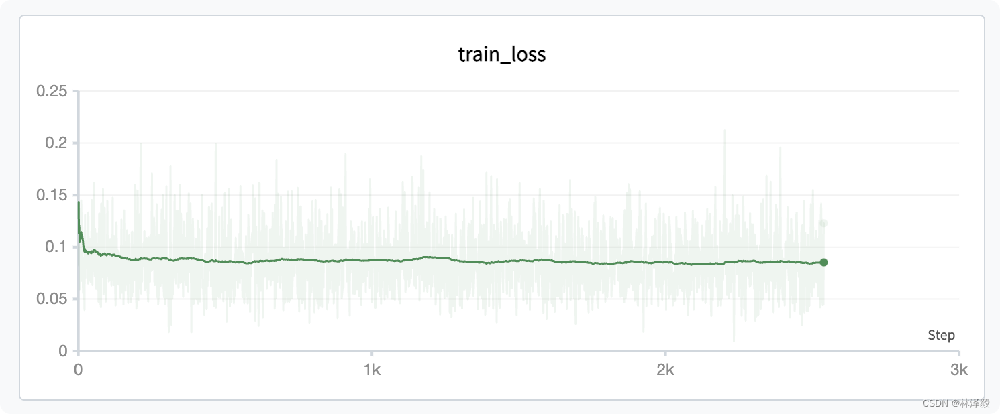
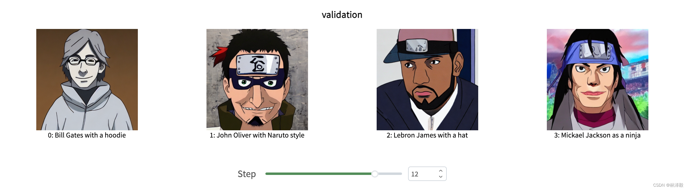

# Fine-tuning Stable Diffusion for Text-to-Image Generation

[Zhihu Tutorial](https://zhuanlan.zhihu.com/p/703921817) | [Online Demo](https://swanlab.cn/@ZeyiLin/SD-Naruto/runs/664kdc104y0v90i8221hf/chart)

[Stable Diffusion 1.5](https://huggingface.co/runwayml/stable-diffusion-v1-5/tree/main) (SD1.5) is a text-to-image model open-sourced by Stability AI on August 22, 2022. It is one of the most classic and community-active models in the SD series.

Using SD1.5 as a pre-trained model, fine-tuning a Naruto-style text-to-image model (non-LoRA approach) on the Naruto dataset is an introductory task for learning **SD training**.


> **VRAM Requirement**: Approximately 22GB

In this article, we will use the [SD-1.5](https://huggingface.co/runwayml/stable-diffusion-v1-5) model to train on the [Naruto](https://huggingface.co/datasets/lambdalabs/naruto-blip-captions) dataset, while monitoring the training process and evaluating model performance using [SwanLab](https://swanlab.cn).

- Code: [Github](https://github.com/Zeyi-Lin/Stable-Diffusion-Example)
- Experiment Log: [SD-naruto - SwanLab](https://swanlab.cn/@ZeyiLin/SD-Naruto/runs/21flglg1lbnqo67a6f1kr/environment/requirements)
- Model: [runwayml/stable-diffusion-v1-5](https://huggingface.co/runwayml/stable-diffusion-v1-5)
- Dataset: [lambdalabs/naruto-blip-captions](https://huggingface.co/datasets/lambdalabs/naruto-blip-captions)
- SwanLab: [https://swanlab.cn](https://swanlab.cn)

---

## 1. Environment Setup

This case study is based on **Python>=3.8**. Please ensure Python is installed on your computer.

Additionally, your computer should have at least one NVIDIA GPU (approximately 22GB VRAM required).

We need to install the following Python libraries. Before that, make sure you have installed PyTorch and CUDA in your environment:

```txt
swanlab
diffusers
datasets
accelerate
torchvision
transformers
```

One-click installation command:

```bash
pip install swanlab diffusers datasets accelerate torchvision transformers
```

> The code in this article was tested with `diffusers==0.29.0`, `accelerate==0.30.1`, `datasets==2.18.0`, `transformers==4.41.2`, and `swanlab==0.3.11`. For more library versions, please refer to the [Python environment recorded by SwanLab](https://swanlab.cn/@ZeyiLin/Text2Image/runs/21flglg1lbnqo67a6f1kr/environment/requirements).

---

## 2. Prepare the Dataset

This case study uses the [Naruto](https://huggingface.co/datasets/lambdalabs/naruto-blip-captions) dataset, which is primarily used for training text-to-image models.

The dataset consists of 1200 (image, description) pairs, where the left side is an image of a Naruto character, and the right side is its description:


Our training task aims to enable the trained SD model to generate Naruto-style images based on input prompts:


---

The dataset size is approximately 700MB. There are two ways to download the dataset:

1. If your network connection to HuggingFace is stable, simply run the code provided below, and it will be downloaded directly via HF's `datasets` library.
2. If there are network issues, I have also uploaded it to [Baidu Netdisk](https://pan.baidu.com/s/1Yu5HjXnHxK0Wgymc8G-g5g?pwd=gtk8) (extraction code: gtk8). Download `naruto-blip-captions.zip`, extract it locally, and place it in the same directory as the training script.

---

## 3. Prepare the Model

Here, we use the [stable-diffusion-v1-5](https://huggingface.co/runwayml/stable-diffusion-v1-5) model released by Runway on HuggingFace.


There are two ways to download the model:

1. If your network connection to HuggingFace is stable, simply run the code provided below, and it will be downloaded directly via HF's `transformers` library.
2. If there are network issues, I have also uploaded it to [Baidu Netdisk](https://pan.baidu.com/s/1Yu5HjXnHxK0Wgymc8G-g5g?pwd=gtk8) (extraction code: gtk8). Download `stable-diffusion-v1-5.zip`, extract it locally, and place it in the same directory as the training script.

---

## 4. Configure Training Visualization Tool

We use [SwanLab](https://swanlab.cn) to monitor the entire training process and evaluate the final model performance.

If this is your first time using SwanLab, you need to register an account at https://swanlab.cn, copy your API Key from the **User Settings** page, and paste it when the training starts:


---

## 5. Start Training

Since the training code is relatively long, I have placed it on [Github](https://github.com/Zeyi-Lin/Stable-Diffusion-Example/tree/main). Please clone the code:

```bash
git clone https://github.com/Zeyi-Lin/Stable-Diffusion-Example.git
```

If your network connection to HuggingFace is stable, simply run the training:

```bash
python train_sd1-5_naruto.py \
  --use_ema \
  --resolution=512 --center_crop --random_flip \
  --train_batch_size=1 \
  --gradient_accumulation_steps=4 \
  --gradient_checkpointing \
  --max_train_steps=15000 \
  --learning_rate=1e-05 \
  --max_grad_norm=1 \
  --seed=42 \
  --lr_scheduler="constant" \
  --lr_warmup_steps=0 \
  --output_dir="sd-naruto-model"
```

The meanings of the above parameters are as follows:

- `--use_ema`: Use Exponential Moving Average (EMA) technique, which can improve the model's generalization ability by using the moving average of model parameters for prediction during training instead of directly using the current model parameters.
- `--resolution=512`: Set the resolution of training images to 512 pixels.
- `--center_crop`: Perform center cropping on images, using the central part of the image as the training sample and ignoring the edges.
- `--random_flip`: Randomly flip images during training to increase the diversity of training data.
- `--train_batch_size=1`: Set the training batch size to 1, meaning only one image is used per training iteration.
- `--gradient_accumulation_steps=4`: Set gradient accumulation steps to 4, meaning parameters are updated every 4 training steps.
- `--gradient_checkpointing`: Use gradient checkpointing to reduce memory usage and speed up training.
- `--max_train_steps=15000`: Set the maximum training steps to 15000.
- `--learning_rate=1e-05`: Set the learning rate to 1e-05.
- `--max_grad_norm=1`: Set the maximum gradient norm to 1 to prevent gradient explosion.
- `--seed=42`: Set the random seed to 42 to ensure consistent randomness during training.
- `--lr_scheduler="constant"`: Use a constant learning rate scheduler, keeping the learning rate unchanged throughout the training process.
- `--lr_warmup_steps=0`: Set the learning rate warmup steps to 0, meaning no warmup is performed.
- `--output_dir="sd-naruto-model"`: Set the model output directory to "sd-naruto-model".

---

If you downloaded the model or dataset from **the above Baidu Netdisk link**, you need to do the following two things:

**Step 1**: Place the dataset and model folders in the same directory as the training script. The file structure should look like this:

```txt
|--- sd_config.py
|--- train_sd1-5_naruto.py
|--- stable-diffusion-v1-5
|--- naruto-blip-captions
```

`stable-diffusion-v1-5` is the downloaded model folder, and `naruto-blip-captions` is the downloaded dataset folder.

**Step 2**: Modify the code in `sd_config.py` to change the `default` values of `pretrained_model_name_or_path` and `dataset_name` as follows:

```python
    parser.add_argument(
        "--pretrained_model_name_or_path",
        type=str,
        default="./stable-diffusion-v1-5",
    )
    parser.add_argument(
        "--dataset_name",
        type=str,
        default="./naruto-blip-captions",
    )
```

Then run the startup command.

---

When you see the following progress bar, it means the training has started:


---

## 6. Training Results Demonstration

We can view the final training results on [SwanLab](https://swanlab.cn/@ZeyiLin/SD-Naruto/runs/21flglg1lbnqo67a6f1kr/chart):


You can see that the characteristic of SD training is that the loss keeps oscillating. As the epochs increase, the loss initially decreases, but subsequent changes are not significant:


Let's take a look at the subjectively generated images. The images from the first epoch look like this:



You can see that LeBron James still looks very "original," and Michael Jackson's generated image looks a bit strange...

Now let's look at the intermediate state:




After a relatively long training period, the results improve significantly.

> Interestingly, Bill Gates' generated image always seems to have a very evil vibe...


At this point, you have completed the training of the SD model on the Naruto dataset.

---

## 7. Model Inference

The trained model will be saved in the `sd-naruto-model` folder. The inference code is as follows:

```python
from diffusers import StableDiffusionPipeline
import torch

model_id = "./sd-naruto-model"
pipe = StableDiffusionPipeline.from_pretrained(model_id, torch_dtype=torch.float16)
pipe = pipe.to("cuda")

prompt = "Lebron James with a hat"
image = pipe(prompt).images[0]  
    
image.save("result.png")
```

---

## Related Links

- Code: [Github](https://github.com/Zeyi-Lin/Stable-Diffusion-Example)
- Experiment Log: [SD-naruto - SwanLab](https://swanlab.cn/@ZeyiLin/SD-Naruto/runs/21flglg1lbnqo67a6f1kr/environment/requirements)
- Model: [runwayml/stable-diffusion-v1-5](https://huggingface.co/runwayml/stable-diffusion-v1-5)
- Dataset: [lambdalabs/naruto-blip-captions](https://huggingface.co/datasets/lambdalabs/naruto-blip-captions)
- SwanLab: [https://swanlab.cn](https://swanlab.cn)