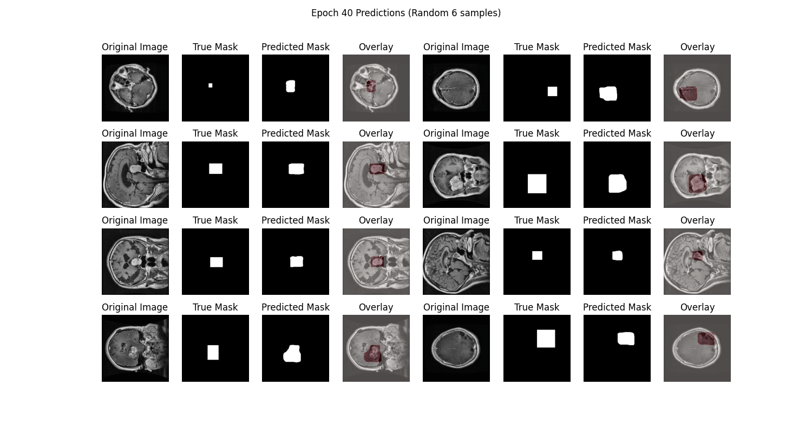
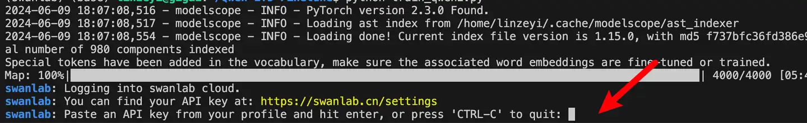
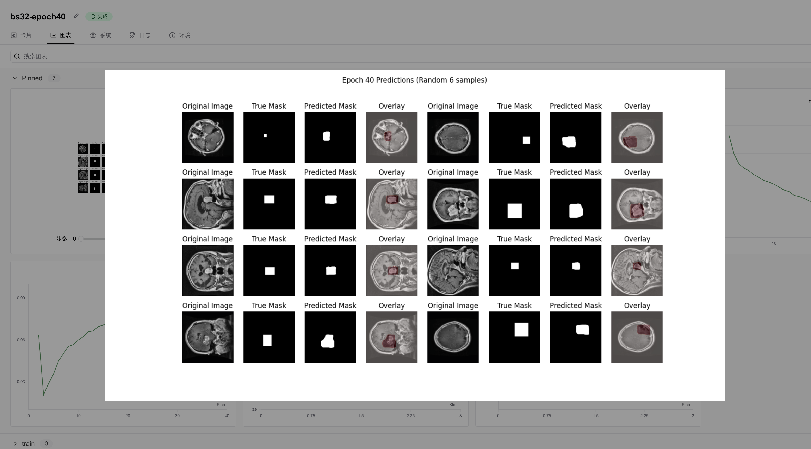

# UNet for Medical Image Segmentation  

:::info  
Computer Vision, Medical Imaging, Image Segmentation  
:::  

[](https://swanlab.cn/@ZeyiLin/Unet-Medical-Segmentation/runs/67konj7kdqhnfdmusy2u6/chart)  

[Training Process](https://swanlab.cn/@ZeyiLin/Unet-Medical-Segmentation/runs/67konj7kdqhnfdmusy2u6/chart)  

UNet is a convolutional neural network (CNN)-based model for medical image segmentation, proposed by Ronneberger et al. in 2015. In this article, we will briefly introduce training a UNet model on a brain tumor medical image segmentation dataset using the PyTorch framework, while monitoring the training process with SwanLab to achieve intelligent localization of lesion areas or organ structures.  

  

• **Code**: Full code available in Section 5 or on [Github](https://github.com/Zeyi-Lin/UNet-Medical)  
• **Training Logs**: [Unet-Medical-Segmentation - SwanLab](https://swanlab.cn/@ZeyiLin/Unet-Medical-Segmentation/runs/67konj7kdqhnfdmusy2u6/chart)  
• **Model**: UNet (implemented directly in PyTorch)  
• **Dataset**: [brain-tumor-image-dataset-semantic-segmentation - Kaggle](https://www.kaggle.com/datasets/pkdarabi/brain-tumor-image-dataset-semantic-segmentation)  
• **SwanLab**: [https://swanlab.cn](https://swanlab.cn)  

---  

## 1. Environment Setup  

The environment setup consists of three steps:  

1. Ensure your computer has at least one NVIDIA GPU with CUDA installed.  
2. Install Python (version ≥ 3.8) and PyTorch with CUDA support.  
3. Install third-party libraries required for UNet fine-tuning using the following commands:  

```bash  
git clone https://github.com/Zeyi-Lin/UNet-Medical.git  
cd UNet-Medical  
pip install -r requirements.txt  
```  

## 2. Dataset Preparation  

This section uses the [Brain Tumor Segmentation Dataset](https://www.kaggle.com/datasets/pkdarabi/brain-tumor-image-dataset-semantic-segmentation), which is specifically designed for medical image segmentation tasks.  

> **Dataset Description**: The Brain Tumor Segmentation Dataset is tailored for semantic segmentation in medical imaging, aiming to accurately identify brain tumor regions. It contains binary annotations (tumor/non-tumor) and enables pixel-level classification for fine-grained tumor segmentation. This dataset is suitable for training and evaluating medical image segmentation models, providing automated analysis support for brain tumor diagnosis.  

  

For this task, we will download and extract the dataset for subsequent training.  

**Download and Extract the Dataset**:  

```bash  
python download.py  
unzip dataset/Brain_Tumor_Image_DataSet.zip -d dataset/  
```  

After completing these steps, you should see the following directory structure:  

  

The folder contains training, validation, and test sets with image files (in `jpg` format) and annotation files (in `json` format). At this point, the dataset preparation is complete.  

Below are some detailed code snippets. If you want to start training immediately, skip to Section 5.  

## 3. Model Implementation  

Here, we implement the UNet model in PyTorch (in `net.py`). The code is shown below:  

```python  
import torch  
import torch.nn as nn  

# Define the downsampling block for the U-Net model  
class DownBlock(nn.Module):  
    def __init__(self, in_channels, out_channels, dropout_prob=0, max_pooling=True):  
        super(DownBlock, self).__init__()  
        self.conv1 = nn.Conv2d(in_channels, out_channels, 3, padding=1)  
        self.conv2 = nn.Conv2d(out_channels, out_channels, 3, padding=1)  
        self.relu = nn.ReLU(inplace=True)  
        self.maxpool = nn.MaxPool2d(2) if max_pooling else None  
        self.dropout = nn.Dropout(dropout_prob) if dropout_prob > 0 else None  

    def forward(self, x):  
        x = self.relu(self.conv1(x))  
        x = self.relu(self.conv2(x))  
        if self.dropout:  
            x = self.dropout(x)  
        skip = x  
        if self.maxpool:  
            x = self.maxpool(x)  
        return x, skip  

# Define the upsampling block for the U-Net model  
class UpBlock(nn.Module):  
    def __init__(self, in_channels, out_channels):  
        super(UpBlock, self).__init__()  
        self.up = nn.ConvTranspose2d(in_channels, out_channels, kernel_size=2, stride=2)  
        self.conv1 = nn.Conv2d(out_channels * 2, out_channels, 3, padding=1)  
        self.conv2 = nn.Conv2d(out_channels, out_channels, 3, padding=1)  
        self.relu = nn.ReLU(inplace=True)  

    def forward(self, x, skip):  
        x = self.up(x)  
        x = torch.cat([x, skip], dim=1)  
        x = self.relu(self.conv1(x))  
        x = self.relu(self.conv2(x))  
        return x  

# Define the complete U-Net model  
class UNet(nn.Module):  
    def __init__(self, n_channels=3, n_classes=1, n_filters=32):  
        super(UNet, self).__init__()  
        
        # Encoder path  
        self.down1 = DownBlock(n_channels, n_filters)  
        self.down2 = DownBlock(n_filters, n_filters * 2)  
        self.down3 = DownBlock(n_filters * 2, n_filters * 4)  
        self.down4 = DownBlock(n_filters * 4, n_filters * 8)  
        self.down5 = DownBlock(n_filters * 8, n_filters * 16)  
        
        # Bottleneck layer (remove final max-pooling)  
        self.bottleneck = DownBlock(n_filters * 16, n_filters * 32, dropout_prob=0.4, max_pooling=False)  
        
        # Decoder path  
        self.up1 = UpBlock(n_filters * 32, n_filters * 16)  
        self.up2 = UpBlock(n_filters * 16, n_filters * 8)  
        self.up3 = UpBlock(n_filters * 8, n_filters * 4)  
        self.up4 = UpBlock(n_filters * 4, n_filters * 2)  
        self.up5 = UpBlock(n_filters * 2, n_filters)  
        
        # Output layer  
        self.outc = nn.Conv2d(n_filters, n_classes, 1)  
        self.sigmoid = nn.Sigmoid()  

    def forward(self, x):  
        # Encoder path  
        x1, skip1 = self.down1(x)      # 128  
        x2, skip2 = self.down2(x1)     # 64  
        x3, skip3 = self.down3(x2)     # 32  
        x4, skip4 = self.down4(x3)     # 16  
        x5, skip5 = self.down5(x4)     # 8  
        
        # Bottleneck layer  
        x6, skip6 = self.bottleneck(x5)  # 8 (no downsampling)  
        
        # Decoder path  
        x = self.up1(x6, skip5)    # 16  
        x = self.up2(x, skip4)     # 32  
        x = self.up3(x, skip3)     # 64  
        x = self.up4(x, skip2)     # 128  
        x = self.up5(x, skip1)     # 256  
        
        x = self.outc(x)  
        x = self.sigmoid(x)  
        return x  
```  

The model is saved as a `pth` file, requiring approximately 124 MB.  

## 4. Experiment Tracking with SwanLab  

[SwanLab](https://github.com/swanhubx/swanlab) is an open-source tool for training experiment tracking. Designed for AI researchers, SwanLab provides training visualization, automatic logging, hyperparameter recording, experiment comparison, and multi-user collaboration. With SwanLab, researchers can identify training issues through intuitive visualizations, compare multiple experiments for inspiration, and share results via online links to facilitate team collaboration.   

For this training session, we configure SwanLab with the project name `Unet-Medical-Segmentation`, experiment name `bs32-epoch40`, and the following hyperparameters:  

```python  
swanlab.init(  
    project="Unet-Medical-Segmentation",  
    experiment_name="bs32-epoch40",  
    config={  
        "batch_size": 32,  
        "learning_rate": 1e-4,  
        "num_epochs": 40,  
        "device": "cuda" if torch.cuda.is_available() else "cpu",  
    },  
)  
```  

Here, the batch size is 32, the learning rate is 1e-4, and the training runs for 40 epochs.  

For first-time SwanLab users, register an account on the [official website](https://swanlab.cn), copy your API Key from the user settings page, and paste it when prompted during training. Subsequent logins will not require this step:  

  

## 5. Start Training  

View the training visualization: <a href="https://swanlab.cn/@ZeyiLin/Unet-Medical-Segmentation/runs/67konj7kdqhnfdmusy2u6/chart" target="_blank">Unet-Medical-Segmentation</a>  

**This section accomplishes the following:**  
1. Loads the UNet model.  
2. Prepares the dataset (training, validation, and test sets) with resizing to (256, 256) and normalization.  
3. Uses SwanLab to log training metrics, hyperparameters, and final model outputs.  
4. Trains for 40 epochs.  
5. Generates final prediction visualizations.  

The directory structure before execution should be:  

```
|———— dataset/  
|———————— train/  
|———————— val/  
|———————— test/  
|———— readme_files/  
|———— train.py  
|———— data.py  
|———— net.py  
|———— download.py  
|———— requirements.txt  
```  

**Full Code**  

train.py:  

```python  
import torch  
import torch.nn as nn  
import torch.optim as optim  
import matplotlib.pyplot as plt  
from pycocotools.coco import COCO  
from torch.utils.data import DataLoader  
import torchvision.transforms as transforms  
import random  
import swanlab  
from net import UNet  
from data import COCOSegmentationDataset  


# Dataset paths  
train_dir = './dataset/train'  
val_dir = './dataset/valid'  
test_dir = './dataset/test'  

train_annotation_file = './dataset/train/_annotations.coco.json'  
test_annotation_file = './dataset/test/_annotations.coco.json'  
val_annotation_file = './dataset/valid/_annotations.coco.json'  

# Load COCO datasets  
train_coco = COCO(train_annotation_file)  
val_coco = COCO(val_annotation_file)  
test_coco = COCO(test_annotation_file)  

# Loss functions  
def dice_loss(pred, target, smooth=1e-6):  
    pred_flat = pred.view(-1)  
    target_flat = target.view(-1)  
    intersection = (pred_flat * target_flat).sum()  
    return 1 - ((2. * intersection + smooth) / (pred_flat.sum() + target_flat.sum() + smooth))  

def combined_loss(pred, target):  
    dice = dice_loss(pred, target)  
    bce = nn.BCELoss()(pred, target)  
    return 0.6 * dice + 0.4 * bce  

# Training function  
def train_model(model, train_loader, val_loader, criterion, optimizer, num_epochs, device):  
    best_val_loss = float('inf')  
    patience = 8  
    patience_counter = 0  

    for epoch in range(num_epochs):  
        model.train()  
        train_loss = 0  
        train_acc = 0  
        
        for images, masks in train_loader:  
            images, masks = images.to(device), masks.to(device)  
            
            optimizer.zero_grad()  
            outputs = model(images)  
            loss = criterion(outputs, masks)  
            
            loss.backward()  
            optimizer.step()  
            
            train_loss += loss.item()  
            train_acc += (outputs.round() == masks).float().mean().item()  

        train_loss /= len(train_loader)  
        train_acc /= len(train_loader)  
        
        # Validation  
        model.eval()  
        val_loss = 0  
        val_acc = 0  
        
        with torch.no_grad():  
            for images, masks in val_loader:  
                images, masks = images.to(device), masks.to(device)  
                outputs = model(images)  
                loss = criterion(outputs, masks)  
                
                val_loss += loss.item()  
                val_acc += (outputs.round() == masks).float().mean().item()  
        
        val_loss /= len(val_loader)  
        val_acc /= len(val_loader)  
        
        swanlab.log(  
            {  
                "train/loss": train_loss,  
                "train/acc": train_acc,  
                "train/epoch": epoch+1,  
                "val/loss": val_loss,  
                "val/acc": val_acc,  
            },  
            step=epoch+1)  
        
        print(f'Epoch {epoch+1}/{num_epochs}:')  
        print(f'Train Loss: {train_loss:.4f}, Train Acc: {train_acc:.4f}')  
        print(f'Val Loss: {val_loss:.4f}, Val Acc: {val_acc:.4f}')  
        
        # Early stopping  
        if val_loss < best_val_loss:  
            best_val_loss = val_loss  
            patience_counter = 0  
            torch.save(model.state_dict(), 'best_model.pth')  
        else:  
            patience_counter += 1  
            if patience_counter >= patience:  
                print("Early stopping triggered")  
                break  

def main():  
    swanlab.init(  
        project="Unet-Medical-Segmentation",  
        experiment_name="bs32-epoch40",  
        config={  
            "batch_size": 32,  
            "learning_rate": 1e-4,  
            "num_epochs": 40,  
            "device": "cuda" if torch.cuda.is_available() else "cpu",  
        },  
    )  
    
    # Device setup  
    device = torch.device(swanlab.config["device"])  
    
    # Data preprocessing  
    transform = transforms.Compose([  
        transforms.ToTensor(),  
        transforms.Resize((256, 256)),  
        transforms.Normalize(mean=[0.485, 0.456, 0.406], std=[0.229, 0.224, 0.225])  
    ])  
    
    # Create datasets  
    train_dataset = COCOSegmentationDataset(train_coco, train_dir, transform=transform)  
    val_dataset = COCOSegmentationDataset(val_coco, val_dir, transform=transform)  
    test_dataset = COCOSegmentationDataset(test_coco, test_dir, transform=transform)  
    
    # Data loaders  
    BATCH_SIZE = swanlab.config["batch_size"]  
    train_loader = DataLoader(train_dataset, batch_size=BATCH_SIZE, shuffle=True)  
    val_loader = DataLoader(val_dataset, batch_size=BATCH_SIZE)  
    test_loader = DataLoader(test_dataset, batch_size=BATCH_SIZE)  
    
    # Initialize model  
    model = UNet(n_filters=32).to(device)  
    
    # Optimizer and learning rate  
    optimizer = optim.Adam(model.parameters(), lr=swanlab.config["learning_rate"])  
    
    # Train model  
    train_model(  
        model=model,  
        train_loader=train_loader,  
        val_loader=val_loader,  
        criterion=combined_loss,  
        optimizer=optimizer,  
        num_epochs=swanlab.config["num_epochs"],  
        device=device,  
    )  
    
    # Test set evaluation  
    model.eval()  
    test_loss = 0  
    test_acc = 0  
    
    with torch.no_grad():  
        for images, masks in test_loader:  
            images, masks = images.to(device), masks.to(device)  
            outputs = model(images)  
            loss = combined_loss(outputs, masks)  
            test_loss += loss.item()  
            test_acc += (outputs.round() == masks).float().mean().item()  
    
    test_loss /= len(test_loader)  
    test_acc /= len(test_loader)  
    print(f"Test Loss: {test_loss:.4f}, Test Accuracy: {test_acc:.4f}")  
    swanlab.log({"test/loss": test_loss, "test/acc": test_acc})  
    
    # Visualization  
    visualize_predictions(model, test_loader, device, num_samples=10)  
    

def visualize_predictions(model, test_loader, device, num_samples=5, threshold=0.5):  
    model.eval()  
    with torch.no_grad():  
        # Get a batch of data  
        images, masks = next(iter(test_loader))  
        images, masks = images.to(device), masks.to(device)  
        predictions = model(images)  
        
        # Convert predictions to binary masks  
        binary_predictions = (predictions > threshold).float()  
        
        # Select random samples  
        indices = random.sample(range(len(images)), min(num_samples, len(images)))  
        indices = indices[:8]  
        
        # Create a large figure  
        plt.figure(figsize=(15, 8))  
        plt.suptitle(f'Epoch {swanlab.config["num_epochs"]} Predictions (Random 6 samples)')  
        
        for i, idx in enumerate(indices):  
            # Original image  
            plt.subplot(4, 8, i*4 + 1)  
            img = images[idx].cpu().numpy().transpose(1, 2, 0)  
            img = (img * [0.229, 0.224, 0.225] + [0.485, 0.456, 0.406]).clip(0, 1)  
            plt.imshow(img)  
            plt.title('Original Image')  
            plt.axis('off')  
            
            # Ground truth mask  
            plt.subplot(4, 8, i*4 + 2)  
            plt.imshow(masks[idx].cpu().squeeze(), cmap='gray')  
            plt.title('True Mask')  
            plt.axis('off')  
            
            # Predicted mask  
            plt.subplot(4, 8, i*4 + 3)  
            plt.imshow(binary_predictions[idx].cpu().squeeze(), cmap='gray')  
            plt.title('Predicted Mask')  
            plt.axis('off')  

            # Overlay  
            plt.subplot(4, 8, i*4 + 4)  
            plt.imshow(img)  
            plt.imshow(binary_predictions[idx].cpu().squeeze(), cmap='Reds', alpha=0.3)  
            plt.title('Overlay')  
            plt.axis('off')  
        
        # Log to SwanLab  
        swanlab.log({"predictions": swanlab.Image(plt)})  

if __name__ == '__main__':  
    main()  
```  

**Run Training**  

```bash  
python train.py  
```  

The following output indicates training has started:  

  

## 6. Training Results  

View detailed training progress here: <a href="https://swanlab.cn/@ZeyiLin/Unet-Medical-Segmentation/runs/67konj7kdqhnfdmusy2u6/chart" target="_blank">Unet-Medical-Segmentation</a>  

  

From the SwanLab charts, we observe that both training and validation losses decrease with epochs, while accuracies increase. The final test accuracy reaches **97.93%**.  

The `prediction` chart displays the model's segmentation results on the test set, showing relatively accurate tumor localization:  

  

  

This tutorial primarily aims to introduce medical image segmentation training. For improved performance, consider experimenting with more complex architectures or data augmentation. Share your results on the [SwanLab Benchmark Community](https://swanlab.cn/benchmarks)!  

## 7. Model Inference  

Load the trained model (`best_model.pth`) and perform inference:  

```bash  
python predict.py  
```  

predict.py:  

```python  
import torch  
import torchvision.transforms as transforms  
from PIL import Image  
import matplotlib.pyplot as plt  
from net import UNet  
import numpy as np  
import os  

def load_model(model_path='best_model.pth', device='cuda'):  
    """Load trained model"""  
    try:  
        # Check if file exists  
        if not os.path.exists(model_path):  
            raise FileNotFoundError(f"Model file not found at {model_path}")  
            
        model = UNet(n_filters=32).to(device)  
        state_dict = torch.load(model_path, map_location=device, weights_only=True)  
        model.load_state_dict(state_dict)  
        model.eval()  
        print(f"Model loaded successfully from {model_path}")  
        return model  
    except Exception as e:  
        print(f"Error loading model: {str(e)}")  
        raise  

def preprocess_image(image_path):  
    """Preprocess input image"""  
    image = Image.open(image_path).convert('RGB')  
    display_image = image.resize((256, 256), Image.Resampling.BILINEAR)  
    
    transform = transforms.Compose([  
        transforms.ToTensor(),  
        transforms.Resize((256, 256)),  
        transforms.Normalize(mean=[0.485, 0.456, 0.406], std=[0.229, 0.224, 0.225])  
    ])  
    
    image_tensor = transform(image)  
    return image_tensor.unsqueeze(0), display_image  

def predict_mask(model, image_tensor, device='cuda', threshold=0.5):  
    """Generate segmentation mask"""  
    with torch.no_grad():  
        image_tensor = image_tensor.to(device)  
        prediction = model(image_tensor)  
        prediction = (prediction > threshold).float()  
    return prediction  

def visualize_result(original_image, predicted_mask):  
    """Visualize predictions"""  
    plt.figure(figsize=(12, 6))  
    plt.suptitle('Predictions')  
    
    # Original image  
    plt.subplot(131)  
    plt.imshow(original_image)  
    plt.title('Original Image')  
    plt.axis('off')  
    
    # Predicted mask  
    plt.subplot(132)  
    plt.imshow(predicted_mask.squeeze(), cmap='gray')  
    plt.title('Predicted Mask')  
    plt.axis('off')  
    
    # Overlay  
    plt.subplot(133)  
    plt.imshow(np.array(original_image))  
    plt.imshow(predicted_mask.squeeze(), cmap='Reds', alpha=0.3)  
    plt.title('Overlay')  
    plt.axis('off')  
        
    plt.tight_layout()  
    plt.savefig('./predictions.png')  
    print("Visualization saved as predictions.png")  

def main():  
    device = torch.device("cuda" if torch.cuda.is_available() else "cpu")  
    print(f"Using device: {device}")  
    
    try:  
        model_path = "./best_model.pth"  
        print(f"Attempting to load model from: {model_path}")  
        model = load_model(model_path, device)  
        
        image_path = "dataset/test/27_jpg.rf.b2a2b9811786cc32a23c46c560f04d07.jpg"  
        if not os.path.exists(image_path):  
            raise FileNotFoundError(f"Image file not found at {image_path}")  
            
        print(f"Processing image: {image_path}")  
        image_tensor, original_image = preprocess_image(image_path)  
        
        predicted_mask = predict_mask(model, image_tensor, device)  
        predicted_mask = predicted_mask.cpu().numpy()  
        
        print("Generating visualization...")  
        visualize_result(original_image, predicted_mask)  
        print("Results saved to predictions.png")  
        
    except Exception as e:  
        print(f"Error during prediction: {str(e)}")  
        raise  

if __name__ == '__main__':  
    main()  
```  

## Additional Notes  

### Hardware Specifications and Parameters  

Training was conducted on an **NVIDIA vGPU-32GB**, completing 40 epochs in **13 minutes 22 seconds**.  

  

GPU memory usage was **6.124 GB**, meaning any GPU with ≥6GB VRAM can run this task. To reduce memory requirements, decrease the batch size.  

  

---  

## References  

• **Code**: Full code in Section 5 or on [Github](https://github.com/Zeyi-Lin/UNet-Medical)  
• **Training Logs**: [Unet-Medical-Segmentation - SwanLab](https://swanlab.cn/@ZeyiLin/Unet-Medical-Segmentation/runs/67konj7kdqhnfdmusy2u6/chart)  
• **Model**: UNet (PyTorch implementation)  
• **Dataset**: [brain-tumor-image-dataset-semantic-segmentation - Kaggle](https://www.kaggle.com/datasets/pkdarabi/brain-tumor-image-dataset-semantic-segmentation)  
• **SwanLab**: [https://swanlab.cn](https://swanlab.cn)