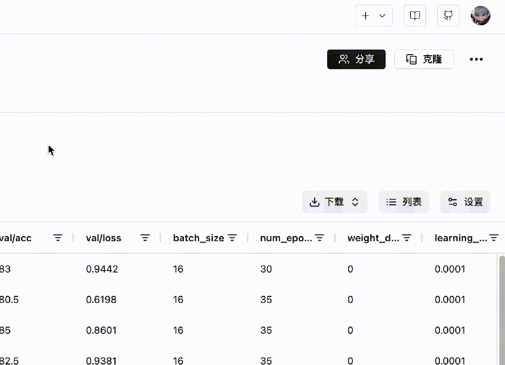
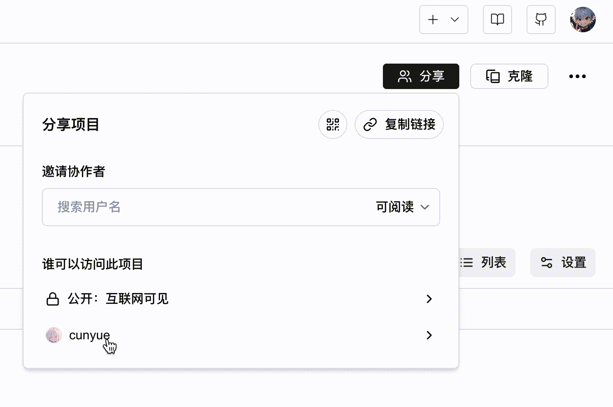

# Add Project Collaborators

SwanLab supports adding project collaborators to facilitate teamwork.

> Each project can have up to 10 collaborators.

## Adding Collaborators

**The process for adding collaborators is as follows:**

1. On the project's "Overview" page, there is a "Share" button in the top right corner.
2. Click the button to search for your team members by username.
3. Select the member, set their permissions, and click the black "+" button to complete the addition of the collaborator.



## Collaborator Permissions

| Permission | Read | Develop | Manage |
| --- | --- | --- | --- |
| View Experiments | ✅ | ✅ | ✅ |
| View Overview | ✅ | ✅ | ✅ |
| View Chart Comparison | ✅ | ✅ | ✅ |
| Create New Experiments | ❌ | ✅ | ✅ |
| Edit Experiment Information | ❌ | ✅ | ✅ |
| Delete Experiments | ❌ | ✅ | ✅ |
| Modify Project Information | ❌ | ❌ | ✅ |
| Delete Project | ❌ | ❌ | ✅ |
| Manage Collaborators | ❌ | ❌ | ✅ |

## Collaborators creating experiments in other projects

If you are a collaborator of the project `OpenVLA` (with develop or manage permissions), and the project belongs to user `A` (username is `A`), you want to create experiments in the `OpenVLA` project, then you can:

```python
swanlab.init(
    project="OpenVLA",
    workspace="A", 
)
```


## Removing Collaborators

In the "Share" panel, click on the collaborator settings at the bottom, then click the "Remove" button. In the permission selection menu, choose "Remove" to remove the collaborator.

