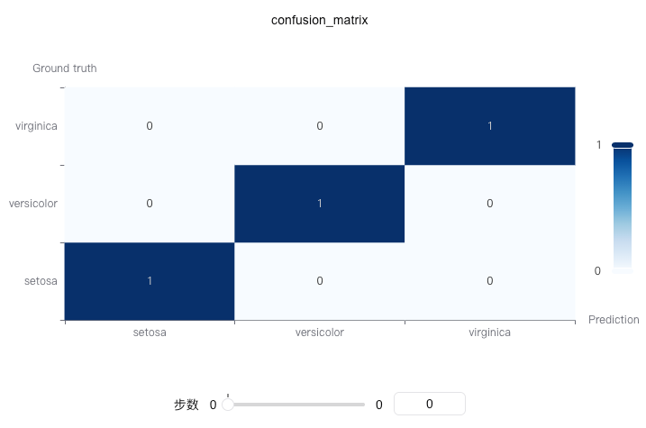

# Logging Confusion Matrix

A confusion matrix is a chart used to evaluate the performance of a classification model. It shows the correspondence between the model's predicted results and the true labels, clearly illustrating prediction accuracy and types of errors for each class.

The confusion matrix is a fundamental tool for evaluating classification models, especially suitable for multi-class classification problems.

You can use `swanlab.confusion_matrix` to log a confusion matrix.

[](https://swanlab.cn/@ZeyiLin/ComputeMetrics/runs/gvivixdwka8lyutdxt865/chart#NHFwdTEx-Uzk3bUJKMVY=)

### Basic Usage

```python
from sklearn.datasets import load_iris
from sklearn.model_selection import train_test_split
import xgboost as xgb
import swanlab

# Load the Iris dataset
iris_data = load_iris()
X = iris_data.data
y = iris_data.target
class_names = iris_data.target_names.tolist()

# Split into training and test sets
X_train, X_test, y_train, y_test = train_test_split(X, y, test_size=0.2, random_state=42)

# Train the model
model = xgb.XGBClassifier(objective='multi:softmax', num_class=len(class_names))
model.fit(X_train, y_train)

# Get predictions
y_pred = model.predict(X_test)

# Initialize SwanLab
swanlab.init(project="Confusion-Matrix-Demo", experiment_name="Confusion-Matrix-Example")

# Log the confusion matrix
swanlab.log({
    "confusion_matrix": swanlab.confusion_matrix(y_test, y_pred, class_names)
})

swanlab.finish()
```



### Using Custom Class Names

```python
# Define custom class names
custom_class_names = ["Class A", "Class B", "Class C"]

# Log confusion matrix with custom names
confusion_matrix = swanlab.confusion_matrix(y_test, y_pred, custom_class_names)
swanlab.log({"confusion_matrix_custom": confusion_matrix})
```

### Without Class Names

```python
# Without specifying class names, numeric indices will be used
confusion_matrix = swanlab.confusion_matrix(y_test, y_pred)
swanlab.log({"confusion_matrix_default": confusion_matrix})
```

### Binary Classification Example

```python
import numpy as np
from sklearn.datasets import make_classification
from sklearn.model_selection import train_test_split
import xgboost as xgb
import swanlab

# Generate binary classification data
X, y = make_classification(n_samples=1000, n_features=20, n_informative=2, n_redundant=10, random_state=42)
X_train, X_test, y_train, y_test = train_test_split(X, y, test_size=0.3, random_state=42)

# Train the model
model = xgb.XGBClassifier(use_label_encoder=False, eval_metric='logloss')
model.fit(X_train, y_train)

# Get predictions
y_pred = model.predict(X_test)

# Log confusion matrix
swanlab.log({
    "confusion_matrix": swanlab.confusion_matrix(y_test, y_pred, ["Negative", "Positive"])
})
```

### Notes

1. **Data Format**: `y_true` and `y_pred` can be lists or numpy arrays.
2. **Multi-class Support**: This function supports both binary and multi-class classification.
3. **Class Names**: The length of `class_names` should match the number of classes.
4. **Dependencies**: Requires installing the `scikit-learn` and `pyecharts` packages.
5. **Coordinate System**: In scikit-learn's `confusion_matrix`, the top-left corner is (0,0), while in pyecharts' heatmap, it is the bottom-left. This function automatically handles the coordinate transformation.
6. **Matrix Interpretation**: In the confusion matrix, rows represent true labels and columns represent predicted labels.