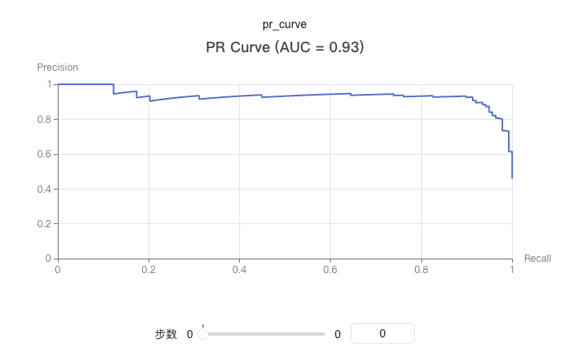

# Logging PR Curve

The PR (Precision-Recall) curve illustrates the relationship between precision and recall at various threshold levels. Plotting a PR curve is useful for evaluating the performance of binary classification models.

PR curves are especially suitable for imbalanced datasets, as they provide a better assessment of model performance on the minority class.

You can use `swanlab.pr_curve` to log a PR curve.

[](https://swanlab.cn/@ZeyiLin/ComputeMetrics/runs/35snhyn3wndz58r4j8d4h/chart#ZTIwZm1s-aVI2S1ZCQl8=)



### Basic Usage

```python {22}
from sklearn.datasets import make_classification
from sklearn.model_selection import train_test_split
import xgboost as xgb
import swanlab

# Generate sample data
X, y = make_classification(n_samples=1000, n_features=20, n_informative=2, n_redundant=10, random_state=42)
X_train, X_test, y_train, y_test = train_test_split(X, y, test_size=0.3, random_state=42)

# Train the model
model = xgb.XGBClassifier(use_label_encoder=False, eval_metric='logloss')
model.fit(X_train, y_train)

# Get predicted probabilities
y_pred_proba = model.predict_proba(X_test)[:, 1]

# Initialize SwanLab
swanlab.init(project="PR-Curve-Demo", experiment_name="PR-Curve-Example")

# Log the PR curve
swanlab.log({
    "pr_curve": swanlab.pr_curve(y_test, y_pred_proba, title=True)
})

swanlab.finish()
```

### Custom Title

```python
# Hide title (default)
pr_curve = swanlab.pr_curve(y_test, y_pred_proba, title=False)
swanlab.log({"pr_curve_no_title": pr_curve})

# Show default title
pr_curve = swanlab.pr_curve(y_test, y_pred_proba, title=True)
swanlab.log({"pr_curve_with_title": pr_curve})

# Custom title
pr_curve = swanlab.pr_curve(y_test, y_pred_proba, title="demo")
swanlab.log({"pr_curve_with_custom_title": pr_curve})
```

### Notes

1. **Data Format**: `y_true` and `y_pred_proba` can be lists or numpy arrays.
2. **Binary Classification**: This function is designed specifically for binary classification tasks.
3. **Probability Values**: `y_pred_proba` should be the predicted probabilities for the positive class, ranging from 0 to 1.
4. **Dependencies**: Requires installing the `scikit-learn` and `pyecharts` packages.
5. **AUC Calculation**: The function automatically computes the area under the PR curve (AUC), but it is not displayed in the title by default.