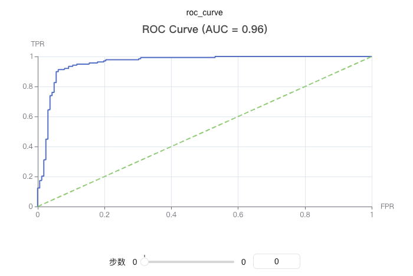

# Logging ROC Curve

Plot the ROC (Receiver Operating Characteristic) curve to evaluate the performance of a binary classification model. The ROC curve illustrates the relationship between the True Positive Rate (TPR) and the False Positive Rate (FPR) at various threshold settings.

The ROC curve is an essential tool for assessing classification model performance, providing an intuitive visualization of how the model performs across different decision thresholds.

You can use `swanlab.roc_curve` to log an ROC curve.

[](https://swanlab.cn/@ZeyiLin/ComputeMetrics/runs/gvivixdwka8lyutdxt865/chart#NHFwdTEx-Uzk3bUJKMVY=)



### Basic Usage

```python
from sklearn.datasets import make_classification
from sklearn.model_selection import train_test_split
import xgboost as xgb
import swanlab

# Generate sample data
X, y = make_classification(n_samples=1000, n_features=20, n_informative=2, n_redundant=10, random_state=42)
X_train, X_test, y_train, y_test = train_test_split(X, y, test_size=0.3, random_state=42)

# Train the model
model = xgb.XGBClassifier(use_label_encoder=False, eval_metric='logloss')
model.fit(X_train, y_train)

# Get predicted probabilities
y_pred_proba = model.predict_proba(X_test)[:, 1]

# Initialize SwanLab
swanlab.init(project="ROC-Curve-Demo", experiment_name="ROC-Curve-Example")

# Log the ROC curve
swanlab.log({
    "roc_curve": swanlab.roc_curve(y_test, y_pred_proba, title=True)
})

swanlab.finish()
```

### Custom Title

```python
# Hide title (default)
roc_curve = swanlab.roc_curve(y_test, y_pred_proba, title=False)
swanlab.log({"roc_curve_no_title": roc_curve})

# Show default title
roc_curve = swanlab.roc_curve(y_test, y_pred_proba, title=True)
swanlab.log({"roc_curve_with_title": roc_curve})

# Custom title
roc_curve = swanlab.roc_curve(y_test, y_pred_proba, title="demo")
swanlab.log({"roc_curve_with_custom_title": roc_curve})
```

### Using with Other Metrics

```python
import swanlab
from sklearn.metrics import accuracy_score, f1_score

# Log multiple ML metrics together
swanlab.log({
    "roc_curve": swanlab.roc_curve(y_test, y_pred_proba),
    "pr_curve": swanlab.pr_curve(y_test, y_pred_proba),
    "accuracy": accuracy_score(y_test, y_pred),
    "f1_score": f1_score(y_test, y_pred)
})
```

### Notes

1. **Data Format**: `y_true` and `y_pred_proba` can be lists or numpy arrays.
2. **Binary Classification**: This function is designed specifically for binary classification tasks.
3. **Probability Values**: `y_pred_proba` should represent the predicted probabilities for the positive class, ranging from 0 to 1.
4. **Dependencies**: Requires installing the `scikit-learn` and `pyecharts` packages.
5. **AUC Calculation**: The function automatically computes the Area Under the ROC Curve (AUC), but it is not displayed in the title by default.
6. **Curve Characteristics**: The ROC curve starts at (0,0) and ends at (1,1). The diagonal line represents the performance of a random classifier.