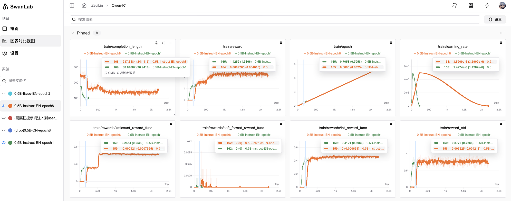
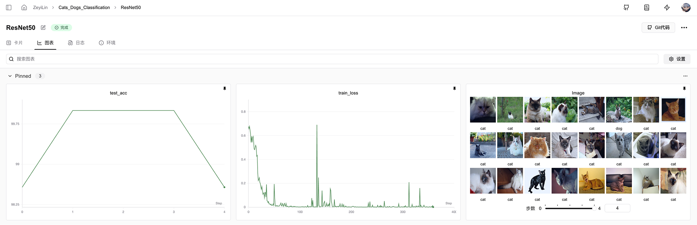

# Create an Experiment

Using the SwanLab Python SDK to track AI experiments, you can then view the results in an interactive dashboard.  
This section will introduce how to create a SwanLab experiment.



## How to Create a SwanLab Experiment?

Creating a SwanLab experiment involves three steps:
1. Initialize SwanLab
2. Pass a hyperparameter dictionary
3. Record metrics in your training loop

### 1. Initialize SwanLab

The `swanlab.init()` function initializes a SwanLab experiment, which starts a background process to synchronize and record data.  
The following code snippet shows how to create a new SwanLab project named **cat-dog-classification** and add:

1. **project**: The project name.
2. **experiment**: The experiment name. The experiment name serves as an identifier for the current experiment to help you recognize it.
3. **description**: The description. The description provides a detailed introduction to the experiment.

```python
# Import the SwanLab Python library
import swanlab

# 1. Start a SwanLab experiment
run = swanlab.init(
    project="cat-dog-classification",
    experiment_name="Resnet50",
    description="My first AI experiment",
)
```

When you initialize SwanLab, `swanlab.init()` returns an object.  
Additionally, SwanLab creates a local directory (default name is "swanlog") where all logs and files are saved and asynchronously transferred to the SwanLab server. (This directory can also be opened with the `swanlab watch -l [logdir]` command to view the local experiment dashboard.)

::: info
**Note**: If the project already exists when calling `swanlab.init`, the experiment will be added to the pre-existing project.  
For example, if you already have a project named `"cat-dog-classification"`, the new experiment will be added to that project.
:::

<br>

### 2. Pass a Hyperparameter Dictionary

Pass a hyperparameter dictionary, such as learning rate or model type.  
The dictionary you pass in `config` will be saved and used for subsequent experiment comparisons and result queries.

```python
# 2. Pass a hyperparameter dictionary
swanlab.config={"epochs": 20, "learning_rate": 1e-4, "batch_size": 32, "model_type": "CNN"}
```

For more information on how to configure experiments, see [Set Experiment Configuration](/en/guide_cloud/experiment_track/set-experiment-config.md).

<br>

### 3. Record Metrics in the Training Loop

Calculate accuracy and loss metrics in each epoch loop and record them to SwanLab using `swanlab.log()`.  
By default, when you call `swanlab.log`, it creates a new step added to the historical data of the corresponding metric, with the rule being new step = old maximum step number + 1.  
The following code example shows how to record metrics using `swanlab.log()`:

```python
# Omitted details on how to set up the model and dataset

# Set up the model and dataset
model, dataloader = get_model(), get_data()

# Training loop
for epoch in range(swanlab.config.epochs):
    for batch in dataloader:
        loss, acc = model.train_step()
        # 3. Record metrics in your training loop for visualization in the dashboard
        swanlab.log({"acc": acc, "loss": loss})
```

<br>

### Complete Code

The complete script containing the above code snippets is as follows:

```python
# Import the SwanLab Python library
import swanlab

# 1. Start a SwanLab experiment
run = swanlab.init(
    project="cat-dog-classification",
    experiment_name="Resnet50",
    description="My first AI experiment",
)

# 2. Pass a hyperparameter dictionary
swanlab.config={"epochs": 20, "learning_rate": 1e-4, "batch_size": 32, "model_type": "CNN"}

# Omitted details on how to set up the model and dataset
# Set up the model and dataset
model, dataloader = get_model(), get_data()

# Training loop
for epoch in range(swanlab.config.epochs):
    for batch in dataloader:
        loss, acc = model.train_step()
        # 3. Record metrics in your training loop for visualization in the dashboard
        swanlab.log({"acc": acc, "loss": loss})
```

<br>

### Visualize Your Experiment

Use the SwanLab dashboard as a one-stop node for managing and visualizing AI model results.  
You can visualize rich interactive charts, such as line charts, image charts, audio charts, etc.  
For more information on how to view experiments, see [View Experiment Results](/en/guide_cloud/experiment_track/view-result.md).



## Best Practices

Here are some best practices for creating experiments that you can refer to. A complete experiment creation can include the following four parameters:
- `config`: Configuration. Record anything you want to use to reproduce the model, such as hyperparameters, model name, dataset, etc. These contents will be displayed in the "Table View" and "Experiment Card" pages of the dashboard and can also be used as a basis for experiment comparison, filtering, and filtering.
- `project`: Project. A project is a set of experiments that can be compared together and will be displayed in a unified dashboard.
- `experiment_name`: Experiment name. Define the name of the experiment. You set it in the script and can edit it later in the SwanLab application.
- `description`: Description. An introductory text for the experiment, recording the differences and inspirations between different experiments. You set it in the script and can edit it later in the SwanLab application.

The following code snippet shows a best practice example:

```python
import swanlab

config = dict(
    learning_rate=1e-4, optimizer="Adam", architecture="Transformer", dataset_id="cats-dogs-2024"
)

swanlab.init(
    project="cats-dogs-classification",
    experiment_name="ViT-Adam-1e-4",
    description="An experiment on cat-dog classification using the ViT model and Adam optimizer with a learning rate of 1e-4.",
    config=config,
)
```

For more information on available parameters when creating a SwanLab experiment, see the [swanlab.init](/en/api/py-init.md) documentation in the API documentation.