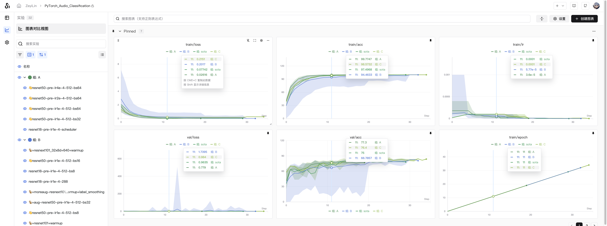

# Grouping Experiments

> Group multiple training and evaluation runs into larger experiments.

Pass the `group` parameter to `swanlab.init` to set the group for new experiments.



## Use Cases

1. **Distributed training**: Use grouping when experiments are split into different parts with separate training and evaluation scripts that should be viewed as a single whole.
2. **Multi-process experiments**: Combine multiple smaller processes into one experiment.
3. **K-fold cross-validation**: Combine experiments with different random seeds into a complete experiment for comparison.

## Setting Group

### 1. Set Group in Code

Pass the `group` parameter when initializing the experiment to assign it to the corresponding experiment group. The `job_type` parameter can be used to identify the experiment's task type (optional):

```python
import swanlab

swanlab.init(
    experiment="my_experiment",
    group="experiment_1",  # Related experiments use the same group name
    job_type="demo",      # Training task
)
```

### 2. Set Group via Environment Variable

Use the `SWANLAB_GROUP` environment variable to specify the experiment's group:

```python
import os
import swanlab

# Use swan's built-in ID generator to create a unique group name
os.environ["SWANLAB_GROUP"] = "experiment-1"

swanlab.init(experiment="my_experiment")
```

> Use the `SWANLAB_JOB_TYPE` environment variable to specify the experiment's task type.

### 3. Set Group in UI

SwanLab supports dynamic grouping of experiments by any column, including hidden columns. For example, if you use `swanlab.config` to log hyperparameters like batch size or learning rate, you can dynamically group by these hyperparameters directly in the web application.

> **Note**: The **Group** column in the experiment list is hidden by default.

To group experiments by one or more columns:

1. Click the **Group** button.
2. Click the name of one or more columns.


## Moving Experiments Between Groups

### 1. Move a Single Experiment's Group

SwanLab supports configuring an experiment's group by clicking on the `Group` column for that experiment.

<video controls src="./grouping/move-grouping.mp4"></video>

### 2. Batch Move Multiple Experiments' Groups

SwanLab supports quick batch move operations on the `Group` column for multiple experiments.

<video controls src="./grouping/batch-move-grouping.mp4"></video>
