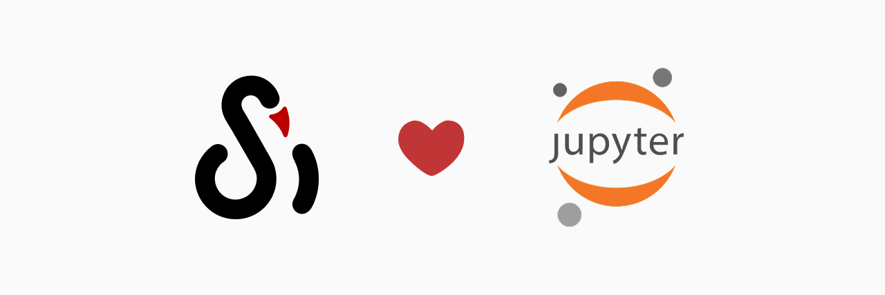

# Track Experiments with Jupyter Notebook

Combine SwanLab with Jupyter to get interactive visualizations without leaving the Notebook.



## Install SwanLab in Notebook

```bash
!pip install swanlab -qqq
```

ps: `-qqq` is used to control the amount of output information during command execution and is optional.

## Logging into Swanlab in Notebook

`jupyter --execute` is the command-line execution mode provided by Jupyter, commonly used in automation, CI/CD pipelines, and scheduled tasks. In these scenarios, unattended operation is required, and interactive input (such as `input()` or manually pasting keys) is not allowed; otherwise, the process will stall or encounter errors.

Environment variables automatically inject the API Key into the Notebook execution environment, ensuring that the Notebook runs smoothly in any non-interactive environment. Therefore, you need to log in via [swanlab.login](/en/api/py-login.md).

```python
import swanlab
import os

SWANLAB_API_KEY = os.getenv("SWANLAB_API_KEY")
swanlab.login(api_key=SWANLAB_API_KEY)
```

::: info

On Kaggle, you should use [Kaggle Secrets](https://www.kaggle.com/discussions/product-feedback/114053) to store API keys. This prevents key leaks, simplifies management, conforms to security best practices, and ensures that Notebooks can be securely shared and collaborated on.

```python
from kaggle_secrets import UserSecretsClient
user_secrets = UserSecretsClient()
SWANLAB_API_KEY = user_secrets.get_secret("SWANLAB_API_KEY")

import swanlab
swanlab.login(api_key=SWANLAB_API_KEY)
```

:::

## Interact with SwanLab in Notebook

```python
import swanlab

swanlab.init()
...
# In the Notebook, you need to explicitly close the experiment
swanlab.finish()
```

When initializing the experiment with `swanlab.init`, a "Display SwanLab Dashboard" button will appear at the end of the printed information:


Clicking this button will embed the SwanLab web page for the experiment in the Notebook:


Now, you can directly see the training process and interact with it in this embedded web page.
