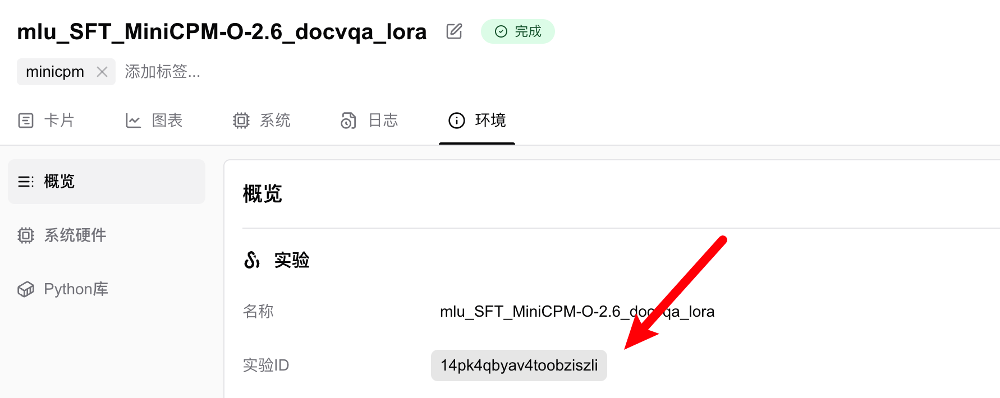

# Resuming Experiments / Continuing Interrupted Training  

> Resume interrupted or completed SwanLab experiments.  

Continuing interrupted training means that if you have a previously completed or interrupted experiment and need to add more experimental data, you can resume the experiment using the `resume` and `id` parameters. The experiment will then revert to an "in progress" state.  

:::warning Use Cases  
1. **Continuing Interrupted Training:** The previous training process was interrupted. When resuming training from a checkpoint, you want the experiment charts to continue from the original SwanLab experiment rather than creating a new one.  
2. **Supplementing Charts:** Training and evaluation are split into two processes, but you want both recorded in the same SwanLab experiment.  
3. **Updating Hyperparameters:** Some parameters in the config were incorrect, and you want to update them.  
:::  

## Basic Usage  

Resuming an experiment primarily relies on two parameters: `resume` and `id`:  

```python  
swanlab.init(  
    project="<project>",  
    workspace="<workspace>",  
    resume=True,  
    id="<exp_id>",  # The ID must be a 21-character string  
)  
```  

The `resume` parameter controls the behavior of experiment resumption and has the following options:  

- `must`: If an experiment with the corresponding ID exists in the project, it will be resumed; otherwise, an error will be raised.  
- `allow`: If an experiment with the corresponding ID exists in the project, it will be resumed; otherwise, a new experiment will be created.  
- `never`: Passing an `id` parameter will raise an error; otherwise, a new experiment will be created (i.e., the effect of not enabling resume).  
- `True`: Equivalent to `allow`.  
- `False`: Equivalent to `never`.  

The **experiment ID** is the unique identifier for an experiment. It can be found in the "Environment" tab of the experiment or in the URL and must be a 21-character string:  

  

Alternatively, you can open an experiment and locate the `<exp_id>` section in its URL structure:  

```  
https://swanlab.cn/@<username>/<project>/runs/<exp_id>/...  
```  

Here, `<exp_id>` is the experiment ID.  

## Example  

```python  
import swanlab  

run = swanlab.init(project="resume_test")  
swanlab.log({"loss": 2, "acc": 0.4})  
# Complete the experiment  
run.finish()  

# Resume the experiment  
run = swanlab.init(project="resume_test", resume=True, id=run.id)  
swanlab.log({"loss": 0.2, "acc": 0.9})  
```

## Tips: Use Environment Variables to Resume

If you are using some frameworks for training, it may not be convenient to modify the source code at `swanlab.init`. In this case, you can use environment variables to resume:

```bash
export SWANLAB_RESUME=must
export SWANLAB_ID=<exp_id>
```

## Tips: Copy an Experiment and Resume

If you are worried that the content of the current resume may have bugs, you can copy an experiment and resume it:

1. Find the `run` directory corresponding to the original experiment in the local `swanlog` folder (the path can be found in the "Log Directory" under the Environment Tab)
2. Use the `swanlab sync` command to upload the experiment to the cloud:

```bash
swanlab sync <run_dir>
```
3. Resume the new uploaded experiment