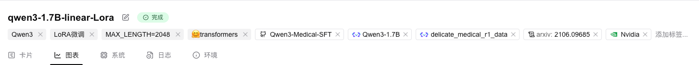
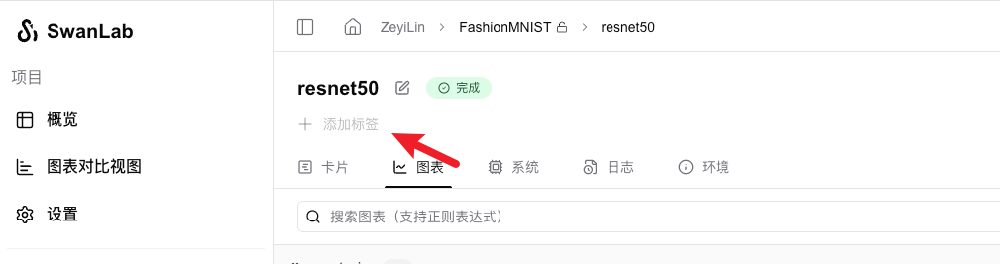
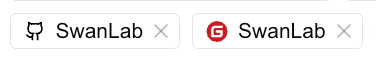
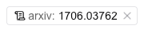
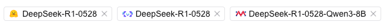
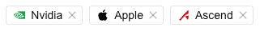

# Setting Experiment Tags  

Experiment tags allow you to quickly label the **methods, datasets, models, hyperparameters, Git repositories, etc.** used in the experiment, and can later be used for grouping and filtering experiments.  

Configured tags will appear below the experiment name:  

  

## Regular Tags  

**Method 1: Programmatic Setup**  

Use the `tags` parameter in `swanlab.init` to set experiment tags.  

```python  
swanlab.init(  
    tags=["tag1", "tag2"],  
)  
```  

**Method 2: GUI Setup**  

In the web interface, navigate to the top section of the experiment and click the "Add Tag" button to edit tags:  

  

## Git Tags  

Supports recognizing GitHub and Gitee repository links in tags, displaying them in a special format with clickable redirects.  

```python  
swanlab.init(  
    tags=[  
        "https://github.com/SwanHubX/SwanLab",  
        "https://gitee.com/SwanHubX/SwanLab",  
    ],  
)  
```  

  

## Arxiv Tags  

Supports recognizing Arxiv links in tags, displaying them in a special format with clickable redirects.  

```python  
swanlab.init(  
    tags=["https://arxiv.org/abs/1706.03762"],  
)  
```  

  

## AI Community Tags  

Supports recognizing links from AI open-source communities ([HuggingFace](https://huggingface.co/), [ModelScope](https://www.modelscope.cn/), [Modelers](https://www.modelers.cn/)), displaying them in a special format with clickable redirects.  

```python  
swanlab.init(  
    tags=[  
        "https://huggingface.co/deepseek-ai/DeepSeek-R1-0528",  
        "https://modelscope.cn/models/deepseek-ai/DeepSeek-R1-0528",  
        "https://modelers.cn/models/Modelers_Park/DeepSeek-R1-0528-Qwen3-8B",  
    ],  
)  
```  

  

## Hardware Tags  

Supports recognizing hardware accelerator brands (nvidia, ascend, apple) in tags.  

```python  
swanlab.init(  
    tags=["nvidia", "ascend", "apple"],  
)  
```  

