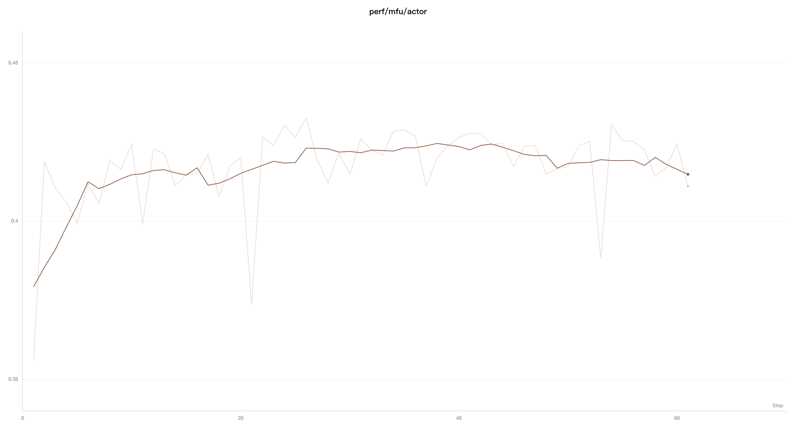

# Smoothing for Line Charts

> In line charts, smoothing is used to identify trends in noisy data.

## Setting Up Smoothing

Click the "Settings" button in the upper-right corner of the line chart to open the settings panel. Under the "Smoothing" option, select your preferred smoothing algorithm and configure the smoothing parameters:


SwanLab supports various smoothing algorithms:

- [Time-Weighted Exponential Moving Average (EMA) Smoothing](#time-weighted-ema)
- [Gaussian Smoothing](#gaussian-smoothing)
- [Running Average Smoothing](#running-average-smoothing)

## Time-Weighted EMA

The Time-Weighted Exponential Moving Average (Time-Weighted EMA) smoothing algorithm is a technique that smooths time-series data by exponentially decaying the weight of previous data points. For detailed information about this technique, refer to [Exponential Smoothing](https://en.wikipedia.org/wiki/Exponential_smoothing). The weight value ranges from 0 to 1. This algorithm also includes a debias term to prevent early values in the time series from being biased toward zero.

The TWEMA algorithm takes into account the point density on the line (the number of `y` values per unit range on the `x`-axis). This ensures consistent smoothing when displaying multiple lines with different characteristics simultaneously.

Below is example code illustrating its underlying workings:

```javascript
const smoothingWeight = Math.min(Math.sqrt(smoothingParam || 0), 0.999);
let lastY = yValues.length > 0 ? 0 : NaN;
let debiasWeight = 0;

return yValues.map((yPoint, index) => {
  const prevX = index > 0 ? index - 1 : 0;
  // VIEWPORT_SCALE scales the result to the chart's x-axis range
  const changeInX =
    ((xValues[index] - xValues[prevX]) / rangeOfX) * VIEWPORT_SCALE;
  const smoothingWeightAdj = Math.pow(smoothingWeight, changeInX);

  lastY = lastY * smoothingWeightAdj + yPoint;
  debiasWeight = debiasWeight * smoothingWeightAdj + 1;
  return lastY / debiasWeight;
});
```

Here's how it appears on the website:


## Running Average

Moving average is a smoothing algorithm that replaces the current point with the average of points within a window before and after the given `x` value. Refer to the ["Boxcar Filter" on Wikipedia](https://en.wikipedia.org/wiki/Moving_average). The selected parameter for the moving average indicates the number of points considered for the weight and bias in calculating the moving average.

If your points are unevenly distributed on the `x`-axis, consider using Gaussian smoothing.

Here's how it appears on the website:



## Gaussian Smoothing

Gaussian smoothing (or Gaussian kernel smoothing) calculates a weighted average of points, where the weights correspond to a Gaussian distribution with a standard deviation specified by the smoothing parameter. For each input `x` value, the smoothed value is computed based on the points that appear before and after it.

Here's how it appears on the website:

