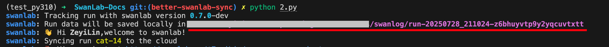
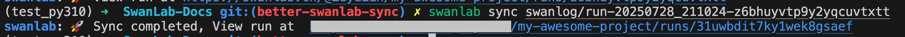

# Upload Offline Experiment Data

> Synchronize local experiment data to SwanLab cloud/private deployment

**Use Cases:**
1. **Network interruption during training:** The server lost connection for 1 hour during model training, causing SwanLab cloud records to break.
2. **Training environment without internet:** You unfortunately discover that your company/school's training server has no internet access and doesn't allow Docker installation.
3. **Multi-device synchronization:** You're using private deployment but also want to sync experiment records to the cloud.
4. **Experiment replication:** The experiment is universally applicable to multiple projects you've created (e.g., baseline, benchmark experiments) and you want to replicate it across projects.

When encountering the above scenarios, the `swanlab sync` command can help. [API Documentation](/api/cli-swanlab-sync).

## Local Experiment Data Directory

SwanLab saves **experiment log files** by default in the `swanlog` directory of your project. You can also customize the save path using the `logdir` parameter. [Documentation](/api/py-init#设置日志文件保存位置).

Each time you create an experiment, SwanLab automatically creates a `run-[experiment ID]` directory under `swanlog` and continuously records data to this directory.



::: warning Tips
This `run-` prefixed directory is crucial—it's the foundation for `swanlab sync`.
:::

## Upload Experiment Data

Locate the data directory you want to upload to the cloud, then execute the command:

```bash
swanlab sync ./swanlog/run-xxx
```

:::info
By default, data will be synced to the `project` recorded in the log files (i.e., the project specified when running the experiment).  
To sync to a different project, use the `-p` option.
:::

If you see the following output, the upload was successful:



## Sync to Original Experiment

If you don't want to create a new experiment but instead sync to the original one (it will automatically compare data and add differential parts), use the `--id` parameter:

```bash
swanlab sync ./swanlog/run-xxx --id <experiment ID>
```

For how to obtain the experiment ID, see: [Resume Experiment/Checkpoint Training](/guide_cloud/experiment_track/resume-experiment)

## Batch Upload

You can use wildcards for batch uploads:

```bash
swanlab sync ./swanlog/run-*
```

## Upload to a Specific Project/Team Workspace

```bash
swanlab sync ./swanlog/run-xxx -p <project_name> -w <workspace_name>
```

:::warning Experiment Replication Scenario
If you want an experiment to appear in multiple projects, use the above command to upload it to multiple projects.
:::

## Upload to Private Deployment

```bash
swanlab sync ./swanlog/run-xxx --h <private_deployment_address>
```