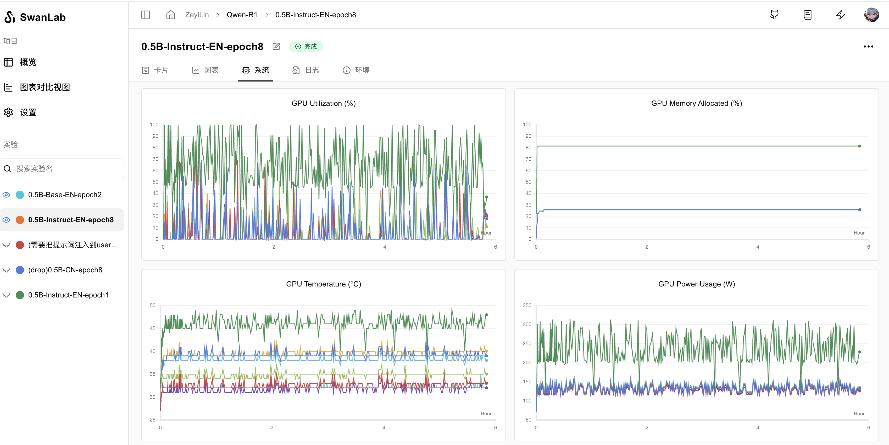
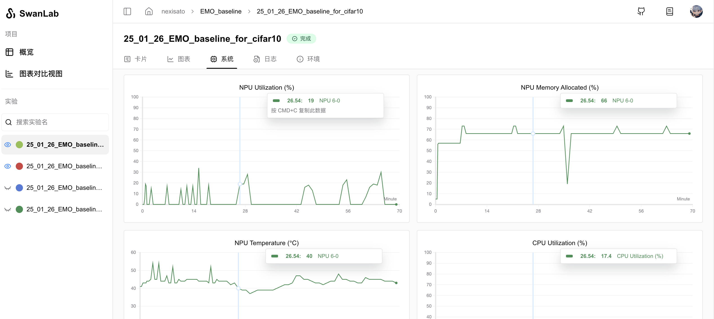
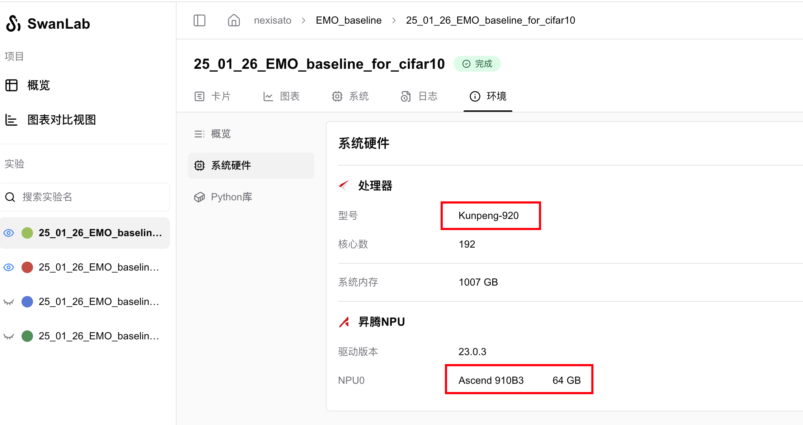

# System Hardware Monitoring (Supports Ascend)

During the tracking of experiments, SwanLab **automatically monitors** the hardware resources of the machine and records them in the **"System" charts**.

Currently, SwanLab supports monitoring hardware resources for two types of **AI computing chips** (**Huawei Ascend** and **NVIDIA**), covering metrics such as GPU utilization, VRAM usage, GPU temperature, and GPU power consumption.

In addition, SwanLab also supports monitoring hardware resources such as **CPU**, **memory**, and **disk**.

---

> We are thrilled to collaborate with the Ascend Computing team to offer trainers more opportunities to experience domestic computing power.

[Ascend NPU Monitoring Example](https://swanlab.cn/@nexisato/EMO_baseline/runs/lg1ky9or15htzkek3vv2h/system)

NPU Monitoring Charts:

AI Chip Environment Records:

