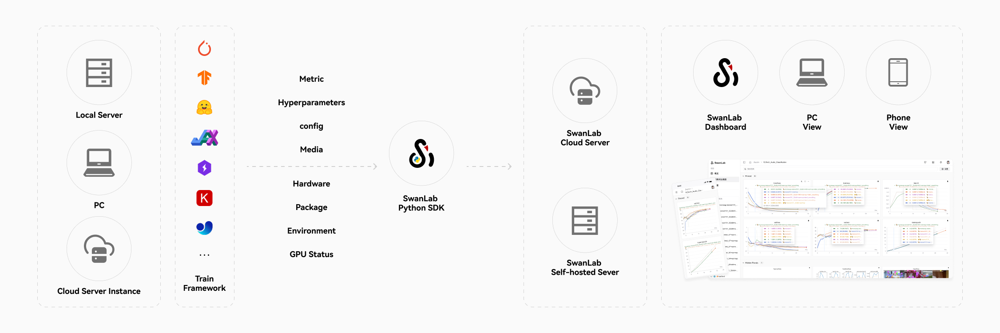
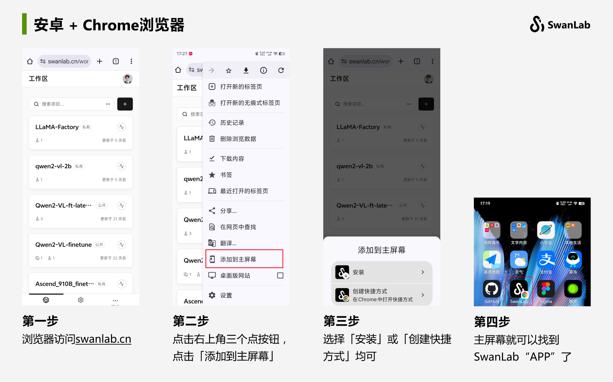

# Viewing Experiment Results  

Leverage SwanLab's powerful experiment dashboard to manage and visualize AI model training results in one place.  

[[toc]]  

## Cloud Synchronization  

No matter where you train your model—**your local machine, a lab server cluster, or cloud instances**—we seamlessly collect and consolidate your training data. Access progress anytime, anywhere, even on your phone.  

No more manually screenshotting terminal outputs or copying data into Excel. Forget about managing TensorBoard files across different machines—SwanLab handles it all effortlessly.  

  

## 📱 Mobile Experiment Monitoring  

Ever had an experiment running while you're away from your computer—working out, commuting, or just waking up—and desperately wanted to check its progress? Your phone + SwanLab is the perfect solution. [Learn more](../general/app.md)  

  

## Table View  

Compare training experiments in table view to track hyperparameter changes.  
By default, data is sorted by: `[Experiment Name] - [Metadata] - [Configuration] - [Metrics]`.  

  

## Chart Comparison View  

The **Chart Comparison View** consolidates experiment charts into a unified multi-experiment visualization.  
Easily compare how different experiments perform on the same metric, identifying trends and variations at a glance.  

  

## Logs  

From `swanlab.init` to experiment completion, SwanLab records all terminal output in the **Logs** tab—viewable, copyable, and downloadable anytime. Search functionality helps pinpoint critical details.  

  

## Environment  

SwanLab automatically logs training environment details, including:  

- **Basic Info**: Runtime, hostname, OS, Python version, interpreter path, working directory, command line, Git repo URL, branch, commit, log directory, SwanLab version  
- **System Hardware**: CPU cores, memory size, GPU count, GPU model, VRAM  
- **Python Dependencies**: All installed Python packages in the runtime environment  

