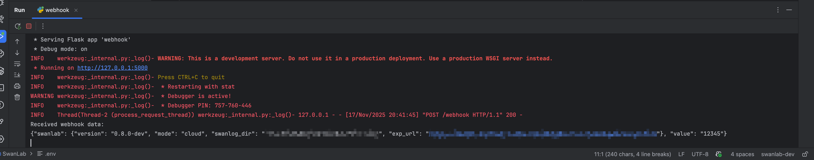

# Webhook Usage Guide

SwanLab webhook operates on a per-experiment basis and triggers the webhook logic simultaneously when an experiment is created.

## Usage

Set the SwanLab WebHook via an environment variable:

```bash
export SWANLAB_WEBHOOK='http://127.0.0.1/webhook'
```

After setting this up, SwanLab will send a POST callback when the experiment starts (i.e., when `swanlab.init()` is called).

## Callback Structure

The webhook sends callbacks using the POST method. The callback structure is described below using TypeScript type notation:

```ts
interface SwanLabInfo {
    // SwanLab version number
    version: string
    // SwanLab running mode
    mode: 'cloud' | 'local' | 'offline' | 'disabled'
    // Log storage path
    swanlog_dir: string
    // Cloud experiment URL
    exp_url: string
}

// Webhook callback structure
interface Body{
   swanlab: SwanLabInfo
}
```

## Minimal Test

Here is a minimal test code using the Flask framework:

```python
from flask import Flask, request

app = Flask(__name__)

@app.route('/webhook', methods=['POST'])
def webhook():
    # Get request body data
    data = request.get_data(as_text=True)  # Get data as text
    print("Received webhook data:")
    print(data)
    return "Webhook received successfully!", 200

if __name__ == '__main__':
    app.run(host='127.0.0.1', port=5000, debug=True)
```

After running the service, execute the following script in a new terminal:

```bash
export SWANLAB_WEBHOOK='http://127.0.0.1:5000/webhook'
# Ignore the following two environment variables if not for private deployment
export SWANLAB_API_HOST='Your backend API HOST'
export SWANLAB_WEB_HOST='Your backend WEB HOST'

python -c "import swanlab;swanlab.init()"
```

You will receive content similar to the following:

