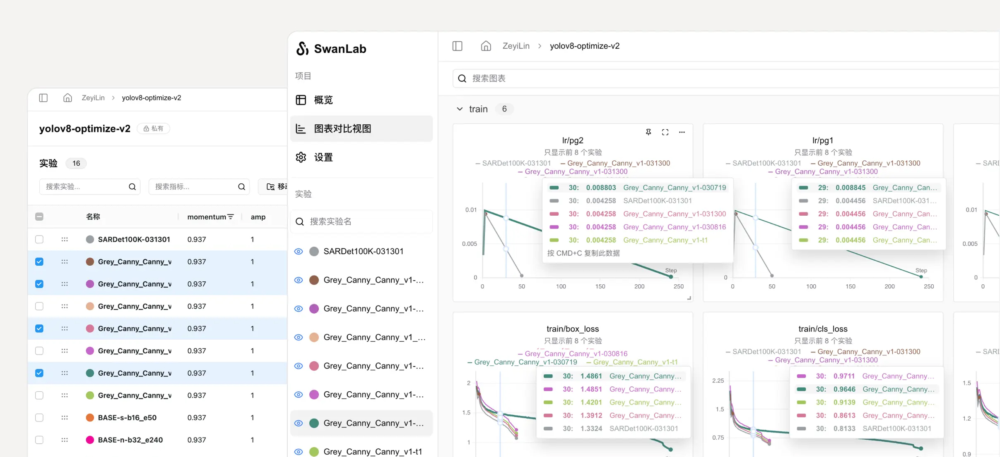
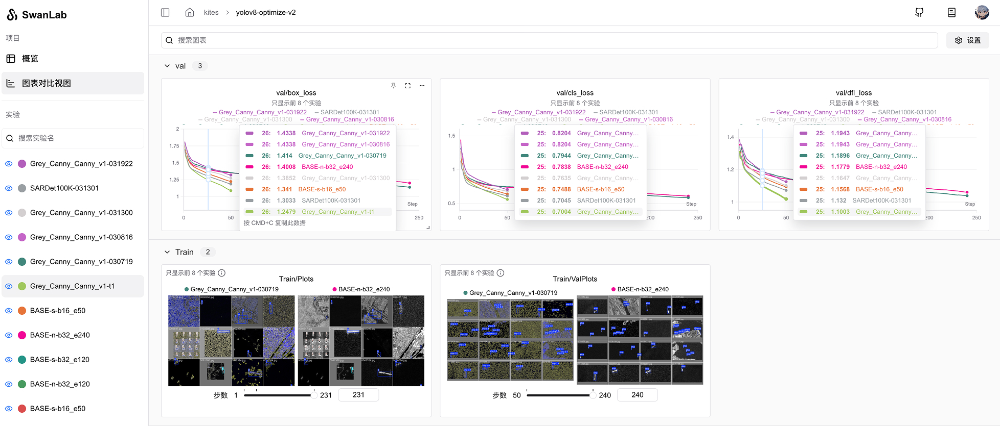
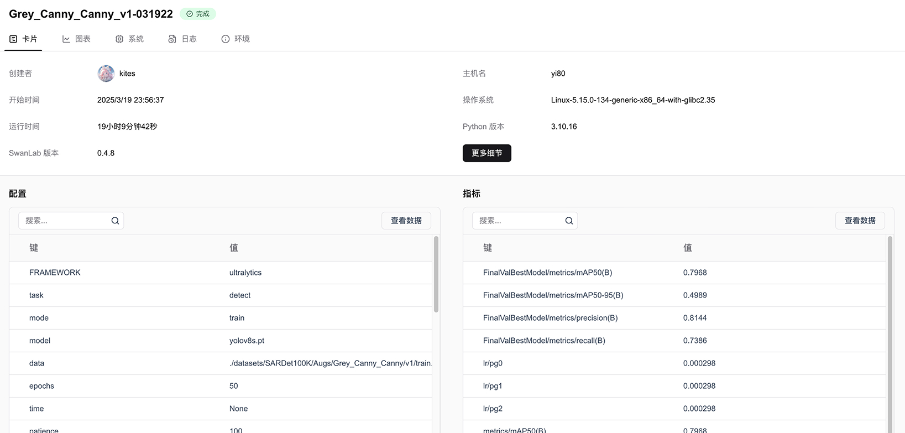
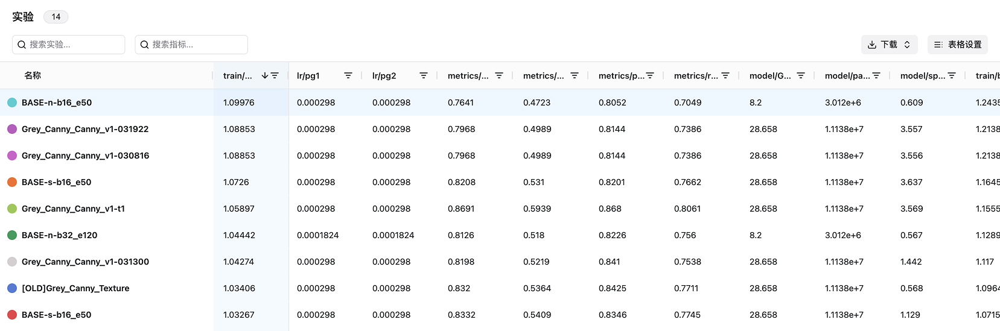

# What is Experiment Tracking  

**Experiment tracking** refers to the process of recording **hyperparameters, metrics, hardware, environment, logs**, and other data for each experiment from start to finish during machine learning model development, and **organizing** and **presenting** this data in a UI interface. The purpose of experiment tracking is to help researchers more effectively **manage** and **analyze** experimental results, enabling better understanding of model performance variations and, ultimately, optimizing the model development process.  

::: warning 🤔 Simple Terms  
The role of experiment tracking can be understood as recording key information during machine learning experiments to **"provide ammunition"** for subsequent model evolution.  
:::  

  

Closely related to **experiment tracking** are **visualization**, **reproducibility**, **experiment comparison**, and **team collaboration**.  

1. **📊 Visualization**: Visualizing experiment tracking data through a UI interface allows trainers to **intuitively observe each step** of the experiment, **analyze metric trends**, and determine which **changes** led to improvements in model performance, thereby **enhancing overall model iteration efficiency**.  

  

<br>  

2. **♻️ Reproducibility**: Experiments often require **extensive trials** to progress from functional to usable to state-of-the-art (SOTA), and some excellent results may emerge in the early or middle stages. Without experiment tracking and visualization, trainers may struggle to recall these results, leading to the **loss or vague recollection** of valuable experimental outcomes. SwanLab's experiment tracking and visualization features enable trainers to **review** these results at any time, significantly improving reproducibility and overall efficiency.  

  

<br>  

3. **🆚 Experiment Comparison**: Trainers can **easily compare** multiple sets of experimental results using SwanLab, analyze which changes led to performance improvements, and **quickly identify the optimal training strategy**.  

  

<br>  

4. **👥 Team Collaboration**: Through SwanLab's **experiment sharing, team spaces, and multi-user collaboration** features, seamlessly share training progress and insights, break down information silos among team members, and **improve team collaboration efficiency**.  

## How Does SwanLab Perform Experiment Tracking?  

**SwanLab** enables you to track machine learning experiments with just a few lines of code and view and compare results in an interactive dashboard. The tracking process:  

1. Create a SwanLab experiment.  
2. Store hyperparameter dictionaries (e.g., learning rate or model type) in your configuration (`swanlab.config`).  
3. Log metrics (e.g., accuracy `acc` and loss `loss`) over time during the training loop (`swanlab.log`).  

The following pseudocode demonstrates a typical **SwanLab experiment tracking workflow**:  

```python  
# 1. Create a SwanLab experiment  
swanlab.init(project="my-project-name")  

# 2. Store model inputs or hyperparameters  
swanlab.config.learning_rate = 0.01  

# Model training code goes here  
...  

# 3. Log metrics over time to visualize performance  
swanlab.log({"loss": loss})  
```  

## How to Get Started?  

Explore the following resources to learn about SwanLab experiment tracking:  

- Read the [Quick Start](/en/guide_cloud/general/quick-start) guide.  
- Explore this chapter to learn how to:  
  - [Create an experiment](/en/guide_cloud/experiment_track/create-experiment)  
  - [Configure an experiment](/en/guide_cloud/experiment_track/set-experiment-config.md)  
  - [Log metrics](/en/guide_cloud/experiment_track/log-experiment-metric.md)  
  - [View experiment results](/en/guide_cloud/experiment_track/view-result.md)  
- Explore the SwanLab Python library in the [API documentation](/en/api/api-index).