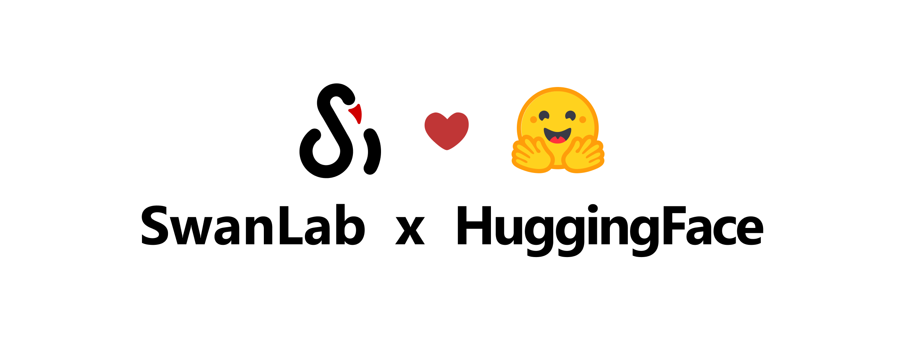
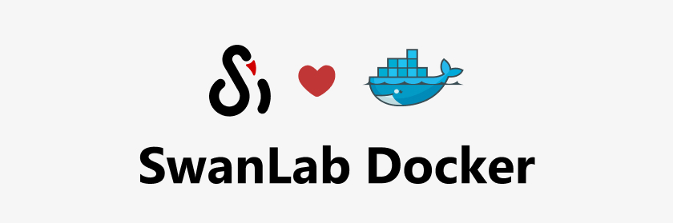

# ⚡️Changelog

::: warning Update Guide
Upgrade to latest version: `pip install -U swanlab`  
Github: https://github.com/SwanHubX/SwanLab
:::

## v0.6.1 - 2025.6.5

**🚀 New Features**  
- Hovering over the table header now displays a shortened name  
- Added the "Expand Subtable" feature in table view  
- Hardware monitoring now supports Hygon DCU  
- Hardware monitoring now supports retrieving power consumption information for Ascend NPUs  

**🤔 Optimizations**  
- Improved integration with the HuggingFace Accelerate framework  
- Duplicate step log warnings are no longer printed by default

## v0.6.0 - 2025.6.1  

**🚀 New Features**  
- Added support for **free dragging of charts**  
- Added ECharts custom charts, including 20+ chart types such as bar charts, pie charts, and histograms;  
- Hardware monitoring now supports **MetaX** GPUs  
- Integrated the [PaddleNLP](https://github.com/PaddlePaddle/PaddleNLP) framework;

## v0.5.9 - 2025.5.25  

**🚀 New Features**  
- 📒 Logging now supports standard error streams, significantly improving the logging experience for frameworks like EvalScope/PyTorch Lightning  
- 💻 Hardware monitoring now supports **Moore Threads** GPUs  
- 🔐 Added security protection for command execution logs—API Keys will now be automatically hidden  
- ⚙️ Settings now include "Default Workspace" and "Default Visibility" configurations, allowing you to specify under which organization new projects are created by default!

## v0.5.8 - 2025.5.13  

**🚀 New Features**  

- Added Experimental Tag feature  
- Added Log Scale feature for line charts  
- Added Experiment Group Drag-and-Drop feature  
- Added Configuration and Metrics table download functionality in experiment cards  
- Added [Open API](/zh/api/py-openapi.md), supporting data retrieval from SwanLab via API  
- Significantly optimized metric transmission performance, improving speed for handling thousands of metrics  
- Integrated the `paddlenlp` framework  

**🤔 Optimizations**  
- Improved a series of interactions on the personal homepage  

**🌍 Ecosystem**  
- Listed on Tencent Cloud App Marketplace: [Guide](/zh/guide_cloud/self_host/tencentcloud-app.md)

## v0.5.6 - 2025.4.23  

**🚀 New Features**  
- Line charts now support chart configuration, allowing customization of X/Y axis ranges, main title, and X/Y axis titles.  
- Chart search now supports regular expressions.  
- SwanLab private deployment edition now supports offline activation verification.  
- Added support for Kunlunxin XPU environment logging and hardware monitoring.  
- Improved pip environment logging compatibility for projects using `uv`.  
- Environment logging now records Linux distributions (e.g., Ubuntu, CentOS, Kylin, etc.).  

**🤔 Optimizations**  
- Fixed issues with the sidebar's one-click experiment hiding feature.  

## v0.5.5 - 2025.4.7

**🚀 New Features**
- Added `swanlab.Molecule` data type to support biochemical molecular visualization, providing better training experience for AI4Science tasks like AlphaFold
- Experiment tables now remember your sorting, filtering, and column dragging!
- Added support for recording Cambricon MLU temperature and power metrics
- Introduced three new environment variables: SWANLAB_PROJ, SWANLAB_WORKSPACE, and SWANLAB_EXP_NAME
- Added Cambricon MLU logo display in environment information

**🌍 Ecosystem**
- Large model evaluation framework [EvalScope](https://github.com/modelscope/evalscope) has integrated SwanLab! See: https://github.com/modelscope/evalscope/pull/453

**🛠 Improvements**
- Optimized web page loading performance

## v0.5.4 - 2025.3.31  

**🚀 New Features**  
• Added the `swanlab.Settings` method for more granular experiment behavior control, further enhancing openness  
• Added hardware logging and resource monitoring for Cambricon MLU  
• Added CANN version logging for Ascend NPU hardware records  
• Added GPU architecture and CUDA core count logging for NVIDIA GPU hardware records  
• NVIDIA GPU hardware monitoring now supports logging "GPU memory access time percentage"  
• **"Profile"** page now displays your **"Organization"**  
• **"Overview"** page now supports editing **"Project Description"** text  

**🤔 Improvements**  
• Fixed some issues with `sync_wandb`  
• Fixed some issues with the `Object3D` class  
• Optimized the styling of **"General"** settings  
• Significantly improved project loading performance  

**🔌 Plugins**  
• Official plugins now include **Slack Notifications** and **Discord Notifications**, further integrating with the global ecosystem

## v0.5.3 - 2025.3.20

**🚀 New Features**

- SwanLab has officially joined the **🤗HuggingFace ecosystem**! Starting from Transformers version 4.50.0, SwanLab is officially integrated as an experiment tracking tool. Simply add `report_to="swanlab"` in `TrainingArguments` to start tracking your training.
* Added `swanlab.Object3D` to support recording 3D point clouds. [Docs](/en/api/py-object3d)
* Hardware monitoring now supports recording GPU memory (MB), disk utilization, and network upload and download.

**🤔 Optimizations**

* Fixed several issues.

## v0.5.0 - 2025.3.12

**🎉🎉 SwanLab Self-Hosted Deployment (Community Edition) is now officially released!!** [Deployment Guide](/guide_cloud/self_host/docker-deploy.md)

**🚀 New Features**
- Added the `callbacks` parameter to `swanlab.init`, allowing the registration of callback functions during initialization to support various custom plugin classes.
- Introduced `swanlab.register_callback()`, enabling the registration of callback functions outside of `init`. [Documentation](/api/py-register-callback.html)
- Upgraded `swanlab.login()` with new parameters `host`, `web_host`, and `save`, adapting to the characteristics of self-hosted deployment services and supporting the option to not write user login credentials locally for shared server scenarios. [Documentation](/zh/api/py-login.md)
- Upgraded `swanlab login` with new parameters `host`, `web_host`, and `api-key`. [Documentation](/zh/api/cli-swanlab-login.md)
- Added support for using `swanlab.sync_mlflow()` to synchronize MLFlow projects to SwanLab. [Documentation](/guide_cloud/integration/integration-mlflow.md)

**🤔 Optimizations**
- We have significantly optimized the SDK architecture, improving its performance in scenarios with a large number of metrics.
- The experiment sidebar is now resizable!
- Added a "Git Code" button to the top-right corner of the experiment page, allowing one-click navigation to the corresponding repository.

**🔌 Plugins**:
- Added **notification plugins**, supporting notifications via **email, Feishu, DingTalk, and WeCom** when training ends.
- Added **logging plugins**, supporting the writing of metadata, configurations, and metrics to **local CSV files** during training.

## v0.4.12 - 2025.3.8

**Optimizations**
- Fixed some issues

## v0.4.11 - 2025.3.5

**Improvements**

- Fixed the issue of W&B format conversion errors in some versions
- Fixed some interaction issues

## v0.4.10 - 2025.3.4

**🚀 New Features**

• Added integration with [DiffSynth-Studio](https://github.com/modelscope/DiffSynth-Studio), [Documentation](/en/guide_cloud/integration/integration-diffsynth-studio.md).  
• Added support for converting **MLFlow** experiments to SwanLab. [Documentation](/en/guide_cloud/integration/integration-mlflow.md).  
• Introduced **Project Descriptions**, allowing you to add short notes to your projects.  

**Improvements**

• Fixed an issue where CPU model information could not be correctly recorded on OpenEuler systems.

## v0.4.9 - 2025.2.28

**🚀 New Features**
- Added `Move Experiment` function
- Added `update_config` method to some integration Callback classes
- `run` now supports `get_url()` and `get_project_url()` methods to get experiment and project URLs

**Optimizations**
- Fixed some issues on Linux systems

## v0.4.8 - 2025.2.16

**🚀 New Features**
- Added integration with Modelscope Swift, [Docs](/en/guide_cloud/integration/integration-swift.md)
- Added `Add Group` and `Move Chart to Another Group` functions

**Optimizations**
- Fixed some issues with the SDK

## v0.4.7 - 2025.2.11

**🚀 New Features**
- `swanlab.log` now supports the `print_to_console` parameter. When enabled, the `key` and `value` of `swanlab.log` will be printed to the terminal in dictionary format.
- `swanlab.init` now supports the `name` and `notes` parameters, which are equivalent to `experiment_name` and `description`, respectively.

## v0.4.6 - 2025.2.3

**🚀New Features**
- Added integration with LLM reinforcement learning framework [verl](https://github.com/volcengine/verl), [Docs](/en/guide_cloud/integration/integration-verl.md)
- `swanlab.log` supports nested dictionary input

**Optimizations**
- Optimized distributed training optimization in PyTorch Lightning framework

## v0.4.5 - 2025.1.22

**🚀New Features**
- Added `swanlab.sync_tensorboardX()` and `swanlab.sync_tensorboard_torch()`: Supports synchronizing metrics to SwanLab when using TensorboardX or PyTorch.utils.tensorboard for experiment tracking. [Docs](/en/guide_cloud/integration/integration-tensorboard.md)

**Optimizations**
- Optimized the code compatibility of `sync_wandb()`

## v0.4.3 - 2025.1.17

**🚀 New Features**
- Added `swanlab.sync_wandb()`: Supports synchronizing metrics to SwanLab when using Weights&Biases for experiment tracking. [Docs](/en/guide_cloud/integration/integration-wandb.md)
- Added framework integration: Configuration items will now record the framework being used.

**Optimizations**
- Improved table view interactions, adding row and column dragging, filtering, and sorting interactions.
- Significantly optimized workspace loading performance.
- Significantly optimized log rendering performance.
- Improved the interaction when executing `swanlab.init()` on a non-logged-in computer.
- Fixed several known issues.

## New Year's Day Update

**🚀 New Features**
- Upgraded chart smoothing; the state will remain preserved after webpage refresh
- Updated chart resizing; now you can change the size by dragging the bottom right corner of the chart

**⚙️ Bug Fixes**
- Fixed a bug where the project settings did not display the delete option when there were no experiments

## v0.4.2 - 2024.12.24

**🚀New Features**
- Added password login
- Added project settings page

**Improvements**
- Fixed warning issues when running hardware monitoring on some devices

## v0.4.0 - 2024.12.15

🎉The long-awaited hardware monitoring feature (cloud version) is now available, supporting system-level monitoring of **CPU, NPU, and GPU**:

- **CPU**: Utilization, Thread Count
- **Memory**: Utilization, Process Utilization, Available Memory
- **Nvidia GPU**: Utilization, Memory Allocation, Temperature, Power Consumption
- **Ascend NPU**: Utilization, HBM Allocation, Temperature

More monitoring features are on the way!

by Cunyue

## v0.3.28 - 2024.12.6

> 🍥Announcement: Hardware monitoring feature coming soon!

**🚀New Features**
- Added integration with LightGBM
- Added integration with XGBoost

**Improvements**
- Increased line length limit for log recording
- Improved performance in preparation for version 0.4.0

## v0.3.27 - 2024.11.26

**🚀New Features**
- Added Huawei Ascend NPU GPU detection
- Added integration with Coreshub

## New UI Released!

**🚀What We Improved**
- Launched new website and UI interface focused on user experience
- Released personal/organization homepage
- Added "Dark Mode"
- Fully optimized "Quick Start Guide" with framework integrations and examples
- Improved experiment selection logic in "Chart Comparison View"

## v0.3.25 - 2024.11.11

**🚀New Features**
- 🎉[VSCode Extension](https://marketplace.visualstudio.com/items?itemName=SwanLab.swanlab&ssr=false#overview) is now available
- Added integration with Keras framework
- Added `run.public` method to access experiment project name, experiment name, links etc., [#732](https://github.com/SwanHubX/SwanLab/pull/732)

## v0.3.22 - 2024.10.18

**🚀New Features**
- 🎉Benchmark Community Beta version is now live: https://swanlab.cn/benchmarks
- Added integration with PaddleYolo, [Documentation](/en/guide_cloud/integration/integration-paddleyolo.md)

**Bug Fixes**
- Fixed sqlite parallel read/write errors during multiple parallel experiment submissions, [#715](https://github.com/SwanHubX/SwanLab/issues/715)
- Fixed compatibility issues with CPU brand recording

## v0.3.21 - 2024.9.26

**🚀New Features**
- [Organization creation](/en/guide_cloud/general/organization.md) is now fully open, with a limit of 15 people per organization
- Experiment names now support "duplicates" with a new experiment naming system

## v0.3.19 - 2024.9.2

**🚀New Features**
- (Beta) Added cloud storage functionality for task-based training `swanlab task`
**Improvements**
- [Environment] Added CPU brand recording

**Bug Fixes**
- Fixed issues with `swanlab login` in Windows command line caused by misoperations

## v0.3.17 - 2024.8.18

1. Completed code refactoring of cloud chart library and frontend, improved many interactions
2. Fixed parameter display issue in experiment table sidebar for unloaded experiments
3. Fixed network connection errors caused by requests package for some users
4. [Environment] Added NVIDIA driver version recording
5. Local board now supports automatic port renewal for occupied ports

## v0.3.16 - 2024.7.31

**🚀New Features**
- (Beta) Added task-based training `swanlab task` functionality
- Added integration with `torchtune`, [Documentation](/en/guide_cloud/integration/integration-pytorch-torchtune)

**Improvements**
- Added `public` parameter to `swanlab.init` to set new project visibility, defaults to `False`
- Changed default visibility of projects created with `swanlab.init` to private
- Added `dataclass` type support for `swanlab.config`

**Bug Fixes**
- Fixed missing dependency issues when importing swanlab in conda-forge environment

## v0.3.14 - 2024.7.20

**Bug Fixes**
- Fixed environment dependency installation issues
- Fixed various compatibility issues on Windows systems

## v0.3.13 - 2024.6.27

**🚀New Features**
- Added support for changing experiment colors

**⚡️Improvements**
- Optimized issues in Google CoLab and Jupyter Notebook
- Improved error log collection and printing

**Bug Fixes**
- Fixed various issues when running on Windows systems
- Fixed terminal printing issues with frameworks like Hydra
- Fixed issue where save_dir couldn't be None in SwanlabVisBackend for mmengine integration

## v0.3.11 - 2024.6.14

**🚀New Features**
- Added PID and Python Verbose to environment recording
- Support for changing project visibility
- Offline board command changed to `swanlab watch [LOG PATH]`

**⚡️Improvements**
- Optimized Python environment search performance
- Optimized SwanLab library architecture

**Bug Fixes**
- Fixed offline board startup failure issues

## v0.3.10 - 2024.6.10

**Bug Fixes**
- Fixed encoding errors when uploading certain texts
- Fixed environment information not uploading correctly

## v0.3.9 - 2024.6.8

**🚀New Features**
- `swanlab logout`: Support logging out of SwanLab account in terminal

**👥Integration**
- Added integration with HuggingFace Accelerate, [Documentation](/en/guide_cloud/integration/integration-huggingface-accelerate.md)

**⚡️Improvements**
- Improved media file upload stability

**Bug Fixes**
- Fixed nvml library compatibility issues
- Resolved 409 errors when uploading large media files at experiment end
- Fixed OSError issues on some machines

## v0.3.8 - 2024.5.31

**⚡️Improvements**
- Improved integration with ultralytics in ddp scenarios
- Added latest version notification during swanlab.init

**Bug Fixes**
- Fixed thread crash when log value is `inf`
- Fixed image upload failures during long training sessions

## v0.3.6 - 2024.5.28

**Bug Fixes**
- Fixed some logging data upload issues
- Fixed `swanlab login` issues

## v0.3.4 - 2024.5.27

**🚀New Features**
- Added `mode` parameter to `swanlab.init`, supporting new `disabled` mode
- Support for batch experiment deletion

**⚡️Improvements**
- Optimized ultralytics integration code

**👥Integration**
- Integration with Stable Baseline3, [Guide](/en/guide_cloud/integration/integration-sb3.md)

## v0.3.3 - 2024.5.22

**👥Integration**
- Integration with Weights & Biases, supporting wandb project conversion to `SwanLab` projects, [Guide](/en/guide_cloud/integration/integration-wandb.md)
- Integration with Ultralytics, [Guide](/en/guide_cloud/integration/integration-ultralytics.md)
- Integration with fastai, [Guide](/en/guide_cloud/integration/integration-fastai.md)

## v0.3.2 - 2024.5.17

**👥Integration**
- Integration with Tensorboard, supporting conversion of `Tensorboard` log files to `SwanLab` experiments, [Guide](/en/guide_cloud/integration/integration-tensorboard.md)

**🚀New Features**
- Support for downloading line charts as PNG images
- SwanLab experiments can now be embedded in online documents (Feishu/Notion etc. that support webpage embedding)
- Table view supports CSV export
- Table view supports metrics-only view

**⚡️Improvements**
- Optimized value display in line charts and table views

**⚙️Bug Fixes**
- Fixed config table display bug when loading `hydra` config files with `swanlab.config` on Windows
- Resolved SwanLab login issues in Jupyter Notebook

## v0.3.1 - 2024.5.3

**⚡️Improvements**
- Added default `.gitignore` to `swanlog` log folder

**⚙️Bug Fixes**
- Fixed compatibility issues with Omegaconfig and similar types in `swanlab.init` config