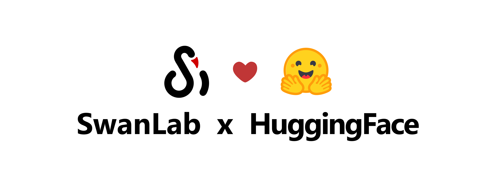
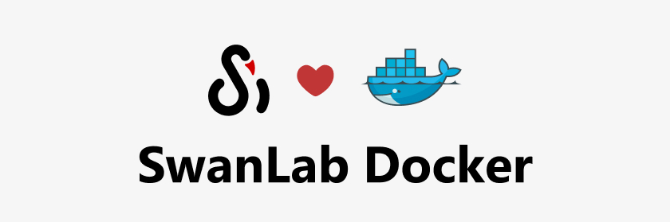

# ⚡️Changelog

::: warning Update Guide
Upgrade to latest version: `pip install -U swanlab`  
Github: https://github.com/SwanHubX/SwanLab
:::

## v0.7.12 - 2026.03.19

**🚀 New Features**
- 🦜 **Experiment Duplicate** feature is now available, improving the experience of comparing baseline experiments across multiple projects
- 🪓 **Parallel Mode** is now available, allowing multiple distributed processes to upload metrics to the same experiment at the same time
- 🪓 **Write Rate Upgrade**, now SwanLab supports higher SDK metric write rates
- 🦄 **resume id** now supports custom characters
- 🪓 **SDK supports specifying experiment color**

**🔧 Bug Fixes**
- Fixed a bug where adding tags would cause a lag
- Fixed a series of other issues

## v0.7.8 - 2026.02.06

**🚀 New Features**
- ⚡️ LightningBoard (Lightning Board) is now available, designed for extremely large chart scenarios like pre-training of large models
- 📊 New chart embedding link, now you can embed your charts into online documents (e.g., Notion, Feishu Cloud Docs)
- 📊 New chart pinning to first position in group
- 📊 Charts Table supports CSV download
- 🌸 Project share button moved to top header area

**🔧 Bug Fixes**
- Fixed issue where horizontal axis was not displayed completely when downloading chart PNG
- Fixed issue where clicking the "Apply" button in the chart configuration panel would cause a lag when the chart was zoomed in
- Fixed a series of other issues

## v0.7.6 - 2026.01.06

**🚀 New Features**
- Added support for AMD ROCm hardware monitoring
- Added support for TianShu hardware monitoring
- Optimized SDK connection performance, improving stability

## v0.7.4 - 2025.12.14

Released SwanLab Kubernetes version, deployment instructions see [this document](/en/guide_cloud/self_host/kubernetes-deploy.md)

**🚀 New Features**
- Adapted to SwanLab Kubernetes version
- Overview table view - supports hiding, showing, pinning, sorting, and ascending/descending columns through table headers

## v0.7.3 - 2025.12.11
**🚀 New Features**
- Added detailed information display for line charts, when hovering over a line chart, pressing Shift will enable detailed mode, supporting display of the time of the current log point
- Grouped charts now support MIN/MAX area range display
- Added integration with NVIDIA-NeMo RL framework, [Documentation](/en/guide_cloud/integration/integration-nvidia-nemo-rl.md)
- Added integration with Telegram notification plugin, [Documentation](/en/plugin/notification-telegram.md)

**🤔 Improvements**
- Fixed network connection quality issues with the SDK
- Optimized chart loading performance

## v0.7.2 - 2025.11.17

**🚀 New Features**
- Added **X-axis data source** to the global chart settings
- Added **Hover mode** to the global chart settings, supporting setting the hover mode for other charts when hovering over a specific line chart
- Added new environment variable: `SWANLAB_WEBHOOK_VALUE`

**🤔 Improvements**
- Fixed some issues

## v0.7.0 - 2025.11.06

**🚀 New Features**
- **Experiment Group** is now available, supporting group management for large batches of experiments
- Workspace page upgraded, supporting quick switching between multiple organizations
- `swanlab.init` now supports `group` and `job_type` parameters

**🤔 Improvements**
- Significantly optimized chart rendering performance, allowing researchers to focus more on experimental analysis itself.
- Fixed some compatibility issues with the public API.

## v0.6.12 - 2025.10.18

**🚀 New Features**
- Added Bark notification plugin, supporting iOS push notifications when training completes or an error occurs, [Documentation](/en/plugin/notification-bark.md)
- Optimized application performance

## v0.6.11 - 2025.10.15

**🚀 New Features**
- New project UI interface, table view supports global filtering, sorting, and other capabilities
- Line chart configuration now supports **X-axis data source** configuration
- Added **ctrl-c** to the experiment status, indicating manually interrupted experiments
- Added `swanlab local`, `swanlab online`, `swanlab offline`, `swanlab disabled` commands to quickly set SwanLab mode in the command line, [Documentation](/en/api/cli-swanlab-offline.md)

## v0.6.9 - 2025.9.9

**🚀 New Features**
- Projects now support adding collaborators. [Documentation](/en/guide_cloud/experiment_track/add-collaborator)
- Major upgrade to the organization management page, offering enhanced permission control and project management capabilities.
- Added new environment variables: `SWANLAB_DESCRIPTION`, `SWANLAB_TAGS`, `SWANLAB_DISABLE_GIT`.

**🤔 Improvements**
- Enhanced chart rendering performance with low-intrusion loading animations, allowing researchers to focus more on experimental analysis itself.
- Fixed some compatibility issues with the public API.

**🔌 Integrations**
- Added integration with Apple's [MLX LM](https://github.com/ml-explore/mlx-lm) framework. [Documentation](/en/guide_cloud/integration/integration-mlx-lm)
- Added integration with SGLang's [SpecForge](https://github.com/sgl-project/SpecForge) framework.

## v0.6.8 - 2025.7.29

**🚀 New Features**
- Sidebar now supports **experiment filtering and sorting**
- Table view introduces a **column control panel** for easy column hiding and showing
- **Multiple API Key management** is now available, making your data more secure
- [swanlab sync](/en/guide_cloud/experiment_track/sync-logfile.md) now offers improved compatibility for log file integrity, adapting to scenarios such as training crashes
- New chart types released: [PR Curve](/en/api/py-pr_curve.md), [ROC Curve](/en/api/py-roc_curve.md), and [Confusion Matrix](/en/api/py-confusion_matrix.md)
- Open API now includes an **interface for retrieving experiment metrics**

**🤔 Improvements**
- Added support for Japanese and Russian languages
- The configuration table in experiment cards now supports one-click collapse/expand
- Fixed some issues

## v0.6.7 - 2025.7.17

**🚀 New Features**
- Added support for **more flexible line chart configuration**, including line type, color, thickness, grid, and legend position
- Added support for `swanlab.Video` data type, supporting recording and visualizing GIF format files
- Added support for configuring the Y-axis and maximum number of experiments displayed in the global chart dashboard

**⚙️ Improvements**
- Increased the maximum experiment name length to 250 characters
- Fixed some issues

## v0.6.5 - 2025.7.5

**🚀 New Features**
- Added support for **resuming training from checkpoints (resume断点续训)**
- Added support for **zooming in on small line charts**
- Added support for configuring **individual chart smoothing**

**⚙️ Improvements**
- Significantly improved **interaction experience when zooming in on charts**

**🔌 Integrations**
- 🤗 Integrated with the [accelerate](https://github.com/huggingface/accelerate) framework. See the [documentation](/guide_cloud/integration/integration-huggingface-accelerate.md) to enhance experiment tracking in distributed training.
- Integrated with the [ROLL](https://github.com/alibaba/ROLL) framework. See the [documentation](/guide_cloud/integration/integration-roll.md) to improve experiment logging during distributed training.
- Integrated with the [Ray](https://github.com/ray-project/ray) framework. See the [documentation](/guide_cloud/integration/integration-ray.md) to enhance experiment tracking in distributed training environments.

**🔌 Plugins**
- Added a new `LogdirFileWriter` plugin, which supports writing files directly into the log directory.

## v0.6.4 - 2025.6.18

**🚀 New Features**
- Added integration with [AREAL](https://github.com/inclusionAI/AReaL), [PR](https://github.com/inclusionAI/AReaL/pull/98)
- Added support for highlighting corresponding curves when hovering over experiments in the sidebar
- Added support for cross-group comparison line charts
- Enabled progressive chart rendering to improve page loading speed
- Added support for setting experiment name clipping rules

**⚙️ Bug Fixes**
- Fixed issues with `local` mode where log files could not be correctly `sync`ed and `watched`

## v0.6.3 - 2025.6.12

**🚀 New Features**
- Added `swanlab.echarts.table` to support creating table charts
- Added MB memory recording for Ascend NPU, MetaX, Hygon DCU, Cambricon MLU, and Kunlunxin XPU hardware monitoring
- `swanlab sync` now supports uploading multiple log files at once
- Added `Public/Private` filtering to workspaces
- Added `Latest/Max/Min` switch module to table view

## v0.6.2 - 2025.6.9

**🚀 New Features**
- Added the `swanlab sync` command to support syncing local logs to SwanLab Cloud or private deployment  
- Supports storing complete experiment log files locally

## v0.6.1 - 2025.6.5

**🚀 New Features**  
- Hovering over the table header now displays a shortened name  
- Added the "Expand Subtable" feature in table view  
- Hardware monitoring now supports Hygon DCU  
- Hardware monitoring now supports retrieving power consumption information for Ascend NPUs  

**🤔 Optimizations**  
- Improved integration with the HuggingFace Accelerate framework  
- Duplicate step log warnings are no longer printed by default

## v0.6.0 - 2025.6.1  

**🚀 New Features**  
- Added support for **free dragging of charts**  
- Added ECharts custom charts, including 20+ chart types such as bar charts, pie charts, and histograms;  
- Hardware monitoring now supports **MetaX** GPUs  
- Integrated the [PaddleNLP](https://github.com/PaddlePaddle/PaddleNLP) framework;

## v0.5.9 - 2025.5.25  

**🚀 New Features**  
- 📒 Logging now supports standard error streams, significantly improving the logging experience for frameworks like EvalScope/PyTorch Lightning  
- 💻 Hardware monitoring now supports **Moore Threads** GPUs  
- 🔐 Added security protection for command execution logs—API Keys will now be automatically hidden  
- ⚙️ Settings now include "Default Workspace" and "Default Visibility" configurations, allowing you to specify under which organization new projects are created by default!

## v0.5.8 - 2025.5.13  

**🚀 New Features**  

- Added Experimental Tag feature  
- Added Log Scale feature for line charts  
- Added Experiment Group Drag-and-Drop feature  
- Added Configuration and Metrics table download functionality in experiment cards  
- Added [Open API](/zh/api/py-openapi.md), supporting data retrieval from SwanLab via API  
- Significantly optimized metric transmission performance, improving speed for handling thousands of metrics  
- Integrated the `paddlenlp` framework  

**🤔 Optimizations**  
- Improved a series of interactions on the personal homepage  

**🌍 Ecosystem**  
- Listed on Tencent Cloud App Marketplace: [Guide](/zh/guide_cloud/self_host/tencentcloud-app.md)

## v0.5.6 - 2025.4.23  

**🚀 New Features**  
- Line charts now support chart configuration, allowing customization of X/Y axis ranges, main title, and X/Y axis titles.  
- Chart search now supports regular expressions.  
- SwanLab private deployment edition now supports offline activation verification.  
- Added support for Kunlunxin XPU environment logging and hardware monitoring.  
- Improved pip environment logging compatibility for projects using `uv`.  
- Environment logging now records Linux distributions (e.g., Ubuntu, CentOS, Kylin, etc.).  

**🤔 Optimizations**  
- Fixed issues with the sidebar's one-click experiment hiding feature.  

## v0.5.5 - 2025.4.7

**🚀 New Features**
- Added `swanlab.Molecule` data type to support biochemical molecular visualization, providing better training experience for AI4Science tasks like AlphaFold
- Experiment tables now remember your sorting, filtering, and column dragging!
- Added support for recording Cambricon MLU temperature and power metrics
- Introduced three new environment variables: SWANLAB_PROJ, SWANLAB_WORKSPACE, and SWANLAB_EXP_NAME
- Added Cambricon MLU logo display in environment information

**🌍 Ecosystem**
- Large model evaluation framework [EvalScope](https://github.com/modelscope/evalscope) has integrated SwanLab! See: https://github.com/modelscope/evalscope/pull/453

**🛠 Improvements**
- Optimized web page loading performance

## v0.5.4 - 2025.3.31  

**🚀 New Features**  
• Added the `swanlab.Settings` method for more granular experiment behavior control, further enhancing openness  
• Added hardware logging and resource monitoring for Cambricon MLU  
• Added CANN version logging for Ascend NPU hardware records  
• Added GPU architecture and CUDA core count logging for NVIDIA GPU hardware records  
• NVIDIA GPU hardware monitoring now supports logging "GPU memory access time percentage"  
• **"Profile"** page now displays your **"Organization"**  
• **"Overview"** page now supports editing **"Project Description"** text  

**🤔 Improvements**  
• Fixed some issues with `sync_wandb`  
• Fixed some issues with the `Object3D` class  
• Optimized the styling of **"General"** settings  
• Significantly improved project loading performance  

**🔌 Plugins**  
• Official plugins now include **Slack Notifications** and **Discord Notifications**, further integrating with the global ecosystem

## v0.5.3 - 2025.3.20

**🚀 New Features**

- SwanLab has officially joined the **🤗HuggingFace ecosystem**! Starting from Transformers version 4.50.0, SwanLab is officially integrated as an experiment tracking tool. Simply add `report_to="swanlab"` in `TrainingArguments` to start tracking your training.
* Added `swanlab.Object3D` to support recording 3D point clouds. [Docs](/en/api/py-object3d)
* Hardware monitoring now supports recording GPU memory (MB), disk utilization, and network upload and download.

**🤔 Optimizations**

* Fixed several issues.

## v0.5.0 - 2025.3.12

**🎉🎉 SwanLab Self-Hosted Deployment (Community Edition) is now officially released!!** [Deployment Guide](/guide_cloud/self_host/docker-deploy.md)

**🚀 New Features**
- Added the `callbacks` parameter to `swanlab.init`, allowing the registration of callback functions during initialization to support various custom plugin classes.
- Introduced `swanlab.register_callback()`, enabling the registration of callback functions outside of `init`. [Documentation](/api/py-register-callback.html)
- Upgraded `swanlab.login()` with new parameters `host`, `web_host`, and `save`, adapting to the characteristics of self-hosted deployment services and supporting the option to not write user login credentials locally for shared server scenarios. [Documentation](/zh/api/py-login.md)
- Upgraded `swanlab login` with new parameters `host`, `web_host`, and `api-key`. [Documentation](/zh/api/cli-swanlab-login.md)
- Added support for using `swanlab.sync_mlflow()` to synchronize MLFlow projects to SwanLab. [Documentation](/guide_cloud/integration/integration-mlflow.md)

**🤔 Optimizations**
- We have significantly optimized the SDK architecture, improving its performance in scenarios with a large number of metrics.
- The experiment sidebar is now resizable!
- Added a "Git Code" button to the top-right corner of the experiment page, allowing one-click navigation to the corresponding repository.

**🔌 Plugins**:
- Added **notification plugins**, supporting notifications via **email, Feishu, DingTalk, and WeCom** when training ends.
- Added **logging plugins**, supporting the writing of metadata, configurations, and metrics to **local CSV files** during training.

## v0.4.12 - 2025.3.8

**Optimizations**
- Fixed some issues

## v0.4.11 - 2025.3.5

**Improvements**

- Fixed the issue of W&B format conversion errors in some versions
- Fixed some interaction issues

## v0.4.10 - 2025.3.4

**🚀 New Features**

• Added integration with [DiffSynth-Studio](https://github.com/modelscope/DiffSynth-Studio), [Documentation](/en/guide_cloud/integration/integration-diffsynth-studio.md).  
• Added support for converting **MLFlow** experiments to SwanLab. [Documentation](/en/guide_cloud/integration/integration-mlflow.md).  
• Introduced **Project Descriptions**, allowing you to add short notes to your projects.  

**Improvements**

• Fixed an issue where CPU model information could not be correctly recorded on OpenEuler systems.

## v0.4.9 - 2025.2.28

**🚀 New Features**
- Added `Move Experiment` function
- Added `update_config` method to some integration Callback classes
- `run` now supports `get_url()` and `get_project_url()` methods to get experiment and project URLs

**Optimizations**
- Fixed some issues on Linux systems

## v0.4.8 - 2025.2.16

**🚀 New Features**
- Added integration with Modelscope Swift, [Docs](/en/guide_cloud/integration/integration-swift.md)
- Added `Add Group` and `Move Chart to Another Group` functions

**Optimizations**
- Fixed some issues with the SDK

## v0.4.7 - 2025.2.11

**🚀 New Features**
- `swanlab.log` now supports the `print_to_console` parameter. When enabled, the `key` and `value` of `swanlab.log` will be printed to the terminal in dictionary format.
- `swanlab.init` now supports the `name` and `notes` parameters, which are equivalent to `experiment_name` and `description`, respectively.

## v0.4.6 - 2025.2.3

**🚀New Features**
- Added integration with LLM reinforcement learning framework [verl](https://github.com/volcengine/verl), [Docs](/en/guide_cloud/integration/integration-verl.md)
- `swanlab.log` supports nested dictionary input

**Optimizations**
- Optimized distributed training optimization in PyTorch Lightning framework

## v0.4.5 - 2025.1.22

**🚀New Features**
- Added `swanlab.sync_tensorboardX()` and `swanlab.sync_tensorboard_torch()`: Supports synchronizing metrics to SwanLab when using TensorboardX or PyTorch.utils.tensorboard for experiment tracking. [Docs](/en/guide_cloud/integration/integration-tensorboard.md)

**Optimizations**
- Optimized the code compatibility of `sync_wandb()`

## v0.4.3 - 2025.1.17

**🚀 New Features**
- Added `swanlab.sync_wandb()`: Supports synchronizing metrics to SwanLab when using Weights&Biases for experiment tracking. [Docs](/en/guide_cloud/integration/integration-wandb.md)
- Added framework integration: Configuration items will now record the framework being used.

**Optimizations**
- Improved table view interactions, adding row and column dragging, filtering, and sorting interactions.
- Significantly optimized workspace loading performance.
- Significantly optimized log rendering performance.
- Improved the interaction when executing `swanlab.init()` on a non-logged-in computer.
- Fixed several known issues.

## New Year's Day Update

**🚀 New Features**
- Upgraded chart smoothing; the state will remain preserved after webpage refresh
- Updated chart resizing; now you can change the size by dragging the bottom right corner of the chart

**⚙️ Bug Fixes**
- Fixed a bug where the project settings did not display the delete option when there were no experiments

## v0.4.2 - 2024.12.24

**🚀New Features**
- Added password login
- Added project settings page

**Improvements**
- Fixed warning issues when running hardware monitoring on some devices

## v0.4.0 - 2024.12.15

🎉The long-awaited hardware monitoring feature (cloud version) is now available, supporting system-level monitoring of **CPU, NPU, and GPU**:

- **CPU**: Utilization, Thread Count
- **Memory**: Utilization, Process Utilization, Available Memory
- **Nvidia GPU**: Utilization, Memory Allocation, Temperature, Power Consumption
- **Ascend NPU**: Utilization, HBM Allocation, Temperature

More monitoring features are on the way!

by Cunyue