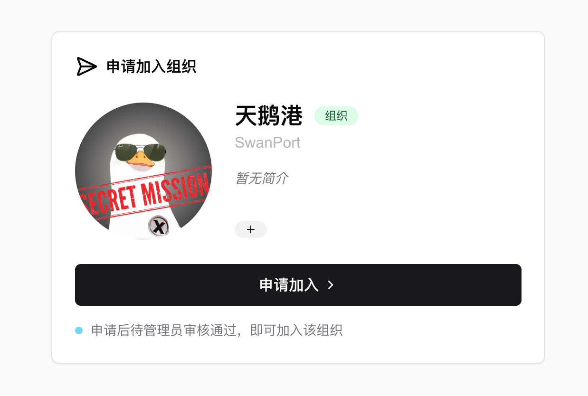

# Using SwanLab in Teams

## Creating an Organization

In the top-left corner of the homepage, click the "Create Organization" button. Fill in the organization name, organization ID, and other relevant information to complete the creation of the organization.

<div align="center">

</div>

## Inviting Members

<div align="center">

</div>

Under the organization space, navigate to "Settings" -> "General." In the "Members" section, click the "Invite Members" button and share the invitation link with the members you want to join the organization.

<div align="center">

</div>

Members can click the invitation link and submit their application. Once approved by the administrator, they will successfully join the organization.

## Uploading Experiments to the Organization Space

By default (i.e., without setting the `workspace` parameter), your project will be uploaded to your personal space.  
To upload it to the organization space, set the `workspace` parameter in `swanlab.init` to the organization's username (not the organization's nickname).

```python
import swanlab

swanlab.init(
    workspace="[organization username]"
)
```

If multiple members of the organization want to collaborate on the same project, simply set the `project` parameter in `swanlab.init` to the same value for all collaborators.