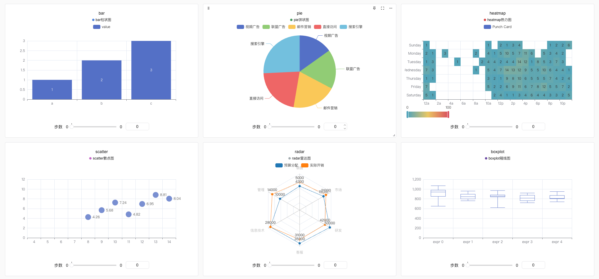
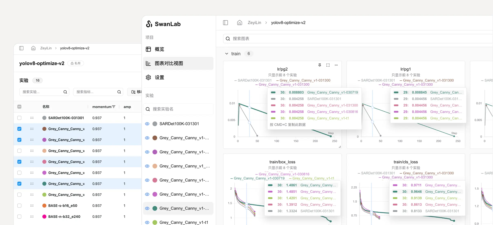

# Welcome to SwanLab  

[Official Website](https://swanlab.cn) · [Framework Integration](/guide_cloud/integration/integration-huggingface-transformers.html) · [Github](https://github.com/swanhubx/swanlab) · [Quick Start](/guide_cloud/general/quick-start.md) · [Sync WandB](/guide_cloud/integration/integration-wandb.md#_1-sync-tracking) · [Benchmark Community](https://swanlab.cn/benchmarks)  

::: warning 🎉 Self-Hosted Version Officially Released!  
The self-hosted version supports local use with features comparable to the public cloud edition. For deployment instructions, see [this document](/guide_cloud/self_host/docker-deploy.md).  
:::  

  

SwanLab is an **open-source, lightweight** AI model training tracking and visualization tool that provides a platform for **tracking, recording, comparing, and collaborating on experiments**.  

Designed for AI researchers, SwanLab offers a user-friendly Python API and an elegant UI, featuring **training visualization, automatic logging, hyperparameter tracking, experiment comparison, and multi-user collaboration**. With SwanLab, researchers can identify training issues through intuitive visual charts, compare multiple experiments for inspiration, and **share via online webpages** or **collaborative training within organizations**, breaking down communication barriers and improving team efficiency.  

Using SwanLab, researchers can document every training experience, seamlessly communicate and collaborate with peers, while machine learning engineers can develop production-ready models faster.  

## 📹 Online Demos  

| [ResNet50 Cat-Dog Classification][demo-cats-dogs] | [Yolov8-COCO128 Object Detection][demo-yolo] |  
| :--------: | :--------: |  
| [![][demo-cats-dogs-image]][demo-cats-dogs] | [![][demo-yolo-image]][demo-yolo] |  
| Track a simple ResNet50 model training on a cat-dog dataset for image classification. | Use Yolov8 on the COCO128 dataset for object detection, tracking training hyperparameters and metrics. |  

| [Qwen2 Instruction Fine-Tuning][demo-qwen2-sft] | [LSTM Google Stock Prediction][demo-google-stock] |  
| :--------: | :--------: |  
| [![][demo-qwen2-sft-image]][demo-qwen2-sft] | [![][demo-google-stock-image]][demo-google-stock] |  
| Track Qwen2 LLM instruction fine-tuning for basic instruction following. | Train a simple LSTM model on Google stock data for future price prediction. |  

| [ResNeXt101 Audio Classification][demo-audio-classification] | [Qwen2-VL COCO Dataset Fine-Tuning][demo-qwen2-vl] |  
| :--------: | :--------: |  
| [![][demo-audio-classification-image]][demo-audio-classification] | [![][demo-qwen2-vl-image]][demo-qwen2-vl] |  
| Progressive experiments from ResNet to ResNeXt for audio classification. | Lora fine-tuning for Qwen2-VL multimodal LLM on the COCO2014 dataset. |  

| [EasyR1 Multimodal LLM RL Training][demo-easyr1-rl] | [Qwen2.5-0.5B GRPO Training][demo-qwen2-grpo] |  
| :--------: | :--------: |  
| [![][demo-easyr1-rl-image]][demo-easyr1-rl] | [![][demo-qwen2-grpo-image]][demo-qwen2-grpo] |  
| Multimodal LLM RL training using the EasyR1 framework. | GRPO training for Qwen2.5-0.5B on the GSM8k dataset. |  

Video Demo:  

<video controls src="./what_is_swanlab/demo.mp4"></video>  

## What Can SwanLab Do?  

**1. 📊 Experiment Metrics & Hyperparameter Tracking**: Easily integrate into your ML pipeline to track key training metrics.  

- ☁️ Supports **cloud** usage (like Weights & Biases), allowing remote training progress monitoring. [How to view experiments on mobile](https://docs.swanlab.cn/guide_cloud/general/app.html).  
- 🌸 **Visualize Training**: The UI provides intuitive visualizations of experiment data, helping trainers analyze metric trends and identify improvements.  
- 📝 **Hyperparameter logging**, **metric summaries**, **tabular analysis**.  
- **Supported Metadata Types**: Scalar metrics, images, audio, text, video, 3D point clouds, biochemical molecules, Echarts custom charts...  

  

- **Supported Chart Types**: Line charts, media (images/audio/text), 3D point clouds, biochemical molecules, bar charts, scatter plots, box plots, heatmaps, pie charts, radar charts...  

  

- **Automatic Background Logging**: Logging, hardware environment, Git repo, Python environment, Python library list, project directory.  
- **Resume Training Logging**: Supports adding new metric data to the same experiment after training completes/interrupts.  

**2. ⚡️ Comprehensive Framework Integration**: Supports **40+** frameworks including PyTorch, 🤗HuggingFace Transformers, PyTorch Lightning, 🦙LLaMA Factory, MMDetection, Ultralytics, PaddleDetection, LightGBM, XGBoost, Keras, Tensorboard, Weights&Biases, OpenAI, Swift, XTuner, Stable Baseline3, and Hydra.  

  

**3. 💻 Hardware Monitoring**: Real-time tracking for CPU, GPU (**Nvidia**, **MetaX**, **MooreThread**), NPU (**Ascend**), MLU (**Cambricon**), XPU (**KunlunX**), and memory metrics.  

**4. 📦 Experiment Management**: A centralized dashboard designed for training scenarios, providing an overview and quick management of multiple projects/experiments.  

**5. 🆚 Result Comparison**: Compare hyperparameters and results across experiments via online tables and charts to uncover insights.  

  

**6. 👥 Online Collaboration**: Collaborate with teams by syncing experiments in real time, viewing training logs, and sharing feedback.  

**7. ✉️ Share Results**: Copy and share persistent URLs for experiments, easily sending them to peers or embedding in notes.  

**8. 💻 Self-Hosting Support**: Use SwanLab offline—the community edition supports dashboards and experiment management. [Self-Hosting Guide](#-self-hosting).  

**9. 🔌 Plugin Extensions**: Extend functionality with plugins like [Lark Notifications](https://docs.swanlab.cn/plugin/notification-lark.html), [Slack Notifications](https://docs.swanlab.cn/plugin/notification-slack.html), [CSV Logger](https://docs.swanlab.cn/plugin/writer-csv.html).  

## Why Choose SwanLab?  

Unlike software engineering, AI is an **experimental discipline**—generating ideas, rapid testing, and validation are key. Documenting experiments is crucial for researchers and teams to **build knowledge and accelerate progress**.  

Traditional methods involve manually copying logs or TFEvent files, **but crude logs hinder inspiration, and offline logs make collaboration difficult**.  

SwanLab offers a cloud-based AI experiment tracking solution with **training visualization, experiment tracking, hyperparameter logging, and multi-user collaboration**. Researchers can **easily find insights through intuitive charts and share experiments via online links**, breaking communication barriers.  

> Traditional AI research focuses on results, while we focus on the **process**.  
> Community feedback highlights SwanLab as **simple, efficient, and rapidly evolving**.  
> —Zeyi, SwanLab Co-Founder  

  

Most importantly, SwanLab is **open-source**, built by ML engineers and the community. The self-hosted version ensures data security and privacy**.  

We hope this guide helps you understand SwanLab—we believe it can assist you.  

## Getting Started  

- [Quick Start](/guide_cloud/general/quick-start.md): A 5-minute tutorial for experiment tracking!  
- [API Docs](/api/api-index.md): Complete API documentation.  
- [Online Support](/guide_cloud/community/online-support.md): Join the community, report issues, and contact us.  
- [Self-Hosting](/guide_cloud/self_host/docker-deploy.md): Guide for self-hosted (private deployment) usage.  
- [Examples](/examples/mnist.md): Case studies of SwanLab with various deep learning tasks.  

## Comparison with Familiar Tools  

### Tensorboard vs. SwanLab  

- **☁️ Online Usage**: SwanLab syncs experiments to the cloud for remote monitoring, sharing, and collaboration. Tensorboard is offline-only.  
- **👥 Collaboration**: SwanLab simplifies team training management, while Tensorboard is designed for individual use.  
- **💻 Centralized Dashboard**: SwanLab aggregates results from any machine; Tensorboard requires manual TFEvent file management.  
- **💪 Powerful Tables**: SwanLab tables support searching/filtering thousands of model versions. Tensorboard struggles with large projects.  

### W&B vs. SwanLab  

- Weights & Biases is a closed-source, online-only MLOps platform.  
- SwanLab supports **open-source, free, self-hosted** usage alongside cloud features.  

## Framework Integrations  

Use SwanLab with your favorite frameworks! Below is our integration list. Submit an [Issue](https://github.com/swanhubx/swanlab/issues) for framework requests.  

**Core Frameworks**  
- [PyTorch](/guide_cloud/integration/integration-pytorch.html)  
- [MindSpore](/guide_cloud/integration/integration-ascend.html)  
- [Keras](/guide_cloud/integration/integration-keras.html)  

**Specialized/Fine-Tuning Frameworks**  
- [PyTorch Lightning](/guide_cloud/integration/integration-pytorch-lightning.html)  
- [HuggingFace Transformers](/guide_cloud/integration/integration-huggingface-transformers.html)  
- [LLaMA Factory](/guide_cloud/integration/integration-llama-factory.html)  
- [Modelscope Swift](/guide_cloud/integration/integration-swift.html)  
- [DiffSynth-Studio](/guide_cloud/integration/integration-diffsynth-studio.html)  
- [Sentence Transformers](/guide_cloud/integration/integration-sentence-transformers.html)  
- [OpenMind](https://modelers.cn/docs/zh/openmind-library/1.0.0/basic_tutorial/finetune/finetune_pt.html#%E8%AE%AD%E7%BB%83%E7%9B%91%E6%8E%A7)  
- [Torchtune](/guide_cloud/integration/integration-pytorch-torchtune.html)  
- [XTuner](/guide_cloud/integration/integration-xtuner.html)  
- [MMEngine](/guide_cloud/integration/integration-mmengine.html)  
- [FastAI](/guide_cloud/integration/integration-fastai.html)  
- [LightGBM](/guide_cloud/integration/integration-lightgbm.html)  
- [XGBoost](/guide_cloud/integration/integration-xgboost.html)  

**Computer Vision**  
- [Ultralytics](/guide_cloud/integration/integration-ultralytics.html)  
- [MMDetection](/guide_cloud/integration/integration-mmdetection.html)  
- [MMSegmentation](/guide_cloud/integration/integration-mmsegmentation.html)  
- [PaddleDetection](/guide_cloud/integration/integration-paddledetection.html)  
- [PaddleYOLO](/guide_cloud/integration/integration-paddleyolo.html)  

**Reinforcement Learning**  
- [Stable Baseline3](/guide_cloud/integration/integration-sb3.html)  
- [veRL](/guide_cloud/integration/integration-verl.html)  
- [HuggingFace trl](/guide_cloud/integration/integration-huggingface-trl.html)  
- [EasyR1](/guide_cloud/integration/integration-easyr1.html)  
- [AReaL](/guide_cloud/integration/integration-areal.html)  
- [ROLL](/guide_cloud/integration/integration-roll.html)  

**Other Frameworks**:  
- [Tensorboard](/guide_cloud/integration/integration-tensorboard.html)  
- [Weights&Biases](/guide_cloud/integration/integration-wandb.html)  
- [MLFlow](/guide_cloud/integration/integration-mlflow.html)  
- [HuggingFace Accelerate](/guide_cloud/integration/integration-huggingface-accelerate.html)  
- [Hydra](/guide_cloud/integration/integration-hydra.html)  
- [Omegaconf](/guide_cloud/integration/integration-omegaconf.html)  
- [OpenAI](/guide_cloud/integration/integration-openai.html)  
- [ZhipuAI](/guide_cloud/integration/integration-zhipuai.html)  

[More Integrations](/guide_cloud/integration/integration-pytorch-lightning.html)  

## Online Support  

- **[GitHub Issues](https://github.com/SwanHubX/SwanLab/issues)**: Report bugs or issues.  
- **Email Support**:  
  - Product: <contact@swanlab.cn>, <zeyi.lin@swanhub.co> (Product Manager)  
- **WeChat & Lark Groups**: See [Online Support](/guide_cloud/community/online-support.md).  
- **WeChat Official Account**:  

  
  

  

<!-- link -->  

[release-shield]: https://img.shields.io/github/v/release/swanhubx/swanlab?color=369eff&labelColor=black&logo=github&style=flat-square  
[release-link]: https://github.com/swanhubx/swanlab/releases  

[license-shield]: https://img.shields.io/badge/license-apache%202.0-white?labelColor=black&style=flat-square  
[license-shield-link]: https://github.com/SwanHubX/SwanLab/blob/main/LICENSE  

[last-commit-shield]: https://img.shields.io/github/last-commit/swanhubx/swanlab?color=c4f042&labelColor=black&style=flat-square  
[last-commit-shield-link]: https://github.com/swanhubx/swanlab/commits/main  

[pypi-version-shield]: https://img.shields.io/pypi/v/swanlab?color=orange&labelColor=black&style=flat-square  
[pypi-version-shield-link]: https://pypi.org/project/swanlab/  

[pypi-downloads-shield]: https://static.pepy.tech/badge/swanlab?labelColor=black&style=flat-square  
[pypi-downloads-shield-link]: https://pepy.tech/project/swanlab  

[swanlab-cloud-shield]: https://img.shields.io/badge/Product-SwanLab%20Cloud-636a3f?labelColor=black&style=flat-square  
[swanlab-cloud-shield-link]: https://swanlab.cn/  

[wechat-shield]: https://img.shields.io/badge/WeChat-%E5%BE%AE%E4%BF%A1-4cb55e?labelColor=black&style=flat-square  
[wechat-shield-link]: https://docs.swanlab.cn/guide_cloud/community/online-support.html  

[colab-shield]: https://colab.research.google.com/assets/colab-badge.svg  
[colab-shield-link]: https://colab.research.google.com/drive/1RWsrY_1bS8ECzaHvYtLb_1eBkkdzekR3?usp=sharing  

[github-stars-shield]: https://img.shields.io/github/stars/swanhubx/swanlab?labelColor&style=flat-square&color=ffcb47  
[github-stars-link]: https://github.com/swanhubx/swanlab  

[github-issues-shield]: https://img.shields.io/github/issues/swanhubx/swanlab?labelColor=black&style=flat-square&color=ff80eb  
[github-issues-shield-link]: https://github.com/swanhubx/swanlab/issues  

[github-contributors-shield]: https://img.shields.io/github/contributors/swanhubx/swanlab?color=c4f042&labelColor=black&style=flat-square  
[github-contributors-link]: https://github.com/swanhubx/swanlab/graphs/contributors  

[demo-cats-dogs]: https://swanlab.cn/@ZeyiLin/Cats_Dogs_Classification/runs/jzo93k112f15pmx14vtxf/chart  
[demo-cats-dogs-image]: /assets/example-catsdogs.png  

[demo-yolo]: https://swanlab.cn/@ZeyiLin/ultratest/runs/yux7vclmsmmsar9ear7u5/chart  
[demo-yolo-image]: /assets/example-yolo.png  

[demo-qwen2-sft]: https://swanlab.cn/@ZeyiLin/Qwen2-fintune/runs/cfg5f8dzkp6vouxzaxlx6/chart  
[demo-qwen2-sft-image]: /assets/example-qwen2.png  

[demo-google-stock]:https://swanlab.cn/@ZeyiLin/Google-Stock-Prediction/charts  
[demo-google-stock-image]: /assets/example-lstm.png  

[demo-audio-classification]:https://swanlab.cn/@ZeyiLin/PyTorch_Audio_Classification/charts  
[demo-audio-classification-image]: /assets/example-audio-classification.png  

[demo-qwen2-vl]:https://swanlab.cn/@ZeyiLin/Qwen2-VL-finetune/runs/pkgest5xhdn3ukpdy6kv5/chart  
[demo-qwen2-vl-image]: /assets/example-qwen2-vl.jpg  

[demo-easyr1-rl]:https://swanlab.cn/@Kedreamix/easy_r1/runs/wzezd8q36bb6dlza6wtpc/chart  
[demo-easyr1-rl-image]: /assets/example-easyr1-rl.png  

[demo-qwen2-grpo]:https://swanlab.cn/@kmno4/Qwen-R1/runs/t0zr3ak5r7188mjbjgdsc/chart  
[demo-qwen2-grpo-image]: /assets/example-qwen2-grpo.png  

[tracking-swanlab-shield-link]:https://swanlab.cn  
[tracking-swanlab-shield]: https://raw.githubusercontent.com/SwanHubX/assets/main/badge2.svg  

[visualize-swanlab-shield-link]:https://swanlab.cn  
[visualize-swanlab-shield]: https://raw.githubusercontent.com/SwanHubX/assets/main/badge1.svg  

[dockerhub-shield]: https://img.shields.io/docker/v/swanlab/swanlab-next?color=369eff&label=docker&labelColor=black&logoColor=white&style=flat-square  
[dockerhub-link]: https://hub.docker.com/r/swanlab/swanlab-next/tags