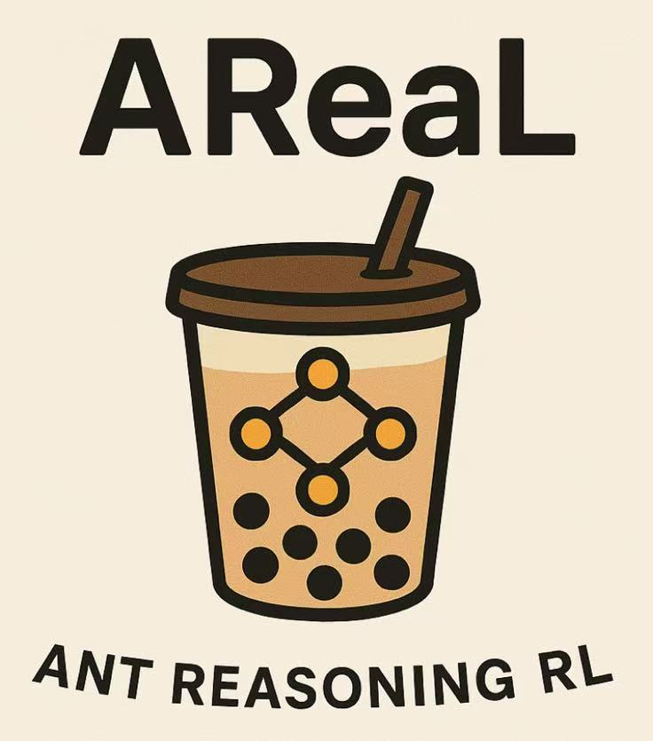

# AREAL  

[AReaL](https://github.com/inclusionAI/AReaL) (Ant Reasoning RL) is an open-source, fully asynchronous reinforcement learning training system developed by the Reinforcement Learning Lab (RL Lab) at Ant Research. It is designed for large-scale reasoning models. Based on the open-source project [RealHF](https://github.com/openpsi-project/ReaLHF), this system is committed to open-sourcing by providing training details, data, and the necessary infrastructure for reproducing results, along with the model itself.  

  

The AReaL project has integrated SwanLab. For guidance, please refer to this document: [Areal - monitoring-the-training-process](https://inclusionai.github.io/AReaL/tutorial/quickstart_legacy.html).