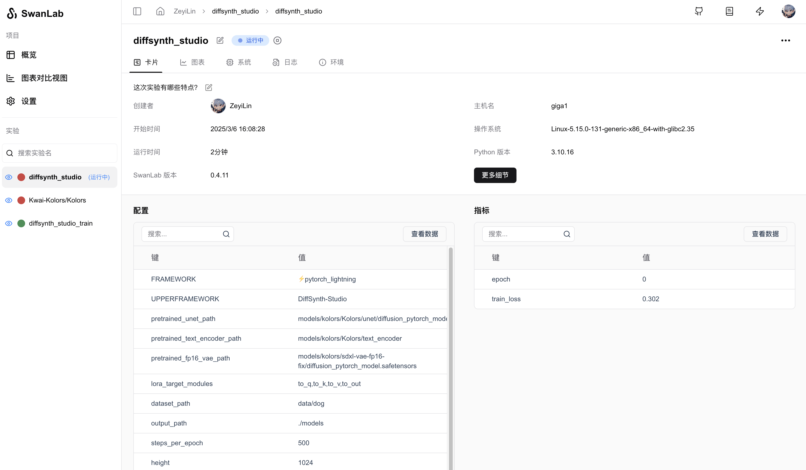
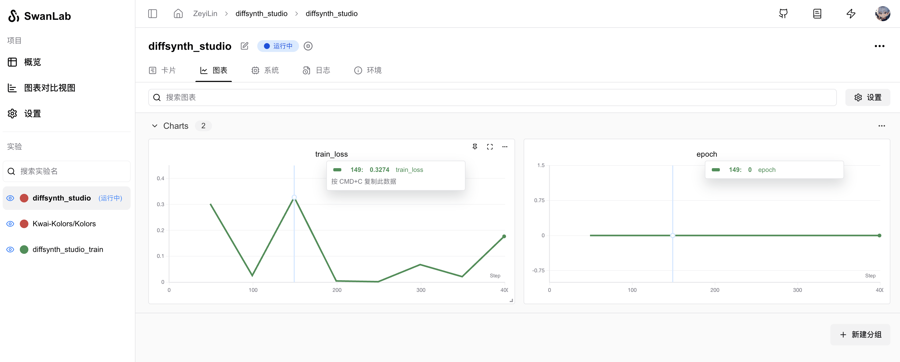

# DiffSynth Studio

[DiffSynth-Studio](https://github.com/modelscope/DiffSynth-Studio) is an open-source diffusion model engine launched by [ModelScope](https://modelscope.cn/), focusing on image and video style transfer and generation tasks. By optimizing architectural designs (such as text encoders, UNet, VAE, and other components), it significantly enhances computational performance while maintaining compatibility with open-source community models, providing users with an efficient and flexible creative tool.

DiffSynth Studio supports various diffusion models, including Wan-Video, StepVideo, HunyuanVideo, CogVideoX, FLUX, ExVideo, Kolors, Stable Diffusion 3, and more.


You can use DiffSynth Studio to quickly train Diffusion models while using SwanLab for experiment tracking and visualization.

[[toc]]

## Preparation

**1. Clone the Repository and Set Up the Environment**

```bash
git clone https://github.com/modelscope/DiffSynth-Studio.git
cd DiffSynth-Studio
pip install -e .
pip install swanlab
pip install lightning lightning_fabric
```

**2. Prepare the Dataset**

The dataset for DiffSynth Studio needs to be structured in the following format. For example, place the image data in the `data/dog` directory:

```bash
data/dog/
└── train
    ├── 00.jpg
    ├── 01.jpg
    ├── 02.jpg
    ├── 03.jpg
    ├── 04.jpg
    └── metadata.csv
```

The `metadata.csv` file should be structured as follows:

```csv
file_name,text
00.jpg,A small dog
01.jpg,A small dog
02.jpg,A small dog
03.jpg,A small dog
04.jpg,A small dog
```

> Here is a well-formatted Naruto dataset, [Baidu Cloud](https://pan.baidu.com/s/1kPvkTV6gy2xWFRpyXRX0Yw?pwd=2p6h), for reference and testing.

**3. Prepare the Model**

Here, we use the Kolors model as an example. Download the model weights and VAE weights:

```bash
modelscope download --model=Kwai-Kolors/Kolors --local_dir models/kolors/Kolors
modelscope download --model=AI-ModelScope/sdxl-vae-fp16-fix --local_dir models/kolors/sdxl-vae-fp16-fix
```

## Setting SwanLab Parameters

When running the training script, add `--use_swanlab` to record the training process on the SwanLab platform.

If you need offline recording, you can add `--swanlab_mode "local"`.

```bash {3,4}
CUDA_VISIBLE_DEVICES="0" python examples/train/kolors/train_kolors_lora.py \
...
--use_swanlab \
--swanlab_mode "cloud"
```

## Starting the Training

Use the following command to start the training and record hyperparameters, training logs, loss curves, and other information using SwanLab:

```bash {11,12}
CUDA_VISIBLE_DEVICES="0" python examples/train/kolors/train_kolors_lora.py \
--pretrained_unet_path models/kolors/Kolors/unet/diffusion_pytorch_model.safetensors \
--pretrained_text_encoder_path models/kolors/Kolors/text_encoder \
--pretrained_fp16_vae_path models/kolors/sdxl-vae-fp16-fix/diffusion_pytorch_model.safetensors \
--dataset_path data/dog \
--output_path ./models \
--max_epochs 10 \
--center_crop \
--use_gradient_checkpointing \
--precision "16-mixed" \
--use_swanlab \
--swanlab_mode "cloud"
```





## Additional Notes

If you want to customize SwanLab project names, experiment names, and other parameters, you can:

**1. Text-to-Image Tasks**

In the `DiffSynth-Studio/diffsynth/trainers/text_to_image.py` file, locate the `swanlab_logger` variable and modify the `project` and `name` parameters:

```python {6-7}
if args.use_swanlab:
    from swanlab.integration.pytorch_lightning import SwanLabLogger
    swanlab_config = {"UPPERFRAMEWORK": "DiffSynth-Studio"}
    swanlab_config.update(vars(args))
    swanlab_logger = SwanLabLogger(
        project="diffsynth_studio", 
        name="diffsynth_studio",
        config=swanlab_config,
        mode=args.swanlab_mode,
        logdir=args.output_path,
    )
    logger = [swanlab_logger]
```

**2. Wan-Video Text-to-Video Tasks**

In the `DiffSynth-Studio/examples/wanvideo/train_wan_t2v.py` file, locate the `swanlab_logger` variable and modify the `project` and `name` parameters:

```python {6-7}
if args.use_swanlab:
    from swanlab.integration.pytorch_lightning import SwanLabLogger
    swanlab_config = {"UPPERFRAMEWORK": "DiffSynth-Studio"}
    swanlab_config.update(vars(args))
    swanlab_logger = SwanLabLogger(
        project="wan", 
        name="wan",
        config=swanlab_config,
        mode=args.swanlab_mode,
        logdir=args.output_path,
    )
    logger = [swanlab_logger]
```