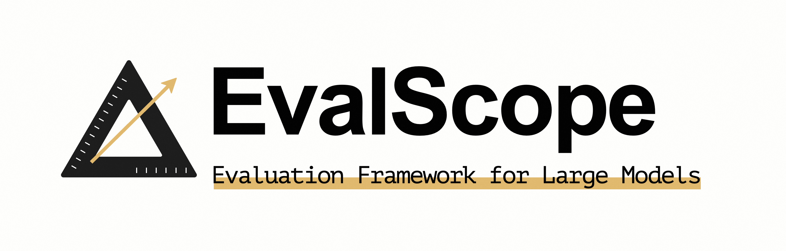

# EvalScope  

[EvalScope](https://github.com/modelscope/evalscope) is the official model evaluation and benchmarking framework for [ModelScope](https://modelscope.cn/), designed to meet diverse evaluation needs. It supports various model types including large language models (LLMs), multimodal models, embedding models, reranker models, and CLIP models.  

  

The framework accommodates multiple evaluation scenarios such as end-to-end RAG evaluation, arena mode, and inference performance testing. It comes pre-loaded with benchmarks and metrics including MMLU, CMMLU, C-Eval, and GSM8K. Seamlessly integrated with the [ms-swift](https://github.com/modelscope/ms-swift) training framework, EvalScope enables one-click evaluation, providing comprehensive support for model training and evaluation 🚀.  

Now you can use EvalScope to evaluate LLM performance while leveraging SwanLab for convenient tracking, comparison, and visualization.  

[Demo](https://swanlab.cn/@ShaohonChen/perf_benchmark/charts)  

## 1. Preparation  

Install the required environment:  

```bash  
pip install evalscope  
pip install swanlab  
```  

For extended EvalScope functionality, install optional dependencies as needed:  

```bash  
pip install -e '.[opencompass]'   # Install OpenCompass backend  
pip install -e '.[vlmeval]'       # Install VLMEvalKit backend  
pip install -e '.[rag]'           # Install RAGEval backend  
pip install -e '.[perf]'          # Install performance dependencies  
pip install -e '.[app]'           # Install visualization dependencies  
pip install -e '.[all]'           # Install all backends (Native, OpenCompass, VLMEvalKit, RAGEval)  
```  

## 2. Evaluating Qwen Model Performance  

To evaluate the performance of `Qwen2.5-0.5B-Instruct` on the `gsm8k` and `arc` datasets while monitoring results via SwanLab, run the following command:  

```bash  {5,6}
evalscope eval \  
 --model Qwen/Qwen2.5-0.5B-Instruct \  
 --datasets gsm8k arc \  
 --limit 5 \  
 --swanlab-api-key 'your_api_key' \  
 --name 'qwen2.5-gsm8k-arc'  
```  

Where:  
• `swanlab-api-key` is your SwanLab API key  
• `name` specifies the experiment name  

To customize the project name, navigate to the `statistic_benchmark_metric_worker` function in `evalscope/perf/benchmark.py` and modify the `project` parameter in the SwanLab configuration section.  