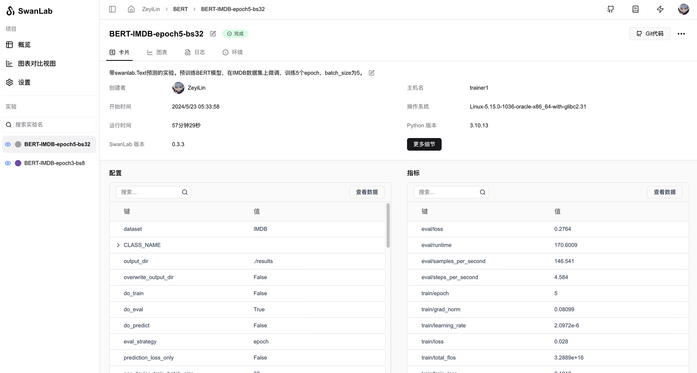
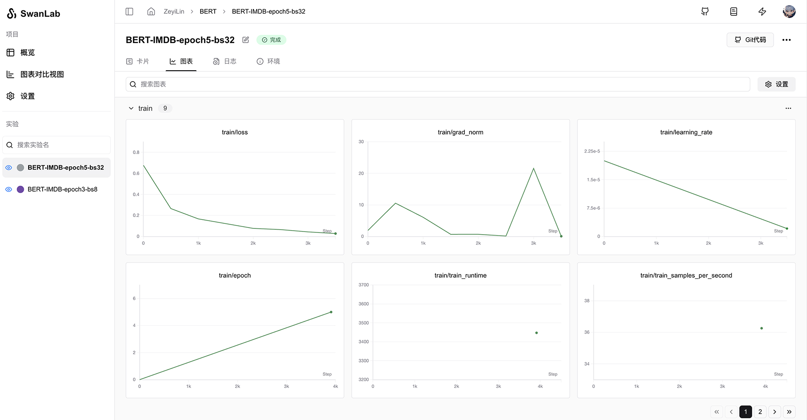

# 🤗HuggingFace Transformers

[](https://colab.research.google.com/drive/1iYwrAM4ToCWt5p5hlrrkHlQqBIav_r2E?usp=sharing)

Hugging Face's [Transformers](https://github.com/huggingface/transformers) is a highly popular open-source library that provides a wide range of pre-trained models, primarily for Natural Language Processing (NLP) tasks. The library aims to make the latest models easily accessible and supports multiple frameworks such as TensorFlow and PyTorch.


You can use Transformers for rapid model training while utilizing SwanLab for experiment tracking and visualization.

> For versions `transformers>=4.50.0`, SwanLab is officially integrated.  
> If your version is below 4.50.0, please use [SwanLabCallback Integration](#_4-swanlabcallback-integration).

## 1. One-Line Integration

Simply locate the `TrainingArguments` section in your training code and add the `report_to="swanlab"` parameter to complete the integration.

```python
from transformers import TrainingArguments, Trainer

args = TrainingArguments(
    ...,
    report_to="swanlab" # [!code ++]
)

trainer = Trainer(..., args=args)
```

If you want to set an experiment name to distinguish each training, you can set the `run_name` parameter:

```python
args = TrainingArguments(
    ...,
    report_to="swanlab",
    run_name="great_try_1", # [!code ++]
)
```

## 2. Custom Project Name / Workspace

By default, the project name will be the `directory name` from which you run the code, the experiment name will be the `output_dir`.

If you wish to customize the project name or workspace, you can set the `SWANLAB_PROJ_NAME` and `SWANLAB_WORKSPACE` environment variables:

::: code-group

```python
import os  # [!code ++]

os.environ["SWANLAB_PROJ_NAME"]="qwen2-sft"  # [!code ++]
os.environ["SWANLAB_WORKSPACE"]="EmotionMachine"  # [!code ++]

...

from transformers import TrainingArguments, Trainer

args = TrainingArguments(
    ...,
    report_to="swanlab",
    run_name="great_try_1",
)

trainer = Trainer(..., args=args)
```

```bash [Command Line（Linux/MacOS）]
export SWANLAB_PROJ_NAME="qwen2-sft"
export SWANLAB_WORKSPACE="EmotionMachine"
```

```bash [Command Line（Windows）]
set SWANLAB_PROJ_NAME="qwen2-sft"
set SWANLAB_WORKSPACE="EmotionMachine"
```

:::

## 3. Example Code: Bert Text Classification

```python
import evaluate
import numpy as np
from datasets import load_dataset
from transformers import AutoModelForSequenceClassification, AutoTokenizer, Trainer, TrainingArguments


def tokenize_function(examples):
    return tokenizer(examples["text"], padding="max_length", truncation=True)


def compute_metrics(eval_pred):
    logits, labels = eval_pred
    predictions = np.argmax(logits, axis=-1)
    return metric.compute(predictions=predictions, references=labels)


dataset = load_dataset("yelp_review_full")

tokenizer = AutoTokenizer.from_pretrained("bert-base-cased")

tokenized_datasets = dataset.map(tokenize_function, batched=True)

small_train_dataset = tokenized_datasets["train"].shuffle(seed=42).select(range(1000))
small_eval_dataset = tokenized_datasets["test"].shuffle(seed=42).select(range(1000))

metric = evaluate.load("accuracy")

model = AutoModelForSequenceClassification.from_pretrained("bert-base-cased", num_labels=5)

training_args = TrainingArguments(
    output_dir="test_trainer",
    num_train_epochs=3,
    logging_steps=50,
    report_to="swanlab", # [!code ++]
)

trainer = Trainer(
    model=model,
    args=training_args,
    train_dataset=small_train_dataset,
    eval_dataset=small_eval_dataset,
    compute_metrics=compute_metrics,
)

trainer.train()
```

## 4. SwanLabCallback Integration

If you are using a version of `Transformers<4.50.0` or wish to have more flexible control over SwanLab's behavior, you can use the SwanLabCallback integration.

### 4.1 Import SwanLabCallback

```python
from swanlab.integration.transformers import SwanLabCallback
```

**SwanLabCallback** is a logging class adapted for Transformers.

**SwanLabCallback** can define parameters such as:

- project, experiment_name, description, etc., which have the same effect as swanlab.init, used for initializing the SwanLab project.
- You can also create a project externally via `swanlab.init`, and the integration will log the experiment to the project you created externally.

### 4.2 Pass to Trainer

```python (1,7,12)
from swanlab.integration.transformers import SwanLabCallback
from transformers import Trainer, TrainingArguments

...

# Instantiate SwanLabCallback
swanlab_callback = SwanLabCallback(project="hf-visualization")

trainer = Trainer(
    ...
    # Pass callbacks parameter
    callbacks=[swanlab_callback],
)

trainer.train()
```

### 4.3 Complete Example Code

```python (4,41,50)
import evaluate
import numpy as np
import swanlab
from swanlab.integration.transformers import SwanLabCallback
from datasets import load_dataset
from transformers import AutoModelForSequenceClassification, AutoTokenizer, Trainer, TrainingArguments


def tokenize_function(examples):
    return tokenizer(examples["text"], padding="max_length", truncation=True)


def compute_metrics(eval_pred):
    logits, labels = eval_pred
    predictions = np.argmax(logits, axis=-1)
    return metric.compute(predictions=predictions, references=labels)


dataset = load_dataset("yelp_review_full")

tokenizer = AutoTokenizer.from_pretrained("bert-base-cased")

tokenized_datasets = dataset.map(tokenize_function, batched=True)

small_train_dataset = tokenized_datasets["train"].shuffle(seed=42).select(range(1000))
small_eval_dataset = tokenized_datasets["test"].shuffle(seed=42).select(range(1000))

metric = evaluate.load("accuracy")

model = AutoModelForSequenceClassification.from_pretrained("bert-base-cased", num_labels=5)

training_args = TrainingArguments(
    output_dir="test_trainer",
    # If you only want to use SwanLab for experiment tracking, set the report_to parameter to "none"
    report_to="none",
    num_train_epochs=3,
    logging_steps=50,
)

# Instantiate SwanLabCallback
swanlab_callback = SwanLabCallback(experiment_name="TransformersTest")

trainer = Trainer(
    model=model,
    args=training_args,
    train_dataset=small_train_dataset,
    eval_dataset=small_eval_dataset,
    compute_metrics=compute_metrics,
    # Pass callbacks parameter
    callbacks=[swanlab_callback],
)

trainer.train()
```

### 4.4 GUI Effect Display

Automatically recorded hyperparameters:



Metrics recording:




### 4.5 Extension: Adding More Callbacks

Imagine a scenario where you want the model to infer test samples at the end of each epoch and log the inference results with swanlab. You can create a new class inheriting from `SwanLabCallback` and add or override lifecycle functions. For example:

```python
class NLPSwanLabCallback(SwanLabCallback):    
    def on_epoch_end(self, args, state, control, **kwargs):
        test_text_list = ["example1", "example2"]
        log_text_list = []
        for text in test_text_list:
            result = model(text)
            log_text_list.append(swanlab.Text(result))
            
        swanlab.log({"Prediction": test_text_list}, step=state.global_step)
```

The above is a new callback class for NLP tasks, adding the `on_epoch_end` function, which will execute at the end of each epoch during `transformers` training.

View all Transformers lifecycle callback functions: [Link](https://github.com/huggingface/transformers/blob/main/src/transformers/trainer_callback.py#L311)

## 5. Environment

Reference: [HuggingFace Docs: transformers.integrations.SwanLabCallback](https://huggingface.co/docs/transformers/main/en/main_classes/callback#transformers.integrations.SwanLabCallback)