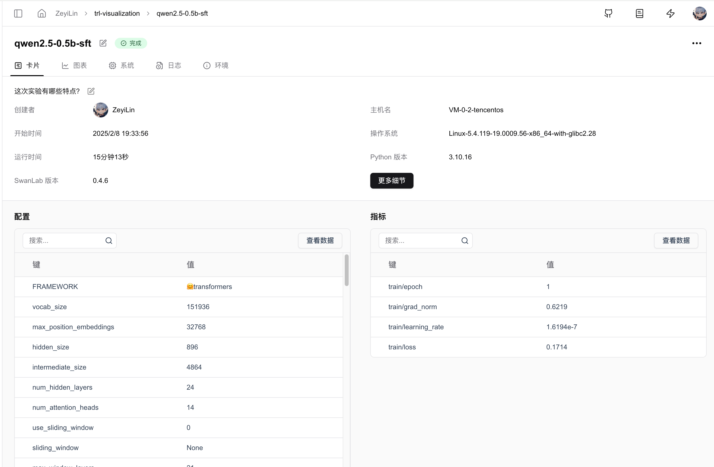
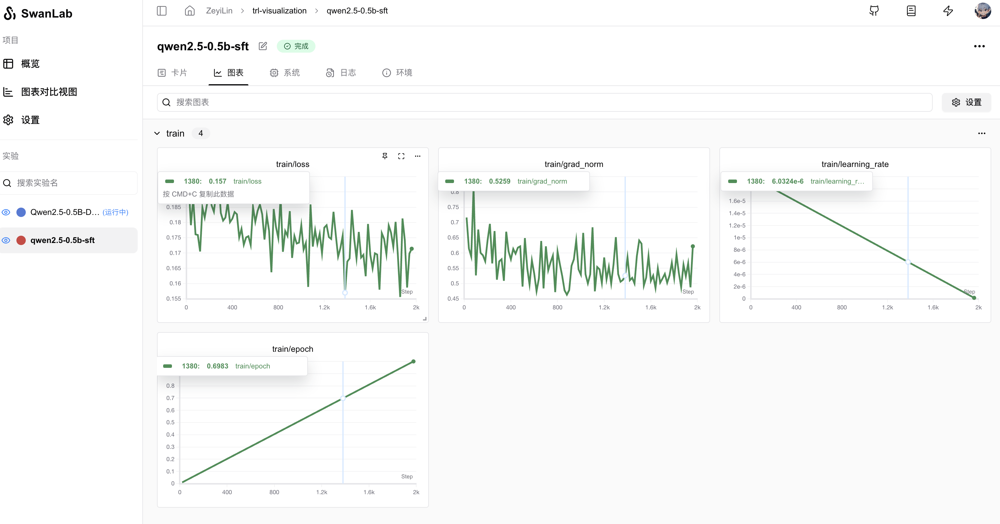

# 🤗HuggingFace Trl

[TRL](https://github.com/huggingface/trl) (Transformers Reinforcement Learning) is a leading Python library designed to optimize foundational models through advanced techniques such as Supervised Fine-Tuning (SFT), Proximal Policy Optimization (PPO), and Direct Preference Optimization (DPO). Built on top of the 🤗 Transformers ecosystem, TRL supports multiple model architectures and modalities, and can scale across various hardware configurations.


You can use Trl for rapid model training while leveraging SwanLab for experiment tracking and visualization.

[Demo](https://swanlab.cn/@ZeyiLin/trl-visualization/runs/q1uf2r4wmao7iomc5z1ff/overview)

> For versions `transformers>=4.50.0`, SwanLab is officially integrated.  
> If your version is below 4.50.0, please use [SwanLabCallback Integration](#_5-using-swanlabcallback).

## 1. One-Line Integration

Simply locate the HF `Config` section (e.g., `SFTConfig`, `GRPOConfig`, etc.) in your training code and add the `report_to="swanlab"` parameter to complete the integration.

```python
from trl import SFTConfig, SFTTrainer

args = SFTConfig(
    ...,
    report_to="swanlab" # [!code ++]
)

trainer = Trainer(..., args=args)
```

## 2. Custom Project Name

By default, the project name will be the `directory name` from which you run the code.

If you wish to customize the project name, you can set the `SWANLAB_PROJECT` environment variable:

::: code-group

```python
import os
os.environ["SWANLAB_PROJECT"]="qwen2-sft"
```

```bash [Command Line（Linux/MacOS）]
export SWANLAB_PROJECT="qwen2-sft"
```

```bash [Command Line（Windows）]
set SWANLAB_PROJECT="qwen2-sft"
```

:::

## 3. Example Code

Using the Qwen2.5-0.5B-Instruct model, perform SFT training with the Capybara dataset:

```python
from trl import SFTConfig, SFTTrainer
from datasets import load_dataset

dataset = load_dataset("trl-lib/Capybara", split="train")

training_args = SFTConfig(
    output_dir="Qwen/Qwen2.5-0.5B-SFT",
    per_device_train_batch_size=1,
    per_device_eval_batch_size=1,
    num_train_epochs=1,
    logging_steps=20,
    learning_rate=2e-5,
    report_to="swanlab", # [!code ++]
    )

trainer = SFTTrainer(
    args=training_args,
    model="Qwen/Qwen2.5-0.5B-Instruct",
    train_dataset=dataset,
)

trainer.train()
```

The same applies to DPO, GRPO, PPO, etc. Simply pass `report_to="swanlab"` to the corresponding `Config`.

## 4. GUI Effect Display

**Automatically Recorded Hyperparameters:**



**Metrics Recording:**



## 5. Using SwanLabCallback

If you are using a version of `Transformers<4.50.0` or wish to have more flexible control over SwanLab's behavior, you can use the SwanLabCallback integration.

### 5.1 Import SwanLabCallback

```python
from swanlab.integration.transformers import SwanLabCallback
```

**SwanLabCallback** is a logging class adapted for Transformers.

**SwanLabCallback** can define parameters such as:

- project, experiment_name, description, etc., which have the same effect as swanlab.init, used for initializing the SwanLab project.
- You can also create a project externally via `swanlab.init`, and the integration will log the experiment to the project you created externally.

### 5.2 Pass to Trainer

```python (1,7,12)
from swanlab.integration.transformers import SwanLabCallback
from trl import SFTConfig, SFTTrainer

...

# Instantiate SwanLabCallback
swanlab_callback = SwanLabCallback(project="trl-visualization")

trainer = SFTTrainer(
    ...
    # Pass callbacks parameter
    callbacks=[swanlab_callback],
)

trainer.train()
```

### 5.3 Complete Example Code

Using the Qwen2.5-0.5B-Instruct model, perform SFT training with the Capybara dataset:

```python (3,7,26)
from trl import SFTConfig, SFTTrainer
from datasets import load_dataset
from swanlab.integration.transformers import SwanLabCallback

dataset = load_dataset("trl-lib/Capybara", split="train")

swanlab_callback = SwanLabCallback(
    project="trl-visualization",
    experiment_name="Qwen2.5-0.5B-SFT",
    description="Testing SFT training using the trl framework"
)

training_args = SFTConfig(
    output_dir="Qwen/Qwen2.5-0.5B-SFT",
    per_device_train_batch_size=1,
    per_device_eval_batch_size=1,
    num_train_epochs=1,
    logging_steps=20,
    learning_rate=2e-5,
    report_to="none",
    )

trainer = SFTTrainer(
    args=training_args,
    model="Qwen/Qwen2.5-0.5B-Instruct",
    train_dataset=dataset,
)

trainer.train()
```

The same applies to DPO, GRPO, PPO, etc. Simply pass `SwanLabCallback` to the corresponding `Trainer`.