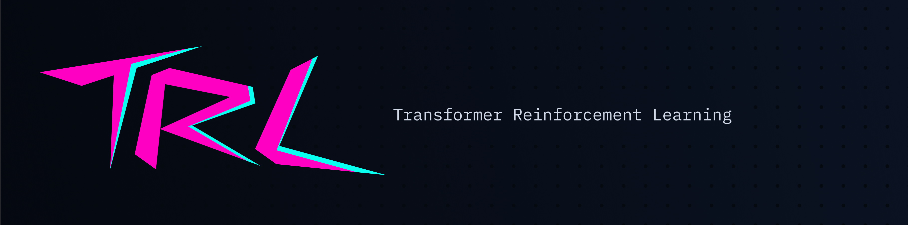

# 🤗HuggingFace Trl

[TRL](https://github.com/huggingface/trl) (Transformers Reinforcement Learning, Training Transformers Models with Reinforcement Learning) is a leading Python library designed to optimize foundational models through advanced techniques such as Supervised Fine-Tuning (SFT), Proximal Policy Optimization (PPO), and Direct Preference Optimization (DPO). Built on top of the 🤗 Transformers ecosystem, TRL supports multiple model architectures and modalities, and can scale across various hardware configurations.



You can use Trl to quickly train models while leveraging SwanLab for experiment tracking and visualization.

[Demo](https://swanlab.cn/@ZeyiLin/trl-visualization/runs/q1uf2r4wmao7iomc5z1ff/overview)

## 1. Introducing SwanLabCallback

```python
from swanlab.integration.transformers import SwanLabCallback
```

**SwanLabCallback** is a logging class adapted for Transformers.

**SwanLabCallback** can define parameters such as:

- `project`, `experiment_name`, `description`, and other parameters consistent with `swanlab.init`, used for initializing SwanLab projects.
- You can also create a project externally via `swanlab.init`, and the integration will log experiments to the project you created externally.

## 2. Passing to Trainer

```python (1,7,12)
from swanlab.integration.transformers import SwanLabCallback
from trl import SFTConfig, SFTTrainer

...

# Instantiate SwanLabCallback
swanlab_callback = SwanLabCallback(project="trl-visualization")

trainer = SFTTrainer(
    ...
    # Pass the callbacks parameter
    callbacks=[swanlab_callback],
)

trainer.train()
```

## 3. Complete Example Code

Using the Qwen2.5-0.5B-Instruct model, perform SFT training on the Capybara dataset:

```python (3,7,26)
from trl import SFTConfig, SFTTrainer
from datasets import load_dataset
from swanlab.integration.transformers import SwanLabCallback

dataset = load_dataset("trl-lib/Capybara", split="train")

swanlab_callback = SwanLabCallback(
    project="trl-visualization",
    experiment_name="Qwen2.5-0.5B-SFT",
    description="Testing SFT training using the trl framework"
)

training_args = SFTConfig(
    output_dir="Qwen/Qwen2.5-0.5B-SFT",
    per_device_train_batch_size=1,
    per_device_eval_batch_size=1,
    num_train_epochs=1,
    logging_steps=20,
    learning_rate=2e-5,
    )

trainer = SFTTrainer(
    args=training_args,
    model="Qwen/Qwen2.5-0.5B-Instruct",
    train_dataset=dataset,
    callbacks=[swanlab_callback]
)

trainer.train()
```

The same applies to DPO, GRPO, PPO, etc. Simply pass the `SwanLabCallback` to the corresponding `Trainer`.

## 4. GUI Effect Demonstration

**Automatic Hyperparameter Logging:**


**Metric Logging:**

