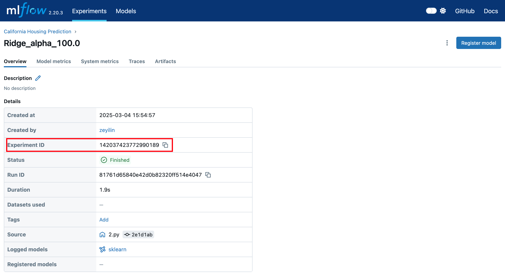

# MLFlow

[MLFlow](https://github.com/mlflow/mlflow) is an open-source platform for managing the machine learning lifecycle, created and maintained by Databricks. It aims to help data scientists and machine learning engineers manage the entire lifecycle of machine learning projects more efficiently, including experiment tracking, model management, model deployment, and collaboration. MLflow is modular and can integrate with any machine learning library, framework, or tool.


:::warning Tutorials for Syncing with Other Tools

• [TensorBoard](/guide_cloud/integration/integration-tensorboard.md)
• [Weights & Biases](/guide_cloud/integration/integration-wandb.md)
:::

**You can sync MLflow projects to SwanLab in two ways:**

1. **Sync Tracking**: If your current project uses MLflow for experiment tracking, you can use the `swanlab.sync_mlflow()` command to synchronize metrics to SwanLab while running the training script.
2. **Convert Existing Projects**: If you want to replicate a project from MLflow to SwanLab, you can use `swanlab convert` to convert an existing MLflow project into a SwanLab project.

::: info
The current version only supports converting scalar charts.
:::

[[toc]]

## 1. Sync Tracking

### 1.1 Add the `sync_mlflow` Command

Add the `swanlab.sync_mlflow()` command anywhere before `mlflow.start_run()` in your code to synchronize metrics to SwanLab while running the training script.

```python
import swanlab

swanlab.sync_mlflow()

...

mlflow.start_run()
```

In this approach, `mlflow.start_run()` will simultaneously initialize SwanLab. The project name, experiment name, and configuration will align with `experiment_name`, `run_name`, and `log_param` in `mlflow.start_run()`. Therefore, you do not need to manually initialize SwanLab.

### 1.2 Alternative Approach

Another approach is to manually initialize SwanLab first, then run the MLflow code.

```python
import swanlab

swanlab.init(...)
swanlab.sync_mlflow()
```

In this approach, the project name, experiment name, and configuration will align with `project`, `experiment_name`, and `config` in `swanlab.init()`. The `experiment_name` and `run_name` in `mlflow.start_run()` will be ignored, and `config` will be updated in `swanlab.config`.

### 1.3 Test Code

```python
import mlflow
import random
import swanlab

swanlab.sync_mlflow()

mlflow.set_experiment("mlflow_sync_test")

with mlflow.start_run(run_name="test_run"):
    mlflow.log_param("learning_rate", 0.01)
    mlflow.log_params({"batch_size": 32, "epochs": 10})
    
    for epoch in range(10):
        acc = 1 - 2 ** -epoch - random.random() / epoch
        loss = 2 ** -epoch + random.random() / epoch
        mlflow.log_metric("accuracy", acc, step=epoch)
        mlflow.log_metric("loss", loss, step=epoch)
        
        mlflow.log_metrics({
            "precision": acc * 0.9,
            "recall": acc * 0.8
        }, step=epoch)
```

## 2. Convert Existing Projects

### 2.1 Preparation

**Required: MLflow Service URL**

First, note down the **URL** of your MLflow service, e.g., `http://127.0.0.1:5000`.

> If the MLflow service is not yet started, use the `mlflow ui` command to start the service and note down the URL.

**Optional: Experiment ID**

If you only want to convert a specific experiment, note down the experiment ID as shown in the image below.



### 2.2 Method 1: Command Line Conversion

Conversion command:

```bash
swanlab convert -t mlflow --mlflow-url <MLFLOW_URL> --mlflow-exp <MLFLOW_EXPERIMENT_ID>
```

Supported parameters:

• `-t`: Conversion type, options include wandb, tensorboard, and mlflow.
• `-p`: SwanLab project name.
• `-w`: SwanLab workspace name.
• `--mode`: (str) Selection mode, default is "https://github.com/kvcache-ai/ktransformers/",可选 `["cloud", "local", "offline", "disabled"]`.
• `-l`: Logdir path.
• `--mlflow-url`: URL of the MLflow service.
• `--mlflow-exp`: MLflow experiment ID.

If `--mlflow-exp` is not specified, all experiments under the project will be converted. If specified, only the designated experiment will be converted.

### 2.3 Method 2: Conversion Within Code

```python
from swanlab.converter import MLFLowConverter

mlflow_converter = MLFLowConverter(project="mlflow_converter")
# mlflow_exp is optional
mlflow_converter.run(tracking_uri="http://127.0.0.1:5000", experiment="1")
```

This has the same effect as the command line conversion.

`MLFLowConverter` supported parameters:

• `project`: SwanLab project name.
• `workspace`: SwanLab workspace name.
• `mode`: (str) Selection mode, default is "cloud",可选 `["cloud", "local", "offline", "disabled"]`.
• `logdir`: Log directory path.