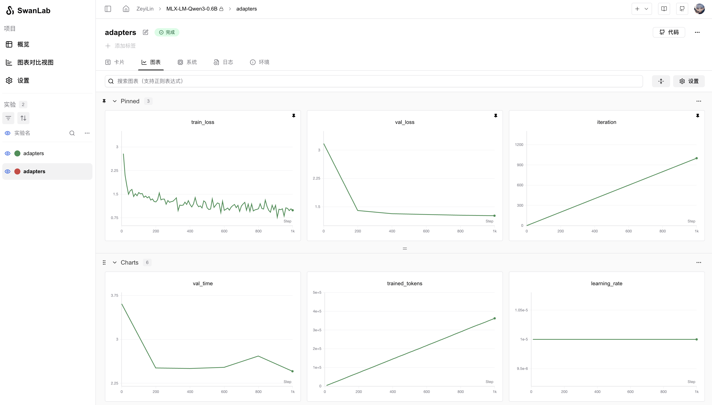

# MLX LM

[MLX LM](https://github.com/ml-explore/mlx-lm) is an open-source Python package developed by Apple's machine learning research team, designed specifically for efficiently running and fine-tuning large language models (LLMs) on Apple Silicon (M1, M2, M3, etc.). Built on the MLX framework, it leverages Apple’s unified memory architecture and Metal Performance Shaders to optimize performance, making it particularly suitable for local AI model development and execution on Mac devices.


You can use MLX LM to quickly train models while tracking and visualizing experiments with SwanLab.

## 1. Environment Setup

```bash
pip install mlx-lm swanlab
```

## 2. LoRA Fine-Tuning

The process of training LLMs with `mlx-lm` is straightforward, and examples can be found in [mlx-lm/examples](https://github.com/ml-explore/mlx-lm/tree/main/mlx_lm/examples).

The following is an example of a configuration file for LoRA fine-tuning using the Qwen3-0.6B model with MLX-LM:

```yaml
model: "Qwen/Qwen3-0.6B"
train: true
fine_tune_type: lora
optimizer: adamw
data: "mlx-community/WikiSQL"
seed: 0
num_layers: 16
batch_size: 4
iters: 1000
val_batches: 25
learning_rate: 1e-5
steps_per_report: 10
steps_per_eval: 200
resume_adapter_file: null
adapter_path: "adapters"
save_every: 100
test: false
test_batches: 100
max_seq_length: 2048
grad_checkpoint: false
lora_parameters:
  keys: ["self_attn.q_proj", "self_attn.v_proj"]
  rank: 8
  scale: 20.0
  dropout: 0.0
```

Save this configuration file locally as `qwen3_sft.yaml`.

Then, use the following command to start training and log the process to SwanLab:

```bash
mlx_lm.lora --config qwen3_sft.yaml --report-to swanlab --project-name MLX-LM
```

## 3. Visualization Results

