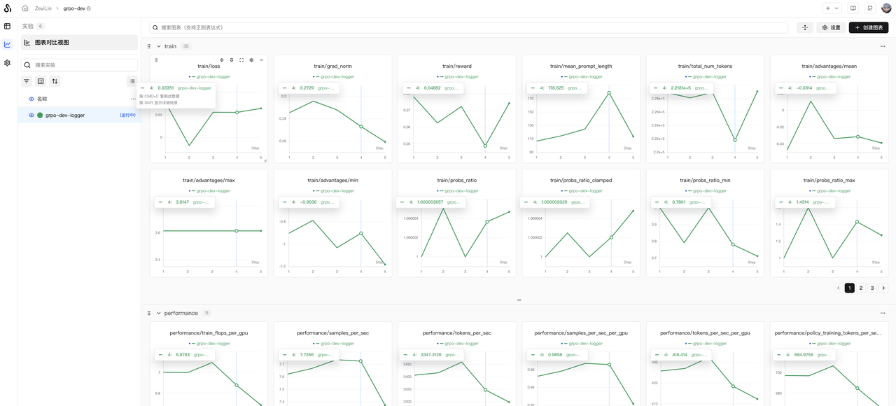
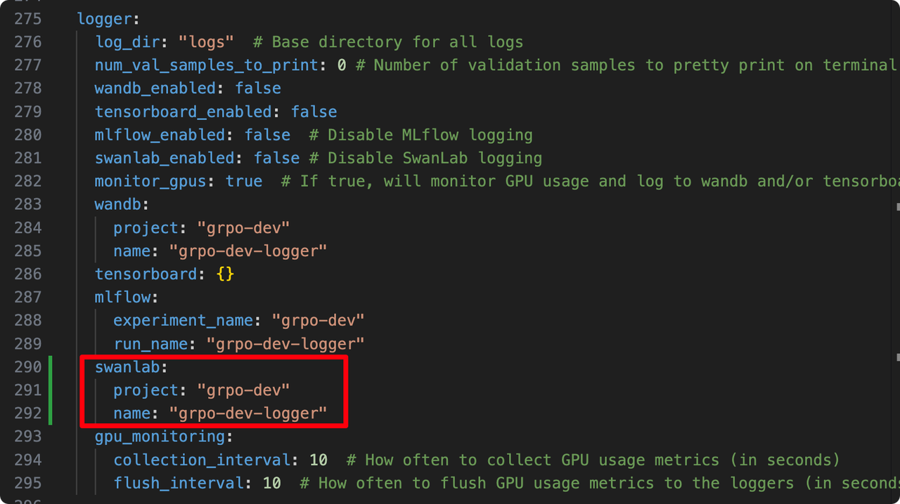

# NVIDIA-NeMo RL

We are excited to announce that SwanLab has officially integrated with NVIDIA's LLM RL post-training framework, **NVIDIA-NeMo/RL**.


In the latest release of NVIDIA NeMo RL, you can use SwanLab to track, observe, analyze, and manage experiments throughout the entire training process. This empowers AI researchers to master every detail of RL training and accelerate efficient model iteration.

* **Official Documentation:** [https://docs.nvidia.com/nemo/rl/latest/design-docs/logger.html](https://docs.nvidia.com/nemo/rl/latest/design-docs/logger.html)
* **GitHub:** [https://github.com/NVIDIA-NeMo/RL](https://github.com/NVIDIA-NeMo/RL)
* **SwanLab:** [https://swanlab.cn](https://swanlab.cn)

## 1. NVIDIA-NeMo/RL


**NVIDIA NeMo RL** is an open-source LLM post-training library under the NVIDIA NeMo framework, designed to simplify and scale reinforcement learning methods for multimodal models (such as large language models, vision-language models, etc.). NeMo RL is designed for flexibility, reproducibility, and scalability, supporting both small-scale experiments and large-scale multi-GPU, multi-node deployments, making it suitable for rapid experimentation in research and production environments.

It is worth mentioning that NeMo RL is the refactored repository of **NeMo Aligner**. NeMo Aligner was one of the earliest reinforcement learning libraries for large language models, and today's popular VeRL and ROLL frameworks were both inspired by NeMo Aligner.


NeMo RL supports a wide variety of training types. In addition to GRPO, it supports On-policy Distillation, DPO, RM, and SFT. You can also quickly evaluate trained models using NeMo RL.

As an official NVIDIA framework, NeMo RL provides excellent support for multi-card and multi-node training based on NVIDIA GPUs, supporting various backends including DTensor and Megatron.

Now, you can use NeMo RL to quickly perform LLM post-training while using SwanLab for comprehensive tracking, observation, and analysis.

## 2. Usage

### 2.1 Basic Environment

* **Compute Card:** At least one NVIDIA GPU with 24GB+ VRAM
* **CUDA Version:** >= 12.8
* **Python Package Manager:** uv
* **Python Version:** >= 3.10

---

### 2.2 Installation Environment

Clone the latest NVIDIA-NeMo/RL repository:

```bash
git clone git@github.com:NVIDIA-NeMo/RL.git nemo-rl --recursive
cd nemo-rl
```

If you are using the Megatron backend on bare metal (outside a container), you may also need to install cuDNN headers. Here is how to check and install them:

```bash
# Check if you have libcudnn installed
dpkg -l | grep cudnn.*cuda

# Find the version you need here: [https://developer.nvidia.com/cudnn-downloads](https://developer.nvidia.com/cudnn-downloads)
# As an example, these are the "Linux Ubuntu 20.04 x86_64" instructions

wget https://developer.download.nvidia.com/compute/cuda/repos/ubuntu2004/x86_64/cuda-keyring_1.1-1_all.deb
sudo dpkg -i cuda-keyring_1.1-1_all.deb
sudo apt update
sudo apt install cudnn  # Will install cuDNN meta packages which points to the latest versions

# sudo apt install cudnn9-cuda-12  # Will install cuDNN version 9.x.x compiled for cuda 12.x
# sudo apt install cudnn9-cuda-12-8  # Will install cuDNN version 9.x.x compiled for cuda 12.8
```

If you encounter issues installing the vllm dependency `deep_ep` on bare metal (outside a container), you may also need to install `libibverbs-dev`. Here is the installation method:

```bash
sudo apt-get update
sudo apt-get install libibverbs-dev
```

Then, initialize the `uv` virtual environment for the NeMo RL project using the following command:

```bash
uv venv
```

At this point, the basic environment preparation is complete.

---

### 2.3 GRPO Training

We use Qwen/Qwen2.5-1.5B model, and train on OpenMathInstruct-2 dataset using GRPO:

```bash
uv run python examples/run_grpo_math.py \
    policy.model_name="Qwen/Qwen2.5-1.5B" \
    swanlab_enabled=True
```

By default, this program uses the configuration in `examples/configs/grpo_math_1B.yaml`.

You can also customize parameters using command-line arguments. For example, to run on 8 GPUs, set the `cluster.gpus_per_node` parameter:

```bash
uv run python examples/run_grpo_math.py \
    policy.model_name="Qwen/Qwen2.5-1.5B" \
    swanlab_enabled=True \
    cluster.gpus_per_node=8
```

Once running, observe the training results on SwanLab:



GPU memory usage is shown below (using 8x RTX 5090 GPUs):


If you wish to configure more parameters, you can edit `examples/configs/grpo_math_1B.yaml`.

If you wish to set the SwanLab project name and experiment name, find the following in the yaml file:



```yaml
logger:
  log_dir: "logs" # Base directory for all logs
  # ... other configs
  swanlab_enabled: false # (Note: setting to True in command line overrides this)
  # ...
  swanlab:
    project: "grpo-dev"
    name: "grpo-dev-logger"
```

Simply modify the `project` and `name` parameters.

---

### 2.4 SFT Training

Let's try SFT. Here we use NeMo RL to fine-tune `Qwen2.5-1.5B` using the default `squad` (Stanford Question Answering Dataset) dataset:

```bash
uv run python examples/run_sft.py \
    policy.model_name="Qwen/Qwen2.5-1.5B" \
    swanlab_enabled=True
```

To use multiple GPUs on a single node, you can modify the cluster configuration. This adjustment also allows you to increase the model and batch size:

```bash
uv run python examples/run_sft.py \
  policy.model_name="Qwen/Qwen2.5-1.5B" \
  policy.train_global_batch_size=128 \
  sft.val_global_batch_size=128 \
  swanlab_enabled=True  \
  cluster.gpus_per_node=8
```

Once running, observe the training results on SwanLab:


GPU memory usage is shown below (using 8x RTX 5090 GPUs):

